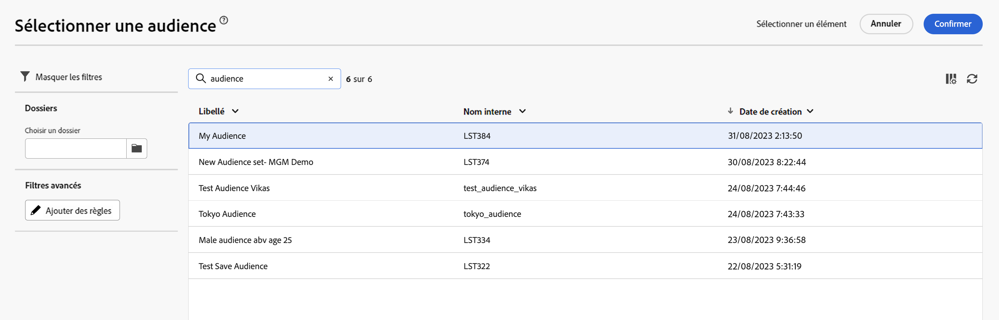

# Sélectionnez une audience. {#add-audience}

>[!CONTEXTUALHELP]
>id="acw_deliveries_email_audience_select"
>title="Sélectionner une audience existante"
>abstract="Les audiences sont définies dans la console Adobe Campaign v8. Si une intégration Adobe Experience Platform est disponible, vous devriez également voir les audiences définies par Platform."

>[!NOTE]
>
>Cette documentation est en cours d’élaboration et est fréquemment mise à jour. La version finale de ce contenu sera prête en janvier 2023.

Cette section explique comment sélectionner une audience existante lors de la définition de la population cible de la diffusion d’un e-mail. Si vous souhaitez créer une nouvelle audience, reportez-vous à cette [section](segment-builder.md).

1. Dans la section **Audience** de l’assistant de création de diffusion, cliquez sur le bouton **[!UICONTROL Sélectionner une audience]**.

   

1. Choisissez **[!UICONTROL Sélectionner une audience]** pour utiliser une audience existante. Afin de créer une nouvelle audience pour cet e-mail, choisissez **Créer la vôtre**. Reportez-vous à cette [section](segment-builder.md).

   Cet écran affiche toutes les audiences existantes définies dans la console Adobe Campaign ou à partir d’Adobe Experience Platform.

   

1. Choisissez une audience, puis cliquez sur **Sélectionner**.

1. Cliquez sur **Modifier les règles** si vous souhaitez affiner votre audience.

   

1. Le créateur de segments vous permet d’enrichir votre audience avec des filtres supplémentaires ou en combinant différentes audiences. Consultez cette [section](segment-builder.md).

   

1. Cliquez sur **Enregistrer**.

Vous pouvez également définir une population témoin afin de mesurer l’impact de vos campagnes. La population témoin ne recevra pas le message. Vous pouvez ainsi comparer le comportement de la population qui a reçu le message avec celui des contacts qui ne l’ont pas reçu. Reportez-vous à la [section](control-group.md).