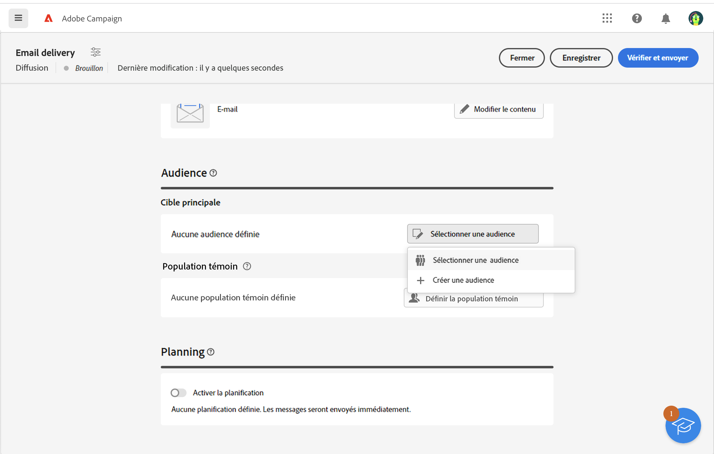
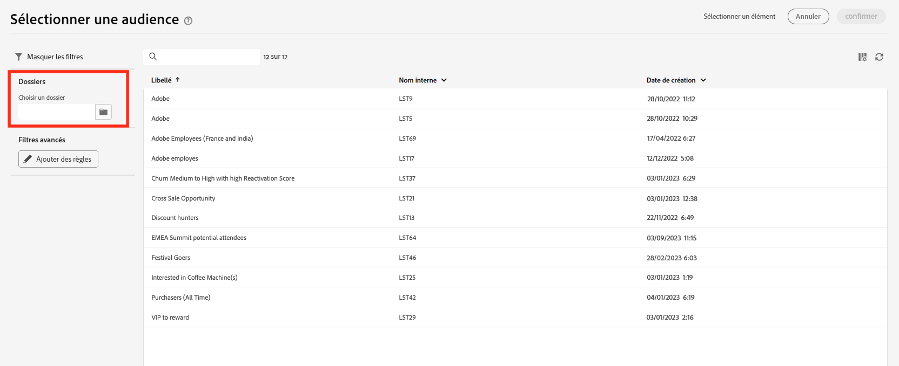
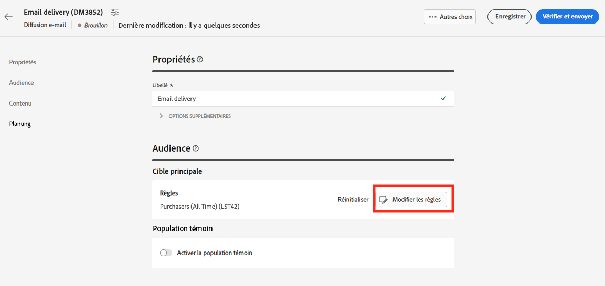

# Sélectionner une audience existante {#add-audience}

>[!CONTEXTUALHELP]
>id="acw_deliveries_email_audience_select"
>title="Sélectionner une audience existante"
>abstract="Parcourez la liste pour sélectionner une audience existante. Utilisez l&#39;icône Afficher les filtres pour filtrer la liste ou sélectionnez un dossier spécifique."

Cette section explique comment sélectionner une audience existante lors de la définition de la population cible d’une diffusion. Lors de la définition de la cible principale d’une diffusion, vous pouvez également :

* [Créer une audience unique](one-time-audience.md) à l’aide du créateur de règles.
* [Charger une audience depuis un fichier externe](file-audience.md) (pour les e-mails uniquement).

Les audiences qui peuvent être ciblées dans les diffusions sont accessibles à partir du menu **Audience** sur la gauche. Elles proviennent de plusieurs sources telles que la console cliente, ou encore les workflows d’audience Web Campaign ou Adobe Experience Platform. [Découvrez comment surveiller et gérer les audiences](manage-audience.md)

Pour sélectionner une audience existante pour votre message, procédez comme suit :

1. Dans la section **Audience** de l’assistant de création de diffusion, cliquez sur le bouton **[!UICONTROL Sélectionner une audience]**.

   

1. Choisissez **[!UICONTROL Sélectionner une audience]** pour utiliser une audience existante. Cet écran affiche toutes les audiences existantes pour le dossier actuel.

   

   Pour choisir une audience dans Adobe Experience Platform, accédez à `AEP Audiences folder` dans la section dédiée aux filtres de l’écran.

   

1. La section Filtre permet d’accéder aux options de filtrage afin d’affiner la liste des audiences. Pour ce faire, cliquez sur **Ajouter des règles** pour accéder au créateur de règles, qui vous permet de créer des filtres avancés pour la liste des audiences. [Découvrez comment utiliser le créateur de règles](../query/query-modeler-overview.md)

   

1. Cliquez sur **Confirmer** pour ajouter votre audience comme cible principale de la diffusion. Une fois l’opération terminée, vous pouvez toujours affiner l’audience à l’aide du créateur de règles en cliquant sur le bouton **Modifier des règles**.

   

   Vous pouvez également définir une population témoin afin de mesurer l’impact de vos campagnes. La population témoin ne reçoit pas le message. Vous pouvez ainsi comparer le comportement de la population qui a reçu le message avec celui des contacts qui ne l’ont pas reçu. [En savoir plus](control-group.md)
