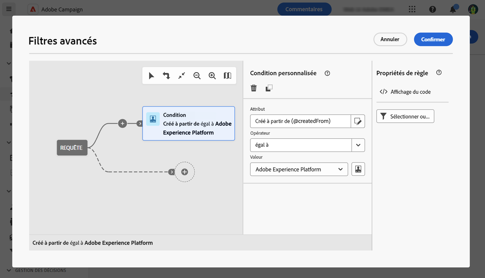

# Utiliser une audience Adobe Experience Platform{#aep-audience}

La destination et les connecteurs source d’Adobe Campaign Managed Cloud Services permettent une intégration transparente entre Adobe Campaign et Adobe Experience Platform.

Une fois une audience Adobe Experience Platform créée et disponible dans la console cliente, vous pouvez l&#39;utiliser de la même manière qu&#39;une audience Campaign pour personnaliser et envoyer des messages.

>[!NOTE]
>
>Pour utiliser les audiences Adobe Experience Platform dans Campaign, vous devez configurer l’intégration avec les sources et destinations d’Adobe. Voir [Documentation de Campaign v8 (console)](https://experienceleague.adobe.com/docs/campaign/campaign-v8/connect/ac-aep.html?lang=fr){target="_blank"}.

Pour sélectionner l&#39;audience d&#39;une diffusion, vous pouvez également :

* Créez une nouvelle audience. [En savoir plus](segment-builder.md)
* Charger une audience à partir d&#39;un fichier externe. [En savoir plus](file-audience.md)
* Utilisez une audience Campaign existante. [En savoir plus](add-audience.md).

Pour sélectionner une audience Adobe Experience Platform pour votre diffusion, procédez comme suit :

1. Dans la section **Audience** de l’assistant de création de diffusion, cliquez sur le bouton **[!UICONTROL Sélectionner une audience]**.

   

1. Choisissez **[!UICONTROL Sélectionner une audience]** pour utiliser une audience existante. Afin de créer une nouvelle audience pour cet e-mail, choisissez **Créer la vôtre**. Reportez-vous à cette [section](segment-builder.md).

   Cet écran affiche toutes les audiences existantes définies dans la console cliente Adobe Campaign, pour le dossier actif. Pour choisir une audience dans Adobe Experience Platform, accédez à la `AEP Audiences folder` dans la section filtre de l’écran.

   

   Vous pouvez également définir une règle pour filtrer l&#39;origine des audiences, comme ci-dessous :

   

1. Choisissez une audience, puis cliquez sur **Sélectionner**.

1. Cliquez sur **Modifier les règles** si vous souhaitez affiner votre audience.

   

1. Le créateur de règles vous permet d’enrichir votre audience avec des filtres supplémentaires ou en combinant différentes audiences. Consultez cette [section](segment-builder.md).

1. Cliquez sur **Enregistrer**.

