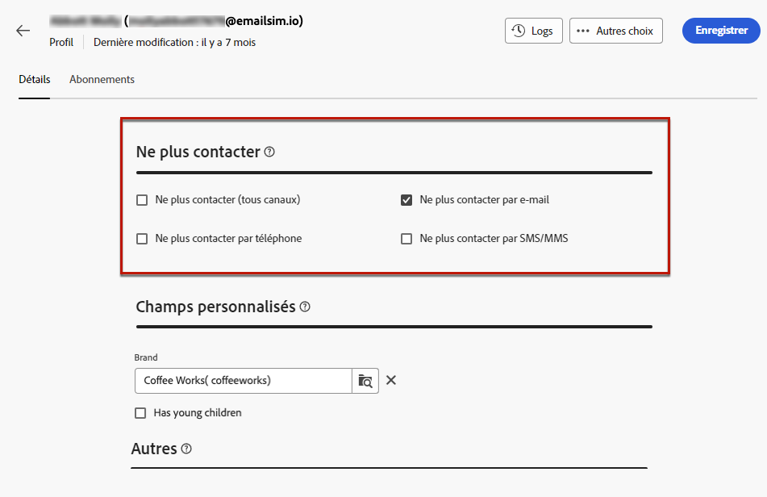

# Gérer le consentement {#manage-consent}

## Recommandations générales {#general-recommendations}

Adobe Campaign vous permet de collecter des données, y compris des informations personnelles et sensibles. Il est essentiel d’obtenir et de surveiller le consentement des personnes destinataires en conformité avec les réglementations de protection des données telles que le RGPD (Règlement général sur la protection des données) et d’autres lois sur la confidentialité applicables.

* Tout d’abord, évitez d’envoyer des e-mails, des notifications push et des SMS non sollicités (« spam »). Adobe soutient fermement les principes de l’autorisation marketing pour favoriser la fidélité et la valeur-vie de la clientèle. Adobe interdit strictement l’utilisation d’Adobe Campaign pour l’envoi de messages non sollicités. [En savoir plus](#denylisted-profiles)

* Assurez-vous toujours que les personnes destinataires acceptent de recevoir des communications en leur offrant la possibilité de se désabonner de vos diffusions<!-- and keep honoring opt-out requests as quickly as possible-->. [En savoir plus](#opt-out)

* Utilisez le processus de gestion des abonnements pour gérer les préférences des personnes destinataires et voir les personnes destinataires qui ont décidé de s’abonner à des types d’abonnements spécifiques. [En savoir plus](../../delivery/using/about-services-and-subscriptions.md)

## Gérer l’opt-out {#opt-out}

Donner aux personnes destinataires la capacité de se désabonner des communications d’une marque est une obligation légale. Il est également nécessaire de s’assurer que ce choix est respecté. <!--Learn more about the applicable legislation in the [Adobe Campaign Classic v7 documentation](https://experienceleague.adobe.com/docs/campaign-classic/using/getting-started/privacy/privacy-and-recommendations.html#privacy-regulations){target="_blank"}.-->

**Pourquoi est-ce important ?**

* Le non-respect de ces réglementations entraîne des risques juridiques pour votre marque.
* Cela permet d’éviter d’envoyer des communications non sollicitées aux personnes destinataires, ce qui pourrait les amener à considérer vos messages comme du spam et nuire à votre réputation.

Lors de l’envoi de diffusions à l’aide d’Adobe Campaign Web, assurez-vous que les clientes et clients peuvent se désabonner de futures communications. Une fois désabonnés, les profils sont automatiquement supprimés de l’audience des futurs messages marketing.

### Opt-out des e-mails {#email-opt-out}

Pour permettre aux personnes destinataires de se désabonner de la réception des communications par e-mail, incluez un **lien de désabonnement** dans chaque e-mail envoyé aux personnes destinataires.

Procédez comme suit :

1. Créez une page de destination externe et hébergez-la sur le système tiers de votre choix.

1. Créez une diffusion par e-mail. [Voici comment procéder](../email/create-email.md)

1. Insérez un lien dans le contenu de votre e-mail. [Voici comment procéder](../email/message-tracking.md#insert-links)

   

1. Dans le champ **[!UICONTROL URL]**, collez le lien vers votre page de destination tierce.

1. Cliquez sur l’icône **[!UICONTROL Liens]** dans le volet de gauche pour afficher la liste de toutes les URL du contenu à tracker.

1. Cliquez sur l’icône en forme de crayon en regard du nouveau lien pour le modifier.

1. Modifiez le **[!UICONTROL Type de tracking]** et définissez-le sur **[!UICONTROL Opt-out]**.

   

1. Cliquez sur **[!UICONTROL Enregistrer]**, puis envoyez le message. [En savoir plus](../monitor/prepare-send.md)

1. Une fois le message reçu, si la personne destinataire clique sur le lien de désinscription, votre page de destination s’affiche.

1. Lorsque la personne destinataire envoie le formulaire de la page de destination, les données de profil sont mises à jour. [En savoir plus](#denylisted-profiles)

<!--Any other option available such as one-click opt-out link or List-Unsubscribe (to include an unsubscribe link in the email header) to enable opt-out in a delivery?-->

## Profils placés sur la liste bloquée {#denylisted-profiles}

Après un désabonnement (opt-out), les profils sont ajoutés à la **liste bloquée** pour un canal donné. Cela signifie qu’ils ne sont plus ciblés par aucune diffusion.

>[!NOTE]
>
>Si un profil de la liste bloquée pour le canal e-mail comporte deux adresses e-mail, les deux adresses sont exclues de la diffusion.

Vous pouvez vérifier si un profil est sur liste bloquée pour un ou plusieurs canaux dans la section **[!UICONTROL Ne plus contacter]** de l’onglet **[!UICONTROL Détails]** du profil. [En savoir plus](../audience/about-recipients.md#access)

<!--Denylisted status on quarantine list

Additionally, when recipients report your message as spam, or reply to an SMS message with a keyword such as "STOP", their address or phone number is quarantined with the **[!UICONTROL Denylisted]** status. Their profile is updated accordingly.

QUESTION: When a user marks an email as spam, is the profile's No longer contact section also updated? Apparently no (not the same = quarantine vs denylist)

>[!NOTE]
>
>The **[!UICONTROL Denylisted]** status refers to the address only, the profile is not on the denylist, so that the user continues receiving SMS messages and push notifications.

Learn more about Feedback loops in the [Delivery Best Practices Guide](https://experienceleague.adobe.com/docs/deliverability-learn/deliverability-best-practice-guide/transition-process/infrastructure.html#feedback-loops){target="_blank"}.

Learn more about quarantine in the [Campaign v8 (client console) documentation](https://experienceleague.adobe.com/docs/campaign/campaign-v8/send/failures/quarantines.html#non-deliverable-bounces){target="_blank"}.-->