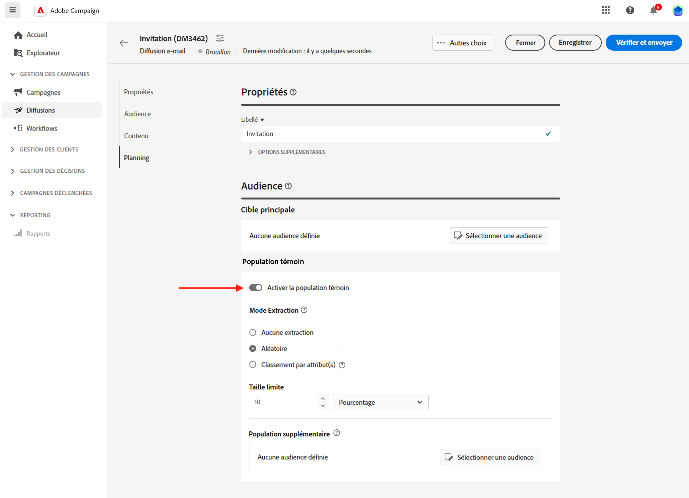
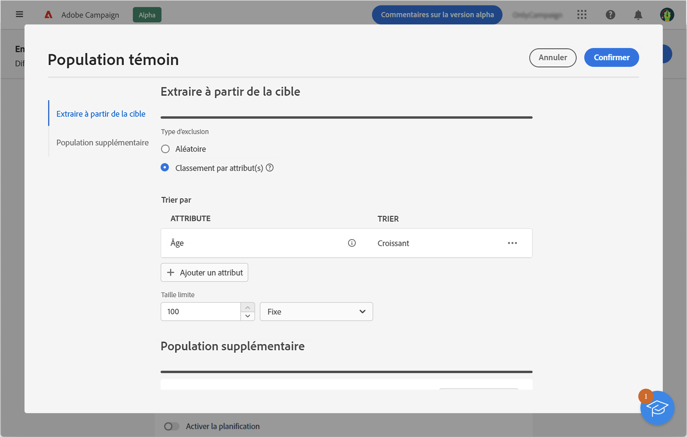
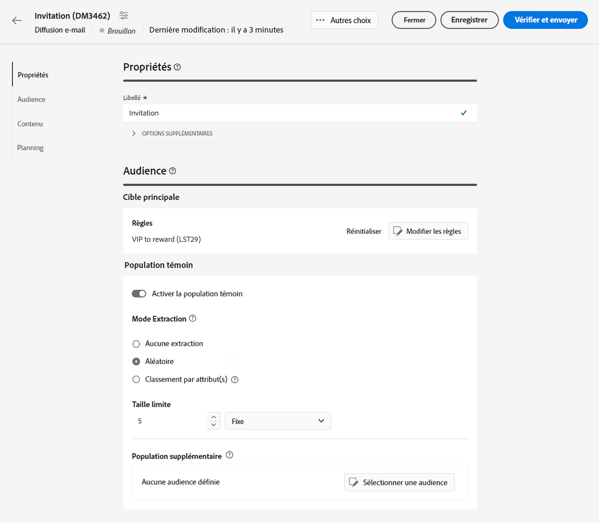
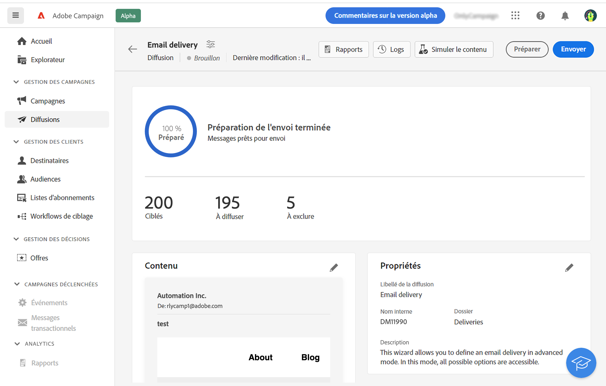
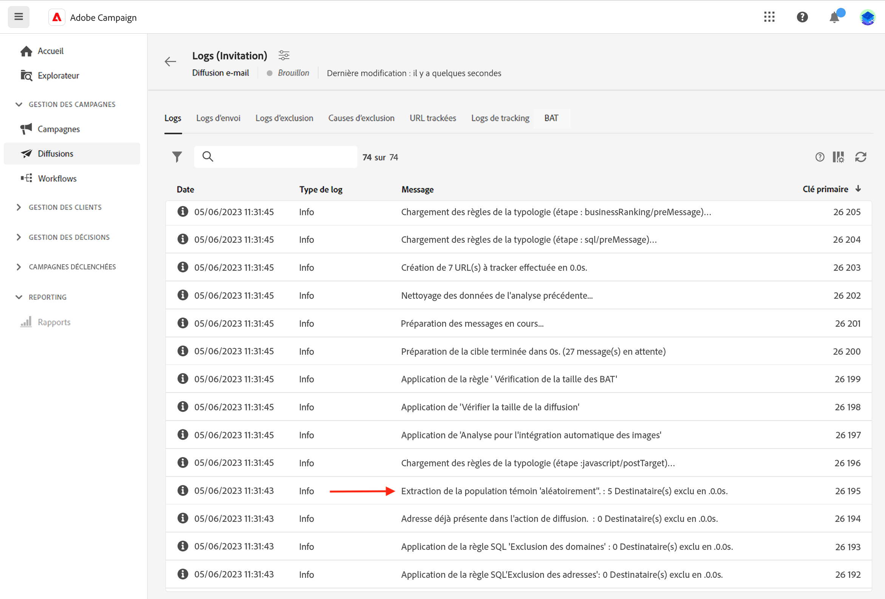
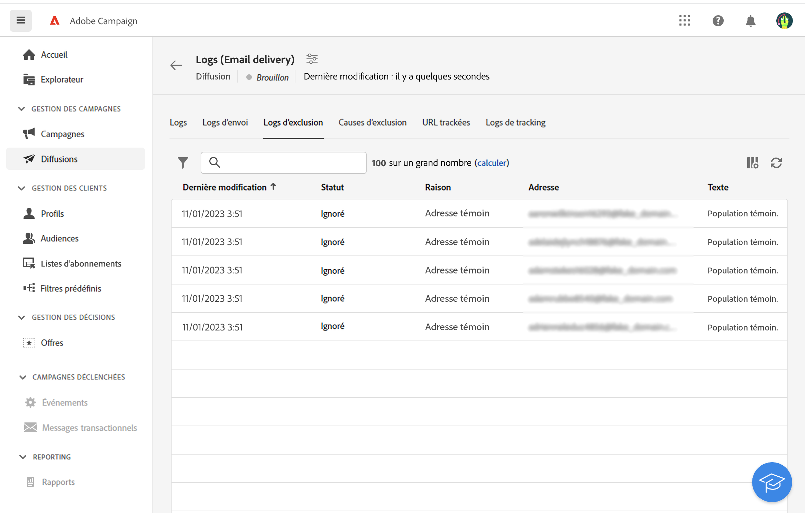
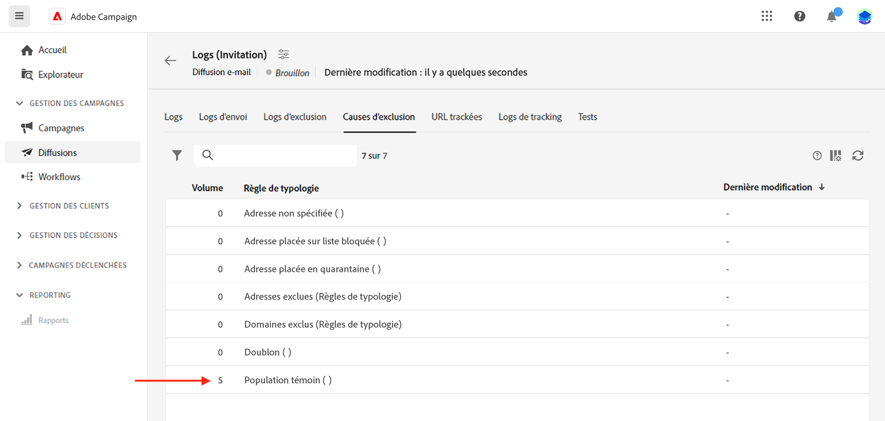
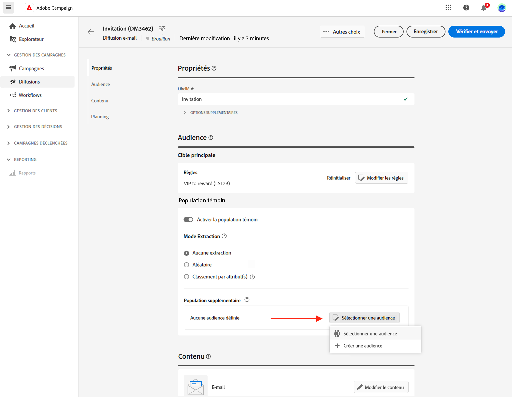

# Configurer une population témoin {#control-group}

Une population témoin est une sous-population exclue de la diffusion. Définissez une population témoin pour éviter d’envoyer des messages à une partie de votre audience et pour comparer le comportement de la cible principale après la diffusion. Cette option vous aide à mesurer l’impact de votre campagne.

➡️ [Découvrez cette fonctionnalité en vidéo](create-audience.md#video)

## Activer la population témoin{#add-a-control-group}

Pour ajouter une population témoin, activez l’option lors de la définition de l’audience de votre diffusion. La population témoin peut être extraite de manière aléatoire de la cible principale et/ou sélectionnée dans une population spécifique. Par conséquent, vous pouvez définir une population témoin de deux manières principales :

* En extrayant un certain nombre de profils de la cible principale.
* En excluant des profils d’une liste ou en fonction de critères définis dans une requête.

Vous pouvez combiner les deux méthodes lors de la définition d’une population témoin.

Tous les profils faisant partie de la population témoin à l’étape de préparation de la diffusion sont supprimés de la cible principale. Ils ne reçoivent pas le message.

>[!CAUTION]
>
>Vous ne pouvez pas utiliser de population témoin lors du chargement de la population cible [à partir d’un fichier externe](file-audience.md).

Pour ajouter une population témoin à une diffusion, activez le bouton (bascule) **[!UICONTROL Activer la population témoin]** dans la section **Audience** de l’écran de création de la diffusion.

## Extraire à partir de la cible {#extract-target}

>[!CONTEXTUALHELP]
>id="acw_deliveries_email_controlgroup_target"
>title="Mode Extraction"
>abstract="Une population témoin est un ensemble de profils exclus de la diffusion. Pour définir une population témoin, vous pouvez choisir d’extraire, de manière aléatoire ou selon un tri, un pourcentage ou un nombre fixe de profils de la population cible."

### Créer une population témoin {#build-extract-target}

Pour définir une population témoin, vous pouvez choisir d’extraire, de manière aléatoire ou selon un tri, un pourcentage ou un nombre fixe de profils de la population cible. Si vous souhaitez ajouter une population supplémentaire, cliquez sur l’option **Aucune extraction** et sélectionnez la population supplémentaire [comme indiqué ici](#extra-population).

Tout d’abord, définissez la façon dont les profils seront extraits de la cible : de manière aléatoire ou en fonction d’un tri.

Dans la section **Population témoin**, choisissez un **Mode d’extraction** :

* **Aléatoire** : lors de la préparation de la diffusion, Adobe Campaign extrait de manière aléatoire un certain nombre de profils correspondant au pourcentage ou au nombre maximal défini comme limite de taille.

* **Classement par attribut(s)** : cette option permet d’exclure un jeu de profils en fonction d’un ou de plusieurs attributs spécifiques dans un ou plusieurs ordres de tri spécifiques.

Dans la section **Limite de taille**, indiquez ensuite le nombre de profils à extraire de la cible principale. Il peut s’agir d’un nombre brut (par exemple, 50 profils à exclure) ou d’un pourcentage de votre audience initiale (5 % de la cible principale, par exemple).

### Exemple de population témoin{#control-group-sample}

Prenons l’exemple suivant : vous souhaitez créer une population témoin constituée des 100 nouveaux destinataires les plus jeunes. Pour ce faire, procédez comme suit :

1. Sélectionnez le champ **Age** comme critère de tri. Laissez l’option de tri sur **Ascendant**.
1. Ajoutez le champ **Date de création**. Modifiez l’option de tri sur **Descendant**.
1. Définissez sur 100 le seuil de la section **Limite de taille**.

   {zoomable=&quot;yes&quot;}

Ces 100 nouveaux destinataires les plus jeunes sont alors exclus de la cible principale.

### Examiner la population témoin {#check-control-group}

Vous pouvez consulter les logs pour vérifier et identifier les profils exclus. Prenons l’exemple suivant d’une exclusion aléatoire sur cinq profils.

{zoomable=&quot;yes&quot;}

Après la préparation de la diffusion, vous pouvez vérifier comment les exclusions ont été appliquées :

* Dans le tableau de bord de la diffusion, avant l’envoi, cochez le KPI **À exclure**.

  {zoomable=&quot;yes&quot;}

* Dans les logs de diffusion, l’onglet Logs affiche l’étape d’exclusion.

  {zoomable=&quot;yes&quot;}
<!--

 * The **Exclusion logs** tab displays each profile and the related exclusion **Reason**.

    {zoomable="yes"}
-->

* L’onglet **Causes d’exclusions** affichent le nombre de profils exclus pour chaque règle de typologie.

  {zoomable=&quot;yes&quot;}

Pour plus d’informations sur les logs de diffusion, consultez [cette section](../monitor/delivery-logs.md).

## Ajouter une population supplémentaire {#extra-population}

>[!CONTEXTUALHELP]
>id="acw_deliveries_email_controlgroup_extra"
>title="Population supplémentaire"
>abstract="Une population témoin est un ensemble de profils exclus de la diffusion. Vous pouvez exclure une population spécifique de l’audience de diffusion en sélectionnant une audience existante ou en définissant une requête."

Vous pouvez également définir une population témoin en sélectionnant une population spécifique dans une audience existante ou en définissant une requête.

Dans la section **Population supplémentaire** de l’écran de définition de la **Population témoin**, cliquez sur le bouton **[!UICONTROL Sélectionner une audience]**.

{zoomable=&quot;yes&quot;}

* Pour utiliser une audience existante, cliquez sur **Sélectionner une audience**. En savoir plus dans [cette section](add-audience.md).

* Pour définir une nouvelle requête, sélectionnez **Créer votre propre requête** et définissez les critères d’exclusion à l’aide du concepteur de requête. En savoir plus dans [cette section](../query/query-modeler-overview.md).

Les profils inclus dans l’audience ou correspondant au résultat de la requête sont **exclus** de la cible de la diffusion : ils ne reçoivent aucun message.

## Comparer les résultats{#control-group-results}

Une fois la diffusion envoyée, vous pouvez extraire les logs d’envoi pour comparer le comportement entre les profils qui n&#39;ont pas reçu la communication et la cible effective. Vous pouvez également utiliser les logs de diffusion pour créer un autre ciblage.

Pour savoir quels profils ont été supprimés de la cible, vérifiez les **logs de diffusion**. En savoir plus [dans cette section](#check-control-group).
