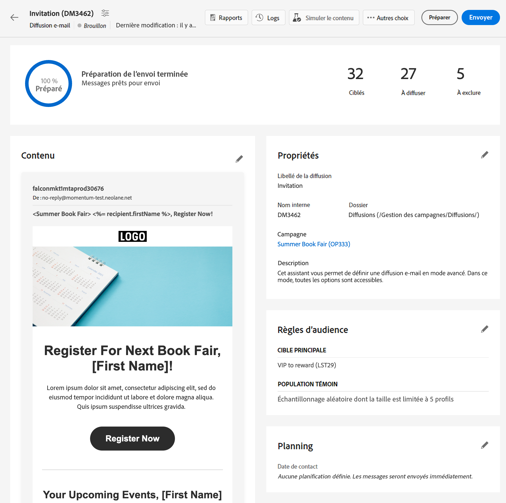

# Configurer une population témoin {#control-group}

>[!NOTE]
>
>Cette documentation est en cours d’élaboration et est fréquemment mise à jour. La version finale de ce contenu sera prête en janvier 2023.

Vous pouvez utiliser des populations témoins pour éviter d’envoyer des messages à une partie de votre audience afin de mesurer l’impact de vos campagnes.

Créez une population témoin lors de la définition de l’audience de votre diffusion. Les profils sont ajoutés à la population témoin de manière aléatoire, filtrés ou non, ou selon des critères. Vous pourrez ensuite comparer le comportement de la population cible qui a reçu le message avec celui des contacts qui n’ont pas été ciblés.

La population témoin peut être extraite de manière aléatoire de la cible principale et/ou sélectionnée dans une population spécifique. Par conséquent, vous pouvez définir une population témoin de deux manières principales :

* En extrayant un certain nombre de profils de la cible principale.
* En excluant certains profils en fonction de critères définis dans une requête.

Vous pouvez utiliser les deux méthodes lors de la définition d’une population témoin.

Tous les profils faisant partie de la population témoin à l’étape de préparation de la diffusion seront supprimés de la cible principale. Ils ne recevront pas le message.

Pour créer une population témoin, cliquez sur le bouton **[!UICONTROL Définir la population témoin]** à partir de la section **Audience** de l’assistant de création de diffusion.

## Extraire à partir de la cible {#extract-target}

>[!CONTEXTUALHELP]
>id="acw_deliveries_email_controlgroup_target"
>title="Extraire à partir de la cible"
>abstract="TBC"

Pour définir une population témoin, vous pouvez choisir d’extraire, de manière aléatoire ou selon un tri, un pourcentage ou un nombre fixe de profils de la population cible.

Tout d’abord, définissez la façon dont les profils seront extraits de la cible : de manière aléatoire ou en fonction d’un tri.

Dans la section **Extraire à partir de la cible**, sélectionnez un **Type d’exclusion** :

* **Tirage aléatoire** : lors de la préparation de la diffusion, Adobe Campaign extrait de manière aléatoire un certain nombre de profils correspondant au pourcentage ou au nombre maximal que vous définissez comme limite de taille.

   

* **Classement par attribut(s)**: cette option vous permet d’exclure un ensemble de profils en fonction d’attributs spécifiques dans un ou plusieurs ordres de tri spécifiques.

   

Définissez ensuite la variable **Limite de taille** : vous devez définir la manière dont vous allez limiter le nombre de profils que vous extrayez de la cible principale.

**Exemple**

Vous pouvez consulter les logs pour vérifier et identifier les profils exclus. Prenons l’exemple d’une exclusion aléatoire sur cinq profils.

Après la préparation de la diffusion, vous pouvez visualiser les exclusions sur les écrans suivants :

* Le **Pour exclure** IPC dans le tableau de bord de la diffusion, avant l&#39;envoi.

   

* Le **Exclus** afficher chaque profil et l’exclusion associée ; **Motif**.

   

* Le **Exclusions appliquées** afficher le nombre de profils exclus pour chaque règle de typologie.

   

Pour plus d&#39;informations sur les logs de diffusion, reportez-vous à cette section [section](../monitor/delivery-logs.md).

## Population supplémentaire {#extra-population}

>[!CONTEXTUALHELP]
>id="acw_deliveries_email_controlgroup_extra"
>title="Population supplémentaire"
>abstract="TBC"

Vous pouvez également définir une population témoin en excluant une population spécifique de la cible. Pour cela, vous pouvez utilisez une audience existante ou définir une requête.

Dans la section **Population supplémentaire** de l’écran de définition de la **Population témoin**, cliquez sur le bouton **[!UICONTROL Sélectionner une audience]**.

* Pour utiliser une audience existante, cliquez sur **Sélectionner une audience**. Reportez-vous à cette [section](add-audience.md).

* Pour définir une nouvelle requête, sélectionnez **Créez votre propre** et définissez les critères d’exclusion à l’aide du créateur de règles. Reportez-vous à cette [section](segment-builder.md).

Les profils inclus dans l’audience ou correspondant au résultat de la requête sont exclus de la cible.