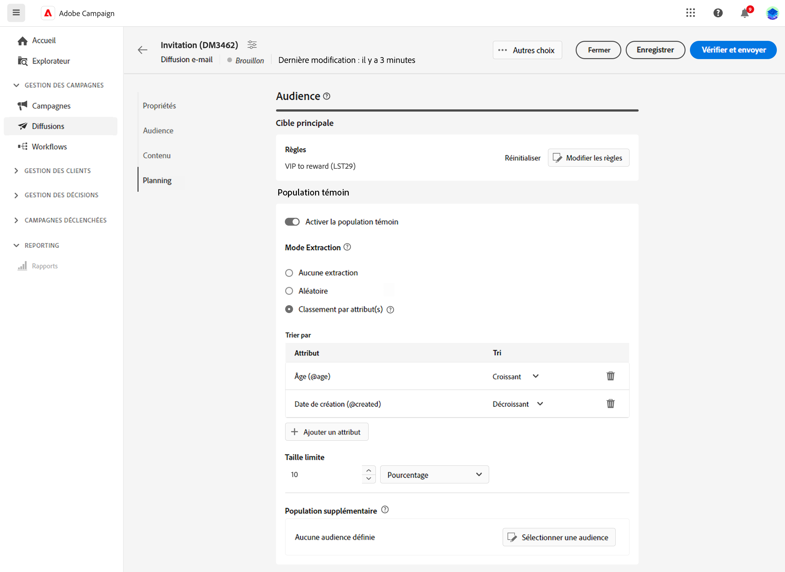
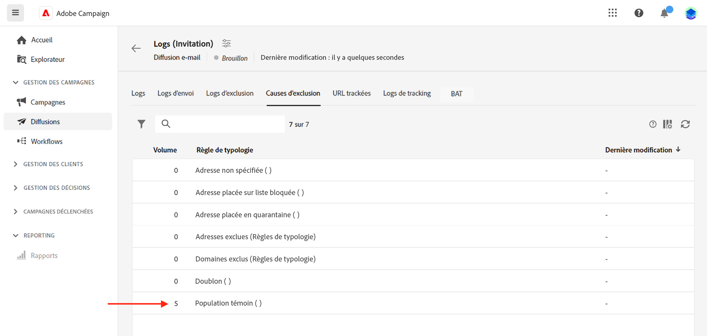

# Configurer une population témoin {#control-group}

Une population témoin est une sous-population exclue de la diffusion. Vous pouvez définir une population témoin afin d’éviter d’envoyer des messages à une partie de votre audience et comparer le comportement après diffusion à la cible principale. Cette option vous aide à mesurer l’impact de votre campagne.

Pour ajouter une population témoin, activez l&#39;option lors de la définition de l&#39;audience de votre diffusion. La population témoin peut être extraite de manière aléatoire de la cible principale et/ou sélectionnée dans une population spécifique. Par conséquent, vous pouvez définir une population témoin de deux manières principales :

* En extrayant un certain nombre de profils de la cible principale.
* Exclure certains profils d’une liste ou en fonction de critères définis dans une requête.

Vous pouvez combiner les deux méthodes lors de la définition d&#39;une population témoin.

Tous les profils faisant partie de la population témoin à l’étape de préparation de la diffusion sont supprimés de la cible principale. Ils ne reçoivent pas le message.

>[!CAUTION]
>
>Vous ne pouvez pas utiliser de population témoin lors du chargement de la population cible. [à partir d’un fichier externe](file-audience.md).

Pour ajouter une population témoin à une diffusion, activez la fonction **[!UICONTROL Activer la population témoin]** bascule, à partir de **Audience** de l&#39;écran de création de la diffusion.

## Extraire à partir de la cible {#extract-target}

>[!CONTEXTUALHELP]
>id="acw_deliveries_email_controlgroup_target"
>title="Mode Extraction"
>abstract="Pour définir une population témoin, vous pouvez choisir d’extraire, de manière aléatoire ou selon un tri, un pourcentage ou un nombre fixe de profils de la population cible."

### Création d’une population témoin {#build-extract-target}

Pour définir une population témoin, vous pouvez choisir d’extraire, de manière aléatoire ou selon un tri, un pourcentage ou un nombre fixe de profils de la population cible. Si vous préférez ajouter une population supplémentaire, choisissez la variable **Aucune extraction** et sélectionner la population supplémentaire [comme détaillé ici](#extra-population).

Tout d&#39;abord, définissez la manière dont les profils sont extraits de la cible : de manière aléatoire ou selon un tri.

Sous , **Population témoin** , choisissez une **Mode d&#39;extraction**:

* **Aléatoire** : lors de la préparation de la diffusion, Adobe Campaign extrait de manière aléatoire un certain nombre de profils correspondant au pourcentage ou au nombre maximal défini comme limite de taille.

* **Classement par attribut(s)** : cette option permet d’exclure un jeu de profils en fonction d’un ou de plusieurs attributs spécifiques dans un ou plusieurs ordres de tri spécifiques.

   

Ensuite, utilisez le **Limite de taille** pour définir le nombre de profils à extraire de la cible principale. Il peut s’agir d’un nombre brut ou d’un pourcentage de votre audience initiale.

### Vérifier votre groupe témoin {#check-extract-target}

Vous pouvez consulter les logs pour vérifier et identifier les profils exclus. Prenons l’exemple suivant d’une exclusion aléatoire sur cinq profils.

Après la préparation de la diffusion, vous pouvez examiner comment les exclusions ont été appliquées :

* Dans le tableau de bord des diffusions, avant l&#39;envoi, cochez la case **Pour exclure** IPC.

   

* Dans les logs de diffusion, l&#39;onglet Logs affiche l&#39;étape d&#39;exclusion.

   

* Le **Exclus** affiche chaque profil et l’exclusion associée. **Motif**.

   

* Le **Exclusions appliquées** affiche le nombre de profils exclus pour chaque règle de typologie.

   

Pour plus d’informations sur les logs de diffusion, consultez [cette section](../monitor/delivery-logs.md).

## Ajouter une population supplémentaire {#extra-population}

>[!CONTEXTUALHELP]
>id="acw_deliveries_email_controlgroup_extra"
>title="Population supplémentaire"
>abstract="Vous pouvez également définir une population témoin en excluant une population spécifique de la cible. Pour cela, vous pouvez utilisez une audience existante ou définir une requête."

Vous pouvez également définir une population témoin en excluant une population spécifique de la cible. Pour cela, vous pouvez utilisez une audience existante ou définir une requête.

Dans la section **Population supplémentaire** de l’écran de définition de la **Population témoin**, cliquez sur le bouton **[!UICONTROL Sélectionner une audience]**.

* Pour utiliser une audience existante, cliquez sur **Sélectionner une audience**. Reportez-vous à cette [section](add-audience.md).

* Pour définir une nouvelle requête, sélectionnez **Créer la vôtre** et définissez les critères d’exclusion à l’aide du créateur de règles. Reportez-vous à cette [section](segment-builder.md).

Les profils inclus dans l’audience ou correspondant au résultat de la requête sont exclus de la cible.