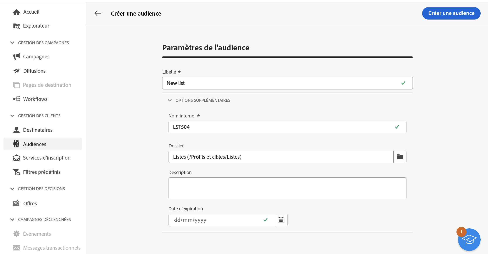
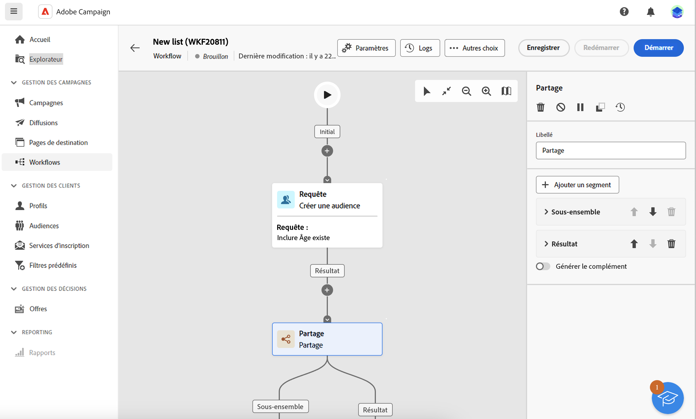
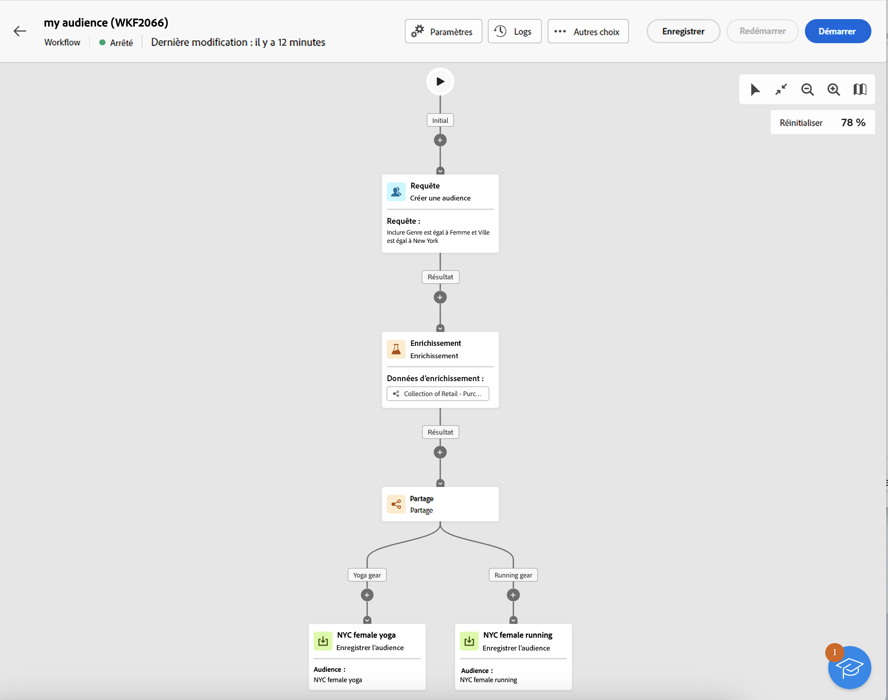

# Création d&#39;audiences {#create-audiences}

>[!CONTEXTUALHELP]
>id="acw_audiences_list"
>title="Audiences"
>abstract="Depuis cet écran, vous pouvez accéder à la liste de toutes les audiences qui peuvent être ciblées dans vos diffusions. Cliquez sur **Créer** pour créer de nouvelles audiences dans une zone de travail visuelle à l’aide de diverses activités de workflow, telles que **Partage** ou **Exclure**."

>[!CONTEXTUALHELP]
>id="acw_audiences_create_settings"
>title="Paramètres de l’audience"
>abstract="Saisissez le nom de l’audience et les options supplémentaires, puis cliquez sur le bouton **Création d’une audience** bouton ."

Campaign Web vous permet de créer de nouvelles audiences dans un canevas de workflow visuel. Au-delà du fait de commencer à zéro pour créer une audience simple, vous pouvez également tirer parti des activités de workflow pour affiner votre audience. Par exemple, vous pouvez combiner plusieurs audiences en une seule, enrichir votre audience avec des attributs externes ou la diviser en plusieurs audiences en fonction des règles de votre choix.

Une fois que vous avez conçu votre workflow, les audiences résultantes sont automatiquement stockées dans la base de données Campaign avec les audiences existantes. Ces audiences peuvent ensuite être ciblées dans des campagnes ou des diffusions autonomes.

## Créer votre première audience {#create}

Pour créer une audience, procédez comme suit :

1. Accédez au **[!UICONTROL Audiences]** et cliquez sur le bouton **[!UICONTROL Création d’une audience]** situé dans le coin supérieur droit.
1. Attribuez un libellé à votre audience.
1. Développez l’objet **[!UICONTROL Options supplémentaires]** pour configurer les paramètres d’audience avancés.

   Par défaut, les audiences sont créées dans la variable **[!UICONTROL Profils et cibles]** / **[!UICONTROL Listes]** menu de l’explorateur. Vous pouvez modifier l’emplacement de stockage par défaut à l’aide du **[!UICONTROL Dossier]** champ .

   

1. Une fois les paramètres d’audience configurés, cliquez sur le bouton **[!UICONTROL Création d’une audience]** bouton . Un canevas de workflow s’affiche, comprenant deux activités par défaut :

   * **[!UICONTROL Créer une audience]**: point de départ de votre workflow, vous permettant de créer une audience et de l’utiliser comme base de votre workflow.

   * **[!UICONTROL Sauvegarde d’audience]**: représente la dernière étape de votre workflow, ce qui vous permet d’enregistrer les résultats du workflow en tant que nouvelle audience.

1. Ouvrez le **[!UICONTROL Créer une audience]** et utilisez le créateur de règles pour définir la population à inclure dans votre audience en filtrant les données contenues dans la base de données. [Découvrez comment configurer une activité Créer une audience](../workflows/activities/build-audience.md)

1. Si vous souhaitez effectuer des opérations supplémentaires sur la population ciblée dans le workflow, ajoutez autant d&#39;activités que nécessaire et reliez-les. Pour plus d’informations sur la configuration des activités de workflow, reportez-vous à la section [documentation sur les workflows](../workflows/activities/about-activities.md).

   >[!NOTE]
   >
   >Les activités de canal ne peuvent pas être utilisées dans les workflows d’audience.

   

1. Configurez la variable **[!UICONTROL Sauvegarde d’audience]** pour indiquer comment enregistrer la population calculée en amont dans le workflow. [Découvrez comment configurer une activité Sauvegarde d’audience](../workflows/activities/save-audience.md)

1. Lorsque votre workflow est prêt, cliquez sur **[!UICONTROL Début]** pour l’exécuter.

Le workflow est enregistré dans la variable **[!UICONTROL Workflows]** tandis que la ou les audiences obtenues sont accessibles dans la **[!UICONTROL Audiences]** liste.

## Exemple de workflow d’audience {#example}

L’exemple ci-dessous montre un workflow d’audience configuré pour cibler les clientes habitant à New York et créer deux nouvelles audiences en fonction de leur dernier achat (tenue de Yoga ou Running).

1. La variable **[!UICONTROL Créer une audience]** Cette activité cible tous les profils de femmes vivant à New York.
1. La variable **[!UICONTROL Enrichissement]** l’activité enrichit l’audience avec des informations de la table Achats afin d’identifier le type de produit que les clients ont acheté.
1. La variable **[!UICONTROL Partage]** L’activité divise le workflow en deux chemins d’accès en fonction du dernier achat des clients.
1. La variable **[!UICONTROL Sauvegarde d’audience]** les activités à la fin de chaque chemin créent deux nouvelles audiences dans la base de données, y compris la population calculée dans chaque chemin.

## Surveillance et gestion des audiences {#monitor}

La liste des audiences disponibles sur le Web de Campaign est accessible à partir du **[!UICONTROL Audiences]** .

Les audiences peuvent provenir de plusieurs sources. La variable **[!UICONTROL Origin]** indique l’emplacement de création d’une audience donnée :

* **[!UICONTROL Adobe Campaign]**: ces audiences sont créées dans la console Adobe Campaign V8. En savoir plus dans la [documentation de Campaign v8 (console cliente)](https://experienceleague.adobe.com/docs/campaign/campaign-v8/audience/create-audiences/create-audiences.html?lang=fr){target="_blank"}.

* **[!UICONTROL ADOBE EXPERIENCE PLATFORM :]** Ces audiences sont créées dans Adobe Experience Platform et intégrées au Web de Campaign à l’aide de l’intégration Sources d’Adobe et Destinations . Découvrez comment configurer cette intégration dans [Documentation de Campaign v8 (console cliente)](https://experienceleague.adobe.com/docs/campaign/campaign-v8/connect/ac-aep/ac-aep.html)

* **[!UICONTROL Interface utilisateur web d’Adobe Campaign]**: ces audiences sont créées à l&#39;aide des workflows d&#39;audience Web de Campaign. [Découvrez comment créer des audiences](create-audience.md)

Pour obtenir plus d’informations sur une audience, ouvrez-la dans la liste. Les propriétés de l’audience s’affichent, avec le nombre de profils inclus dans l’audience. Vous pouvez actualiser le nombre d’audiences à tout moment à l’aide de la variable **[!UICONTROL Calculer]** bouton .

La variable **[!UICONTROL Données]** vous permet de visualiser les profils qui font partie de l’audience. Vous pouvez personnaliser cette vue en ajoutant d’autres colonnes ou en utilisant des filtres avancés pour affiner les données affichées.

Pour dupliquer ou supprimer une audience, cliquez sur le bouton **[!UICONTROL Plus d&#39;action]** est disponible dans la liste des audiences en regard du nom de l’audience ou dans un écran de détails de l’audience.
