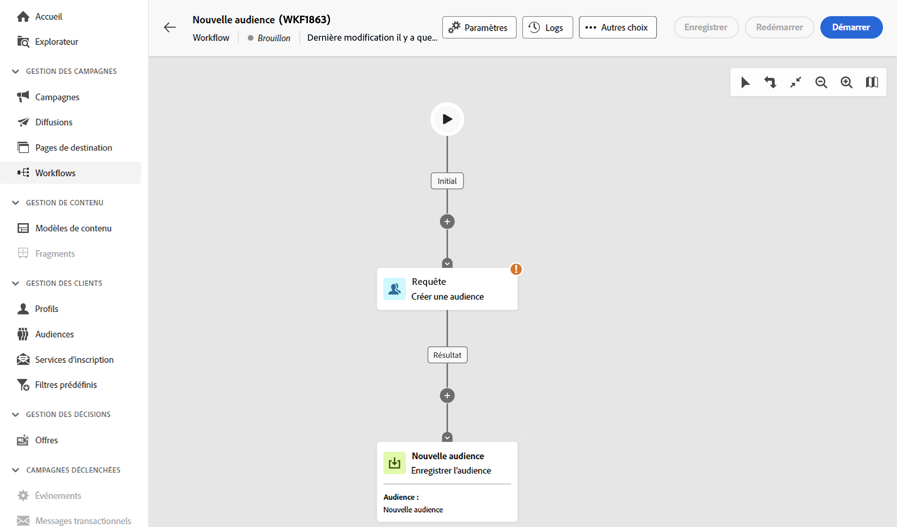
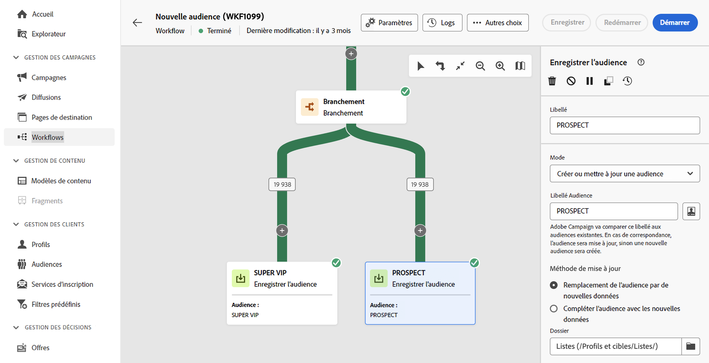

# Créer des audiences {#create-audiences}

>[!CONTEXTUALHELP]
>id="acw_homepage_welcome_rn1"
>title="Composition de l’audience"
>abstract="Créez de nouvelles audiences dans un canevas de workflow visuel. En plus de commencer de zéro pour créer une audience simple, vous pouvez également tirer parti des activités de workflow pour affiner votre audience. Combinez plusieurs audiences en une seule, enrichissez votre audience avec des attributs externes ou divisez-la en plusieurs audiences en fonction des règles de votre choix."
>additional-url="https://experienceleague.adobe.com/docs/campaign-web/v8/whats-new.html?lang=fr" text="Voir les notes de mise à jour"

<!--TO REMOVE BELOW-->

>[!CONTEXTUALHELP]
>id="acw_homepage_rn1"
>title="Composition de l’audience"
>abstract="Créez de nouvelles audiences dans un canevas de workflow visuel. En plus de commencer de zéro pour créer une audience simple, vous pouvez également tirer parti des activités de workflow pour affiner votre audience. Combinez plusieurs audiences en une seule, enrichissez votre audience avec des attributs externes ou divisez-la en plusieurs audiences en fonction des règles de votre choix."
>additional-url="https://experienceleague.adobe.com/docs/campaign-web/v8/whats-new.html?lang=fr" text="Voir les notes de mise à jour"

<!--TO REMOVE ABOVE-->

>[!CONTEXTUALHELP]
>id="acw_audiences_list"
>title="Audiences"
>abstract="Depuis cet écran, vous pouvez accéder à la liste de toutes les audiences qui peuvent être ciblées dans vos diffusions. Cliquez sur **Créer** pour créer de nouvelles audiences dans une zone de travail visuelle à l’aide de diverses activités de workflow, telles que **Partager** ou **Exclure**."

>[!CONTEXTUALHELP]
>id="acw_audiences_create_settings"
>title="Paramètres de l’audience"
>abstract="Saisissez le nom de l’audience et les options supplémentaires, puis cliquez sur le bouton **Créer une audience**."

Campaign Web vous permet de créer de nouvelles audiences dans une zone de travail visuelle de workflow. En plus de commencer de zéro pour créer une audience simple, vous pouvez également tirer parti des activités de workflow pour affiner votre audience. Vous pouvez par exemple combiner plusieurs audiences en une seule, enrichir votre audience avec des attributs externes ou la diviser en plusieurs audiences en fonction des règles de votre choix.

Une fois que vous avez conçu votre workflow, les audiences résultantes sont automatiquement stockées dans la base de données Campaign avec les audiences existantes. Ces audiences peuvent ensuite être ciblées dans des workflows ou des diffusions autonomes.

## Créer votre première audience {#create}

Pour créer une audience, veuillez procéder comme suit :

1. Accédez au menu **[!UICONTROL Audiences]** et cliquez sur le bouton **[!UICONTROL Créer une audience]** situé dans le coin supérieur droit.

1. Un nouveau workflow est automatiquement créé, ce qui vous permet de combiner des activités pour générer votre audience. Par défaut, la zone de travail contient deux activités principales :

   * La &quot;Requête&quot; **[!UICONTROL Créer une audience]** activité est le point de départ de votre workflow, ce qui vous permet de créer une audience et de l’utiliser comme base de votre workflow.

   * La &quot;nouvelle audience&quot; **[!UICONTROL Sauvegarde d’audience]** L’activité représente la dernière étape de votre workflow, ce qui vous permet d’enregistrer les résultats en tant que nouvelle audience.

   

   >[!IMPORTANT]
   >
   >Les workflows d’audience sont stockés dans la variable **Workflows** , ainsi que vos autres workflows Campaign. Ils sont spécialement conçus pour créer des audiences et sont identifiables par leur canevas vertical.

1. Pour une meilleure lisibilité, nous vous recommandons de modifier le nom du workflow dans les paramètres du workflow. **Libellé** champ . [Découvrez comment configurer les paramètres du workflow](../workflows/workflow-settings.md)

1. Ouvrez le **[!UICONTROL Créer une audience]** et utilisez le modèle de requête pour définir la population à inclure dans votre audience en filtrant les données contenues dans la base de données. [Découvrez comment configurer une activité Créer une audience](../workflows/activities/build-audience.md).

1. Si vous souhaitez effectuer des opérations supplémentaires sur la population ciblée dans le workflow, ajoutez autant d’activités que nécessaire et connectez-les l’une à l’autre. Pour plus d’informations sur la configuration des activités de workflow, reportez-vous à la [documentation sur les workflows](../workflows/activities/about-activities.md).

   >[!NOTE]
   >
   >Les activités de canal ne peuvent pas être utilisées dans les workflows d’audience.

   

1. Configurez l’activité **[!UICONTROL Enregistrer une audience]** pour indiquer comment enregistrer la population calculée en amont dans le workflow. [Découvrez comment configurer une activité Enregistrer une audience](../workflows/activities/save-audience.md).

1. Lorsque votre workflow est prêt, cliquez sur **[!UICONTROL Démarrer]** pour l’exécuter.

Le workflow est enregistré dans la variable **[!UICONTROL Workflows]** tandis que la ou les audiences obtenues sont accessibles dans la **[!UICONTROL Audiences]** avec le libellé défini dans la variable **Sauvegarde d’audience** activité. Découvrez comment surveiller et gérer les audiences dans [cette section](manage-audience.md)

Vous pouvez désormais utiliser cette audience comme cible principale d’une diffusion. [En savoir plus](add-audience.md)

## Exemple de workflow d’audience {#example}

L’exemple ci-dessous montre un workflow d’audience configuré pour cibler les clientes habitant à New York et créer deux nouvelles audiences en fonction de leur dernier achat (tenue de yoga ou de running).

1. L’activité **[!UICONTROL Créer une audience]** cible tous les profils de femmes habitant à New York.
1. L’activité **[!UICONTROL Enrichissement]** enrichit l’audience avec des informations du tableau Achats pour identifier le type de produit que les clientes ont acheté.
1. L’activité **[!UICONTROL Partager]** divise le workflow en deux chemins d’accès en fonction du dernier achat des clientes.
1. L’activité **[!UICONTROL Enregistrer une audience]** à la fin de chaque chemin d’accès crée deux nouvelles audiences dans la base de données en incluant la population calculée dans chacun des chemins.

## Modification d’une audience {#edit}

Vous pouvez modifier une audience générée à partir d&#39;un workflow si nécessaire en réexécutant le workflow correspondant. Vous pouvez ainsi actualiser facilement les données d’audience ou affiner l’audience en ajustant la requête en fonction de vos besoins.

1. Accédez au **Audiences** et ouvrez l’audience que vous souhaitez modifier.
1. Dans le **Présentation** , **Dernier workflow** fournit un lien vers le workflow utilisé pour générer l’audience. Cliquez dessus pour accéder au workflow.
1. Apportez les modifications souhaitées, puis cliquez sur le bouton **Début** pour réexécuter le workflow. Une fois le workflow terminé, l’audience issue du workflow est automatiquement mise à jour avec les derniers résultats du workflow.

Par défaut, la réexécution d’un workflow d’audience remplace l’ensemble du contenu de l’audience par de nouvelles données, ce qui entraîne la perte des données précédentes.

Si vous préférez ne pas remplacer les résultats de l’audience existante, configurez la variable **Sauvegarde d’audience** activités afin de répondre à vos besoins. Par exemple, vous pouvez modifier la variable **Libellé de l’audience** pour stocker les nouveaux résultats dans une nouvelle audience ou ajouter les nouveaux résultats au contenu de l’audience existante sans effacer les données précédentes. [Découvrez comment configurer une activité Sauvegarde d’audience](../workflows/activities/save-audience.md)

