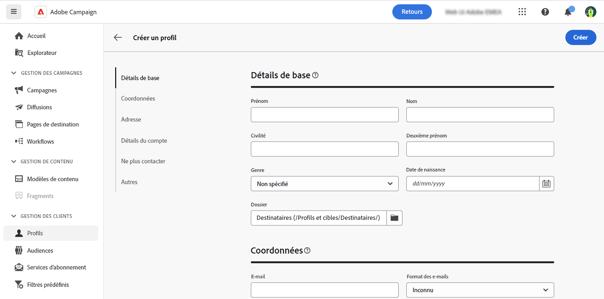

# Créer un profil {#profiles}

>[!CONTEXTUALHELP]
>id="acw_recipients_creation_details"
>title="Détails de base"
>abstract="Cette section fournit des informations sur les détails de base du profil. Pour modifier des informations, apportez vos modifications directement dans le champ correspondant, puis cliquez sur le bouton **Enregistrer** situé dans le coin supérieur droit de l’écran."

>[!CONTEXTUALHELP]
>id="acw_recipients_creation_contactinformation"
>title="Coordonnées"
>abstract="Cette section fournit des informations sur les coordonnées du profil. Pour modifier des informations, apportez vos modifications directement dans le champ correspondant, puis cliquez sur le bouton **Enregistrer** situé dans le coin supérieur droit de l’écran."

>[!CONTEXTUALHELP]
>id="acw_recipients_creation_address"
>title="Adresse"
>abstract="Cette section fournit des informations sur l’adresse postale du profil et la qualité de l’adresse. Pour modifier des informations, apportez vos modifications directement dans le champ correspondant, puis cliquez sur le bouton **Enregistrer** situé dans le coin supérieur droit de l’écran."

>[!CONTEXTUALHELP]
>id="acw_recipients_creation_account"
>title="Détails du compte"
>abstract="Cette section fournit des informations sur les détails du compte du profil. Pour modifier des informations, apportez vos modifications directement dans le champ correspondant, puis cliquez sur le bouton **Enregistrer** situé dans le coin supérieur droit de l’écran."

>[!CONTEXTUALHELP]
>id="acw_recipients_creation_nolongercontact"
>title="Ne plus contacter"
>abstract="Cette section fournit des informations sur les préférences de contact du profil. Pour modifier des informations, apportez vos modifications directement dans le champ correspondant, puis cliquez sur le bouton **Enregistrer** situé dans le coin supérieur droit de l’écran."

>[!CONTEXTUALHELP]
>id="acw_recipients_creation_customfields"
>title="Champs personnalisés"
>abstract="Les champs personnalisés sont des attributs spécifiques, adaptés à vos besoins, qui ont été configurés pour votre instance. Pour modifier des informations, apportez vos modifications directement dans le champ correspondant, puis cliquez sur le bouton **Enregistrer** situé dans le coin supérieur droit de l’écran."

>[!CONTEXTUALHELP]
>id="acw_recipients_creation_othersfields"
>title="Autres"
>abstract="Cette section fournit des attributs intégrés supplémentaires. Pour modifier des informations, apportez vos modifications directement dans le champ correspondant, puis cliquez sur le bouton **Enregistrer** situé dans le coin supérieur droit de l’écran."

Pour créer un profil, procédez comme suit :

1. Accédez à **[!UICONTROL Gestion des clientes et clients]** > **[!UICONTROL Profils]** et cliquez sur le bouton **[!UICONTROL Créer un profil]** dans le coin supérieur droit de l’écran.

1. Liste des attributs disponibles pour l’affichage du profil, organisée en différentes sections détaillées dans le tableau ci-dessous.

   {zoomable="yes"}

   | Section Attributs | Description |
   |  ---  |  ---  |
   | **Détails de base** | Informations de base sur le profil, telles que le nom ou la date de naissance. Par défaut, les profils sont stockés dans le dossier **[!UICONTROL Personnes destinataires]**. Vous pouvez le modifier en accédant à l’emplacement souhaité. [Découvrez comment utiliser les dossiers](../get-started/permissions.md#folders) |
   | **Informations de contact** | Coordonnées du profil, telles que l’adresse e-mail ou le numéro de téléphone. |
   | **Adresse** | Adresse postale du profil. Cette section fournit également une évaluation de la qualité des adresses. L’adresse d’un profil est considérée comme valide si les champs « Nom », « Ville » et « Code postal » sont renseignés. |
   | **Détails du compte** | Informations sur le compte du profil, telles que son statut ou son numéro de compte. |
   | **Ne plus contacter** | Préférences de contact du profil. Lorsque l’une de ces options est sélectionnée, le profil est sur la liste bloquée. Par exemple, si la personne destinataire a cliqué sur un lien de désinscription dans une newsletter, ces informations sont ajoutées aux données de contact. Cette personne n’est plus ciblée sur le ou les canaux sélectionnés. En savoir plus sur la gestion des quarantaines dans la [documentation d’Adobe Campaign v8](https://experienceleague.adobe.com/docs/campaign/campaign-v8/send/failures/quarantines.html?lang=fr){target="_blank"} |
   | **Champs personnalisés** | Si des champs personnalisés ont été configurés, ils s’affichent dans cette section. Les champs personnalisés sont des attributs supplémentaires ajoutés au schéma **[!UICONTROL Profils]** via la console Adobe Campaign. En savoir plus dans la [documentation d’Adobe Campaign v8](https://experienceleague.adobe.com/docs/campaign/campaign-v8/developer/shemas-forms/extend-schema.html?lang=fr){target="_blank"} |
   | **Autres** | Attributs intégrés supplémentaires. |

1. Une fois le profil configuré, cliquez sur **[!UICONTROL Créer]** pour l’enregistrer dans la base de données.

   Une fois terminé, vous pouvez modifier le profil à tout moment en l’ouvrant à partir de la liste des profils. [Découvrir comment explorer les détails des profils](profile-view.md)
