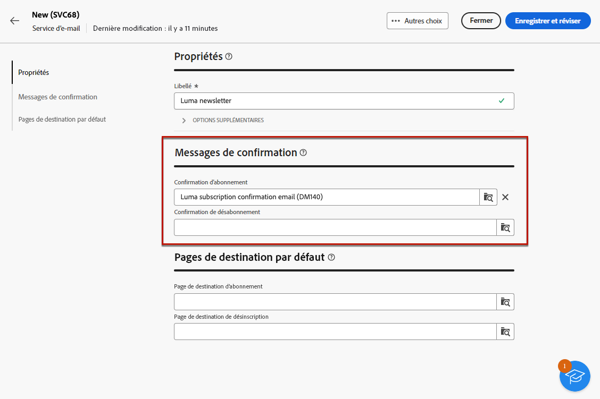

# Création de services {#create-service}

Utilisez Adobe Campaign pour créer et surveiller vos services d’information tels que les newsletters et pour vérifier les abonnements/désabonnements à ces services.

Plusieurs services peuvent être définis en parallèle, par exemple : des newsletters spécialisées pour certaines catégories de produits, certains thèmes ou des zones particulières d’un site Web, des abonnements à divers types de messages d’alerte et des notifications en temps réel.

Pour en savoir plus sur la gestion des abonnements et des désabonnements, consultez la section [Documentation de Campaign v8 (console cliente)](https://experienceleague.adobe.com/docs/campaign/campaign-v8/audience/subscriptions.html){target="_blank"}.

## Accès aux services d’abonnement {#access-services}

1. Accédez à **[!UICONTROL Gestion des accès]** > **[!UICONTROL Services d’inscriptions]** .

   

1. La liste de tous les services créés jusqu&#39;à présent s&#39;affiche. Vous pouvez effectuer des recherches dans les services et filtrer par canal, par dossier ou utiliser des filtres avancés.

   

## Créer votre premier service {#create-service}

1. Sélectionnez la variable **[!UICONTROL Créer un service d’abonnement]** bouton .

   

1. Sélectionnez un canal. **[!UICONTROL Email]** et **[!UICONTROL SMS]** sont disponibles.

1. Dans les propriétés du service, saisissez un libellé et définissez des options supplémentaires si nécessaire.

   

1. Sélectionnez les messages de confirmation.

   

1. Cliquez sur **[!UICONTROL Enregistrement et révision]**.

