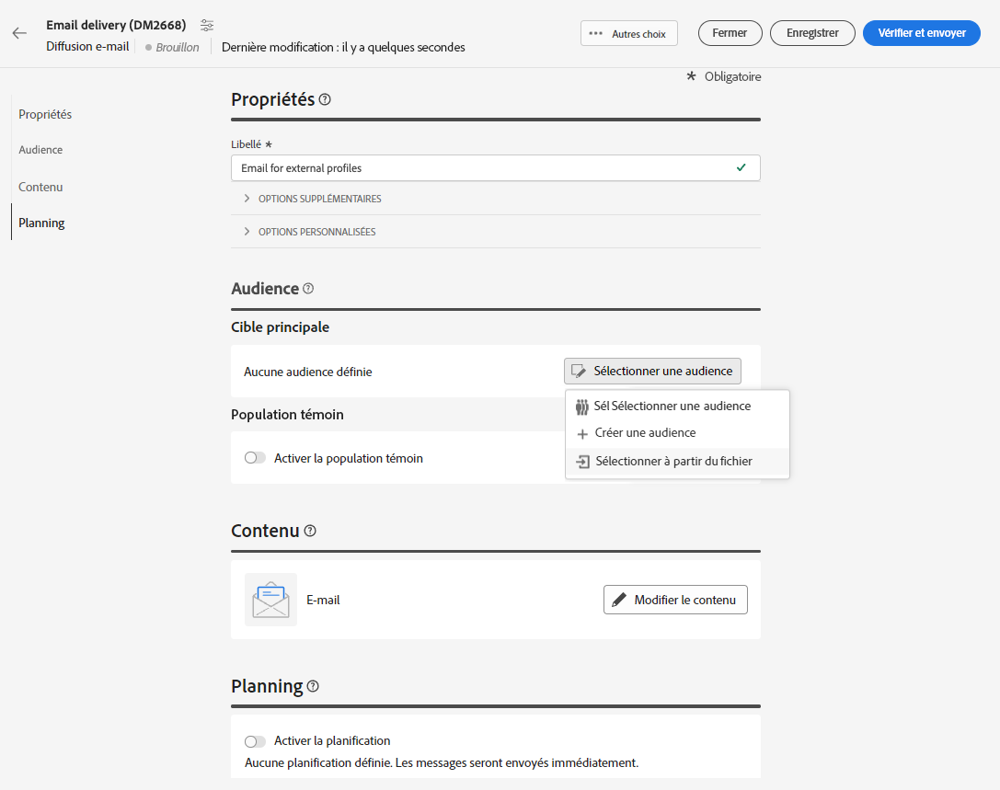
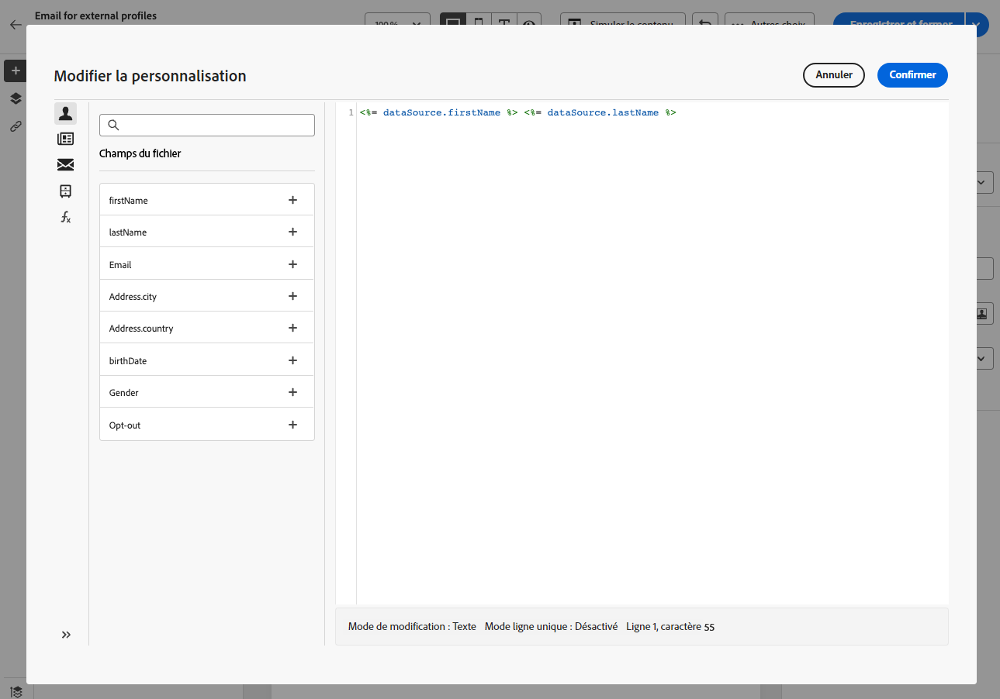
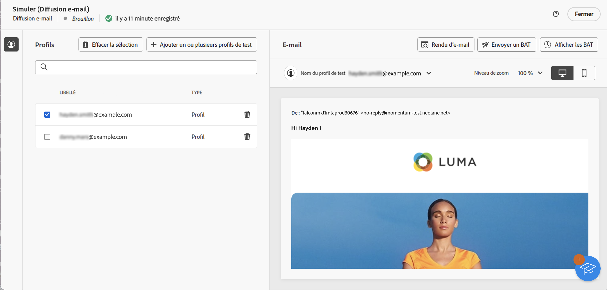
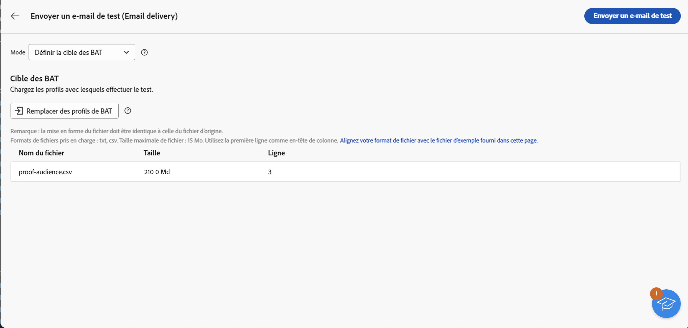

# Charger une audience d’e-mail à partir d’un fichier {#audience-from-file}

>[!CONTEXTUALHELP]
>id="acw_audience_fromfile_select"
>title="Sélection de fichier"
>abstract="Sélectionnez le fichier local à télécharger. Les formats pris en charge sont TXT et CSV. Alignez votre format de fichier sur l’exemple de fichier ci-dessous."

>[!CONTEXTUALHELP]
>id="acw_audience_fromfile_columns"
>title="Définition des colonnes"
>abstract="Vérifiez le format des colonnes dans le fichier externe."

>[!CONTEXTUALHELP]
>id="acw_audience_fromfile_formatting"
>title="Paramètres de formatage"
>abstract="Indiquez le format du fichier externe pour vous assurer que les données seront correctement importées."

>[!CONTEXTUALHELP]
>id="acw_audience_fromfile_preview"
>title="Prévisualiser votre fichier"
>abstract="Vérifiez l’aperçu des colonnes du fichier externe. Cet écran n’affiche que 30 enregistrements au maximum."

Vous pouvez cibler des profils stockés dans un fichier externe. Les profils ne sont pas ajoutés à la base de données, mais tous les champs du fichier d’entrée peuvent être [personnalisés](../personalization/gs-personalization.md). Les formats de fichier pris en charge sont les suivants : texte (TXT) et valeur séparée par des virgules (CSV). Cet article décrit comment charger un profil externe lors de la création d’une diffusion par e-mail autonome. Pour charger des données à partir d’un fichier dans un workflow, reportez-vous à [cette page](../workflows/activities/load-file.md).

>[!CAUTION]
>
>* Cette fonctionnalité n’est disponible que pour les **diffusions par e-mail**. Elle ne peut pas être utilisée avec les diffusions SMS ou Notification push.
>
>* Vous ne pouvez pas utiliser les [populations témoins](control-group.md) lors du chargement de la population cible à partir d’un fichier externe.
>
>* Les profils ne sont pas ajoutés à la base de données et sont chargés et disponibles uniquement pour cette diffusion d’e-mail autonome spécifique.

## Sélectionner et configurer votre fichier {#upload}

Pour cibler des profils à partir d’un fichier local directement dans l’interface e-mail, procédez comme suit :

1. ouvrez une diffusion e-mail existante ou [créez une diffusion e-mail](../email/create-email.md).
1. Dans la fenêtre de création d’une diffusion par e-mail, à partir de la section **Audience**, cliquez sur le bouton **Sélectionner une audience**, puis choisissez l’option **Sélectionner dans un fichier**.

   {zoomable=&quot;yes&quot;}

1. Sélectionnez le fichier local à utiliser. Le format doit correspondre à celui de l’[exemple de fichier](#sample-file).
1. Prévisualisez et vérifiez le mappage des données dans la section centrale de l’écran.
1. Sélectionnez la colonne contenant l’adresse e-mail dans le menu déroulant **Champ d’adresse**. Vous pouvez également sélectionner la colonne de liste bloquée si vous disposez de ces informations dans le fichier d’entrée.
1. Ajustez les paramètres des colonnes et comment formater les données à partir des options disponibles.
1. Cliquez sur **Confirmer** une fois que les paramètres sont corrects.

Lors de la création et de la personnalisation du contenu du message, vous pouvez sélectionner des champs dans le fichier d’entrée de l’[éditeur de personnalisation](../personalization/gs-personalization.md).

{zoomable=&quot;yes&quot;}

## Exemple de fichier {#sample-file}

>[!CONTEXTUALHELP]
>id="acw_audience_fromfile_samplefile"
>title="Charger une audience à partir d’un fichier"
>abstract="Les formats de fichiers pris en charge sont TXT et CSV. Utilisez la première ligne comme en-tête de colonne. Alignez votre format de fichier sur l’exemple fourni dans le lien ci-dessous."

Les formats pris en charge sont TXT et CSV. La première ligne correspond à l’en-tête de colonne.

Choisissez le même format de fichier que celui de l’exemple de fichier ci-dessous :

```javascript
{
lastname,firstname,city,birthdate,email,denylist
Smith,Hayden,Paris,23/05/1985,hayden.smith@example.com,0
Mars,Daniel,London,17/11/1999,danny.mars@example.com,0
Smith,Clara,Roma,08/02/1979,clara.smith@example.com,0
Durance,Allison,San Francisco,15/12/2000,allison.durance@example.com,1
}
```

## Prévisualiser et tester votre e-mail {#test}

Campaign Web vous permet de prévisualiser et d’envoyer des BAT lors de l’utilisation d’une audience chargée à partir d’un fichier. Pour ce faire, procédez comme suit :

1. Cliquez sur le **[!UICONTROL bouton Simuler le contenu]** dans l’écran de modification du contenu de votre diffusion, puis cliquez sur le bouton **[!UICONTROL Ajouter un ou plusieurs profils de test]**.

1. Les profils contenus dans le fichier chargé s’affichent. Sélectionnez le ou les profils à utiliser pour prévisualiser votre contenu, puis cliquez sur **[!UICONTROL Sélectionner]**.

1. Un aperçu du contenu de la diffusion s’affiche dans le volet de droite de l’écran. Les éléments personnalisés sont remplacés par les données du profil sélectionné dans le volet de gauche. [En savoir plus sur la prévisualisation du contenu de la diffusion](../preview-test/preview-content.md)

   {zoomable=&quot;yes&quot;}

1. Pour envoyer un BAT, cliquez sur le bouton **[!UICONTROL Envoyer un BAT]**.

1. Cliquez sur le bouton **[!UICONTROL Charger des profils de BAT]** et sélectionnez le fichier .txt ou .csv contenant les personnes destinataires de vos BAT.

   >[!CAUTION]
   >
   >Assurez-vous que le format de fichier correspond à celui utilisé pour charger votre audience. Toutes les erreurs de format affichent une alerte.

1. Lorsque les profils de BAT sont ajoutés et que vous êtes prêt à envoyer les BAT, cliquez sur le bouton **[!UICONTROL Envoyer un bon à tirer]** et confirmez l’envoi.

   {zoomable=&quot;yes&quot;}

1. Vous pouvez surveiller à tout moment l’envoi du BAT à l’aide du bouton **[!UICONTROL Afficher les BAT]**. [En savoir plus sur la surveillance des BAT](../preview-test/test-deliveries.md#access-test-deliveries)
