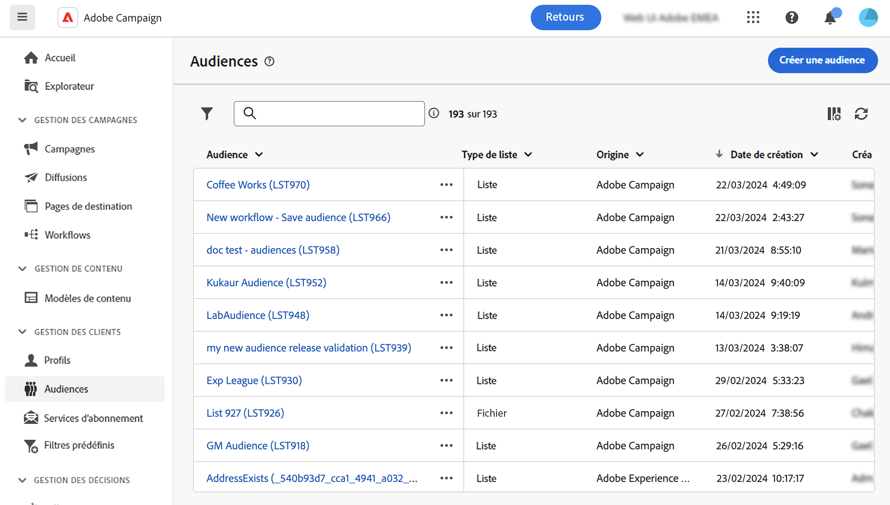

# Surveillance et gestion des audiences {#monitor}

>[!CONTEXTUALHELP]
>id="acw_audiences_properties"
>title="Propriétés"
>abstract="Vous trouverez ici un résumé des propriétés de l’audience, telles que son origine, son dossier de stockage ou son état. Cliquez sur le lien de la section **Dernier workflow** pour ouvrir le workflow qui a été utilisé pour créer l’audience."

>[!CONTEXTUALHELP]
>id="acw_audiences_count"
>title="Taille de l&#39;audience"
>abstract="Vous y trouverez le nombre total de profils au sein de l’audience. Cliquez sur le bouton Calculer pour mettre à jour et recalculer les résultats de l&#39;audience."

>[!CONTEXTUALHELP]
>id="acw_audiences_workflow_error_data_execution"
>title="Erreur d’audience"
>abstract="Données d’audience non disponibles Veuillez attendre la fin de l’exécution du workflow."

L’audience est la cible principale de votre diffusion : les destinataires qui reçoivent les messages. Le type d’audience dépend du mapping de ciblage défini dans le modèle de diffusion. Apprenez-en plus sur les modèles de diffusion sur [cette page](../msg/delivery-template.md).

Pour définir la population d’une audience, vous pouvez :

* [Créer de nouvelles audiences](create-audience.md) à partir du menu **[!UICONTROL Audiences]**.
* [Sélectionner une audience existante](add-audience.md) créée sous la forme d’une liste dans la console cliente ou provenant d’Adobe Experience Platform.
* [Création d’une audience](../query/query-modeler-overview.md) avec le modèle de requête en définissant et combinant les critères de filtrage,
* [Utiliser une audience depuis un fichier externe](file-audience.md). Cette option est disponible uniquement pour les diffusions d’e-mails autonomes et ne peut pas être utilisée dans les diffusions de campagne.

Lors du ciblage d’une audience, vous pouvez également définir des **populations témoins** afin d’éviter d’envoyer des messages à une partie de votre audience et pour mesurer l’impact de vos campagnes. [Découvrez comment définir une population témoin](control-group.md)

>[!NOTE]
>
>Lors de l’envoi de messages dans le cadre d’un workflow de campagne, l’audience est définie dans une activité de workflow **Créer une audience** spécifique. Dans ce contexte, vous ne pouvez pas charger une audience depuis un fichier pour une diffusion par e-mail, et l’audience n’est définie que dans cette activité dédiée. Découvrez comment définir l’audience de votre diffusion dans un workflow de campagne dans [cette section](../workflows/activities/build-audience.md).

La liste des audiences disponibles dans Campaign Web est accessible à partir du menu **[!UICONTROL Audiences]**.

Les audiences peuvent provenir de plusieurs sources. Les colonnes **[!UICONTROL Origine]** indiquent l’emplacement de création d’une audience donnée :

* **[!UICONTROL Adobe Campaign]** : ces audiences sont créées dans la console Adobe Campaign V8. En savoir plus dans la [documentation de Campaign v8 (console cliente)](https://experienceleague.adobe.com/docs/campaign/campaign-v8/audience/create-audiences/create-audiences.html?lang=fr){target="_blank"}.

* **[!UICONTROL Adobe Experience Platform:]** : ces audiences sont créées dans Adobe Experience Platform et intégrées à Campaign Web à l’aide de l’intégration des sources et destinations Adobe. Découvrez comment configurer cette intégration dans la [Documentation de Campaign v8 (console cliente)](https://experienceleague.adobe.com/docs/campaign/campaign-v8/connect/ac-aep/ac-aep.html?lang=fr){target="_blank"}.

>[!NOTE]
>
>Pour utiliser les audiences Adobe Experience Platform dans Campaign, vous devez configurer l’intégration aux sources et destinations Adobe. Consultez la [documentation de Campaign v8 (console cliente)](https://experienceleague.adobe.com/docs/campaign/campaign-v8/connect/ac-aep/ac-aep.html?lang=fr){target="_blank"}.

* **[!UICONTROL Interface utilisateur web d’Adobe Campaign]** : ces audiences sont créées à l’aide des workflows d’audience de Campaign Web. [Découvrez comment créer des audiences](create-audience.md)

Pour obtenir plus d’informations sur une audience, ouvrez-la dans la liste. Les propriétés de l’audience s’affichent, avec le nombre de profils inclus dans l’audience. Vous pouvez actualiser le nombre d’audiences à tout moment à l’aide du bouton **[!UICONTROL Calculer]**.

L’onglet **[!UICONTROL Données]** vous permet de visualiser les profils qui font partie de l’audience. Vous pouvez personnaliser cette vue en ajoutant d’autres colonnes ou en utilisant des filtres avancés pour affiner les données affichées.

Pour dupliquer ou supprimer une audience, cliquez sur le bouton **[!UICONTROL Plus d’action]** disponible dans la liste des audiences, en regard du nom de l’audience ou dans un écran détaillé de l’audience.
