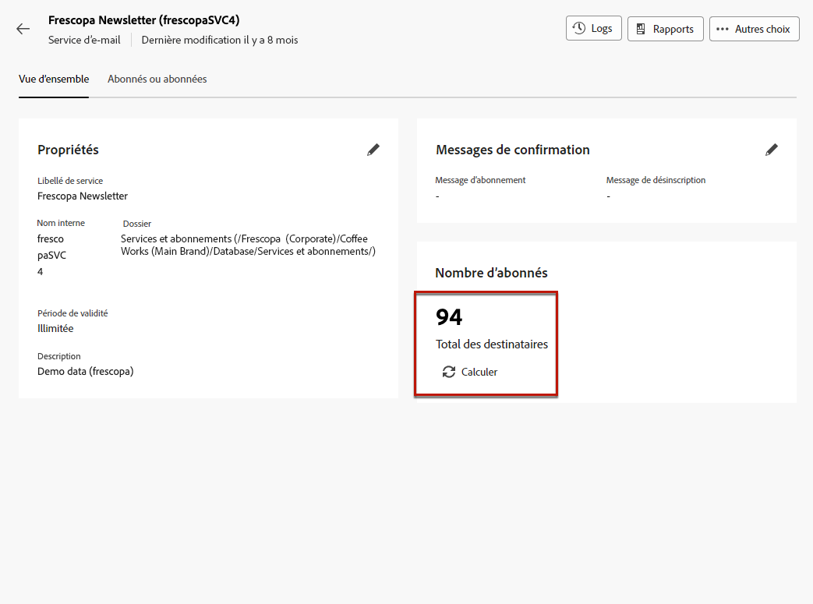

# Utiliser des services d’abonnement {#manage-services}

>[!CONTEXTUALHELP]
>id="acw_subscriptions_list"
>title="Créer et gérer vos services"
>abstract="Utilisez Adobe Campaign pour créer et surveiller vos services, tels que les newsletters, et pour vérifier les abonnements ou désabonnements à ces services. Les abonnements ne s&#39;appliquent qu&#39;aux diffusions email et SMS."

Utilisez le web Adobe Campaign pour gérer et créer vos services tels que les newsletters, et pour vérifier les abonnements ou désabonnements à ces services.

>[!NOTE]
>
>Les abonnements ne s&#39;appliquent qu&#39;aux diffusions email et SMS.

Plusieurs services peuvent être définis en parallèle, par exemple : newsletters pour des catégories de produits spécifiques, des thèmes ou des zones d’un site web, abonnements à différents types de messages d’alerte et notifications en temps réel.

Pour en savoir plus sur la gestion des abonnements et des désabonnements, consultez la section [Documentation de Campaign v8 (console cliente)](https://experienceleague.adobe.com/docs/campaign/campaign-v8/audience/subscriptions.html){target="_blank"}.

## Accès aux services d’abonnement {#access-services}

Pour accéder aux services d&#39;abonnement disponibles pour votre plateforme, procédez comme suit.

1. Accédez au **[!UICONTROL Services d’inscriptions]** sur le rail de navigation de gauche.

   

1. La liste de tous les services d&#39;abonnement existants s&#39;affiche. Vous pouvez effectuer des recherches dans les services et filtrer par canal, par dossier ou utiliser des filtres avancés.

   

1. Pour modifier un service existant, cliquez sur son nom.

1. Vous pouvez supprimer ou dupliquer n’importe quel service à l’aide de l’icône de trois points située en regard de ce nom de service.<!--so all subscribers are unsuibscribed - need to mention?-->

## Créer votre premier service d’abonnement {#create-service}

>[!CONTEXTUALHELP]
>id="acw_subscriptions_list_properties"
>title="Définition des propriétés du service"
>abstract="Saisissez le libellé du service d&#39;abonnement et définissez des options supplémentaires, telles qu&#39;une période de validité pour votre service."

>[!CONTEXTUALHELP]
>id="acw_subscriptions_list_confirm"
>title="Sélectionner un message de confirmation"
>abstract="Lorsqu&#39;un utilisateur s&#39;abonne à un service ou s&#39;en désabonne, vous pouvez envoyer un message de confirmation. Sélectionnez les modèles à utiliser pour ce message."

Pour créer un service d&#39;abonnement, procédez comme suit.

1. Sélectionnez la variable **[!UICONTROL Créer un service d’abonnement]** bouton .

   

1. Sélectionnez un canal : **[!UICONTROL Email]** ou **[!UICONTROL SMS]**.

1. Dans les propriétés du service, saisissez un libellé et définissez les options supplémentaires de votre choix.

   

1. Par défaut, les abonnements sont illimités. Vous pouvez désactiver la variable **[!UICONTROL Durée de validité illimitée]** pour définir une durée de validité du service.

   Dans l’exemple ci-dessous, après 20 jours :
   * Aucun destinataire ne pourra plus s&#39;abonner à ce service.
   * Tous les abonnés à ce service seront automatiquement désabonnés au bout de 20 jours. [En savoir plus](#automatic-unsubscription)

   

1. Lorsqu&#39;un utilisateur s&#39;abonne à un service ou s&#39;en désabonne, vous pouvez envoyer un message de confirmation. Sélectionnez les modèles à utiliser pour ce message en fonction de votre cas d’utilisation. Ces modèles doivent être configurés avec la variable **[!UICONTROL Abonnements]** mapping de ciblage. [En savoir plus](#create-confirmation-message)

   

1. Cliquez sur **[!UICONTROL Enregistrement et révision]**. Le nouveau service est ajouté à la variable **[!UICONTROL Services d’inscriptions]** liste.

## Créer un message de confirmation {#create-confirmation-message}

Pour envoyer des messages de confirmation aux utilisateurs qui s&#39;abonnent ou se désabonnent de votre service, vous devez créer un modèle de diffusion avec la fonction **[!UICONTROL Abonnements]** mapping de ciblage, sans cible définie. Procédez comme suit :

1. Créez un modèle de diffusion pour la confirmation d&#39;inscription. [Voici comment procéder](../msg/delivery-template.md).

1. Ne sélectionnez pas d&#39;audience pour cette diffusion. À la place, accédez au **[!UICONTROL Paramètres de diffusion]**, accédez au [Audience](../advanced-settings/delivery-settings.md#audience) et sélectionnez l’option **[!UICONTROL Abonnements]** mapping de ciblage de la liste.

   

   >[!NOTE]
   >
   >Si vous ne sélectionnez pas l’option  **[!UICONTROL Abonnements]** mapping de ciblage, vos abonnés ne recevront pas le message de confirmation. Les mappings de ciblage sont définis dans la console  Campaign v8. En savoir plus [Documentation d’Adobe Campaign v8](https://experienceleague.adobe.com/docs/campaign/campaign-v8/audience/add-profiles/target-mappings.html?lang=fr){target="_blank"}.

1. Editez le contenu de votre modèle de diffusion, enregistrez-le et fermez-le.

   

   >[!NOTE]
   >
   >En savoir plus sur les canaux de diffusion et la définition d’un contenu de diffusion dans la section [Canal email](../email/create-email.md) et [Canal SMS](../sms/create-sms.md) sections.

1. Répétez les étapes ci-dessus pour créer un modèle de diffusion pour la confirmation de désinscription.

Vous pouvez maintenant sélectionner ces messages lorsque [création d’un service d’abonnement](#create-service). Les utilisateurs qui s’abonnent ou se désabonnent de ce service recevront les messages de confirmation sélectionnés.

## Surveillance des services d’abonnement {#logs-and-reports}

Pour mesurer l’efficacité de vos services d’abonnement pour les canaux SMS et email, vous pouvez accéder aux logs et aux rapports d’un service donné.

1. Sélectionnez un service existant à partir de la fonction **[!UICONTROL Services d’inscriptions]** liste. Cliquez sur **[!UICONTROL Calculer]** obtenez le nombre total d’abonnés.

   

1. Dans le tableau de bord du service, sélectionnez **[!UICONTROL Journaux]** pour visualiser la liste des abonnés à ce service. Vous pouvez vérifier le nombre total d&#39;abonnés, le nom et l&#39;adresse de chaque destinataire et le moment où il s&#39;est abonné ou s&#39;est désabonné. Vous pouvez également les filtrer.

   

1. Dans le tableau de bord du service, sélectionnez **[!UICONTROL Rapports]**. Vérifiez les indicateurs suivants :

   * La variable **[!UICONTROL Nombre total d&#39;abonnés]** s’affiche.

   * Vous pouvez visualiser le nombre d&#39;abonnements et de désabonnements sur une période sélectionnée. Utilisez la liste déroulante pour modifier la période.

     

   * La variable **[!UICONTROL Evolution globale des inscriptions]** Le graphique présente la répartition par période, y compris les abonnements, les désabonnements, l’évolution en nombre et le pourcentage de fidélité.<!--what is Registered?-->

1. Utilisez la variable **[!UICONTROL Recharger]** pour récupérer les dernières valeurs de l&#39;exécution et du planning du workflow de tracking.

