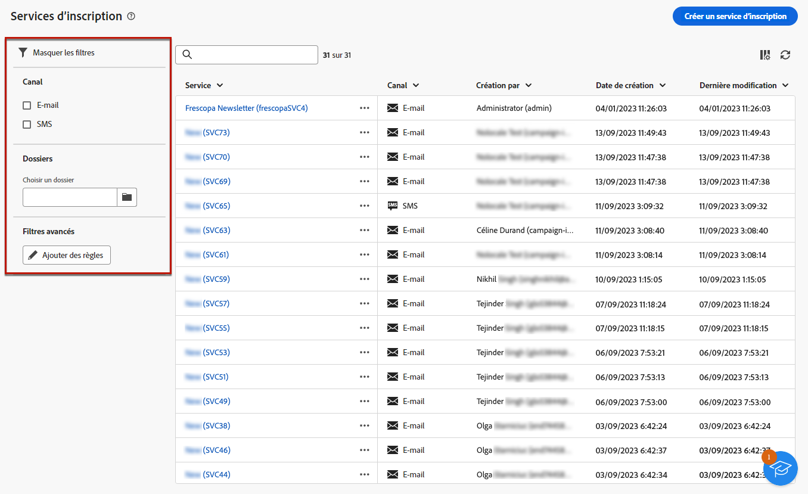
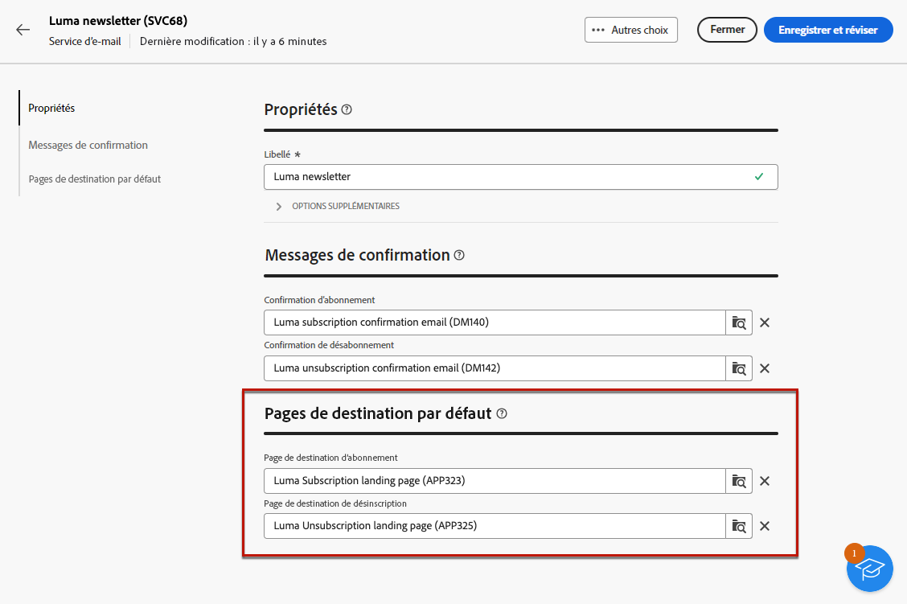

# Créer et gérer des services d’abonnement {#manage-services}

>[!CONTEXTUALHELP]
>id="acw_subscriptions_list"
>title="Créer et gérer des services"
>abstract="Utilisez Adobe Campaign pour créer et surveiller vos services, tels que les newsletters, et pour vérifier les abonnements ou les désabonnements à ces services. Les abonnements ne s’appliquent qu’aux diffusions e-mail et SMS."

Utilisez Adobe Campaign Web pour gérer et créer vos services, tels que des newsletters, et pour vérifier les abonnements ou les désabonnements à ces services.

Plusieurs services peuvent être définis en parallèle, par exemple : des newsletters pour des catégories de produits, des thèmes ou des zones spécifiques d’un site web, des abonnements à divers types de messages d’alerte et des notifications en temps réel.

>[!NOTE]
>
>Les abonnements ne s’appliquent qu’aux diffusions e-mail et SMS.

## Accès aux services d’abonnements {#access-services}

Pour accéder aux services d’abonnements disponibles pour votre plateforme, procédez comme suit.

1. Accédez au menu **[!UICONTROL Services d’abonnement]** sur le rail de navigation de gauche, dans **[!UICONTROL Gestion des clientes et clients]**.

   {zoomable="yes"}

1. La liste de tous les services d’abonnements existants s’affiche. Vous pouvez rechercher les services et filtrer par canal, dossier ou ajouter des règles à l’aide du [requêteur](../query/query-modeler-overview.md).

   {zoomable="yes"}

1. Pour modifier un service existant, cliquez sur son nom.

1. Supprimez ou dupliquez un service à l’aide de l’icône des trois points située en regard du nom du service.<!--so all subscribers are unsubscribed - need to mention?-->

## Créer votre premier service d’abonnement {#create-service}

>[!CONTEXTUALHELP]
>id="acw_subscriptions_list_properties"
>title="Définir les propriétés de vos services"
>abstract="Saisissez le libellé du service d’abonnement et définissez des options supplémentaires, telles qu’une période de validité pour votre service."

>[!CONTEXTUALHELP]
>id="acw_subscriptions_list_confirm"
>title="Sélectionner un message de confirmation"
>abstract="Lorsqu’une personne s’abonne à un service ou s’en désabonne, vous pouvez envoyer un message de confirmation. Sélectionnez les modèles à utiliser pour ce message."

>[!CONTEXTUALHELP]
>id="acw_subscriptions_defaultlp"
>title="Page de destination par défaut"
>abstract="Sélectionnez les pages de destination par défaut associées à ce service."

Pour créer un service d’abonnement, procédez comme suit :

1. Sélectionnez le bouton **[!UICONTROL Créer un service d’abonnement]**.

   {zoomable="yes"}

1. Sélectionnez un canal : **[!UICONTROL E-mail]** ou **[!UICONTROL SMS]**.

1. Dans les propriétés de service, saisissez un libellé et définissez **[!UICONTROL Options supplémentaires]** si nécessaire.

   {zoomable="yes"}

1. Par défaut, les services sont stockés dans le dossier **[!UICONTROL Services et abonnements]**. Vous pouvez le modifier en accédant à l’emplacement souhaité. [Découvrez comment utiliser les dossiers](../get-started/permissions.md#folders)

1. Par défaut, les abonnements sont illimités.

   Désactivez l’option **[!UICONTROL Période de validité illimitée]** pour définir une durée de validité pour le service. Une fois la période de validité terminée :
   * Aucun profil ne peut plus s’abonner à ce service.
   * Tous les abonnés à ce service sont automatiquement désabonnés.

   {zoomable="yes"}

1. Lorsqu’une personne s’abonne à un service ou s’en désabonne, vous pouvez envoyer un message de confirmation. Sélectionnez les modèles à utiliser pour ce message en fonction de votre cas d’utilisation. Ces modèles doivent être configurés avec le mapping de ciblage **[!UICONTROL Abonnements]**. [En savoir plus](#create-confirmation-message)

   {zoomable="yes"}

1. Cliquez sur **[!UICONTROL Enregistrer et réviser]**. Le nouveau service est ajouté à la liste **[!UICONTROL Services d’abonnements]**.

1. Sélectionnez les pages de destination d’abonnement et de désabonnement par défaut associées à ce service.

   >[!AVAILABILITY]
   >
   >Cette fonctionnalité est en disponibilité limitée. Celle-ci est limitée aux clientes et aux clients effectuant la migration **d’Adobe Campaign Standard vers Adobe Campaign v8** et ne peut pas être déployée dans un autre environnement.

   {zoomable="yes"}

   Une fois que vous avez terminé, lorsque vous [insérez un lien](../email/message-tracking.md) dans un e-mail, sélectionnez **[!UICONTROL Lien d’abonnement]** ou **[!UICONTROL Lien de désabonnement]**. En cliquant sur ce lien, les utilisateurs et utilisatrices sont redirigés vers la page de destination d’abonnement ou de désabonnement référencée dans le service. <!--After submitting the form, they will be subscribed to / unsubscribed from the service.-->

   {zoomable="yes"}

1. Enregistrez et vérifiez vos modifications.

Vous pouvez maintenant effectuer les actions suivantes :

* Ajoutez manuellement des personnes abonnées à ce service et désinscrivez des profils. [En savoir plus](../audience/manage-subscribers.md)

* Invitez vos clientes et clients à s’abonner à ce service par le biais d’une page de destination. [En savoir plus](../landing-pages/lp-use-cases.md#lp-subscription)

* Envoyez des messages aux personnes abonnées à ce service. [Voici comment procéder](../msg/send-to-subscribers.md).

## Créer un message de confirmation {#create-confirmation-message}

>[!CONTEXTUALHELP]
>id="acw_subscriptions_delivery_template"
>title="Sélectionner le modèle de diffusion des abonnements"
>abstract="Pour envoyer des messages de confirmation aux personnes qui s’abonnent à votre service, vous devez sélectionner un modèle de diffusion avec le mapping de ciblage **[!UICONTROL Abonnements]**, sans cible définie."

>[!CONTEXTUALHELP]
>id="acw_unsubscriptions_delivery_template"
>title="Sélectionner le modèle de diffusion pour les désabonnements"
>abstract="Pour envoyer des messages de confirmation aux personnes qui se désabonnent de votre service, vous devez sélectionner un modèle de diffusion avec le mapping de ciblage **[!UICONTROL Abonnements]**, sans cible définie."

Pour envoyer des messages de confirmation aux utilisateurs qui se sont abonnés ou désabonnés de votre service, créez un modèle de diffusion avec le mapping de ciblage **[!UICONTROL Abonnements]**, sans cible définie. Procédez comme suit :

1. Créez un modèle de diffusion pour la confirmation d’abonnement. [Découvrir comment créer un modèle](../msg/delivery-template.md)

1. Ne sélectionnez pas d’audience pour cette diffusion. Accédez plutôt à la diffusion **[!UICONTROL Paramètres]**, accédez à l’onglet [Audience](../advanced-settings/delivery-settings.md#audience) et sélectionnez le mapping de ciblage **[!UICONTROL Abonnements]** dans la liste.

   {zoomable="yes"}

   >[!NOTE]
   >
   >Si vous ne sélectionnez pas le mapping de ciblage **[!UICONTROL Abonnements]**, vos abonnés ne recevront pas le message de confirmation. Pour plus d’informations sur les mappings de ciblage, consultez [cette section](../audience/targeting-dimensions.md).

1. Modifiez le contenu de votre modèle de diffusion, enregistrez-le et fermez-le.

   {zoomable="yes"}

   >[!NOTE]
   >
   >Découvrez les canaux de diffusion et comment définir le contenu de la diffusion dans les sections [Canal e-mail](../email/create-email.md) et [Canal SMS](../sms/create-sms.md).

1. Répétez les étapes ci-dessus pour créer un modèle de diffusion pour la confirmation de désinscription.

Vous pouvez maintenant sélectionner ces messages lors de la [création d’un service d’abonnement](#create-service). Les utilisateurs et utilisatrices qui se sont abonnés ou désabonnés à ce service recevront les messages de confirmation sélectionnés.

## Surveiller vos services d’abonnement {#logs-and-reports}

>[!CONTEXTUALHELP]
>id="acw_subscriptions_totalnumber_subscribers"
>title="Nombre de personnes abonnées"
>abstract="Cliquez sur **Calculer** pour obtenir le nombre total d&#39;abonnés à ce service."

>[!CONTEXTUALHELP]
>id="acw_subscriptions_totalnumber_subscribers_report"
>title="Nombre total de personnes abonnées"
>abstract="L’indicateur clé de performance (KPI) donne une vue d’ensemble de la base de personnes abonnées, indiquant le nombre total de personnes abonnées à ce service."

>[!CONTEXTUALHELP]
>id="acw_subscriptions_overtheperiod_subscribers"
>title="Nombre d’abonnements sur la période correspondante"
>abstract="Utilisez la liste déroulante pour modifier la période et afficher le nombre d’abonnements et de désabonnements sur la période sélectionnée."

>[!CONTEXTUALHELP]
>id="acw_subscriptions_overallevolution_subscribers"
>title="Évolution globale des abonnements"
>abstract="Ce graphique présente la répartition par période, y compris les abonnements, les désabonnements, l’évolution des nombres et le pourcentage de fidélité."

Pour mesurer l’efficacité de vos services d’abonnement pour les canaux SMS et e-mail, accédez aux journaux et rapports d’un service donné.

1. Sélectionnez un service existant dans la liste **[!UICONTROL Services d’abonnements]**. Cliquez sur **[!UICONTROL Calculer]** pour obtenir le nombre total d&#39;abonnés.

   {zoomable="yes"}

1. Dans le tableau de bord du service, sélectionnez **[!UICONTROL Journaux]** pour afficher la liste des abonnés à ce service.

   Vous pouvez vérifier le nombre total d’abonnés, le nom et l’adresse de chaque destinataire, ainsi que la date d’inscription ou de désinscription. Vous pouvez également les filtrer.

   {zoomable="yes"}

1. Dans le tableau de bord du service, sélectionnez **[!UICONTROL Rapports]**. Vérifiez les indicateurs suivants :

   * Le **[!UICONTROL nombre total de personnes abonnées]** s’affiche.

   * Afficher le nombre d&#39;abonnements et de désabonnements sur une période sélectionnée. Utilisez la liste déroulante pour modifier la période.

     {zoomable="yes"}

   * Le graphique **[!UICONTROL Évolution globale des abonnements]** présente la répartition par période, y compris les abonnements, les désabonnements, l’évolution en nombre et le pourcentage de fidélité.<!--what is Registered?-->

1. Utilisez le bouton **[!UICONTROL Recharger]** pour récupérer les dernières valeurs de l&#39;exécution et du planning du workflow de tracking.