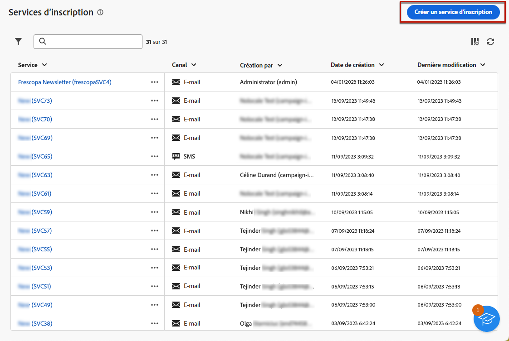

# Créer et gérer des services d’abonnement {#manage-services}

>[!CONTEXTUALHELP]
>id="acw_subscriptions_list"
>title="Créer et gérer des services"
>abstract="Utilisez Adobe Campaign pour créer et surveiller vos services, tels que les newsletters, et pour vérifier les inscriptions ou désinscriptions à ces services. Les abonnements ne s’appliquent qu’aux diffusions e-mail et SMS."

Utilisez Adobe Campaign Web pour créer et surveiller vos services tels que les newsletters, ainsi que pour vérifier les abonnements et désabonnements relatifs à ces services.

Plusieurs services peuvent être définis en parallèle, comme les newsletters spécialisées dans certaines catégories de produits, certains thèmes ou certaines rubriques d’un site web, les abonnements à divers types de messages d’alerte et les notifications en temps réel.

>[!NOTE]
>
>Les abonnements ne s’appliquent qu’aux diffusions e-mail et SMS.

## Accès aux services d’abonnements {#access-services}

Pour accéder aux services d’abonnements disponibles pour votre plateforme, procédez comme suit.

1. Accédez au menu **[!UICONTROL Services d’abonnements]** sur le rail de navigation de gauche.

   {zoomable=&quot;yes&quot;}

1. La liste de tous les services d’abonnements existants s’affiche. Vous pouvez rechercher les services et les filtrer selon le canal, le dossier ou ajouter des règles à l’aide du [concepteur de requête](../query/query-modeler-overview.md).

   {zoomable=&quot;yes&quot;}

1. Pour modifier un service existant, cliquez sur son nom.

1. Vous pouvez supprimer ou dupliquer n’importe quel service à l’aide de l’icône représentant trois points située à côté du nom du service.<!--so all subscribers are unsubscribed - need to mention?-->

## Créer votre premier service d’abonnement {#create-service}

>[!CONTEXTUALHELP]
>id="acw_subscriptions_list_properties"
>title="Définir les propriétés de vos services"
>abstract="Saisissez le libellé du service d’abonnement et définissez des options supplémentaires, telles qu’une période de validité pour votre service."

>[!CONTEXTUALHELP]
>id="acw_subscriptions_list_confirm"
>title="Sélectionner un message de confirmation"
>abstract="Lorsqu’une personne s’abonne à un service ou s’en désabonne, vous pouvez envoyer un message de confirmation. Sélectionnez les modèles à utiliser pour ce message."

Pour créer un service d’abonnement, procédez comme suit :

1. Sélectionnez le bouton **[!UICONTROL Créer un service d’abonnement]**.

   {zoomable=&quot;yes&quot;}

1. Sélectionnez un canal : **[!UICONTROL E-mail]** ou **[!UICONTROL SMS]**.

1. Dans les propriétés du service, saisissez un libellé et définissez les **[!UICONTROL options supplémentaires]** de votre choix.

   {zoomable=&quot;yes&quot;}

1. Par défaut, les services sont stockés dans le dossier **[!UICONTROL Services et abonnements]**. Vous pouvez le modifier en accédant à l’emplacement souhaité. [Découvrez comment utiliser les dossiers](../get-started/permissions.md#folders)

1. Par défaut, les abonnements sont illimités.

   Vous pouvez désactiver l’option **[!UICONTROL Période de validité illimitée]** pour définir une durée de validité du service. Une fois la période de validité terminée :
   * Plus aucun profil ne peut s’abonner à ce service.
   * Toutes les personnes abonnées à ce service sont automatiquement désabonnées.

   {zoomable=&quot;yes&quot;}

1. Lorsqu’une personne s’abonne à un service ou s’en désabonne, vous pouvez envoyer un message de confirmation. Sélectionnez les modèles à utiliser pour ce message en fonction de votre cas d’utilisation. Ces modèles doivent être configurés avec le mapping de ciblage **[!UICONTROL Abonnements]**. [En savoir plus](#create-confirmation-message)

   {zoomable=&quot;yes&quot;}

1. Cliquez sur **[!UICONTROL Enregistrer et réviser]**. Le nouveau service est ajouté à la liste **[!UICONTROL Services d’abonnements]**.

Vous pouvez maintenant :

* ajouter des personnes abonnées à ce service et désabonner des profils. [En savoir plus](../msg/send-to-subscribers.md)

* Envoyez des messages aux personnes abonnées à ce service. [Voici comment procéder](../msg/send-to-subscribers.md).

## Créer un message de confirmation {#create-confirmation-message}

>[!CONTEXTUALHELP]
>id="acw_subscriptions_delivery_template"
>title="Sélectionner le modèle de diffusion des abonnements"
>abstract="Pour envoyer des messages de confirmation aux personnes qui s’abonnent à votre service, vous devez sélectionner un modèle de diffusion avec le mapping de ciblage **[!UICONTROL Abonnements]**, sans cible définie."

>[!CONTEXTUALHELP]
>id="acw_unsubscriptions_delivery_template"
>title="Sélectionner le modèle de diffusion pour les désabonnements"
>abstract="Pour envoyer des messages de confirmation aux personnes qui se désabonnent de votre service, vous devez sélectionner un modèle de diffusion avec le mapping de ciblage **[!UICONTROL Abonnements]**, sans cible définie."

Pour envoyer des messages de confirmation aux personnes qui s’abonnent à ou se désabonnent de votre service, vous devez créer un modèle de diffusion avec le mapping de ciblage **[!UICONTROL Abonnements]**, sans cible définie. Procédez comme suit :

1. Créez un modèle de diffusion pour la confirmation d’abonnement. [Découvrir comment créer un modèle](../msg/delivery-template.md)

1. Ne sélectionnez pas d’audience pour cette diffusion. À la place, accédez aux **[!UICONTROL Paramètres]** de diffusion, puis à l’onglet [Audience](../advanced-settings/delivery-settings.md#audience) et sélectionnez le mapping de ciblage des **[!UICONTROL Abonnements]** dans la liste.

   {zoomable=&quot;yes&quot;}

   >[!NOTE]
   >
   >Si vous ne sélectionnez pas le mapping de ciblage **[!UICONTROL Abonnements]**, vos personnes abonnées ne recevront pas le message de confirmation. Pour plus d’informations sur les mappings de ciblage, consultez [cette section](../audience/targeting-dimensions.md).

1. Modifiez le contenu de votre modèle de diffusion, enregistrez-le et fermez-le.

   {zoomable=&quot;yes&quot;}

   >[!NOTE]
   >
   >En savoir plus sur les canaux de diffusion et la définition d’un contenu de diffusion dans les sections [Canal e-mail](../email/create-email.md) et [Canal SMS](../sms/create-sms.md).

1. Répétez les étapes ci-dessus pour créer un modèle de diffusion pour la confirmation de désinscription.

Vous pouvez maintenant sélectionner ces messages lors de la [création d’un service d’abonnement](#create-service). Les utilisateurs et utilisatrices qui se sont abonnés ou désabonnés à ce service recevront les messages de confirmation sélectionnés.

## Surveiller vos services d’abonnement {#logs-and-reports}

>[!CONTEXTUALHELP]
>id="acw_subscriptions_totalnumber_subscribers"
>title="Nombre de personnes abonnées"
>abstract="Cliquez sur **Calculer** pour obtenir le nombre total de personnes abonnées à ce service."

>[!CONTEXTUALHELP]
>id="acw_subscriptions_totalnumber_subscribers_report"
>title="Nombre total de personnes abonnées"
>abstract="L’indicateur clé de performance (KPI) donne une vue d’ensemble de la base de personnes abonnées, indiquant le nombre total de personnes abonnées à ce service."

>[!CONTEXTUALHELP]
>id="acw_subscriptions_overtheperiod_subscribers"
>title="Nombre d’abonnements sur la période correspondante"
>abstract="Utilisez la liste déroulante pour modifier la période et afficher le nombre d’abonnements et de désabonnements sur la période sélectionnée."

>[!CONTEXTUALHELP]
>id="acw_subscriptions_overallevolution_subscribers"
>title="Évolution globale des abonnements"
>abstract="Ce graphique affiche la répartition par période, y compris les abonnements, les désabonnements, l’évolution en chiffres et le pourcentage de fidélité."

Pour mesurer l’efficacité de vos services d’abonnement pour les canaux SMS et e-mail, vous pouvez accéder aux journaux et aux rapports d’un service donné.

1. Sélectionnez un service existant dans la liste **[!UICONTROL Services d’abonnements]**. Cliquez sur **[!UICONTROL Calculer]** pour obtenir le nombre total de personnes abonnées.

   {zoomable=&quot;yes&quot;}

1. Dans le tableau de bord du service, sélectionnez **[!UICONTROL Journaux]** pour visualiser la liste des personnes abonnées à ce service.

   Vous pouvez vérifier le nombre total de personnes abonnées, le nom et l’adresse de chaque personne destinataire et la date de son abonnement ou de son désabonnement. Vous pouvez également les filtrer.

   {zoomable=&quot;yes&quot;}

1. Dans le tableau de bord du service, sélectionnez **[!UICONTROL Rapports]**. Vérifiez les indicateurs suivants :

   * Le **[!UICONTROL nombre total de personnes abonnées]** s’affiche.

   * Vous pouvez visualiser le nombre d’abonnements et de désabonnements sur une période sélectionnée. Utilisez la liste déroulante pour modifier la période.

     {zoomable=&quot;yes&quot;}

   * Le graphe **[!UICONTROL Évolution globale des abonnements]** affiche la répartition par période, y compris les abonnements, les désabonnements, l’évolution en nombre et le pourcentage de fidélité.<!--what is Registered?-->

1. Utilisez le bouton **[!UICONTROL Recharger]** pour récupérer les dernières valeurs de l’exécution et du planning du workflow de tracking.

<!--## Best practices {#best-practices}

It is recommended to send a confirmation message to the new subscribers of a service. To do so, create a delivery template and select it when creating a subscription service. [Learn more](#create-confirmation-message).

Send communications targeting your subscribers only. [Learn how](../msg/send-to-subscribers.md)

Always provide your subscribers the capability to unsubscribe from your services. [Learn how](consent.md#email-opt-out)

* When creating a confirmation message:

    * Do not select an audience for this delivery.

    * Select the **[!UICONTROL Subscriptions]** target mapping. Otherwise, your subscribers will not receive the confirmation message.
-->