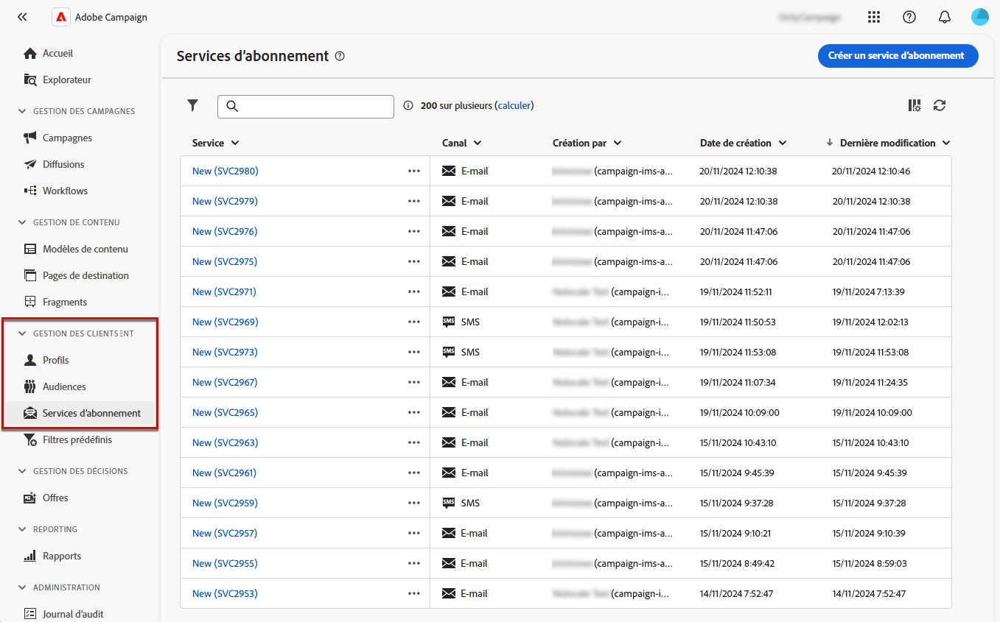
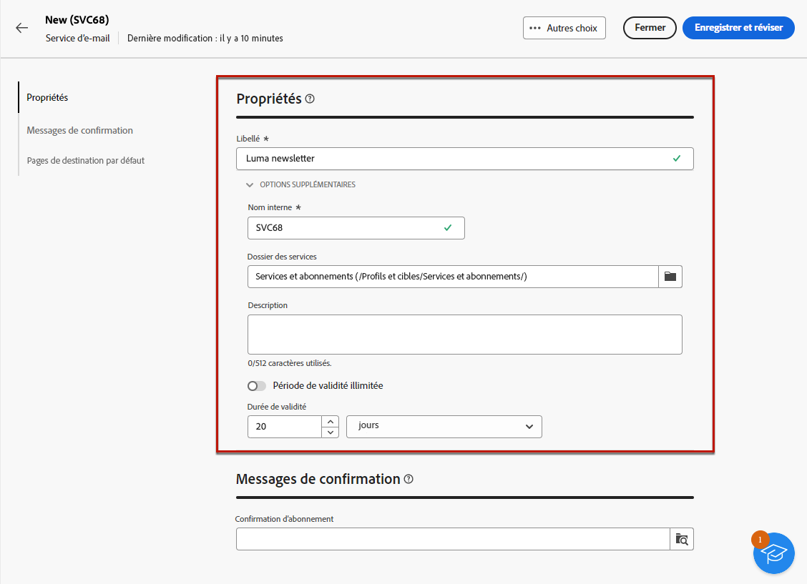

# Créer et gérer des services d’abonnement {#manage-services}

>[!CONTEXTUALHELP]
>id="acw_subscriptions_list"
>title="Créer et gérer vos services"
>abstract="Utilisez Adobe Campaign pour créer et surveiller vos services, tels que les newsletters, et pour vérifier les inscriptions ou désinscriptions à ces services. Les abonnements ne s’appliquent qu’aux diffusions e-mail et SMS."

Utilisez Adobe Campaign Web pour créer et surveiller vos services tels que les newsletters, ainsi que pour vérifier les abonnements et désabonnements relatifs à ces services.

>[!NOTE]
>
>Les abonnements ne s’appliquent qu’aux diffusions e-mail et SMS.

Plusieurs services peuvent être définis en parallèle, comme les newsletters spécialisées dans certaines catégories de produits, certains thèmes ou certaines rubriques d’un site Web, les abonnements à divers types de messages d’alerte et les notifications en temps réel.

Pour en savoir plus sur la gestion des abonnements et des désabonnements, consultez la section [Documentation de Campaign v8 (console cliente)](https://experienceleague.adobe.com/docs/campaign/campaign-v8/audience/subscriptions.html?lang=fr){target="_blank"}.

## Accès aux services d’abonnements {#access-services}

Pour accéder aux services d’abonnements disponibles pour votre plateforme, procédez comme suit.

1. Accédez au menu **[!UICONTROL Services d’abonnements]** sur le rail de navigation de gauche.

   

1. La liste de tous les services d’abonnements existants s’affiche. Vous pouvez effectuer des recherches dans les services et filtrer par canal ou par dossier, ou encore utiliser des filtres avancés.

   

1. Pour modifier un service existant, cliquez sur son nom.

1. Vous pouvez supprimer ou dupliquer n’importe quel service à l’aide de l’icône des trois points située en regard de ce nom de service.<!--so all subscribers are unsuibscribed - need to mention?-->

## Créer votre premier service d’abonnement {#create-service}

>[!CONTEXTUALHELP]
>id="acw_subscriptions_list_properties"
>title="Définir les propriétés de vos services"
>abstract="Saisissez le libellé du service d’abonnement et définissez des options supplémentaires, telles qu’une période de validité pour votre service."

>[!CONTEXTUALHELP]
>id="acw_subscriptions_list_confirm"
>title="Sélectionner un message de confirmation"
>abstract="Lorsqu’une personne s’abonne à un service ou s’en désabonne, vous pouvez envoyer un message de confirmation. Sélectionnez les modèles à utiliser pour ce message."

Pour créer un service d’abonnement, procédez comme suit :

1. Sélectionnez le bouton **[!UICONTROL Créer un service d’abonnement]**.

   

1. Sélectionnez un canal : **[!UICONTROL E-mail]** ou **[!UICONTROL SMS]**.

1. Dans les propriétés du service, saisissez un libellé et définissez les options supplémentaires de votre choix.

   

1. Par défaut, les abonnements sont illimités. Vous pouvez désactiver la variable **[!UICONTROL Durée de validité illimitée]** pour définir une durée de validité du service.

   Dans l’exemple ci-dessous, après 20 jours :
   * Aucun destinataire ne pourra plus s’abonner à ce service.
   * Toutes les personnes abonnées à ce service seront automatiquement désabonnées au bout de 20 jours. [En savoir plus](#automatic-unsubscription)

   

1. Lorsqu’une personne s’abonne à un service ou s’en désabonne, vous pouvez envoyer un message de confirmation. Sélectionnez les modèles à utiliser pour ce message en fonction de votre cas d’utilisation. Ces modèles doivent être configurés avec le mapping de ciblage **[!UICONTROL Abonnements]**. [En savoir plus](#create-confirmation-message)

   

1. Cliquez sur **[!UICONTROL Enregistrer et réviser]**. Le nouveau service est ajouté à la liste **[!UICONTROL Services d’abonnements]**.

## Créer un message de confirmation {#create-confirmation-message}

Pour envoyer des messages de confirmation aux personnes qui s’abonnent à ou se désabonnent de votre service, vous devez créer un modèle de diffusion avec le mapping de ciblage **[!UICONTROL Abonnements]**, sans cible définie. Procédez comme suit :

1. Créez un modèle de diffusion pour la confirmation d’abonnement. [Voici comment procéder](../msg/delivery-template.md).

1. Ne sélectionnez pas d’audience pour cette diffusion. À la place, accédez aux **[!UICONTROL Paramètres de diffusion]**, puis à l’onglet [Audience](../advanced-settings/delivery-settings.md#audience) et sélectionnez le mapping de ciblage **[!UICONTROL Abonnements]** dans la liste.

   

   >[!NOTE]
   >
   >Si vous ne sélectionnez pas le mapping de ciblage **[!UICONTROL Abonnements]**, vos personnes abonnées ne recevront pas le message de confirmation. Les mappings de ciblage sont définis dans la console Campaign v8. En savoir plus dans la [documentation d’Adobe Campaign v8](https://experienceleague.adobe.com/docs/campaign/campaign-v8/audience/add-profiles/target-mappings.html?lang=fr){target="_blank"}.

1. Modifiez le contenu de votre modèle de diffusion, enregistrez-le et fermez-le.

   

   >[!NOTE]
   >
   >En savoir plus sur les canaux de diffusion et la définition d’un contenu de diffusion dans les sections [Canal e-mail](../email/create-email.md) et [Canal SMS](../sms/create-sms.md).

1. Répétez les étapes ci-dessus pour créer un modèle de diffusion pour la confirmation de désinscription.

Vous pouvez maintenant sélectionner ces messages lors de la [création d’un service d’abonnement](#create-service). Les utilisateurs et utilisatrices qui se sont abonnés ou désabonnés à ce service recevront les messages de confirmation sélectionnés.

## Surveiller vos services d’abonnement {#logs-and-reports}

Pour mesurer l’efficacité de vos services d’abonnement pour les canaux SMS et e-mail, vous pouvez accéder aux journaux et aux rapports d’un service donné.

1. Sélectionnez un service existant dans la liste **[!UICONTROL Services d’abonnements]**. Cliquez sur **[!UICONTROL Calculer]** pour obtenir le nombre total de personnes abonnées.

   

1. Dans le tableau de bord du service, sélectionnez **[!UICONTROL Journaux]** pour visualiser la liste des personnes abonnées à ce service. Vous pouvez vérifier le nombre total de personnes abonnées, le nom et l’adresse de chaque destinataire et le moment de son abonnement ou de son désabonnement. Vous pouvez également les filtrer.

   

1. Dans le tableau de bord du service, sélectionnez **[!UICONTROL Rapports]**. Vérifiez les indicateurs suivants :

   * Le **[!UICONTROL nombre total de personnes abonnées]** s’affiche.

   * Vous pouvez visualiser le nombre d’abonnements et de désabonnements sur une période sélectionnée. Utilisez la liste déroulante pour modifier la période.

     

   * Le graphe **[!UICONTROL Évolution globale des abonnements]** affiche la répartition par période, y compris les abonnements, les désabonnements, l’évolution en nombre et le pourcentage de fidélité.<!--what is Registered?-->

1. Utilisez le bouton **[!UICONTROL Recharger]** pour récupérer les dernières valeurs de l’exécution et du planning du workflow de tracking.
