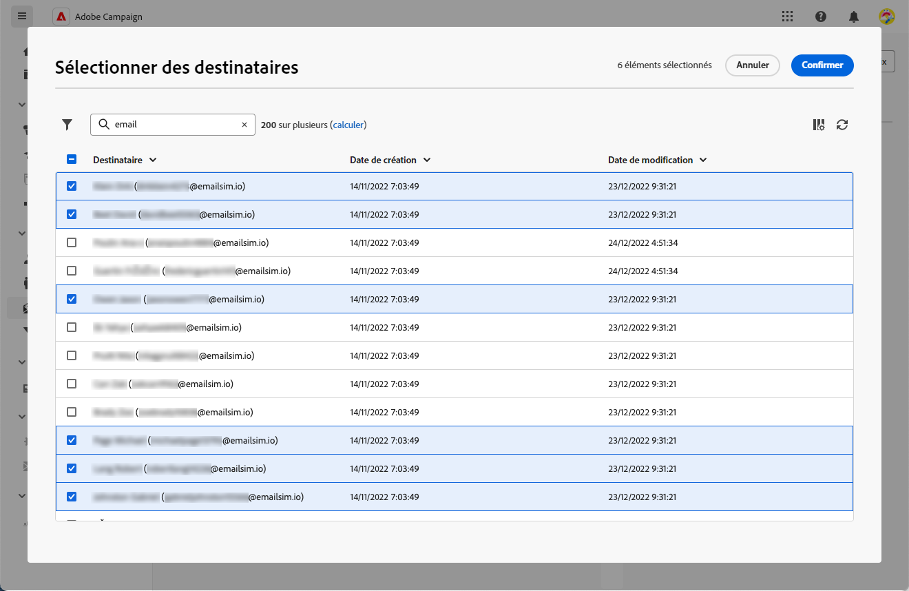

# Gérer les personnes abonnées {#manage-subscribers}

Après avoir [créé un service](manage-services.md#create-service), vous pouvez ajouter des personnes abonnées, désabonner des destinataires et envoyer des messages aux personnes abonnées à ce service.

La gestion des personnes abonnées est détaillée sur cette page. Pour découvrir comment envoyer des messages à vos personnes abonnées, reportez-vous à [cette section](../msg/send-to-subscribers.md).

## Ajouter des personnes abonnées à votre service {#add-subscribers}

Pour ajouter manuellement des personnes abonnées, procédez comme suit.

1. Sélectionnez un service existant dans la liste **[!UICONTROL Services d’abonnements]**.

1. Accédez à l’onglet **[!UICONTROL Personnes abonnées]** et cliquez sur **[!UICONTROL Ajouter des personnes abonnées]**.

   {zoomable="yes"}

1. Sélectionnez les profils à ajouter dans la liste, puis cliquez sur **[!UICONTROL Confirmer]**.

   {zoomable="yes"}

1. Cliquez sur **[!UICONTROL Envoyer]**<!--if you click cancel, does it mean that no message is sent but recipients are still subscribed, or they are not subscribed? it's 2 different actions in the console)--> pour que les personnes destinataires sélectionnées reçoivent le [message de confirmation](manage-services.md#create-confirmation-message) d’abonnement que vous avez défini lors de la [création du service](manage-services.md#create-service).

   {zoomable="yes"}

   >[!NOTE]
   >
   >Si vous sélectionnez **[!UICONTROL Annuler]**, aucun message de confirmation n’est envoyé aux profils sélectionnés, mais ceux-ci sont quand même abonnés.

Les profils ajoutés sont affichés dans l’onglet **[!UICONTROL Personnes abonnées]**. Ils sont maintenant abonnés à votre service.

## Supprimer des personnes abonnées de votre service {#remove-subscribers}

### Désabonner manuellement des profils {#manual-unsubscription}

Une fois les [personnes abonnées ajoutées](#add-subscribers) à votre service, vous pouvez désabonner manuellement chacune d’elles. Suivez les étapes ci-dessous.

1. Sélectionnez un service existant à partir de la liste **[!UICONTROL Services d’abonnements]**.

1. Cliquez sur l’icône représentant trois points de suspension située en regard du nom de la personne destinataire, puis sélectionnez **[!UICONTROL Supprimer]**.

   {zoomable="yes"}

1. Confirmez la suppression.

1. Cliquez sur **[!UICONTROL Envoyer]** pour que la personne destinataire sélectionnée reçoive le [message de confirmation](manage-services.md#create-confirmation-message) de désabonnement que vous avez défini lors de la [création du service](manage-services.md#create-service).

   {zoomable="yes"}

La personne destinataire est supprimée de l’onglet **[!UICONTROL Personnes abonnées]** et n’est plus abonnée à votre service.

### Désabonner automatiquement les destinataires {#automatic-unsubscription}

Un service d’abonnement peut avoir une durée limitée. Les profils sont automatiquement désabonnés à l’expiration de la période de validité.

Cette période est spécifiée lors de la [création du service](manage-services.md#create-service). Dans les **[!UICONTROL Options supplémentaires]**, désactivez l’option **[!UICONTROL Période de validité illimitée]** et définissez une période de validité pour le service.

{zoomable="yes"}

Une fois la durée spécifiée expirée, toutes les personnes abonnées sont automatiquement désabonnées de ce service.