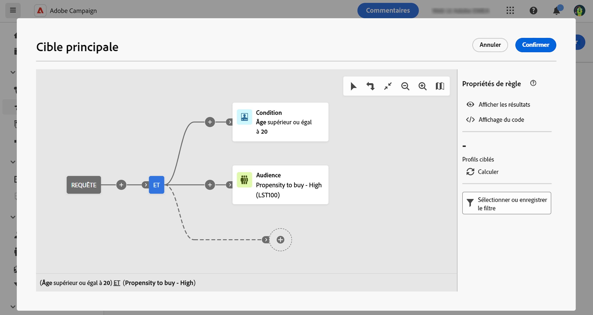

# Créer une audience ponctuelle {#one-time}

Cette section décrit comment créer une audience lors de la création d’une nouvelle diffusion. Dans ce cas, les profils à inclure dans l’audience de diffusion sont ciblés en interrogant la base de données avec le créateur de requêtes.

L’audience obtenue n’est utilisée qu’une seule fois pour cette diffusion. Elle n’est pas enregistrée dans la liste des audiences.

Lors de la définition de la cible principale d’une diffusion, vous pouvez également :

* [Sélectionnez une audience existante](add-audience.md) dans la liste **[!UICONTROL Audiences]**.
* [Chargez une audience depuis un fichier externe](file-audience.md) (pour les e-mails uniquement).

Pour créer une nouvelle audience directement depuis une diffusion, procédez comme suit :

1. Dans la section **Audience** de l’assistant de création de diffusion, cliquez sur le bouton **[!UICONTROL Sélectionner une audience]**.

   {zoomable=&quot;yes&quot;}

1. Sélectionnez **Créer la vôtre**. Le concepteur de requête s’affiche. Il permet de définir la population ciblée par votre diffusion en filtrant les données contenues dans la base de données. [Découvrir comment utiliser le concepteur de requête](../query/query-modeler-overview.md)

   {zoomable=&quot;yes&quot;}

1. Une fois votre requête prête, cliquez sur **Confirmer** pour utiliser l’audience comme cible principale de votre diffusion.

   Vous pouvez également définir une population témoin afin de mesurer l’impact de vos campagnes. La population témoin ne reçoit pas le message. Vous pouvez ainsi comparer le comportement de la population qui a reçu le message avec celui des contacts qui ne l’ont pas reçu. [En savoir plus](control-group.md)
