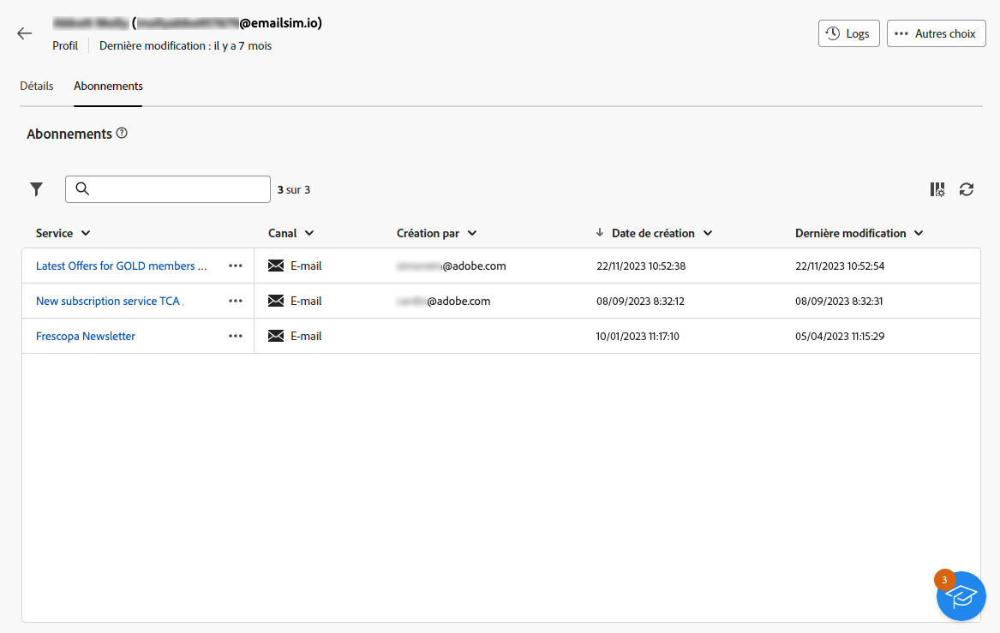
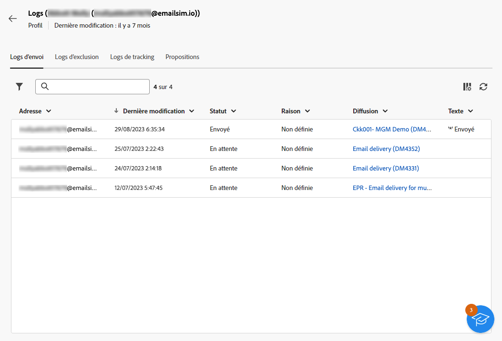

# Explorer les détails des profils {#profile-view}

>[!CONTEXTUALHELP]
>id="acw_recipients_subscription_list"
>title="Liste des abonnements des destinataires"
>abstract="Cet onglet répertorie tous les services auxquels le profil est abonné."

Pour accéder aux détails d’un profil, accédez à la section **[!UICONTROL Gestion des clientes et clients]** > **[!UICONTROL Profils]** puis cliquez sur le profil auquel vous souhaitez accéder.

Les informations relatives au profil sont organisées comme suit :

* L’onglet **[!UICONTROL Détails]** vous permet de parcourir les attributs intégrés et personnalisés du profil. Pour modifier un attribut, apportez des modifications dans le champ souhaité, puis cliquez sur le bouton **[!UICONTROL Enregistrer]**. Des informations détaillées sur les attributs des profils sont disponibles dans la section [Créer un profil](create-profile.md).

  

* L’onglet **[!UICONTROL Abonnements]** permet d’accéder aux informations relatives aux services auxquels le profil est abonné. [En savoir plus sur les services d’abonnement](manage-services.md)

  

* De plus, le bouton **[!UICONTROL Logs]** situé dans le coin supérieur droit de l’écran permet d’afficher l’historique des interactions du profil par le biais des logs d’envoi, d’exclusion et de tracking. [En savoir plus sur les logs de diffusion](../monitor/delivery-logs.md)

  Dans ces logs, vous pouvez également consulter les offres présentées au profil dans l’onglet **[!UICONTROL Propositions]**. [En savoir plus sur les offres](../msg/offers.md)

  
