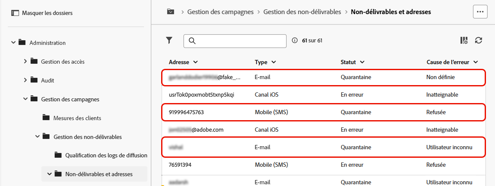
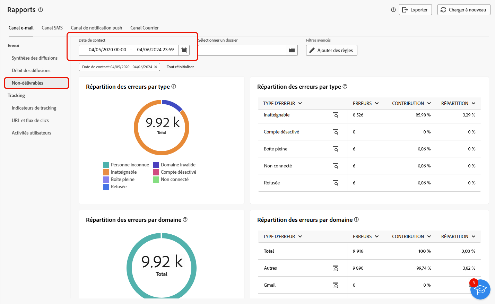
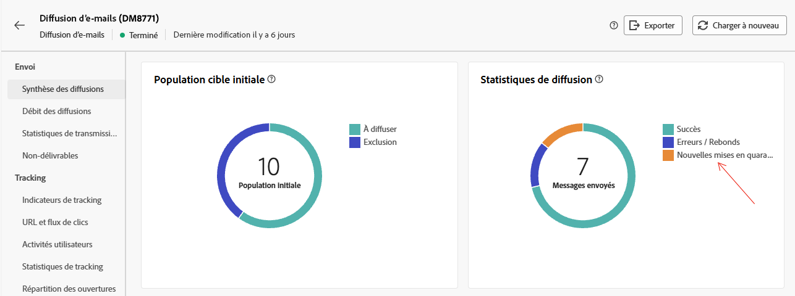

# Gestion des quarantaines {#quarantines}

Adobe Campaign gère les adresses de quarantaine pour les canaux email, push et SMS.

La quarantaine s’applique uniquement à une **adresse e-mail**, un **numéro de téléphone** ou un **jeton d’appareil**, mais pas au profil lui-même. Par exemple, un profil dont l’adresse e-mail est en quarantaine peut mettre à jour son profil et saisir une nouvelle adresse, puis être ciblé de nouveau par des actions de diffusion. De même, si deux profils ont le même numéro de téléphone, ils seront tous deux affectés si le numéro est mis en quarantaine.

>[!CAUTION]
>
>La quarantaine dans Adobe Campaign respecte la casse.

## Qu’est-ce que la quarantaine ? {#quarantines-what}

La quarantaine est la méthode pour **gérer les adresses non valides dans les diffusions**.

Si une diffusion a un taux d’adresses non valides élevé, elle peut être considérée comme un spam. La gestion de ces adresses avec la quarantaine vous évitera un placement sur la liste bloquée par les fournisseurs d’accès à Internet. Cela est important pour votre réputation.

Lorsqu’une adresse est mise en quarantaine dans Adobe Campaign, le profil est automatiquement exclu de la cible lors de l’analyse de la diffusion.

La quarantaine permet de réduire les coûts d’envoi des SMS en excluant les numéros de téléphone erronés des diffusions.

Pour en savoir plus sur les quarantaines, consultez la documentation [Campaign v8 (console)](https://experienceleague.adobe.com/en/docs/campaign/campaign-v8/send/failures/quarantines){target="_blank"}.

## Pourquoi une adresse est-elle mise en quarantaine ? {#quarantines-why}

Une adresse peut être mise en quarantaine pour de nombreuses raisons :

* Pour les SMS, des numéros de téléphone erronés.
* Pour les SMS, lorsque le profil répond à un SMS avec un mot-clé tel que « STOP ».
* Pour les e-mails, lorsque votre message est signalé comme un spam. Le message est automatiquement redirigé vers une boîte e-mail technique gérée par Adobe. L’adresse e-mail de l’utilisateur ou de l’utilisatrice est alors automatiquement mise en quarantaine avec le statut Placé sur la liste bloquée.
* Une adresse e-mail peut être mise en quarantaine, par exemple, lorsque la boîte de réception est pleine, si l’adresse n’existe pas ou si le serveur de messagerie n’est pas disponible.

Pour en savoir plus sur les échecs de diffusion, consultez la documentation [Campaign v8 (console)](https://experienceleague.adobe.com/en/docs/campaign/campaign-v8/send/failures/delivery-failures){target="_blank"}.

## Où trouver les adresses en quarantaine ? {#quarantines-where}

Vous pouvez afficher toutes les adresses en quarantaine de votre instance dans **[!UICONTROL Explorateur]** > **[!UICONTROL Administration]** > **[!UICONTROL Gestion de campagnes]** > **[!UICONTROL Gestion des échecs]** > **[!UICONTROL Échecs et adresses]**. Cette section répertorie les éléments en quarantaine pour les canaux e-mail, SMS et notification push.

{zoomable="yes"}

Vous pouvez également obtenir un rapport sur la quarantaine dans votre instance :

{zoomable="yes"}

Pour chaque diffusion, vous pouvez également consulter le rapport Résumé des diffusions, qui indique le nombre d’adresses en quarantaine dans la cible de diffusion :

{zoomable="yes"}

Vous pouvez disposer de plus de possibilités pour gérer les adresses en quarantaine dans la console Adobe Campaign. [En savoir plus](https://experienceleague.adobe.com/fr/docs/campaign/campaign-v8/send/failures/quarantines#access-quarantined-addresses)
