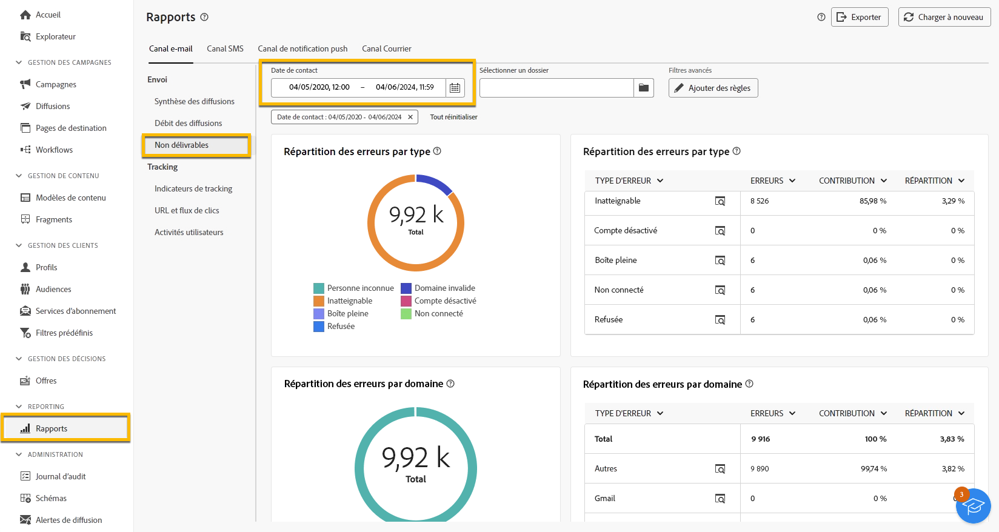
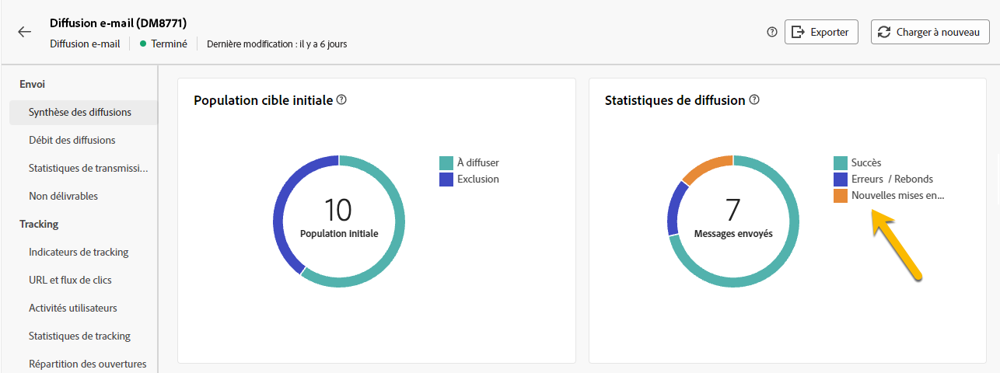

# Gestion des quarantaines {#quarantines}

Adobe Campaign gère les adresses de quarantaine pour les canaux e-mail, push et SMS.

La quarantaine s’applique uniquement à une **adresse e-mail**, un **numéro de téléphone** ou un **jeton d’appareil**, mais pas au profil lui-même. Par exemple, un profil dont l’adresse e-mail est en quarantaine peut être mis à jour avec une nouvelle adresse. Le profil pourrait alors être ciblé de nouveau par des actions de diffusion. De même, si deux profils partagent le même numéro de téléphone, les deux seront affectés si le numéro est mis en quarantaine.

>[!CAUTION]
>
>La quarantaine dans Adobe Campaign respecte la casse.

## Qu’est-ce que la quarantaine ? {#quarantines-what}

La quarantaine est la méthode utilisée pour **gérer les adresses non valides dans les diffusions**.

Si une diffusion connaît un taux élevé d&#39;adresses non valides, elle peut être considérée comme du spam. Placer sur la liste bloquée La gestion de ces adresses avec quarantaine permet d’éviter toute intrusion des fournisseurs d’accès à Internet. Ceci est important pour maintenir votre réputation.

Lorsqu&#39;une adresse est mise en quarantaine dans Adobe Campaign, le profil est automatiquement exclu de la cible lors de l&#39;analyse de la diffusion.

La quarantaine réduit les coûts d&#39;envoi des SMS en excluant les numéros de téléphone erronés des diffusions.

En savoir plus sur les quarantaines dans la [documentation de Campaign v8 (console)](https://experienceleague.adobe.com/fr/docs/campaign/campaign-v8/send/failures/quarantines){target="_blank"}.

## Raisons de la mise en quarantaine d’une adresse {#quarantines-why}

De nombreuses raisons peuvent entraîner la mise en quarantaine d’une adresse :

* Pour les SMS, des numéros de téléphone erronés.
* Pour les SMS, lorsque le profil répond à un SMS avec un mot-clé tel que « STOP »
* Pour les e-mails, lorsque votre message est signalé comme un spam. Le message est automatiquement redirigé vers une boîte aux lettres technique gérée par Adobe. L’adresse e-mail de l’utilisateur ou de l’utilisatrice est alors automatiquement mise en quarantaine avec le statut Placé sur la liste bloquée.
* Une adresse e-mail peut être mise en quarantaine, par exemple, lorsque la boîte de réception est pleine, si l’adresse n’existe pas ou si le serveur de messagerie n’est pas disponible.

En savoir plus sur les diffusions en échec dans la [documentation de Campaign v8 (console)](https://experienceleague.adobe.com/fr/docs/campaign/campaign-v8/send/failures/delivery-failures){target="_blank"}.

## Où trouver les adresses en quarantaine ? {#quarantines-where}

Vous pouvez afficher toutes les adresses de quarantaine de votre instance dans **[!UICONTROL Explorateur]** > **[!UICONTROL Administration]** > **[!UICONTROL Gestion de campagne]** > **[!UICONTROL Gestion des échecs]** > **[!UICONTROL Échecs et adresses]**. Cette section répertorie les éléments en quarantaine pour les canaux e-mail, SMS et notification push.

{zoomable="yes"}

Vous pouvez également accéder à un rapport sur la quarantaine dans votre instance :

{zoomable="yes"}

Pour chaque diffusion, vous pouvez consulter le rapport Synthèse des diffusions . Elle affiche le nombre d&#39;adresses en quarantaine dans la cible de diffusion :

{zoomable="yes"}

Vous pouvez explorer d’autres options de gestion des adresses de quarantaine dans la console Adobe Campaign. [En savoir plus](https://experienceleague.adobe.com/fr/docs/campaign/campaign-v8/send/failures/quarantines#access-quarantined-addresses).