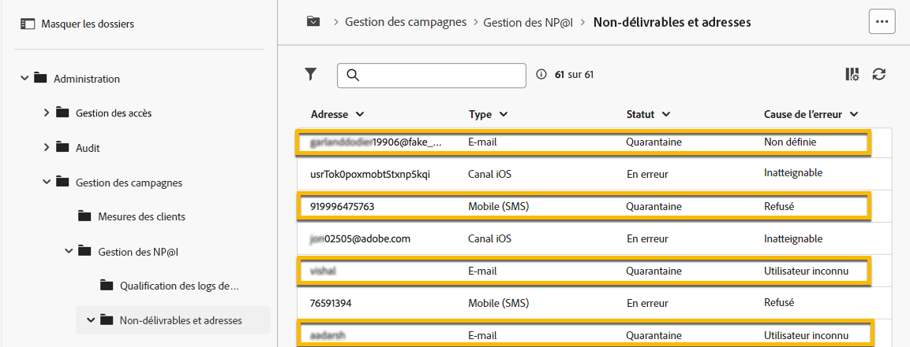

# Quarantaine

Adobe Campaign gère les adresses en quarantaine (email, SMS, notification push).

La mise en quarantaine s’applique uniquement à une **adresse email**, un **numéro de téléphone** ou un **jeton de périphérique**, mais pas au profil lui-même. Par exemple, un profil dont l’adresse e-mail est en quarantaine peut mettre à jour son profil et saisir une nouvelle adresse, puis être ciblé de nouveau par des actions de diffusion. De même, si deux profils ont le même numéro de téléphone, ils seront tous deux affectés si le numéro est mis en quarantaine.

>[!CAUTION]
>
>La mise en quarantaine dans Adobe Campaign est sensible à la casse.

## Qu’est-ce que la quarantaine ?

La mise en quarantaine est la méthode pour **gérer les adresses non valides dans les diffusions**.

Si une diffusion a un taux d&#39;adresses non valides élevé, elle peut être considérée comme du spam. La gestion de ces adresses en quarantaine vous évitera d&#39;être placé sur la liste bloquée par les fournisseurs d&#39;accès. C&#39;est important pour votre réputation.

Lorsqu&#39;une adresse est mise en quarantaine dans Adobe Campaign, le profil est automatiquement exclu de la cible lors de l&#39;analyse de la diffusion.

La mise en quarantaine vous aidera à réduire le coût de l&#39;envoi des SMS en excluant les numéros de téléphone erronés des diffusions.

## Pourquoi une adresse est mise en quarantaine

De nombreuses raisons peuvent mettre une adresse en quarantaine :

- Pour les SMS, les numéros de téléphone erronés
- Pour les SMS, lorsque le profil répond à un SMS avec un mot-clé tel que &quot;STOP&quot;
- Pour les emails, lorsque votre message est signalé comme indésirable. Le message est automatiquement redirigé vers une boîte email technique gérée par Adobe. L’adresse email de l’utilisateur est alors automatiquement mise en quarantaine avec le statut Placé sur la liste bloquée.
- Une adresse e-mail peut être mise en quarantaine, par exemple, lorsque la boîte de réception est pleine, si l&#39;adresse n&#39;existe pas ou si le serveur de messagerie n&#39;est pas disponible.

[En savoir plus sur les diffusions en échec](https://experienceleague.adobe.com/en/docs/campaign-classic/using/sending-messages/monitoring-deliveries/understanding-delivery-failures)

## Où trouver les adresses de quarantaine

Vous pouvez afficher toutes les adresses de quarantaine de votre instance dans **[!UICONTROL Explorateur]** > **[!UICONTROL Administration]** > **[!UICONTROL Campaign Management]** > **[!UICONTROL Gestion des échecs]** > **[!UICONTROL Echecs et adresses]**. Cette section répertorie les éléments mis en quarantaine pour les canaux email, SMS et notification push.

{zoomable="yes"}

Vous pouvez également avoir le rapport sur la quarantaine dans votre instance :

{zoomable="yes"}

Pour chaque diffusion, vous pouvez également vérifier le rapport Synthèse des diffusions : il indique le nombre d&#39;adresses en quarantaine dans la cible de la diffusion :

{zoomable="yes"}

Vous pouvez avoir plus de possibilités pour gérer les adresses de quarantaine dans la console Adobe Campaign. [En savoir plus](https://experienceleague.adobe.com/en/docs/campaign/campaign-v8/send/failures/quarantines#access-quarantined-addresses)
