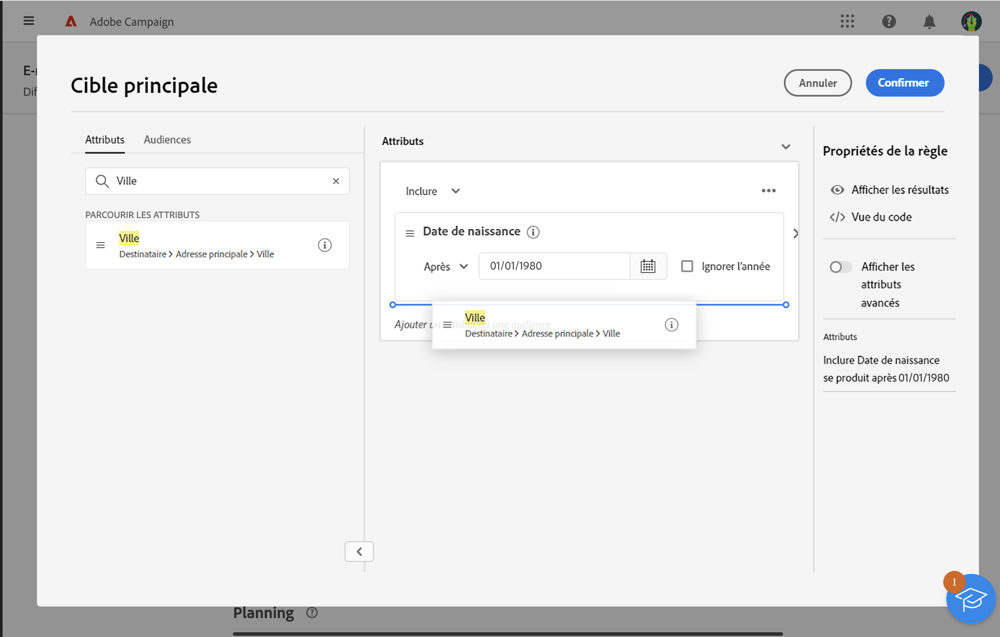

# Utiliser le créateur de segments {#segment-builder}

>[!NOTE]
>
>Cette documentation est en cours d’élaboration et est fréquemment mise à jour. La version finale de ce contenu sera prête en janvier 2023.

Cette section décrit comment créer une audience lors de la conception d’un e-mail. L’audience créée ne peut être utilisée que dans cet e-mail.

Le créateur de segments permet de définir la population ciblée par votre message en filtrant les données contenues dans la base de données Adobe Campaign. Si vous souhaitez sélectionner une audience existante, reportez-vous à cette [section](add-audience.md).

Pour plus d’informations sur le créateur de segments, reportez-vous à la [documentation de Segmentation Service](https://experienceleague.adobe.com/docs/experience-platform/segmentation/ui/segment-builder.html).

Pour créer une audience lors de la conception d’un e-mail, procédez comme suit :

1. Dans la section **Audience** de l’assistant de création de diffusion, cliquez sur le bouton **[!UICONTROL Sélectionner l’audience]**.

   

1. Sélectionnez **Créez la vôtre**. Le créateur de segments s’affiche.

   

## Palette

La palette, située à gauche, contient tous les éléments sur lesquels vous pouvez appliquer un filtre pour créer votre audience. Les vignettes de la palette doivent être déplacées dans la zone de travail centrale pour être configurées et prises en compte. La palette est divisée en deux onglets :

* **Attributs** : cet onglet permet d’accéder à tous les champs disponibles à partir du schéma. La liste des champs dépend du schéma de ciblage défini dans le modèle d’e-mail.

   {width="70%" align="left"}

* **Audiences** : cet onglet vous permet de filtrer à l’aide de l’une des audiences existantes définies dans la console Campaign Classic.

   {width="70%" align="left"}

Vous pouvez utiliser la barre de recherche pour rechercher rapidement des éléments.

## Zone de travail

La zone de travail est la zone centrale, dans laquelle vous pouvez paramétrer et combiner les règles selon les éléments ajoutés depuis la palette. Pour ajouter une nouvelle règle, faites glisser une vignette depuis la palette et déposez-la sur la zone de travail. Des options spécifiques au contexte vous seront ensuite présentées en fonction du type de données ajouté.

{width="70%" align="left"}

## Le volet Propriétés des règles

Sur le côté droit, le volet **Propriétés des règles** vous permet d’effectuer les actions suivantes :

{width="70%" align="left"}

* **Afficher les résultats :** affiche la liste des destinataires ciblés par l’audience.
* **Affichage du code** : affiche une version basée sur le code de l’audience dans SQL.
* **Afficher les attributs avancés** : cochez cette option si vous souhaitez afficher la liste complète des attributs dans la palette de gauche : noeuds, regroupements, liens 1-1, liens 1-N.
* **Attributs** : affiche une description de l’audience créée.

## Exemple

Dans cet exemple, nous allons créer une audience pour cibler tous les clients habitant à Atlanta ou Seattle et nés après 1980.

1. Dans l’onglet **Attributs** de la palette, recherchez le champ **Date de naissance**. Faites glisser la vignette et déposez-la sur la zone de travail.

   

1. Dans la zone de travail, choisissez l’opérateur **Après** et saisissez la date souhaitée.

   

1. Dans la palette, recherchez le champ **Ville** et ajoutez-le à la zone de travail sous la première règle.

   

1. Dans le champ de texte, saisissez le nom de la première ville, puis appuyez sur Entrée.

   

1. Répétez cette action pour le nom de la deuxième ville.

   

1. Cliquez sur **Afficher les résultats** pour afficher la liste et le nombre de destinataires correspondant à la requête.

   

1. Cliquez sur **Confirmer**.

Votre audience est définie et prête à être utilisée dans votre e-mail.