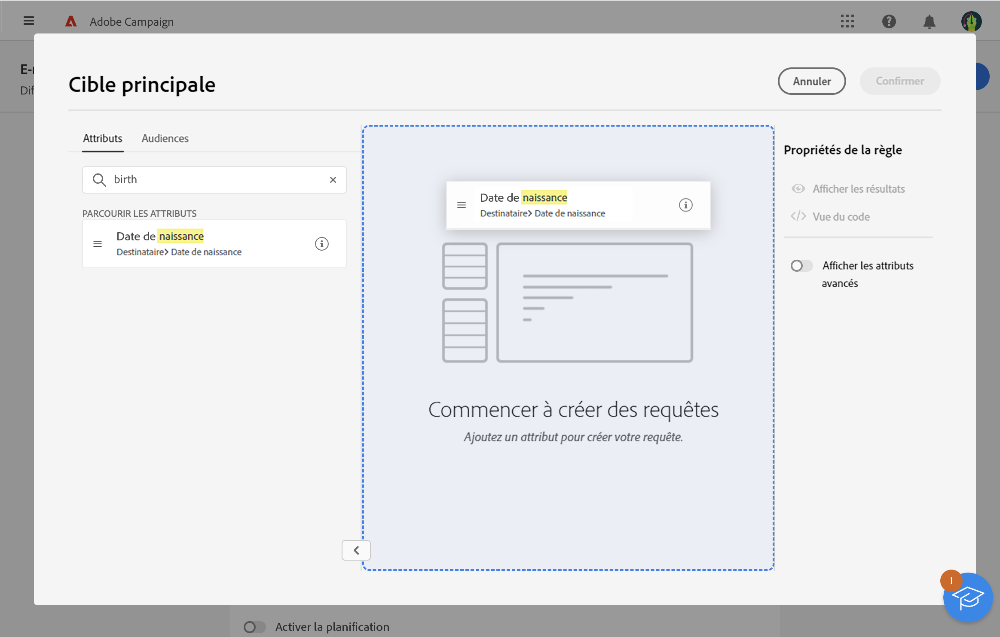
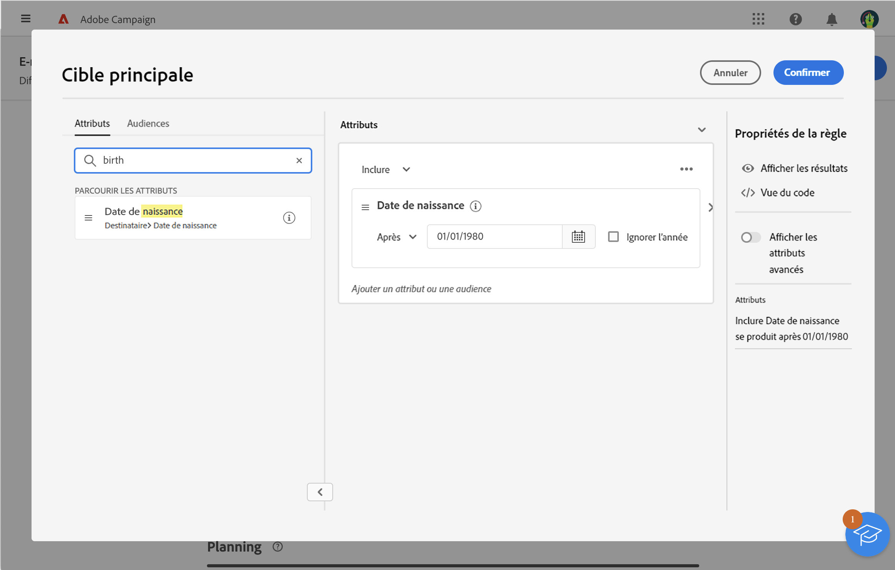
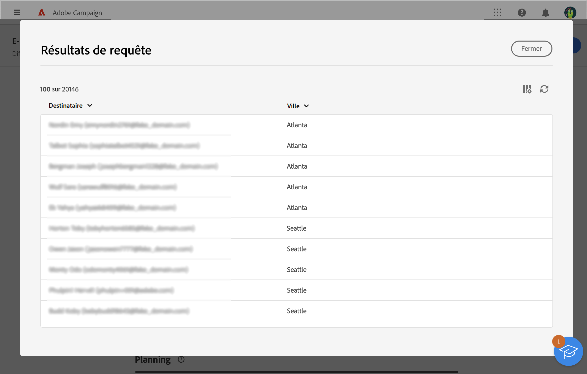

# Utiliser le créateur de règles {#segment-builder}

Le créateur de règles permet de définir la population ciblée par votre diffusion en filtrant les données contenues dans la base de données. Utilisez-le pour créer une audience à partir d’un workflow à l’aide d’une activité **[!UICONTROL Créer une audience]** ou directement lors de la création d’une diffusion pour créer une audience unique.

* [Découvrir comment créer et enregistrer une audience](create-audience.md)
* [Découvrez comment créer une audience unique pour une diffusion.](one-time-audience.md)

## Palette

La palette, située à gauche, contient tous les éléments sur lesquels vous pouvez appliquer un filtre pour créer votre audience. Utilisez la barre de recherche pour rechercher rapidement des éléments. Déplacez les tuiles contenues dans la palette vers la zone de travail centrale pour les configurer et en tenir compte.

{zoomable="yes"}{width="70%" align="left"}

La palette est divisée en deux onglets :

* **Attributs** : cet onglet permet d’accéder à tous les champs disponibles à partir du schéma. La liste des champs dépend du schéma de ciblage défini dans le modèle d’e-mail.

* **Audiences** : cet onglet vous permet de filtrer à l’aide de l’une des audiences existantes définies dans la console Campaign Classic ou depuis Adobe Experience Platform. Découvrez comment surveiller et gérer des audiences dans [cette section](manage-audience.md).

  >[!NOTE]
  >
  >Pour utiliser des audiences Adobe Experience Platform, configurez l’intégration aux destinations. Consultez la [documentation sur les destinations Adobe Experience Platform](https://experienceleague.adobe.com/docs/experience-platform/destinations/home.html?lang=fr){target="_blank"}.

## Zone de travail

La zone de travail est la zone centrale où vous pouvez paramétrer et combiner les règles selon les éléments ajoutés depuis la palette. Pour ajouter une nouvelle règle, faites glisser une tuile depuis la palette et déposez-la sur la zone de travail. Des options spécifiques au contexte sont présentées en fonction du type de données ajouté.

{zoomable="yes"}{width="70%" align="left"}

## Le volet Propriétés de la règle

Sur le côté droit, le volet **Propriétés des règles** vous permet d’effectuer les actions ci-après.

{zoomable="yes"}{width="70%" align="left"}

* **Afficher les résultats** : affiche la liste des profils ciblés par l’audience.
* **Affichage du code** : affiche une version basée sur le code de l’audience dans SQL.
* **Afficher les attributs avancés** : cochez cette option pour afficher la liste complète des attributs dans la palette de gauche, y compris les nœuds, les regroupements, les liens 1-1 et les liens 1-N.
* **Calculer** : met à jour et affiche le nombre de profils ciblés par votre requête.
* **Sélectionner ou enregistrer un filtre** : utilisez un filtre prédéfini pour filtrer votre requête ou enregistrez votre requête en tant que nouveau filtre pour une réutilisation ultérieure. [Découvrir comment utiliser des filtres prédéfinis](../get-started/predefined-filters.md)

  >[!IMPORTANT]
  >
  >Dans cette version du produit, certains filtres prédéfinis ne sont pas disponibles dans l’interface d’utilisation. Vous pouvez toujours les utiliser. [En savoir plus](../get-started/guardrails.md#predefined-filters-filters-guardrails-limitations).

* **Attributs** : affiche une description de l’audience créée.

## Exemple

Dans cet exemple, une audience est créée pour cibler l’ensemble des clientes et clients habitant à Atlanta ou Seattle et dont la date de naissance est postérieure à 1980.

1. Dans l’onglet **Attributs** de la palette, recherchez le champ **Date de naissance**. Faites glisser la vignette et déposez-la sur la zone de travail.

   {zoomable="yes"}

1. Dans la zone de travail, choisissez l’opérateur **Après** et saisissez la date souhaitée.

   {zoomable="yes"}

1. Dans la palette, recherchez le champ **Ville** et ajoutez-le à la zone de travail sous la première règle.

   {zoomable="yes"}

1. Dans le champ de texte, saisissez le nom de la première ville, puis appuyez sur Entrée.

   {zoomable="yes"}

1. Répétez cette action pour le nom de la deuxième ville.

   {zoomable="yes"}

1. Cliquez sur **Afficher les résultats** pour afficher la liste et le nombre de destinataires correspondant à la requête. Ajoutez des colonnes pour visualiser et vérifier les données. Dans cet exemple, ajoutez la colonne **Ville** pour voir Atlanta et Seattle.

   {zoomable="yes"}

1. Cliquez sur **Confirmer**.