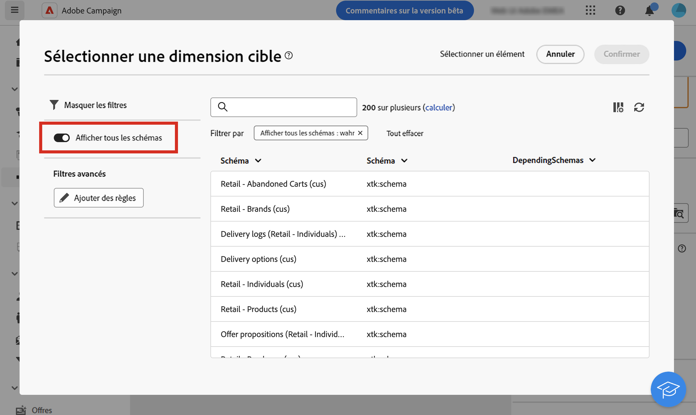

# Dimension de ciblage et dimension de filtrage {#targeting-dimensions}

>[!CONTEXTUALHELP]
>id="acw_orchestration_build_audience_dimension"
>title="Sélectionner la dimension de ciblage"
>abstract="La dimension de ciblage permet de définir la population ciblée par l’opération : destinataires, bénéficiaires d’un contrat, opérateurs ou opératrices, personnes abonnées, etc. Par défaut, pour les e-mails et les SMS, la cible est sélectionnée à partir du tableau intégré Personnes destinataires. Pour les notifications push, la dimension cible par défaut est Applications des personnes abonnées."

La dimension de ciblage, ou mapping de ciblage, est le type de données qu’une opération gère. Elle définit la population ciblée comme les profils, les bénéficiaires de contrats, les opérateurs et opératrices ou les personnes abonnées. La dimension de filtrage permet d’appliquer des filtres à la population ciblée en référençant des critères associés sans modifier la dimension de ciblage principale.

## Dimensions de ciblage {#targeting}

La dimension de ciblage d’un workflow est définie par la première activité **[!UICONTROL Créer une audience]** et est utilisée dans toutes les autres activités jusqu’à la fin du workflow. Par exemple, lors de l’interrogation de profils à partir de la base de données, la transition sortante contient des données de type « destinataire », qui sont transmises à l’activité suivante.

Changez la dimension de ciblage dans un workflow à l’aide d’une activité [Changer une dimension](../workflows/activities/change-dimension.md). Vous pouvez ainsi interroger la base de données sur un tableau spécifique tel que des achats ou des abonnements, puis changer la dimension de ciblage par Destinataires afin d’envoyer des diffusions aux profils correspondants.

Lors de la sélection d’une dimension de ciblage (dans les paramètres du workflow, ou dans des activités telles que **Créer une audience**, **Réconciliation** ou **Changement de dimension**), une liste des schémas couramment utilisés s’affiche par défaut. Pour afficher tous les schémas disponibles, activez le bouton **[!UICONTROL Afficher tous les schémas]**. La sélection de cette option est enregistrée pour chaque utilisateur ou utilisatrice.

{zoomable="yes"}

Par défaut, les modèles de diffusion par e-mail et SMS ciblent les profils. Leur dimension cible utilise les champs de la table **nms:recipient**. Pour les notifications push, la dimension cible par défaut est **Applications Abonnés nms:appSubscriptionRcp**, qui est liée à la table des personnes destinataires.

Utilisez d&#39;autres mappings de ciblage intégrés dans les workflows et les diffusions, comme indiqué ci-dessous :

| Nom | Utiliser pour diffuser à | Schéma |
|-----------------------|-------------------------------------------------------|-------------------------|
| Destinataires | Profils / personnes destinataires (tableau de personnes destinataires intégré) | nms:recipient |
| Visiteurs et visiteuses | Visiteurs et visiteuses dont les profils ont été collectés par le biais d’une recommandation (marketing viral, par exemple) | mns:visitor |
| Abonnements | Profils abonnés à un service d’information, par exemple à une newsletter | nms:subscription |
| Abonnements des visiteurs et visiteuses | Personnes abonnées à un service d’information | nms:visitorSub |
| Opérateurs | Opérateurs et opératrices Adobe Campaign | nms:operator |
| Fichier externe | Diffusion via un fichier contenant toutes les informations nécessaires | Aucun schéma associé, aucune cible renseignée |
| Applications abonnés | Profils abonnés à une application | nms:appSubscriptionRcp |

En outre, créez de nouveaux mappings de ciblage en fonction de besoins spécifiques. Effectuez cette opération à partir de la console cliente uniquement. En savoir plus dans la [documentation de Campaign v8 (console cliente)](https://experienceleague.adobe.com/docs/campaign/campaign-v8/audience/add-profiles/target-mappings.html?lang=fr#new-mapping){target="_blank"}.

## Dimensions de filtrage {#filtering}

La dimension de ciblage permet de définir la population ciblée par l’opération : destinataires, bénéficiaires d’un contrat, opérateurs ou opératrices, abonné(e)s, etc. La dimension de filtrage permet d’appliquer des filtres à cette population en référençant les données associées sans modifier la dimension de ciblage principale. Vous pouvez, par exemple, sélectionner la population en fonction de critères spécifiques, tels que les titulaires d’un contrat ou les personnes abonnées à une newsletter.

Les dimensions de filtrage sont disponibles uniquement dans l’activité **Créer une audience**.

Pour sélectionner la clientèle qui a souscrit une police d’assurance-vie depuis plus de 5 ans, choisissez les options suivantes :

* Dimension de ciblage : **clientèle**
* Dimension de filtrage : **personne titulaire du contrat**

Vous pouvez ensuite définir les conditions de filtrage dans l’activité **Créer une audience**. Consultez cette [page](../workflows/activities/build-audience.md).

Lors de la sélection d’une dimension de ciblage, seules les dimensions de filtrage compatibles s’affichent dans l’interface. Ces deux dimensions doivent nécessairement avoir un lien. Ainsi, le contenu de la liste Dimension de filtrage dépend de la dimension de ciblage sélectionnée dans le premier champ.
