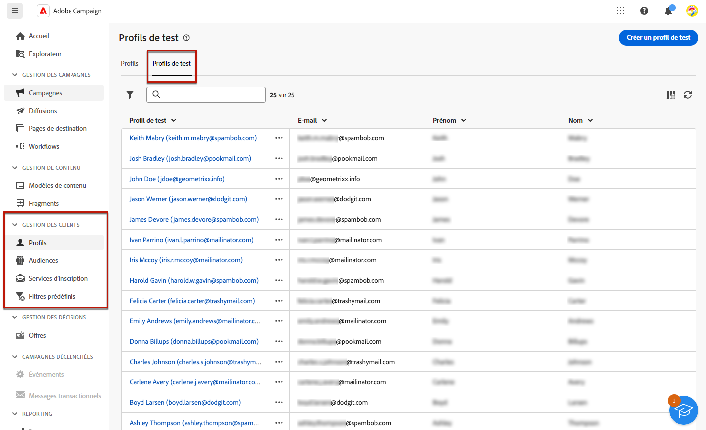
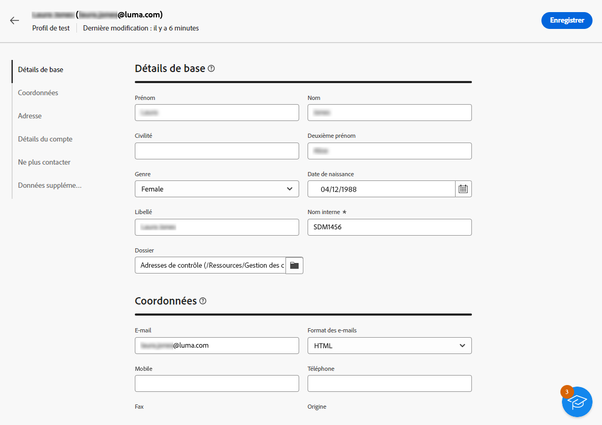
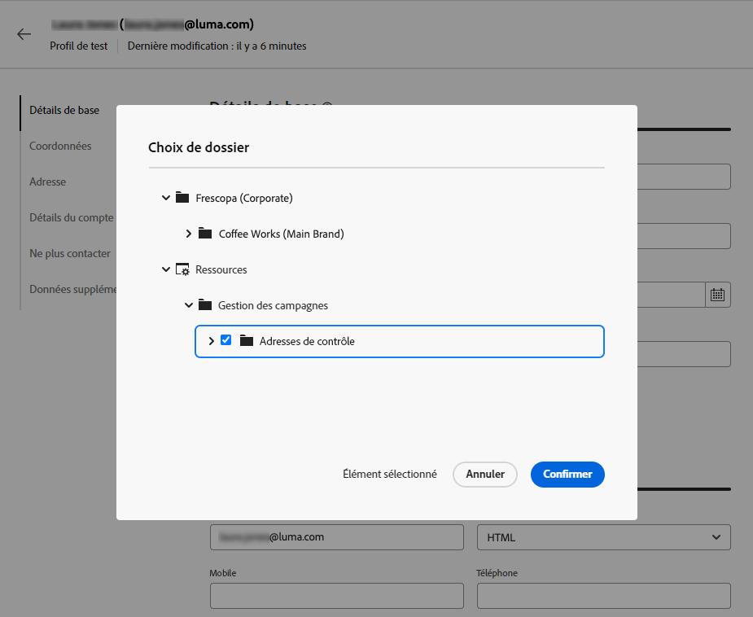
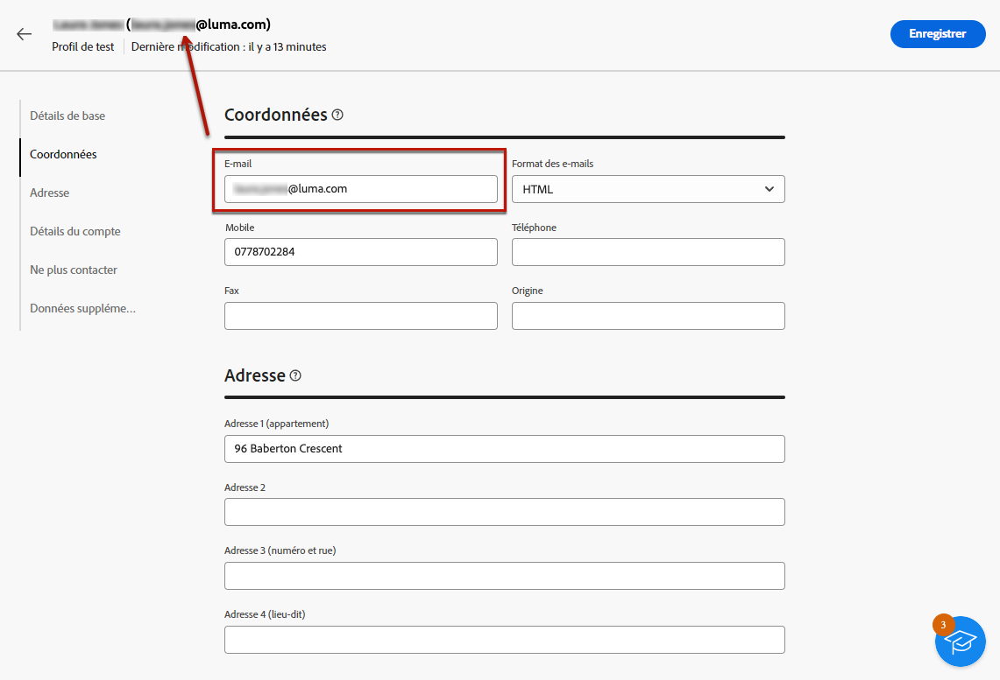
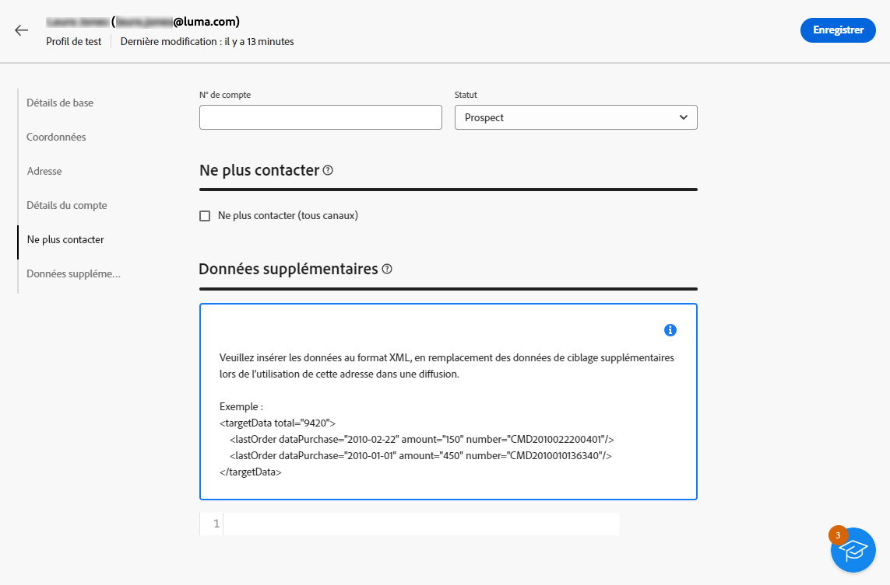

# Créer et gérer des profils de test {#create-test-profiles}

>[!CONTEXTUALHELP]
>id="acw_recipients_testprofiles_menu"
>title="Créer des profils de test"
>abstract="Les profils de test sont créés en tant qu’adresses de contrôle. Il s’agit de destinataires supplémentaires dans la base de données utilisés pour cibler des profils fictifs qui ne correspondent pas aux critères de ciblage définis."

Les profils de test sont créés en tant qu’adresses de contrôle. Il s’agit de destinataires supplémentaires dans la base de données utilisés pour cibler des profils fictifs qui ne correspondent pas aux critères de ciblage définis. Ils vous permettent de prévisualiser et de tester la personnalisation et le rendu avant l&#39;envoi de votre diffusion, en leur envoyant des BAT.

<!--Learn more on test profiles in the [Campaign v8 (client console) documentation](https://experienceleague.adobe.com/docs/campaign/campaign-v8/audience/add-profiles/test-profiles.html){target="_blank"}.-->

Les étapes pour envoyer des messages de test aux adresses de contrôle sont présentées dans la section [cette section](../preview-test/test-deliveries.md#test-profiles).

>[!NOTE]
>
>Les profils de test sont automatiquement exclus des rapports sur les statistiques d&#39;envoi suivantes : **[!UICONTROL Clics]**, **[!UICONTROL Ouvertures]**, **[!UICONTROL Désabonnements]**.

## Accès et gestion des profils de test {#access-test-profiles}

Pour accéder à la liste des modèles de contenu, sélectionnez **[!UICONTROL Gestion des clients]** > **[!UICONTROL Profils]** dans le menu de gauche, puis sélectionnez l’option **[!UICONTROL Profils de test]** .

Vous pouvez filtrer selon un [folder](../get-started/permissions.md#folders) à l’aide de la liste déroulante ou en ajoutant des règles à l’aide de la fonction [query modeler](../query/query-modeler-overview.md).

Pour modifier un profil de test, cliquez sur l’élément de votre choix dans la liste.

Pour supprimer un profil de test, sélectionnez l’option correspondante dans la **[!UICONTROL Autres actions]** .

## Créer un profil de test {#create-test-profile}

>[!CONTEXTUALHELP]
>id="acw_recipients_testprofiles_additionaldata"
>title="Tester les données additionnelles des profils"
>abstract="Renseignez les données de personnalisation utilisées pour les diffusions créées dans les workflows Data management et auxquelles vous souhaitez attribuer une valeur spécifique."

Pour créer un profil de test, procédez comme suit.

1. Accédez à **[!UICONTROL Gestion des clients]** > **[!UICONTROL Profils]**.

1. Sélectionnez la variable **[!UICONTROL Profils de test]** .

   

1. Cliquez sur le bouton **[!UICONTROL Créer un profil de test]** bouton .

1. Renseignez les détails du profil de test. <!--Most of the fields are the same as when creating profiles. [Learn more]-->

   

   >[!NOTE]
   >
   >Le libellé de l&#39;adresse est automatiquement renseigné avec le prénom et le nom que vous avez définis.

1. Par défaut, les profils de test sont stockés dans la variable **[!UICONTROL Adresses de contrôle]** dossier. Vous pouvez la modifier en accédant à l’emplacement souhaité. [En savoir plus](#seed-addresses-folders)

   

<!--
You do not need to enter all fields of each tab when creating a seed address. Missing personalization elements are entered randomly during delivery analysis. (Not valid?)
-->

1. Dans le **[!UICONTROL Coordonnées]** , saisissez l’adresse électronique et d’autres données pertinentes. L&#39;adresse email s&#39;affiche entre parenthèses après le libellé du profil de test.

   

1. Si vous sélectionnez l’option **[!UICONTROL Ne plus contacter (tous canaux)]** , le profil est en liste bloquée. Ce destinataire n&#39;est plus ciblé sur aucun canal (email, SMS, etc.).

1. Dans le **[!UICONTROL Données additionnelles]** saisissez les données de personnalisation utilisées pour les diffusions créées dans les workflows Data management et auxquelles vous souhaitez affecter une valeur spécifique. [En savoir plus sur les workflows](../workflows/gs-workflows.md)

   

   Assurez-vous que les données additionnelles de la cible ont été définies avec un alias commençant par &#39;@&#39; dans l’activité du workflow **[!UICONTROL Enrichissement]**. Sinon, vous ne pourrez pas l&#39;utiliser correctement avec vos adresses de contrôle dans l&#39;activité de diffusion. [En savoir plus sur l’activité Enrichissement](../workflows/activities/enrichment.md)

1. Cliquer sur le bouton **[!UICONTROL Enregistrer]**.

Le profil de test que vous venez de créer est maintenant prêt à être utilisé pour envoyer un test. [En savoir plus](../preview-test/test-deliveries.md#test-profiles)

<!--Use test profiles in Direct mail? cf v7/v8-->

## Gestion des dossiers des adresses de contrôle {#seed-addresses-folders}

Les adresses de contrôle sont stockées dans un noeud dédié de la hiérarchie Adobe Campaign : **[!UICONTROL Explorateur]** > **[!UICONTROL Ressources]** > **[!UICONTROL Campaign Management]** > **[!UICONTROL Adresses de contrôle]**.

Pour organiser les profils de test, vous pouvez créer des sous-dossiers à partir de la liste déroulante Autres actions . [Découvrez comment créer des dossiers](../get-started/permissions.md#folders)

Vous pouvez également créer un profil de test à partir de n’importe quel **[!UICONTROL Adresses de contrôle]** dossier ou sous-dossier. Renseignez tous les détails de la même manière que vous le feriez à partir du **[!UICONTROL Gestion des clients]** > **[!UICONTROL Profils]** . [En savoir plus](#create-test-profile)

Pour éditer un profil de test, cliquez sur son libellé dans la **[!UICONTROL Profils de test]** ou du dossier dans lequel il est stocké.

