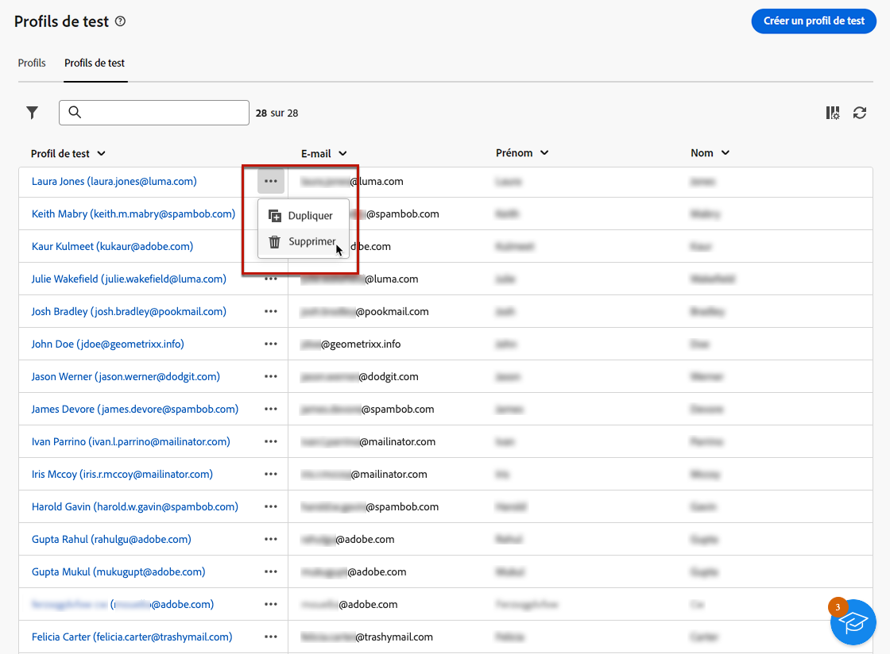

# Créer et gérer des profils de test {#create-test-profiles}

>[!CONTEXTUALHELP]
>id="acw_recipients_testprofiles_menu"
>title="Créer des profils de test"
>abstract="Les profils de test sont des profils destinataires supplémentaires qui vous permettent de prévisualiser et de tester la personnalisation et le rendu avant d’envoyer vos messages. Vous pouvez sélectionner un profil de test lors de la prévisualisation du contenu d’un message et envoyer des BAT aux profils de test afin de contrôler et de valider le contenu et les paramètres d’un message."

Les profils de test sont utilisés pour envoyer des BAT et valider le contenu et les paramètres de votre message. Ces profils sont des profils destinataires supplémentaires qui vous permettent de prévisualiser et de tester la personnalisation et le rendu avant d’envoyer vos messages. Vous pouvez sélectionner un profil de test lors de la prévisualisation du contenu d’un message et envoyer des BAT aux profils de test afin de contrôler et de valider le contenu et les paramètres d’un message.

<!--Learn more on test profiles in the [Campaign v8 (client console) documentation](https://experienceleague.adobe.com/docs/campaign/campaign-v8/audience/add-profiles/test-profiles.html){target="_blank"}.-->

Les étapes permettant d’envoyer des BAT à des profils sont présentées dans [cette section](../preview-test/test-deliveries.md#test-profiles).

>[!NOTE]
>
>* Les profils de test sont créés en tant qu’adresses de contrôle dans la console cliente.
>
>* Les profils de test sont automatiquement exclus des rapports sur les statistiques de diffusions suivants : **[!UICONTROL Clics]**, **[!UICONTROL Ouvertures]**, **[!UICONTROL Désinscriptions]**.

## Accéder aux profils de test et les gérer {#access-test-profiles}

Pour accéder à la liste des profils de test, sélectionnez **[!UICONTROL Gestion des clients]** > **[!UICONTROL Profils]** dans le menu de gauche, puis cliquez sur l’onglet **[!UICONTROL Profils de test]**.

{zoomable=&quot;yes&quot;}

* Vous pouvez filtrer sur un [dossier](../get-started/permissions.md#folders) spécifique à l’aide de la liste déroulante ou ajouter des règles à l’aide du [concepteur de requête](../query/query-modeler-overview.md).

  {zoomable=&quot;yes&quot;}

* Vous pouvez dupliquer n’importe quel profil de test et le mettre à jour si nécessaire. Les étapes permettant de modifier un profil de test sont les mêmes que lors de la [création d’un profil de test](#create-test-profile).

* Pour supprimer un profil de test, sélectionnez l’option correspondante dans le menu **[!UICONTROL Plus d’actions]**.

  {zoomable=&quot;yes&quot;}

* Pour modifier un profil de test, cliquez sur l’élément souhaité dans la liste. Les étapes permettant de modifier un profil de test sont les mêmes que lors de la [création d’un profil de test](#create-test-profile).

Vous pouvez également accéder aux profils de test via la vue **[!UICONTROL Explorateur]**, dans le nœud **[!UICONTROL Ressources]** > **[!UICONTROL Gestion de campagnes]** > **[!UICONTROL Adresses de contrôle]**.

De là, vous pouvez parcourir, créer et gérer des dossiers ou des sous-dossiers, ainsi que vérifier les autorisations associées. [Découvrez comment créer des dossiers](../get-started/permissions.md#folders)

{zoomable=&quot;yes&quot;}

Dans la vue **[!UICONTROL Explorateur]**, vous pouvez également filtrer, supprimer, modifier et [créer](#create-test-profile) des profils de test.

## Créer un profil de test {#create-test-profile}

>[!CONTEXTUALHELP]
>id="acw_recipients_testprofiles_additionaldata"
>title="Tester les données supplémentaires des profils"
>abstract="Renseignez les données de personnalisation utilisées pour les diffusions créées dans les workflows Gestion des données et auxquelles vous souhaitez attribuer une valeur spécifique."

Pour créer un profil de test, procédez comme suit :

1. Accédez à **[!UICONTROL Gestion des clients]** > **[!UICONTROL Profils]** et sélectionnez l’onglet **[!UICONTROL Profils de test]**.

1. Cliquez sur le bouton **[!UICONTROL Créer un profil de test]**.

   {zoomable=&quot;yes&quot;}

1. Renseignez les détails du profil de test si nécessaire. <!--Most of the fields are the same as when creating profiles. [Learn more]-->

   {zoomable=&quot;yes&quot;}

   >[!NOTE]
   >
   >Le champ **[!UICONTROL Libellé]** reprend automatiquement le prénom et le nom saisis.

1. Par défaut, les profils de test sont stockés dans le dossier **[!UICONTROL Adresses de contrôle]**. Vous pouvez le modifier en accédant à l’emplacement souhaité. [Découvrez comment utiliser les dossiers](../get-started/permissions.md#folders)

   <!--{zoomable="yes"}-->

<!--
You do not need to enter all fields of each tab when creating a seed address. Missing personalization elements are entered randomly during delivery analysis. (Not valid?)
-->

1. Dans la section **[!UICONTROL Coordonnées]**, saisissez l’adresse e-mail et d’autres données pertinentes. L’adresse e-mail s’affiche entre parenthèses après le libellé du profil de test.

   {zoomable=&quot;yes&quot;}

1. Si vous sélectionnez la case à cocher **[!UICONTROL Ne plus contacter (tous canaux)]**, le profil de test est sur la liste bloquée. Ce ou cette destinataire ne sera plus ciblé(e) sur aucun canal (e-mail, SMS, etc.).

1. Dans l’onglet **[!UICONTROL Données supplémentaires]**, renseignez les données de personnalisation utilisées pour les diffusions créées dans les workflows Gestion des données et auxquelles vous souhaitez attribuer une valeur spécifique. [En savoir plus sur les workflows](../workflows/gs-workflows.md)

   {zoomable=&quot;yes&quot;}

   Assurez-vous que les données supplémentaires de la cible ont été définies avec un alias commençant par &#39;@&#39; dans l’activité du workflow **[!UICONTROL Enrichissement]**. Sinon, vous ne pouvez pas l’utiliser correctement avec vos adresses de contrôle dans l’activité de diffusion. [En savoir plus sur l’activité d’enrichissement](../workflows/activities/enrichment.md)

1. Cliquer sur le bouton **[!UICONTROL Enregistrer]**.

Le profil de test que vous venez de créer est maintenant prêt à être utilisé pour envoyer un BAT. [En savoir plus](../preview-test/test-deliveries.md#test-profiles)

<!--Use test profiles in Direct mail? cf v7/v8-->
