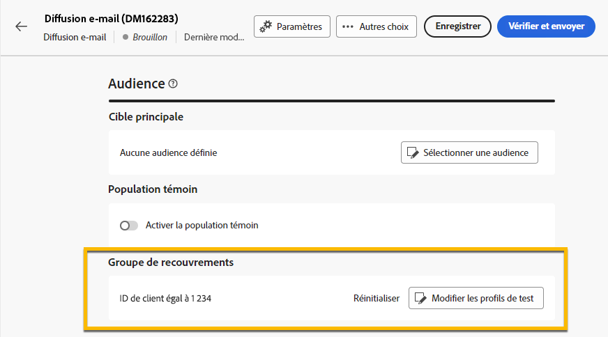
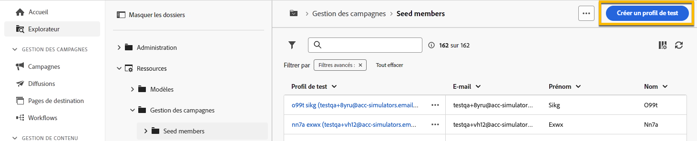

# Utiliser un **[!UICONTROL groupe de recouvrements]** {#trap-group}

Un **[!UICONTROL groupe de pièges]** (également appelé **[!UICONTROL liste de contrôle]**) est utilisé pour inclure des adresses spécifiques dans vos diffusions afin de surveiller et vérifier le processus de distribution en ciblant les profils qui ne correspondent pas aux critères de cible définis. Ainsi, les personnes destinataires qui n’entrent pas dans le cadre de la diffusion peuvent la recevoir, comme toute autre personne destinataire cible.
Un **[!UICONTROL groupe de pièges]** est un groupe **[!UICONTROL d’adresses de contrôle]**, appelé **[!UICONTROL Profil de test]** sur l’interface utilisateur web d’AC.

## Pourquoi utiliser **[!UICONTROL Trap group]** ?

Vous pouvez utiliser un **[!UICONTROL groupe de recouvrements]** dans les cas suivants :

1. **En tant qu’épreuve** : chaque personne membre du **[!UICONTROL Groupe de recouvrements]** recevra la diffusion comme si elle faisait partie de l’audience.

1. **Pour protéger votre liste de distribution** : en recevant ce que l’audience recevra, chaque **[!UICONTROL profil de test]** du **[!UICONTROL groupe de pièges]** sera remarqué si la liste de distribution est utilisée par un tiers.

>[!NOTE]
>
>Le groupe de pièges est différent de [l&#39;envoi de BAT lors de la création de la diffusion](../email/create-email.md#preview-test) et de [groupe témoin](control-group.md).

## À propos du **[!UICONTROL groupe de recouvrements]**

Les profils de test sont automatiquement exclus des rapports sur les statistiques de diffusions suivants : **Clics**, **Ouvertures**, **Désinscriptions**. Les rapports ne portent que sur l’audience réelle.

Pour une diffusion par e-mail, seule l’adresse e-mail est nécessaire pour le **[!UICONTROL groupe de recouvrements]**, la personnalisation des autres champs sera renseignée de manière aléatoire par Campaign.

## Comment configurer un **[!UICONTROL groupe de recouvrements]** dans la diffusion

Pour configurer un **[!UICONTROL groupe de recouvrements]**, accédez aux paramètres **[!UICONTROL Audience]** de votre diffusion. Vous disposez de 2 options :
- [Sélectionner des profils de test](#select-test-profile)
- [Créer une condition](#create-condition)

{zoomable="yes"}

### Sélectionner des profils de test {#select-test-profiles}

Lorsque vous sélectionnez « Sélectionner des profils de test », la fenêtre ci-dessous vous invite à **[!UICONTROL Ajouter un ou plusieurs profils de test]** :

{zoomable="yes"}

Lorsque vous cliquez sur le bouton, vous avez accès aux profils de test que vous pouvez ajouter à votre **[!UICONTROL groupe de pièges]**. Cochez celles que vous souhaitez utiliser.
Vous pouvez créer de nouveaux profils de test. [En savoir plus](#create-seed)

{zoomable="yes"}

Lorsque vous confirmez vos profils de test, vérifiez que vous avez le nombre correct sous **[!UICONTROL Groupe de pièges]**.

{zoomable="yes"}

### Créer une condition {#create-condition}

Avec le choix **[!UICONTROL Créer une condition]** , vous obtenez une nouvelle fenêtre dans laquelle vous pouvez personnaliser une requête pour définir les profils de test que vous souhaitez utiliser :

{zoomable="yes"}

Votre requête s’affiche sous **[!UICONTROL Groupe de recouvrements]**.

{zoomable="yes"}

## Comment créer un **[!UICONTROL profil de test]** {#create-seed}

Vous pouvez créer un **[!UICONTROL profil de test]** dans **[!UICONTROL Explorateur]** > **[!UICONTROL Ressources]** > **[!UICONTROL Campaign Management]** > **[!UICONTROL Membres de l&#39;adresse]**

{zoomable="yes"}

Vous pouvez compléter tous les détails de votre **[!UICONTROL profil de test]** comme s’il s’agissait d’un profil d’audience :

{zoomable="yes"}