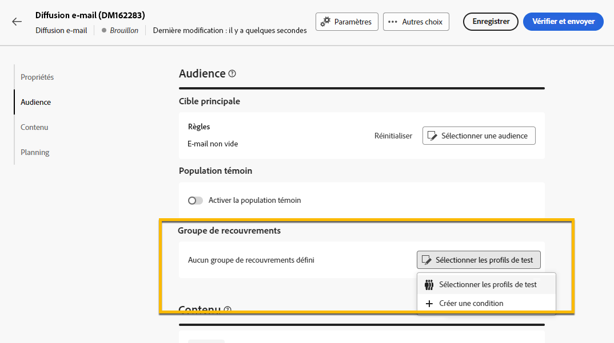

# Utiliser un **[!UICONTROL groupe de recouvrements]** {#trap-group}

Un **[!UICONTROL groupe de recouvrements]** permet de cibler des personnes destinataires qui ne correspondent pas aux critères de ciblage définis. Ainsi, les personnes destinataires qui n’entrent pas dans le cadre de la diffusion peuvent la recevoir, comme toute autre personne destinataire cible.
Un **[!UICONTROL groupe de recouvrements]** est un groupe d’**[!UICONTROL adresses de contrôle]**.

## Pourquoi utiliser un **[!UICONTROL groupe de recouvrements]** ?

Vous pouvez utiliser un **[!UICONTROL groupe de recouvrements]** dans les cas suivants :

1. **En tant qu’épreuve** : chaque personne membre du **[!UICONTROL Groupe de recouvrements]** recevra la diffusion comme si elle faisait partie de l’audience.

1. **Pour protéger votre liste de publipostage** : en recevant ce que l’audience recevra, chaque **[!UICONTROL adresse de contrôle]** du **[!UICONTROL groupe de recouvrements]** sera informée si la liste de publipostage est utilisée par un tiers.

## À propos du **[!UICONTROL groupe de recouvrements]**

Les adresses de contrôle sont automatiquement exclues des rapports sur les statistiques de diffusions suivants : **Clics**, **Ouvertures**, **Désinscriptions**. Les rapports ne portent que sur l’audience réelle.

Pour une diffusion par e-mail, seule l’adresse e-mail est nécessaire pour le **[!UICONTROL groupe de recouvrements]**, la personnalisation des autres champs sera renseignée de manière aléatoire par Campaign.

## Comment configurer un **[!UICONTROL groupe de recouvrements]** dans la diffusion

Pour configurer un **[!UICONTROL groupe de recouvrements]**, accédez aux paramètres **[!UICONTROL Audience]** de votre diffusion. Vous disposez de 2 options :
- [Sélectionner des profils de test](#select-test-profile)
- [Créer une condition](#create-condition)

{zoomable="yes"}

### Sélectionner des profils de test {#select-test-profiles}

Lorsque vous sélectionnez « Sélectionner des profils de test », la fenêtre ci-dessous vous invite à **[!UICONTROL Ajouter un ou plusieurs profils de test]** :

{zoomable="yes"}

Lorsque vous cliquez sur le bouton, vous avez accès aux adresses de contrôle que vous pouvez ajouter à votre **[!UICONTROL groupe de recouvrements]**. Cochez celles que vous souhaitez utiliser.
Vous pouvez créer des adresses de contrôle. [En savoir plus](#create-seed)

{zoomable="yes"}

Lorsque vous confirmez vos adresses de recouvrement, vérifiez que vous disposez du nombre correct sous **[!UICONTROL Groupe de recouvrements]**.

{zoomable="yes"}

### Créer une condition {#create-condition}

Avec l’option **[!UICONTROL Créer une condition]**, vous accédez à une nouvelle fenêtre dans laquelle vous pouvez personnaliser une requête afin de définir les adresses de contrôle que vous voulez utiliser :

{zoomable="yes"}

Votre requête s’affiche sous **[!UICONTROL Groupe de recouvrements]**.

{zoomable="yes"}

## Comment créer une **[!UICONTROL adresse de contrôle]** {#create-seed}

Vous pouvez créer une **[!UICONTROL adresse de contrôle]** dans **[!UICONTROL Explorateur]** > **[!UICONTROL Ressources]** > **[!UICONTROL Gestion de campagnes]** > **[!UICONTROL Membres de contrôle]**

{zoomable="yes"}

Vous pouvez renseigner tous les détails sur votre membre de contrôle comme s’il s’agissait d’un profil d’audience :

{zoomable="yes"}