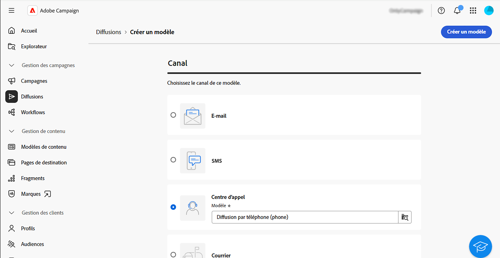
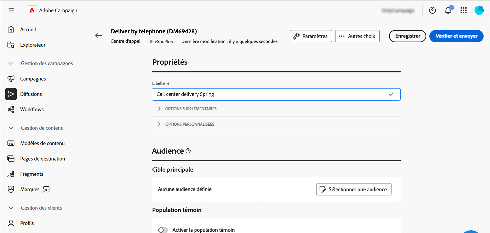
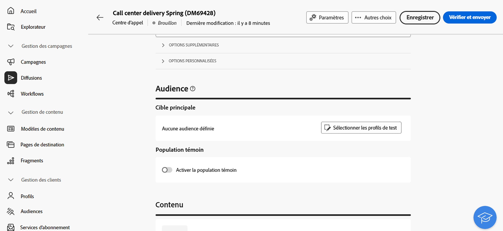
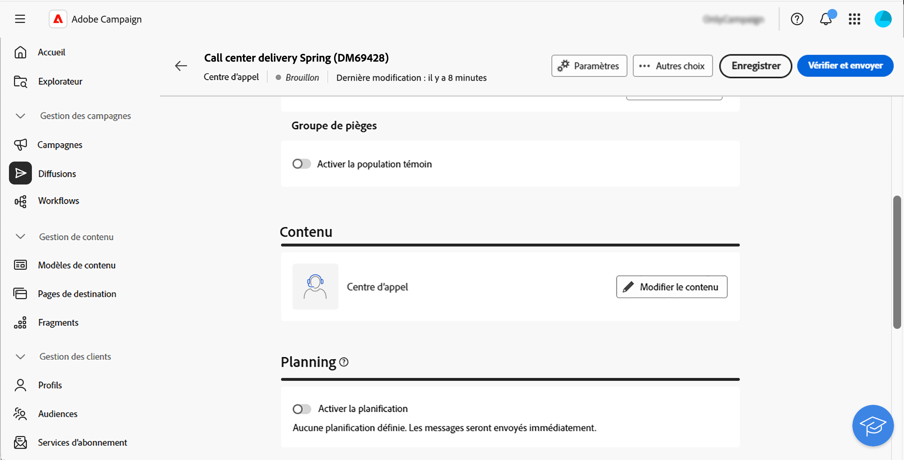
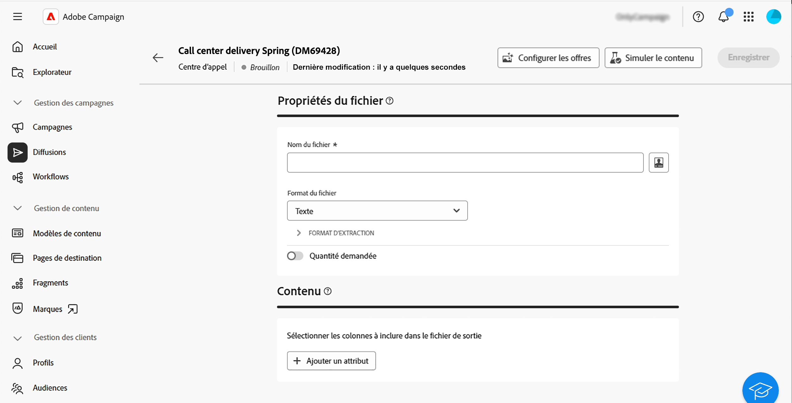
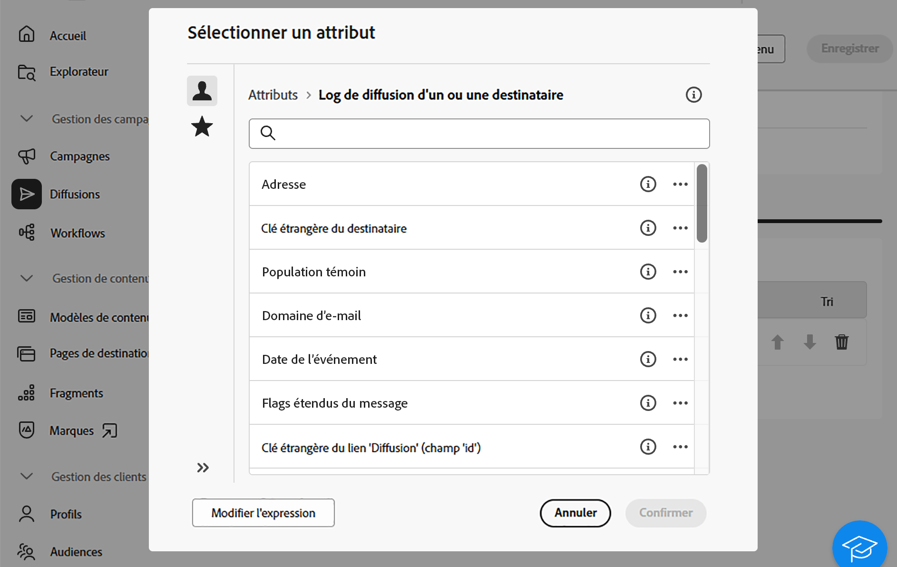
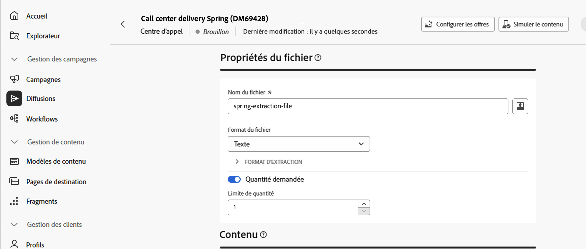
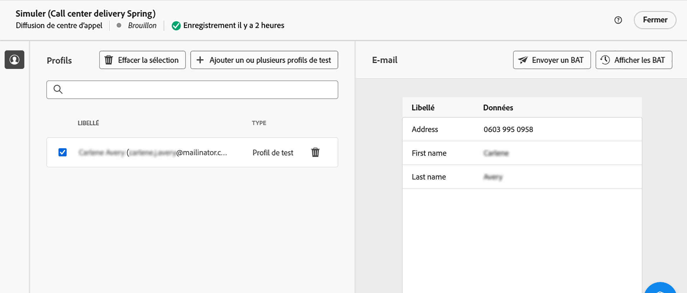
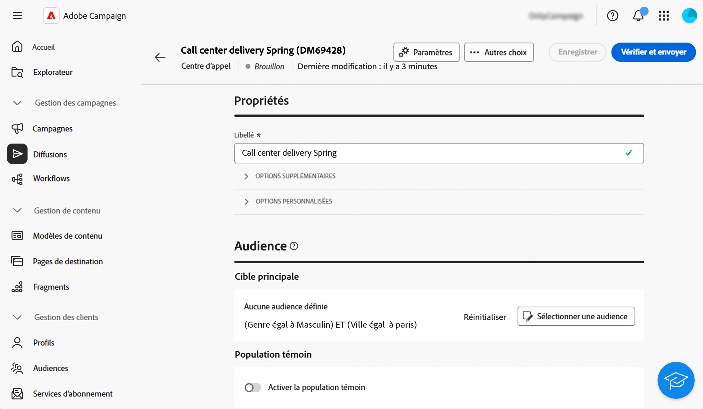
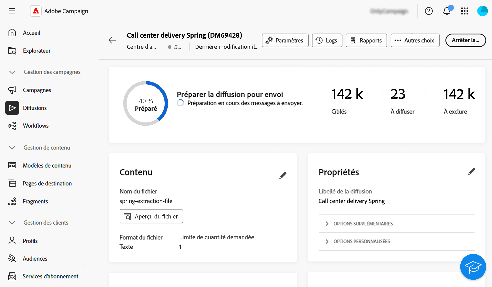

# Créer et envoyer une diffusion de centre d’appel {#create-call-center}

Vous pouvez créer une diffusion de centre d’appel autonome ou en créer une dans le cadre d’un workflow de campagne. Les étapes ci-dessous détaillent la procédure d’une diffusion autonome (ponctuelle). Si vous travaillez dans le contexte d’un workflow de campagne, les étapes de création sont détaillées dans [cette section](../workflows/activities/channels.md#create-a-delivery-in-a-campaign-workflow).

Pour créer une diffusion de centre d’appel autonome, effectuez les étapes principales suivantes :

1. Créer la diffusion, [en savoir plus](#create-delivery)
1. Définir l’audience, [en savoir plus](#select-audience)
1. Modifier le contenu, [en savoir plus](#edit-content)
1. Prévisualiser et envoyer la diffusion, [en savoir plus](#preview-send)

## Créer la diffusion{#create-delivery}

Suivez ces étapes pour créer la diffusion et configurer ses propriétés :

1. Sélectionnez le menu **[!UICONTROL Diffusions]** et cliquez sur le bouton **[!UICONTROL Créer une diffusion]**.

1. Choisissez **[!UICONTROL Centre d’appel]** comme canal et cliquez sur **[!UICONTROL Créer une diffusion]** pour confirmer.

   {zoomable="yes"}

   >[!NOTE]
   >
   >Si vous souhaitez sélectionner un autre modèle, consultez cette [page](../msg/delivery-template.md).

1. Sous **[!UICONTROL Propriétés]**, saisissez un **[!UICONTROL Libellé]** pour la diffusion. Les options supplémentaires sont présentées dans [cette section](../email/create-email.md#create-email).

   {zoomable="yes"}

>[!NOTE]
>
>Vous pouvez planifier l’envoi de votre diffusion à une date spécifique. Pour plus d’informations à ce sujet, consultez cette [section](../msg/gs-deliveries.md#gs-schedule).

## Définir l’audience{#select-audience}

Vous devez maintenant définir l’audience qui sera ciblée pour le fichier d’extraction.

1. Dans la section **[!UICONTROL Audience]** de la page de la diffusion, cliquez sur **[!UICONTROL Sélectionner une audience]**.

   {zoomable="yes"}

1. Choisissez une audience existante ou créez la vôtre.

   * [Découvrir comment sélectionner une audience existante](../audience/add-audience.md)
   * [Découvrir comment créer une audience](../audience/one-time-audience.md)

   {zoomable="yes"}

>[!NOTE]
>
>Les personnes destinataires de centre d’appel doivent afficher au minimum leur nom et leur numéro de téléphone. Les personnes destinataires dont les informations sont incomplètes seront exclues des diffusions de centre d’appel.
>
>Pour découvrir comment configurer des populations témoins, consultez cette [page](../audience/control-group.md).

## Modifier le contenu{#edit-content}

Modifions maintenant le contenu du fichier d’extraction qui sera généré par la diffusion de centre d’appel.

1. Dans la page de la diffusion, cliquez sur le bouton **[!UICONTROL Modifier le contenu]**.

   {zoomable="yes"}

1. Renseignez le champ **[!UICONTROL Nom du fichier]**. Pour découvrir comment personnaliser le nom du fichier, consultez cette [page](../personalization/personalize.md).

1. Sélectionnez un **[!UICONTROL Format de fichier]** : **Texte**, **Texte contenant des colonnes à largeur fixe**, **CSV (Excel)** ou **XML**.

   {zoomable="yes"}

   >[!NOTE]
   >
   >Les options de format d’extraction sont présentées dans cette [page](../direct-mail/content-direct-mail.md#properties).

1. Activez l’option **[!UICONTROL Quantité demandée]** si vous ne pouvez pas limiter le nombre de personnes destinataires de votre diffusion.

1. Dans la section **[!UICONTROL Contenu]**, cliquez sur le bouton **[!UICONTROL Ajouter un attribut]** pour créer une colonne à afficher dans le fichier d’extraction.

1. Choisissez l’attribut à afficher dans la colonne, puis confirmez. Pour en savoir plus sur la sélection d’attributs et leur ajout aux favoris, consultez cette [page](../get-started/attributes.md).

   

1. Répétez ces étapes pour ajouter autant de colonnes que nécessaire à votre fichier d’extraction.

   Vous pouvez alors modifier les attributs, trier le fichier d’extraction ou changer les colonnes de place. Pour en savoir plus à ce sujet, consultez cette [page](../direct-mail/content-direct-mail.md#content).

   

## Prévisualiser et envoyer la diffusion{#preview-send}

Lorsque le contenu de la diffusion est prêt, vous pouvez le prévisualiser à l’aide de profils de test et envoyer des BAT. Vous pouvez ensuite envoyer la diffusion de centre d’appel pour générer le fichier d’extraction.

La prévisualisation et l’envoi du fichier d’extraction comprennent les étapes principales suivantes. D’autres détails sont disponibles dans [cette page](../direct-mail/send-direct-mail.md).

1. Dans la page du contenu de la diffusion, cliquez sur le bouton **[!UICONTROL Simuler le contenu]**.

   {zoomable="yes"}

1. Sélectionnez un ou plusieurs profils de test pour prévisualiser le contenu personnalisé. Vous pouvez également envoyer des BAT. [En savoir plus](../direct-mail/send-direct-mail.md#preview-dm)

   {zoomable="yes"}

1. Dans la page de la diffusion, cliquez sur **[!UICONTROL Vérifier et envoyer]**.

   {zoomable="yes"}

1. Cliquez sur **[!UICONTROL Préparer]** et suivez la progression et les statistiques fournies, puis confirmez.

   {zoomable="yes"}

1. Cliquez sur **[!UICONTROL Envoyer]** pour poursuivre le processus d’envoi final, puis confirmez.

Une fois votre diffusion envoyée, le fichier d’extraction est automatiquement généré et exporté vers l’emplacement spécifié dans le compte externe **[!UICONTROL Routage]** sélectionné dans les [paramètres avancés](../advanced-settings/delivery-settings.md) du modèle de diffusion. Vous pouvez également prévisualiser le fichier en cliquant sur le bouton **Prévisualiser le fichier**, dans la section **Contenu** de l’écran.

Suivez les données de vos KPI (indicateurs clés de performance) à partir de la page de diffusion, ainsi que les données à partir du menu **[!UICONTROL Logs]**.

Commencez à mesurer l’impact de votre message à l’aide de rapports intégrés. [En savoir plus](../reporting/direct-mail.md)
