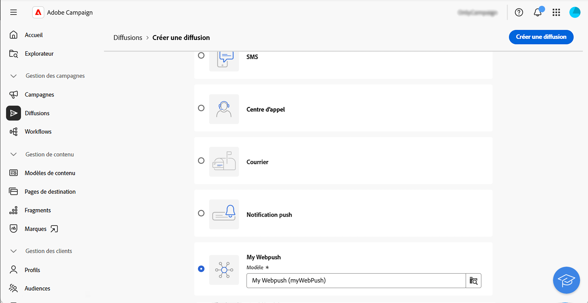
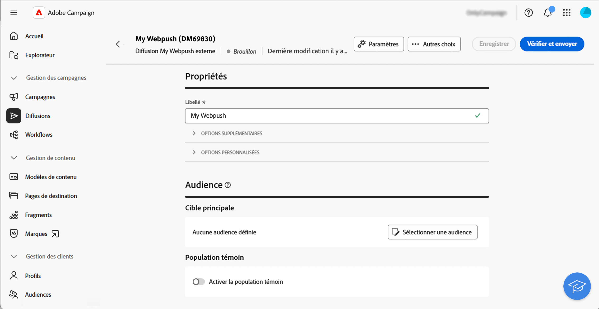
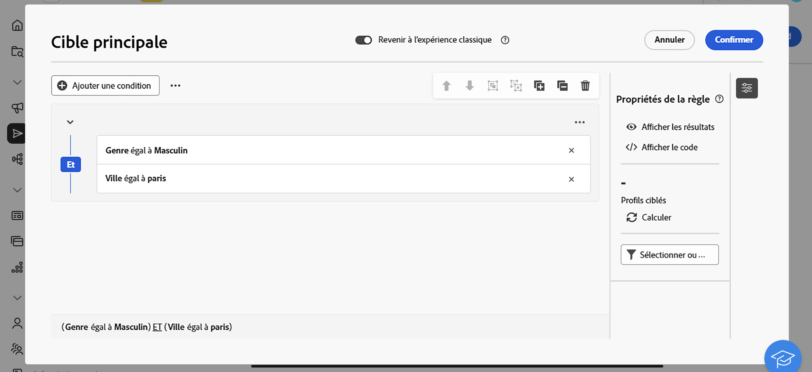
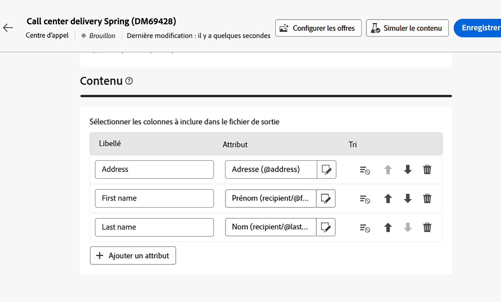
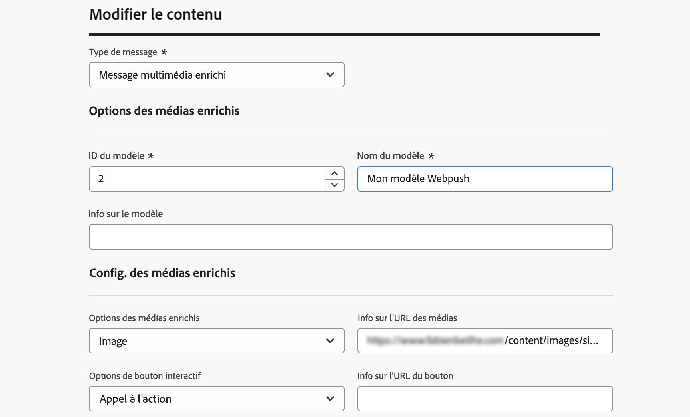
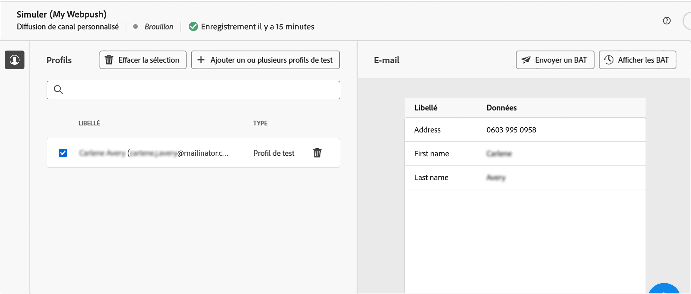
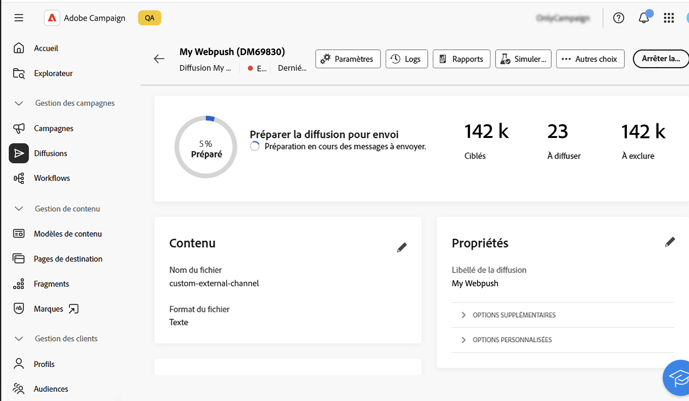

# Commencer avec les canaux personnalisés {#gs-custom-channel}

>[!CONTEXTUALHELP]
>id="acw_homepage_welcome_rn1"
>title="Canal personnalisé pour les diffusions API"
>abstract="Vous pouvez désormais, directement à partir de l’interface d’utilisation d’Adobe Campaign Web, orchestrer et exécuter des diffusions basées sur des canaux d’API personnalisés. Ces diffusions peuvent être autonomes ou faire partie d’un workflow."
>additional-url="https://experienceleague.adobe.com/docs/campaign-web/v8/release-notes/release-notes.html?lang=fr" text="Voir les notes de mise à jour"

Vous pouvez, directement à partir de l’interface d’utilisation d’Adobe Campaign Web, orchestrer et exécuter des diffusions basées sur des canaux personnalisés intégrés à des tiers. La configuration du canal personnalisé est effectuée dans la console cliente.

Deux types de canaux personnalisés sont pris en charge : externe et d’API. Avec les canaux externes, Campaign génère des fichiers d’export personnalisables avec toutes les données de contact et de personnalisation nécessaires. Avec les canaux d’API, les messages sont envoyés aux profils cibles via l’API configurée.

Vous pouvez ajouter des diffusions de canal personnalisé dans des workflows ou simplement les utiliser comme diffusions autonomes.

Les étapes ci-dessous détaillent la procédure d’une diffusion autonome (ponctuelle). La plupart des étapes sont similaires aux diffusions de centre d’appel. Pour plus d&#39;informations, consultez cette [page](../call-center/create-call-center.md).

Pour envoyer une nouvelle diffusion personnalisée autonome, effectuez les étapes principales suivantes :

1. Configurez le canal personnalisé. [En savoir plus](#create-channel)
1. Créer la diffusion, [en savoir plus](#create-delivery)
1. Définir l’audience, [en savoir plus](#select-audience)
1. Modifier le contenu, [en savoir plus](#edit-content)
1. Prévisualiser et envoyer la diffusion, [en savoir plus](#preview-send)

## Configurer le canal personnalisé{#create-channel}

Tout d’abord, vous devez configurer le canal personnalisé. Les étapes principales à effectuer dans la console cliente sont les suivantes. Ces étapes sont communes aux canaux externes et d’API personnalisés :

1. Configurez le schéma pour ajouter le nouveau canal à la liste des canaux disponibles. [En savoir plus](https://experienceleague.adobe.com/docs/campaign/campaign-v8/send/other-channels/custom-channel.html#configure-schema){target="_blank"}
1. Créez un compte externe de routage. [En savoir plus](https://experienceleague.adobe.com/docs/campaign/campaign-v8/send/other-channels/custom-channel.html#create-ext-account){target="_blank"}
1. Créez un modèle de diffusion associé au nouveau canal. [En savoir plus](https://experienceleague.adobe.com/docs/campaign/campaign-v8/send/other-channels/custom-channel.html#create-template){target="_blank"}

Les canaux d’API personnalisés nécessitent une configuration supplémentaire. [En savoir plus](https://experienceleague.adobe.com/docs/campaign/campaign-v8/send/other-channels/custom-channel.html#api-additional){target="_blank"}

## Créer la diffusion{#create-delivery}

Suivez ces étapes pour créer la diffusion et configurer ses propriétés :

1. Sélectionnez le menu **[!UICONTROL Diffusions]** et cliquez sur le bouton **[!UICONTROL Créer une diffusion]**.

1. Sélectionnez le canal personnalisé de votre choix, choisissez le modèle associé, puis cliquez sur **[!UICONTROL Créer une diffusion]** pour confirmer.

   {zoomable="yes"}

1. Sous **[!UICONTROL Propriétés]**, saisissez un **[!UICONTROL Libellé]** pour la diffusion.

   {zoomable="yes"}

Pour plus d’informations sur la création de diffusions, consultez la [documentation](../call-center/create-call-center.md#create-delivery) du centre d’appel.

## Définir l’audience{#select-audience}

Vous devez maintenant définir l’audience qui sera ciblée.

1. Dans la section **[!UICONTROL Audience]** du tableau de bord de diffusion, cliquez sur **[!UICONTROL Sélectionner une audience]**.

1. Choisissez une audience existante ou créez la vôtre.

   {zoomable="yes"}

Pour plus d’informations sur la définition d’une audience, consultez la [documentation](../call-center/create-call-center.md#select-audience) du centre d’appel.

## Modifier le contenu{#edit-content}

Maintenant, modifions le contenu de la diffusion.

>[!BEGINTABS]

>[!TAB Canal externe personnalisé]

1. Dans le tableau de bord de diffusion, cliquez sur le bouton **[!UICONTROL Modifier le contenu]**.

1. Spécifiez un **[!UICONTROL Nom de fichier]**, sélectionnez un **[!UICONTROL Format de fichier]** et ajoutez autant de colonnes que nécessaire pour votre fichier d’extraction.

   

>[!TAB Canal d’API personnalisé]

1. Dans le tableau de bord de diffusion, cliquez sur le bouton **[!UICONTROL Modifier le contenu]**.

1. Renseignez les champs selon vos besoins. Pour découvrir comment configurer cet écran, consultez cette [page](https://experienceleague.adobe.com/docs/campaign/campaign-v8/send/other-channels/custom-channel.html#api-additional-screen){target="_blank"}.

   

>[!ENDTABS]

Pour plus d’informations sur l’édition de contenu, consultez la [documentation](../call-center/create-call-center.md#edit-content) du centre d’appel.

## Prévisualiser et envoyer la diffusion{#preview-send}

Lorsque le contenu de la diffusion est prêt, vous pouvez le prévisualiser à l’aide de profils de test. Vous pouvez ensuite envoyer la diffusion pour générer le fichier d’extraction ou envoyer le message via l’API.

>[!BEGINTABS]

>[!TAB Canal externe personnalisé]

1. Dans le tableau de bord de diffusion, cliquez sur le bouton **[!UICONTROL Modifier le contenu]**.

1. Dans la page du contenu de diffusion, cliquez sur le bouton **[!UICONTROL Simuler le contenu]** et sélectionnez les profils de test.

   {zoomable="yes"}

>[!TAB Canal d’API personnalisé]

1. Dans le tableau de bord de diffusion, cliquez sur le bouton **[!UICONTROL Modifier le contenu]**.

1. Dans la page du contenu de diffusion, cliquez sur le bouton **[!UICONTROL Simuler le contenu]** et sélectionnez les profils de test.

1. Sur le côté droit, cliquez sur **Ouvrir l’aperçu**. Cette fonctionnalité doit être configurée à l’aide de JSSP. Consultez cette [page](https://experienceleague.adobe.com/docs/campaign/campaign-v8/send/other-channels/custom-channel.html#api-additional-preview){target="_blank"}.

   {zoomable="yes"}

>[!ENDTABS]

Dans le tableau de bord de diffusion, cliquez sur **[!UICONTROL Vérifier et envoyer]**, puis sur **[!UICONTROL Préparer]**. Ensuite, confirmez. Cliquez sur **[!UICONTROL Envoyer]** pour poursuivre le processus d’envoi final, puis confirmez.

{zoomable="yes"}

Pour plus d’informations sur la prévisualisation et l’envoi, reportez-vous à la [documentation](../call-center/create-call-center.md#preview-send) du centre d’appel.
