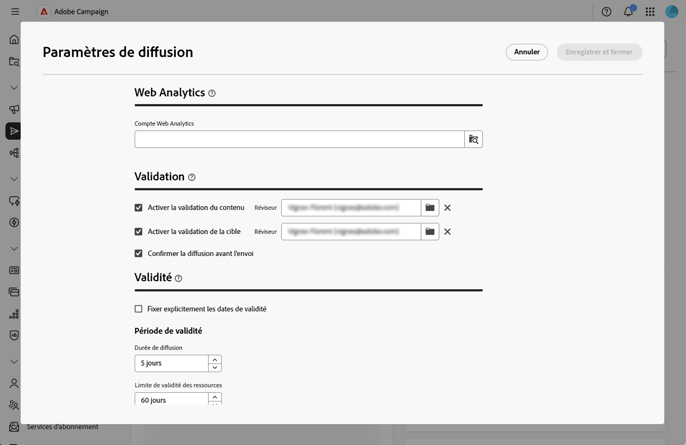
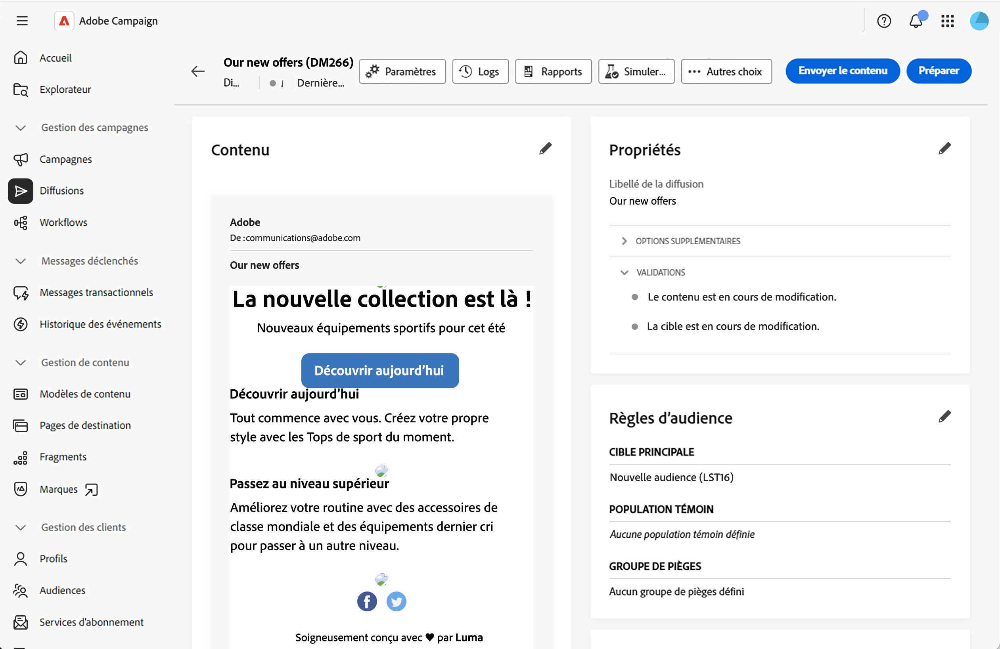
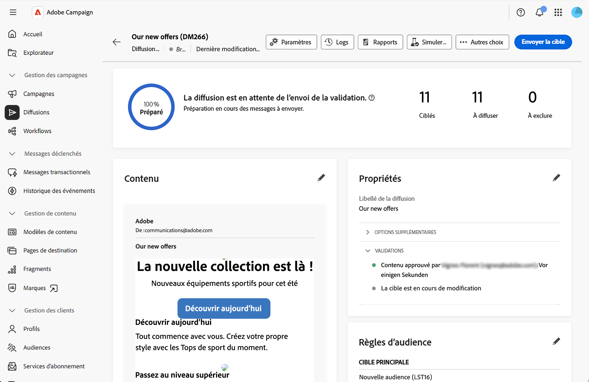
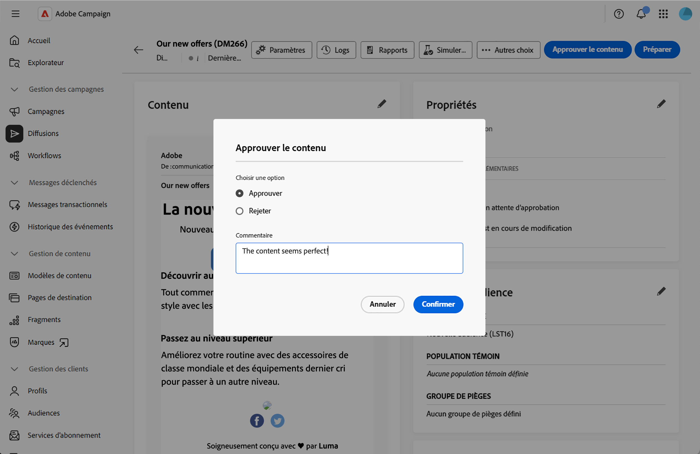

# Gérer le processus de validation {#campaign-approvals}

>[!IMPORTANT]
>
>Les validations ne sont disponibles que pour les diffusions créées dans une campagne. Elles ne s’appliquent pas aux diffusions autonomes ou créées dans des workflows en dehors d’un contexte de campagne.

Le processus de validation permet de coordonner plusieurs parties prenantes et d’assurer un contrôle qualité avant l’envoi des diffusions. Utilisez les validations lorsque votre organisation nécessite la validation de différentes équipes, comme les responsables marketing qui examinent le contenu ou les analystes de données qui valident les audiences cibles.

Lorsque les validations sont activées, vous devez soumettre le contenu ou la cible à la validation. Les réviseurs et réviseuses désignés reçoivent des notifications par e-mail demandant la validation et peuvent les approuver ou les refuser directement depuis l’interface d’utilisation web.Les diffusions ne peuvent pas être envoyées tant que toutes les validations requises n’ont pas été accordées.Vous pouvez activer les éléments suivants :

* **Validation du contenu** : validez le contenu, la conception et la personnalisation du message.
* **Validation de la cible** : validez l&#39;audience et les critères de ciblage.
* **Confirmation de diffusion** : demandez une confirmation finale avant l&#39;envoi.

## Configuration des paramètres de validation {#configure-approvals}

Les paramètres de validation sont hérités du modèle de campagne et peuvent être modifiés pour chaque campagne. Pour configurer les paramètres de validation, procédez comme suit :

1. Ouvrez une campagne ou un modèle de campagne, ou créez-en une à partir du menu **[!UICONTROL Campagnes]**.

1. Cliquez sur le bouton **[!UICONTROL Paramètres]** dans le coin supérieur droit du tableau de bord de la campagne.

1. Dans la section **[!UICONTROL Validations]**, configurez les options suivantes :

   {zoomable="yes"}

   * **[!UICONTROL Activer l’approbation du contenu]** : lorsque ce paramètre est activé, le contenu de la diffusion doit être validé avant envoi.Cliquez sur l’icône de dossier dans le champ **[!UICONTROL Réviseur ou réviseuse]** pour sélectionner un opérateur, une opératrice ou un groupe d’opérateurs.

   * **[!UICONTROL Activer l’approbation de la cible]** : lorsque ce paramètre est activé, l’audience cible de la diffusion doit être validée.Cliquez sur l’icône de dossier dans le champ **[!UICONTROL Réviseur ou réviseuse]** pour sélectionner un opérateur, une opératrice ou un groupe d’opérateurs et d’opératrices.

   * **[!UICONTROL Confirmer la diffusion avant l&#39;envoi]** : nécessite une confirmation manuelle finale avant l&#39;envoi, même après toutes les autres validations.

>[!NOTE]
>
>* Si aucune personne réviseuse n’est spécifiée, le ou la propriétaire de la campagne hérite du rôle.
>* Les réviseurs et réviseuses ont besoin des autorisations appropriées pour approuver les diffusions.Seuls les personnes identifiées dans la liste des réviseurs et réviseuses peuvent approuver une demande.

## Soumettre à validation {#submit-approval}

Une fois votre diffusion créée, procédez comme suit pour envoyer le contenu et la cible pour validation.

>[!NOTE]
>Les validations sont disponibles à la fois dans les diffusions de workflow de campagne et dans les diffusions autonomes de campagne.

1. Dans le tableau de bord de diffusion, cliquez sur le bouton **[!UICONTROL Envoyer le contenu]**. Les réviseurs et réviseuses désignés peuvent approuver ou rejeter une demande.Consultez cette [section](#approve-reject).

   {zoomable="yes"}

   Le statut de validation passe à En attente dans la section **[!UICONTROL Propriétés]** du tableau de bord de la diffusion.Consultez cette [section](#rack-approvals).

1. Une fois le contenu approuvé, cliquez sur le bouton **[!UICONTROL Préparer]**. pour préparer la cible de diffusionLe système prépare l’audience et les critères de ciblage.

1. Cliquez sur le bouton **[!UICONTROL Envoyer la cible]**.Les réviseurs et réviseuses désignés peuvent alors approuver ou rejeter le projet. Consultez cette [section](#approve-reject).

   {zoomable="yes"}

   Le statut de validation passe à En attente.Consultez cette [section](#rack-approvals).

1. Une fois la cible approuvée, la préparation reprend et la diffusion peut être envoyée.

>[!NOTE]
>Si une validation est rejetée, le ou la propriétaire de la diffusion doit apporter toutes les modifications nécessaires au contenu ou à la cible en fonction des commentaires du réviseur ou de la réviseuse et effectuer une nouvelle soumission pour validation.

## Approuver ou rejeter {#approve-reject}

Les réviseurs et réviseuses désignés peuvent approuver ou rejeter les envois de contenu et de cible.Consultez cette [section](#submit-approval).

>[!NOTE]
>Pour que l’e-mail de notification soit envoyé, l’adresse du réviseur ou de la réviseuse doit être configurée dans l’instance.

1. Lorsque vous recevez l’e-mail de notification, ouvrez la diffusion qui nécessite une validation directement depuis l’interface d’utilisation web.

1. Révisez le contenu ou les informations sur la cible.

1. Cliquez sur le bouton **[!UICONTROL Approuver le contenu]** ou **[!UICONTROL Approuver la cible]**.

   {zoomable="yes"}

1. Cliquez sur **[!UICONTROL Approuver]** ou **[!UICONTROL Refuser]**.

1. Vous pouvez éventuellement ajouter un **[!UICONTROL Commentaire]** pour expliquer votre décision.

   {zoomable="yes"}

1. Confirmez votre décision.Le statut de validation est immédiatement mis à jour dans le tableau de bord de la diffusion.Consultez cette [section](#rack-approvals).

## Suivi du statut de validation {#track-approvals}

Le statut de validation est visible dans la section **[!UICONTROL Propriétés]** du tableau de bord de la diffusion.Le statut affiche les validations en attente et leur statut actuel :

{zoomable="yes"}

* **[!UICONTROL En édition]** : le contenu ou la cible n’a pas encore été soumis pour validation.
* **[!UICONTROL En attente de validation]** : le contenu ou la cible est en attente de révision.
* **[!UICONTROL Approuvé]** : le contenu ou la cible a été approuvé par le réviseur ou la réviseuse.
* **[!UICONTROL Rejeté]** : le contenu ou la cible a été rejeté par le réviseur ou la réviseuse.

La section Validation affiche toutes les validations et mises à jour activées en temps réel, à mesure que les réviseurs et les réviseuses valident ou rejettent chaque étape.

## Rubriques connexes : {#related}

* [Créer des campagnes](create-campaigns.md)
* [Gérer les campagnes](manage-campaigns.md)
