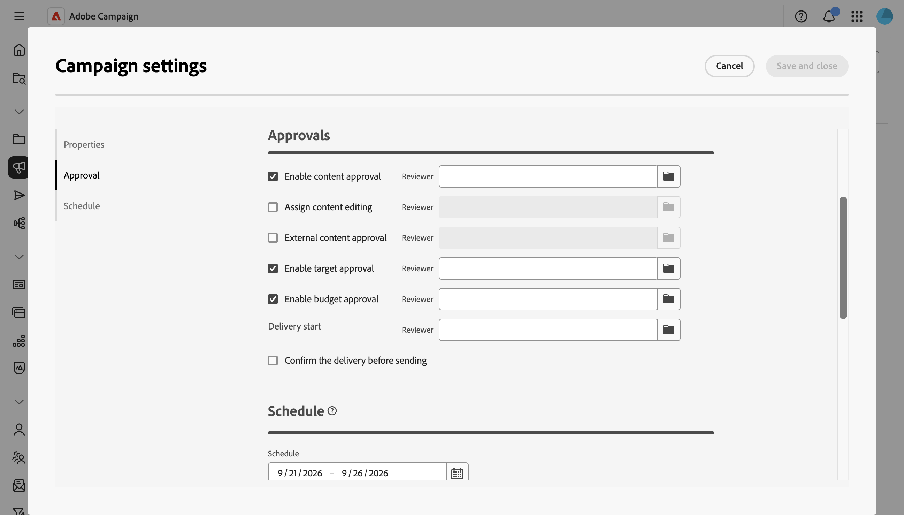
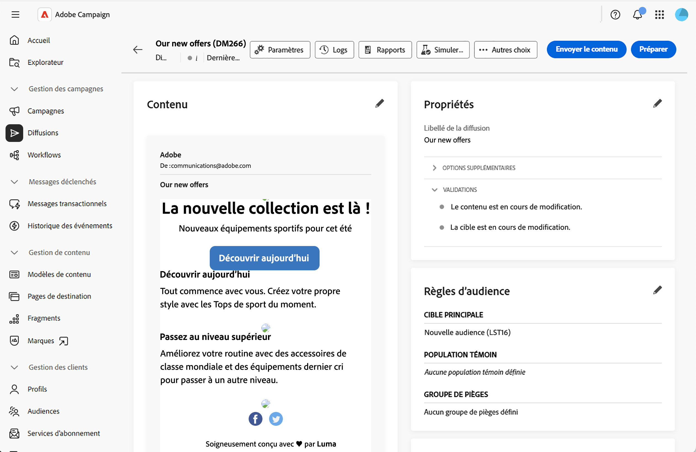
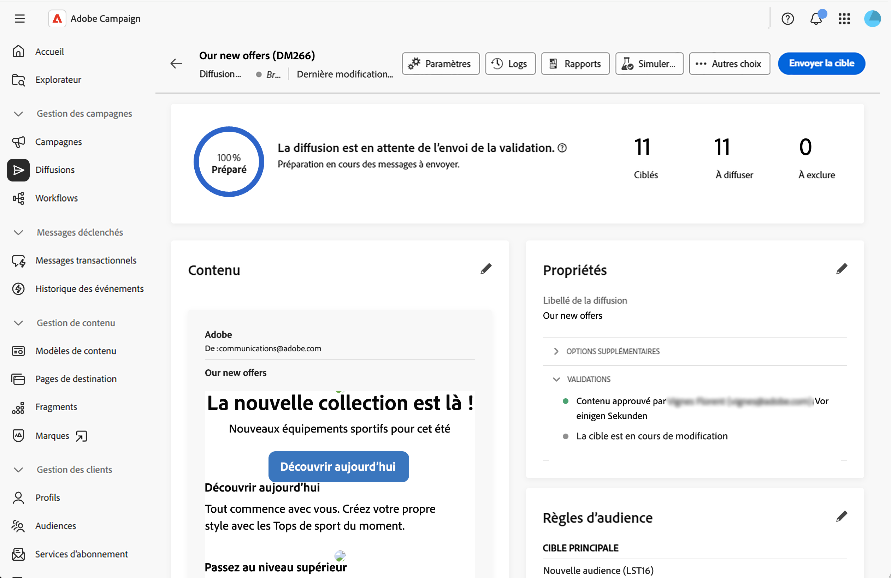
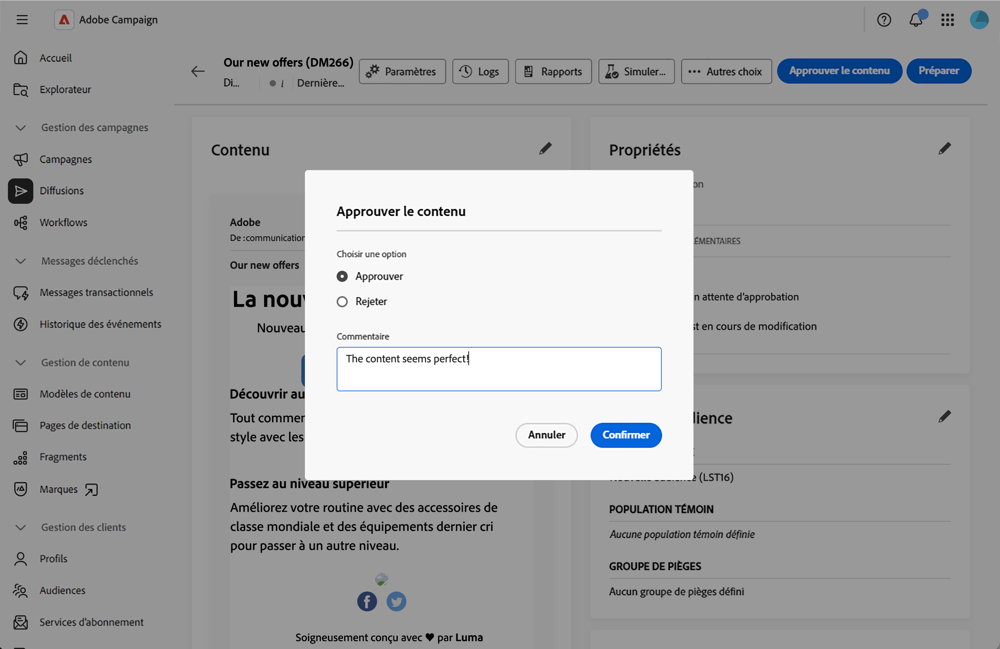

# Gérer le processus de validation {#campaign-approvals}

>[!IMPORTANT]
>
>Les validations ne sont disponibles que pour les campagnes et les diffusions créées dans une campagne.

Le processus de validation permet de coordonner plusieurs parties prenantes et d’assurer un contrôle qualité avant l’envoi des diffusions. Utilisez les validations lorsque votre organisation nécessite la validation de différentes équipes, comme les responsables marketing qui examinent le contenu ou les analystes de données qui valident les audiences cibles.

Lorsque les validations sont activées, vous devez soumettre le contenu ou la cible à la validation. Les réviseurs et réviseuses désignés reçoivent des notifications par e-mail demandant la validation et peuvent les approuver ou les refuser directement depuis l’interface d’utilisation web. Les diffusions ne peuvent pas être envoyées tant que toutes les validations requises n’ont pas été accordées. Vous pouvez activer les éléments suivants :

* **Validation du contenu** : validez le contenu, la conception et la personnalisation du message. Vous pouvez ajouter une étape de modification avant la validation du contenu, gérée par un opérateur désigné, ainsi qu’une étape de validation pour un validant externe une fois le contenu validé en interne.
* **Validation de la cible** : validez l&#39;audience et les critères de ciblage.
* **Validation du budget** : validation du budget de la diffusion
* **Début de diffusion** : permet de restreindre les personnes autorisées à envoyer la diffusion à un réviseur ou une réviseuse spécifique
* **Confirmation de diffusion** : demandez une confirmation finale avant l&#39;envoi.

## Configuration des paramètres de validation {#configure-approvals}

Les paramètres de validation sont hérités du modèle de campagne et peuvent être modifiés pour chaque campagne. La même section **[!UICONTROL Validations]** est également disponible dans les paramètres d’une diffusion créée dans une campagne. Elle vous permet de remplacer la configuration au niveau de la campagne pour cette diffusion uniquement.

Pour configurer les paramètres de validation au niveau de la campagne, procédez comme suit :

1. Ouvrez une campagne ou un modèle de campagne, ou créez-en une à partir du menu **[!UICONTROL Campagnes]**.

1. Cliquez sur le bouton **[!UICONTROL Paramètres]** dans le coin supérieur droit du tableau de bord de la campagne.

1. Dans la section **[!UICONTROL Validations]**, configurez les options suivantes :

   {zoomable="yes"}

   >[!NOTE]
   >
   > Si vous décidez d’activer une option de validation, cliquez sur l’icône de dossier dans le champ **[!UICONTROL Réviseur]** pour sélectionner un opérateur ou un groupe d’opérateurs.

1. Configuration de la **[!UICONTROL validation du contenu]** : lorsqu&#39;elle est activée, le contenu de la diffusion doit être validé avant envoi. Lorsque cette option est activée, deux champs s’affichent :

   * **[!UICONTROL Attribuer l&#39;édition du contenu]** : ajoute une étape d&#39;édition avant la validation du contenu. Un opérateur désigné, tel qu’un webmaster, est averti de la modification du contenu, puis le met à disposition pour approbation.
   * **[!UICONTROL Validation externe du contenu]** : ajoute une étape de validation pour un validant externe, tel qu’un partenaire ou un fournisseur, qui valide le rendu de la diffusion (par exemple la cohérence de la marque) une fois le contenu validé en interne.

1. Définissez la **[!UICONTROL Validation de la cible]** : lorsqu&#39;elle est activée, l&#39;audience cible de la diffusion doit être validée.

1. Définir le **[!UICONTROL Validation du budget]** : lorsqu&#39;il est activé, le budget de la diffusion doit être validé. Cette option nécessite qu’un budget soit déjà affecté à la campagne, ce qui est actuellement fait à partir de la console cliente.

1. Définissez le **[!UICONTROL Début de diffusion]** : limitez le début de diffusion à un opérateur ou à un groupe d’opérateurs spécifique. Si un opérateur ou une opératrice non autorisé(e) tente d’envoyer la diffusion, il ou elle voit une erreur indiquant qu’il ou elle n’est pas autorisé(e) à effectuer cette action.

1. Définir le **[!UICONTROL Confirmer la diffusion avant l’envoi]** : nécessite une confirmation manuelle finale avant l’envoi, même une fois toutes les autres validations terminées.

>[!NOTE]
>
>* Si aucune personne réviseuse n’est spécifiée, le ou la propriétaire de la campagne hérite du rôle.
>* Les réviseurs et réviseuses ont besoin des autorisations appropriées pour approuver les diffusions. Seuls les personnes identifiées dans la liste des réviseurs et réviseuses peuvent approuver une demande.

## Soumettre à validation {#submit-approval}

Une fois votre diffusion créée, procédez comme suit pour envoyer le contenu et la cible pour validation.

>[!NOTE]
>
>Les validations s’appliquent si la diffusion a été créée directement dans la campagne ou par le biais d’un workflow de campagne.

1. Dans le tableau de bord de diffusion, cliquez sur le bouton **[!UICONTROL Envoyer le contenu]**. Les réviseurs et réviseuses désignés peuvent approuver ou rejeter une demande. Consultez cette [section](#approve-reject).

   {zoomable="yes"}

   Le statut de validation passe à En attente dans la section **[!UICONTROL Propriétés]** du tableau de bord de la diffusion. Consultez cette [section](#track-approvals).

1. Une fois le contenu approuvé, cliquez sur le bouton **[!UICONTROL Préparer]**. pour préparer la cible de diffusion Le système prépare l’audience et les critères de ciblage.

1. Cliquez sur le bouton **[!UICONTROL Envoyer la cible]**. Les réviseurs et réviseuses désignés peuvent alors approuver ou rejeter le projet. Consultez cette [section](#approve-reject).

   {zoomable="yes"}

   Le statut de validation passe à En attente. Consultez cette [section](#track-approvals).

1. Si l&#39;approbation de budget est activée, soumettez le budget pour approbation en suivant le même principe. Les réviseurs et réviseuses désignés peuvent approuver ou rejeter une demande. Consultez cette [section](#approve-reject).

1. Une fois la cible et, le cas échéant, le budget validés, la préparation reprend et la diffusion peut être envoyée.

>[!NOTE]
>Si une validation est rejetée, le ou la propriétaire de la diffusion doit apporter toutes les modifications nécessaires au contenu ou à la cible en fonction des commentaires du réviseur ou de la réviseuse et effectuer une nouvelle soumission pour validation.

## Approuver ou rejeter {#approve-reject}

Les réviseurs désignés peuvent approuver ou rejeter les soumissions de contenu, de cible et de budget. Consultez cette [section](#submit-approval).

>[!NOTE]
>Pour que l’e-mail de notification soit envoyé, l’adresse du réviseur ou de la réviseuse doit être configurée dans l’instance.

1. Lorsque vous recevez l’e-mail de notification, ouvrez la diffusion qui nécessite une validation directement depuis l’interface d’utilisation web.

1. Révisez le contenu ou les informations sur la cible.

1. Cliquez sur le bouton **[!UICONTROL Valider le contenu]**, **[!UICONTROL Valider la cible]** ou **[!UICONTROL Valider le budget]**.

   {zoomable="yes"}

1. Cliquez sur **[!UICONTROL Approuver]** ou **[!UICONTROL Refuser]**.

1. Vous pouvez éventuellement ajouter un **[!UICONTROL Commentaire]** pour expliquer votre décision.

   {zoomable="yes"}

1. Confirmez votre décision. Le statut de validation est immédiatement mis à jour dans le tableau de bord de la diffusion. Consultez cette [section](#track-approvals).

## Suivi du statut de validation {#track-approvals}

Le statut de validation est visible dans la section **[!UICONTROL Propriétés]** du tableau de bord de la diffusion. Le statut affiche les validations en attente et leur statut actuel :

{zoomable="yes"}

* **[!UICONTROL En édition]** : le contenu ou la cible n’a pas encore été soumis pour validation.
* **[!UICONTROL En attente de validation]** : le contenu ou la cible est en attente de révision.
* **[!UICONTROL Approuvé]** : le contenu ou la cible a été approuvé par le réviseur ou la réviseuse.
* **[!UICONTROL Rejeté]** : le contenu ou la cible a été rejeté par le réviseur ou la réviseuse.

La section Validation affiche toutes les validations et mises à jour activées en temps réel, à mesure que les réviseurs et les réviseuses valident ou rejettent chaque étape.

## Rubriques connexes : {#related}

* [Créer des campagnes](create-campaigns.md)
* [Gérer les campagnes](manage-campaigns.md)
