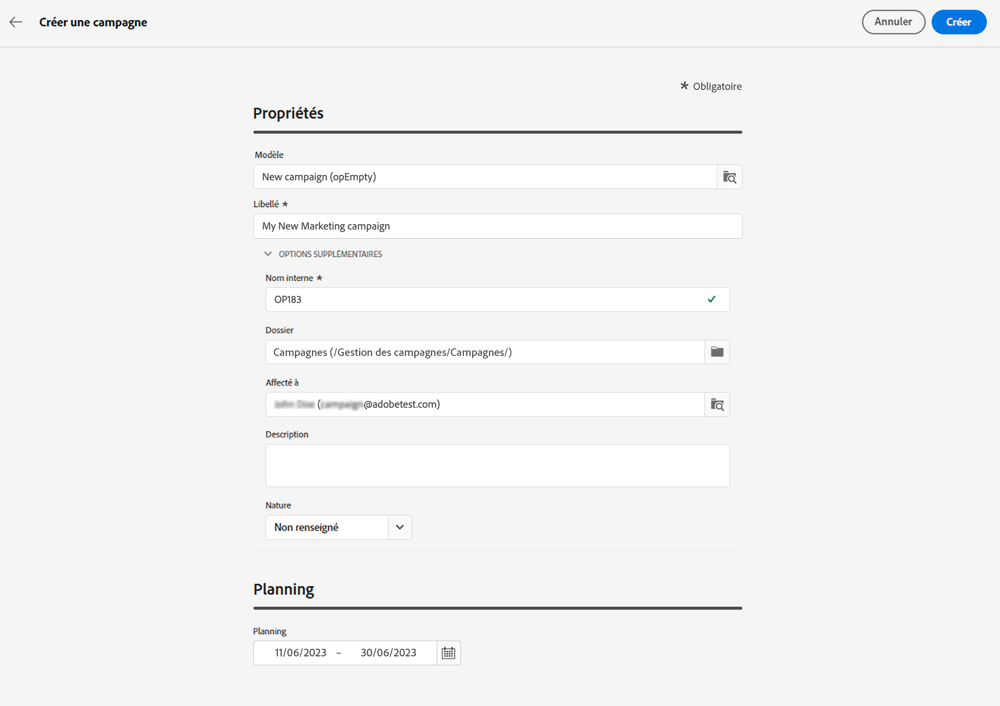

# Créer votre première campagne {#create-first-campaigns}

>[!CONTEXTUALHELP]
>id="acw_campaign_creation_properties"
>title="Propriétés de création de campagne"
>abstract="Définissez les propriétés et les métadonnées de la campagne."

>[!CONTEXTUALHELP]
>id="acw_campaign_properties"
>title="Propriétés de la campagne"
>abstract="Définissez les paramètres et les métadonnées de votre campagne."

Pour créer une campagne, vous devez définir ses propriétés, planifier et inclure les workflows et les diffusions.

## Créer la campagne{#campaign-create}

Pour créer une campagne procédez comme suit :

1. Cliquez sur le menu **[!UICONTROL Campagnes]**, puis sur le bouton **[!UICONTROL Créer une campagne]**.
1. Sélectionnez le **Modèle** à utiliser, puis fournissez un libellé pour la campagne. Les modèles de campagne sont préconfigurés afin de pouvoir être réutilisés pour créer de nouvelles campagnes. Ils sont créés à partir de la console cliente.
   [En savoir plus](https://experienceleague.adobe.com/docs/campaign/automation/campaign-orchestration/marketing-campaign-templates.html?lang=fr).
1. Si nécessaire, vous pouvez modifier les **options supplémentaires** suivantes : nom interne, dossier, personnes assignées, description et nature.
1. Définissez le **planning** de votre campagne. La campagne démarre à la date de début. Les dates de début et de fin sont affichées dans la liste des campagnes et peuvent être utilisées comme filtre. Consultez cette [section](manage-campaigns.md#access-campaigns).

   

   >[!NOTE]
   >
   >Vous pouvez toujours modifier ces propriétés ultérieurement à partir de l’icône **Configurer les paramètres de campagne** en regard du libellé de la campagne. Consultez cette [section](gs-campaigns.md#campaign-dashboard).

1. Cliquez sur **Créer**.
1. Ajoutez des workflows et des diffusions à votre campagne :

   * Dans l’onglet **Workflows**, cliquez sur **Créer un workflow**. Un workflow par défaut est automatiquement ajouté lors de la création de votre campagne. En savoir plus sur la façon de [créer un workflow](../workflows/create-workflow.md).
   * Dans l’onglet **Diffusions**, cliquez sur **Créer une diffusion**. [En savoir plus](../msg/gs-messages.md)

1. Utilisez les boutons **Journaux** et **Reporting** pour analyser les performances de votre campagne.

## Surveiller et suivre la campagne{#campaign-monitoring}

La surveillance des campagnes est une étape essentielle pour analyser l’efficacité de votre campagne. Ouvrez votre campagne, puis cliquez sur le bouton **Journaux**.

Vous pouvez également afficher les rapports dédiés en cliquant sur le bouton **Rapports**. Consultez cette [section](../reporting/campaign-reports.md).

<!--
	+++WORKF
++screen
## Create a cross-channel campaign {#cross-channel-campaign}

>[!CONTEXTUALHELP]
>id="acw_campaign_creation_workflow"
>title="Workflow list"
>abstract="List of workflows available for your campaign. Use the 'Create workflow' button to add a workflow in your campaign."

In a cross-channel campaign, a single marketing communication uses different channels. Data is passed between the channels. The customer receives communication through multiple channels based on, for example, their interaction with the previous communication.

-->
<!--
existing campaign: settings button -> properties like when creation
schedule in header

About plans, programs and campaigns
Adobe Campaign allows you to plan marketing campaigns in which you can create and manage different types of activities: emails, SMS messages, push notifications, workflows, landing pages. These campaigns and their contents can be gathered into programs.

The programs and campaigns allow you to regroup and view the different marketing activities that are linked to them.

A program may contain other programs as well as campaigns, workflows, and landing pages. It appears in the timeline and help you organize your marketing activities: you can separate them by country, by brand, by unit, etc.
A campaign enables you to gather all the marketing activities of your choice under a single entity. A campaign may contain emails, SMS, push notifications, direct mails, workflows, and landing pages.
To better organize your marketing plans, Adobe recommends the following hierarchy: Program > Sub-programs > Campaigns > Workflows > Deliveries.

Reports on programs and campaigns allow you to analyze their impact. For example, you can build reports at the campaign level to aggregate data on all deliveries contained in that campaign.

Related topics:

Timeline
About dynamic reports
Creating a campaign
In programs and sub-programs, you can add campaigns. Campaigns can contain marketing activities such as emails, SMS, push notifications, workflows, and landing pages.

From the Adobe Campaign home page, select the Programs & Campaigns card and access a program or sub-program.

Click on the Create button and select Campaign.

In the Creation mode screen, select a campaign type.

The campaign types available are based on templates defined in Resources > Templates > Campaign templates. For more on this, refer to the Managing templates section.

In the Properties screen, enter the name and ID of the campaign.

Select a start and end date to your campaign. These dates only apply to the campaign itself.

Click on Create to confirm the creation of the campaign.

The campaign is created and displayed. Use the Create button to add marketing activities to your campaign.

NOTE
Depending on your license agreement, you may access only some of these activities.

You can also create a campaign from the marketing activity list. You can choose to link the marketing activity to a parent program or sub-program via the properties window of the campaign.

Programs and campaigns icons and statuses
Each program and each campaign in the list has a visual symbol and an icon whose color indicates the execution status. This status depends on the validity period of the program or the campaign.

Gray: the program/campaign has not yet started - Editing status.
Blue: the program/campaign is in progress - In progress status.
Green: the program/campaign has finished - Finished status. By default, the current date is automatically shown as the validity start date and the end date is calculated according to the start date (D+186 days). You can change these dates in the program or campaign properties.

Business.Adobe.com resources
-->
