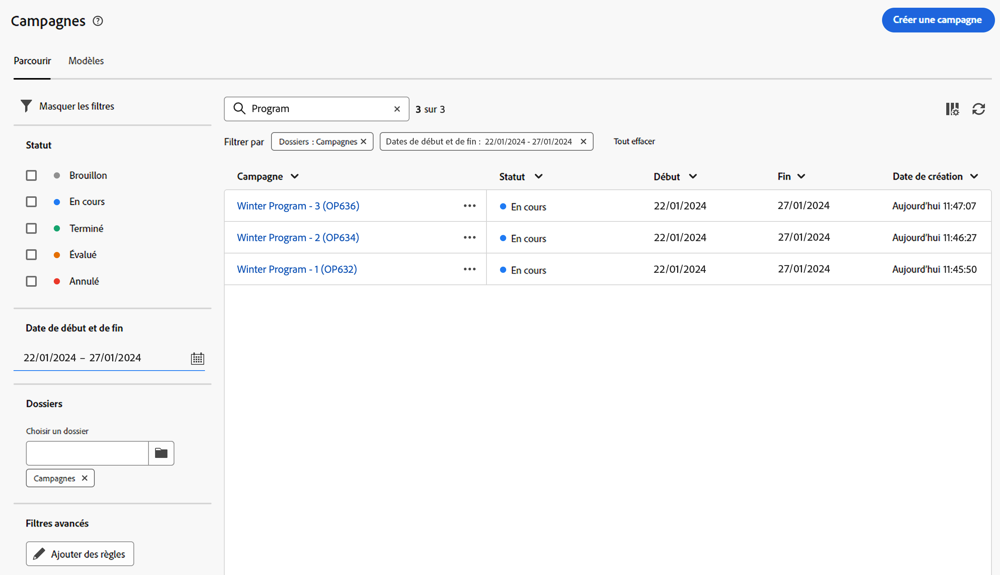

# Prise en main des campagnes {#campaigns}

>[!CONTEXTUALHELP]
>id="acw_homepage_card5"
>title="Concevoir et envoyer des campagnes cross-canal"
>abstract="Les fonctionnalités d’Adobe Campaign vous aident à gérer des données client centralisées, à concevoir des communications et des campagnes client et à créer des expériences personnalisées sur différents canaux : Courriel, Push et SMS."

Utilisez Adobe Campaign pour créer des campagnes cross-canal. Grâce à ses fonctionnalités d’orchestration des campagnes marketing, vous pouvez gérer et centraliser les données client, concevoir des communications client et des campagnes et créer des expériences personnalisées sur différents canaux. Dans cette version, les canaux email, push et SMS sont disponibles.

Concevez et exécutez des campagnes par e-mail à volume élevé pour diffuser des messages personnalisés, pour toutes les plates-formes et toutes les tailles d’écran.
Mesurez l&#39;efficacité de vos diffusions à l&#39;aide de rapports détaillés, notamment le nombre d&#39;ouvertures, de clics, de transferts, etc. Grâce aux fonctionnalités de segmentation d’Adobe Campaign, vous pouvez exécuter des requêtes sur une base de données volumineuse et définir facilement des segments de marketing dynamique qui ciblent parfaitement vos campagnes.

<!--
Get Started with campaigns
Adobe Campaign offers a set of solutions that help you personalize and deliver campaigns across all of your online and offline channels. You can create, configure, execute and analyze marketing campaigns. All marketing campaigns can be managed from a unified control center. Discover how to browse and create marketing campaigns in this section.

Campaigns include actions (deliveries) and processes (importing or extracting files), as well as resources (marketing documents, delivery outlines). They are used in marketing campaigns. Campaigns are part of a program, and programs are included in a campaign plan.
-->

## Accès et gestion de vos campagnes{#access-campaigns}

Pour créer une campagne ou gérer vos campagnes existantes, cliquez sur le bouton **[!UICONTROL Campagnes]** . Deux onglets sont disponibles :

* Le **Parcourir** répertorie toutes les campagnes existantes. Vous pouvez cliquer sur une campagne pour ouvrir son tableau de bord ou créer une nouvelle campagne en cliquant sur le bouton **Créer une campagne** bouton . Consultez cette [section](create-campaigns.md#create-campaigns)

* Le **Modèles** répertorie tous les modèles d’opération disponibles. Les modèles de campagne sont préconfigurés afin de pouvoir être réutilisés pour créer de nouvelles campagnes. Ils sont créés à partir de la console cliente. [En savoir plus](https://experienceleague.adobe.com/docs/campaign/automation/campaign-orchestration/marketing-campaign-templates.html?lang=fr).

Vous pouvez personnaliser les colonnes affichées en cliquant sur le **Configuration d’une colonne pour une disposition personnalisée** située dans le coin supérieur droit de la liste. Vous pouvez ainsi ajouter des informations supplémentaires à la liste. En outre, une barre de recherche et des filtres sont disponibles pour faciliter la recherche dans la liste. [En savoir plus](../get-started/user-interface.md#list-screens)

Vous pouvez, par exemple, filtrer selon le calendrier de votre campagne. Ouvrez le panneau Filtres et utilisez le **Start - End Date** section :

Chaque campagne de la liste affiche des informations sur son état actuel, sa date de création, la dernière fois où elle a été modifiée, etc.

## Le tableau de bord de l&#39;opération{#campaign-dashboard}

Dans le **Parcourir** , cliquez sur une opération pour afficher son tableau de bord. Deux onglets sont disponibles :

* Le **Workflows** répertorie tous les workflows liés à l&#39;opération. Cet onglet permet également de créer un nouveau workflow dans l&#39;opération. Consultez cette [section](create-campaigns.md#create-campaigns)
* Le **Diffusions** répertorie toutes les diffusions liées à l&#39;opération. Cet onglet permet également de créer une diffusion au sein de l&#39;opération. Consultez cette [section](create-campaigns.md#create-campaigns)

Le **Configuration des paramètres de campagne** vous permet de modifier les propriétés de l&#39;opération qui ont été définies lors de la création de l&#39;opération. Consultez cette [section](create-campaigns.md#create-campaigns)

## Logs de tracking et de tracking{#campaign-monitoring}

La surveillance des campagnes est une étape essentielle pour analyser vos campagnes. Elles sont accessibles à partir du **Journaux** bouton .

Vous pouvez également afficher les rapports dédiés en cliquant sur le **Rapports** bouton . Consultez cette [section](../reporting/campaign-reports.md)

## Dupliquer et supprimer

Pour dupliquer ou supprimer une campagne, cliquez sur le bouton représentant des points de suspension puis sélectionnez **Dupliquer** ou **Supprimer**. Vous pouvez également dupliquer ou supprimer un workflow ou une diffusion depuis le tableau de bord d&#39;une opération.

>[!NOTE]
>
>Pour supprimer une diffusion qui se trouve dans un workflow, vous devez la supprimer du workflow.

