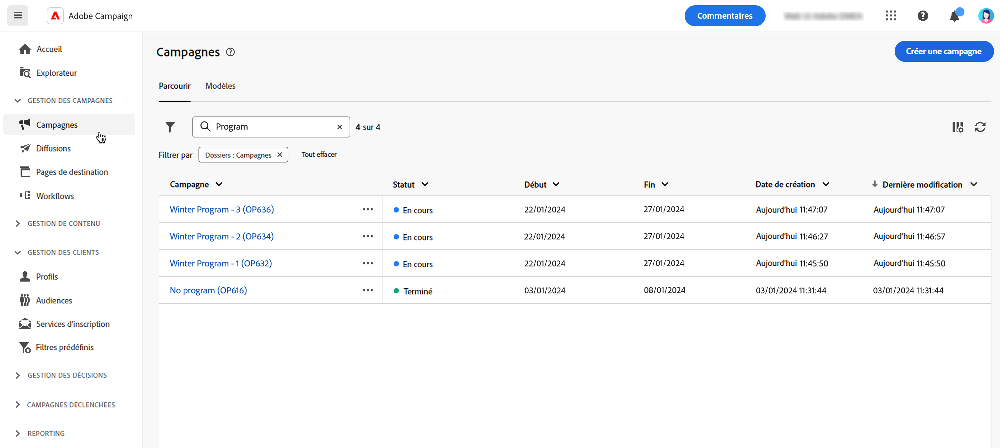

# Prise en main des campagnes {#campaigns}

>[!CONTEXTUALHELP]
>id="acw_homepage_card5"
>title="Concevoir et envoyer des campagnes cross-canal"
>abstract="Les fonctionnalités d’Adobe Campaign vous aident à gérer des données client centralisées, à concevoir des communications et des campagnes client et à créer des expériences personnalisées sur différents canaux : Courriel, Push et SMS."

Utilisez Adobe Campaign pour créer des campagnes cross-canal. Grâce à ses fonctionnalités d’orchestration des campagnes marketing, vous pouvez gérer et centraliser les données client, concevoir des communications client et des campagnes et créer des expériences personnalisées sur différents canaux. Dans cette version, les canaux email, push et SMS sont disponibles.

Concevez et exécutez des campagnes par e-mail à volume élevé pour diffuser des messages personnalisés, pour toutes les plateformes et toutes les tailles d’écran.
Mesurez l&#39;efficacité de vos diffusions à l&#39;aide de rapports détaillés, notamment le nombre d&#39;ouvertures, de clics, de transferts, etc. Grâce aux fonctionnalités de segmentation d’Adobe Campaign, vous pouvez exécuter des requêtes sur une base de données volumineuse et définir facilement des segments de marketing dynamique qui ciblent parfaitement vos campagnes.

## Créer une campagne cross-canal {#cross-channel-campaign}

>[!CONTEXTUALHELP]
>id="acw_campaign_creation_workflow"
>title="Liste des workflows"
>abstract="Liste des workflows disponibles pour votre campagne. Utilisez le bouton « Créer un workflow » pour ajouter un workflow à votre campagne."

Dans une campagne cross-canal, une communication marketing unique utilise différents canaux. Les données sont transmises entre les canaux. Le client reçoit la communication par le biais de plusieurs canaux en fonction, par exemple, de son interaction avec la communication précédente.

## Définir les propriétés de votre campagne {#campaign-properties}

>[!CONTEXTUALHELP]
>id="acw_campaign_creation_properties"
>title="Propriétés de création de campagne"
>abstract="Définissez les propriétés et les métadonnées de la campagne."

>[!CONTEXTUALHELP]
>id="acw_campaign_properties"
>title="Propriétés de la campagne"
>abstract="Définissez les paramètres et les métadonnées de votre campagne."

Les propriétés de la campagne s’affichent lorsque vous créez une campagne.

Vous pouvez également accéder aux propriétés de la campagne à partir de l’icône **Configurer les paramètres de campagne** en regard du libellé de la campagne.

Dans cet écran, vous pouvez modifier les éléments suivants :

## Définir le planning de votre campagne {#campaign-schedule}

>[!CONTEXTUALHELP]
>id="acw_campaign_creation_schedule"
>title="Planning de création de campagne"
>abstract="Utilisez la section Planning des propriétés de votre campagne pour sélectionner la période. La campagne démarre à la date de début."

Utilisez la section **Planning** des propriétés de votre campagne pour sélectionner la période. La campagne démarre à la date de début.

Les dates de début et de fin sont affichées dans la liste des campagnes et peuvent être utilisées comme filtre.

Pour filtrer selon le planning de vos campagnes, ouvrez les filtres et utilisez la section **Date de début et de fin** :

