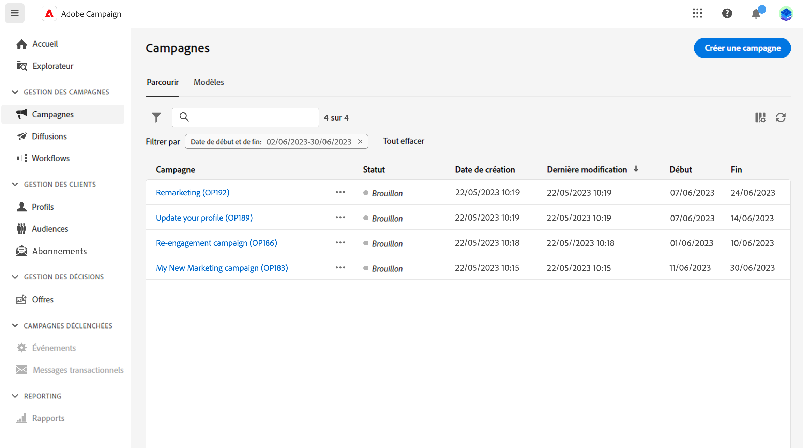
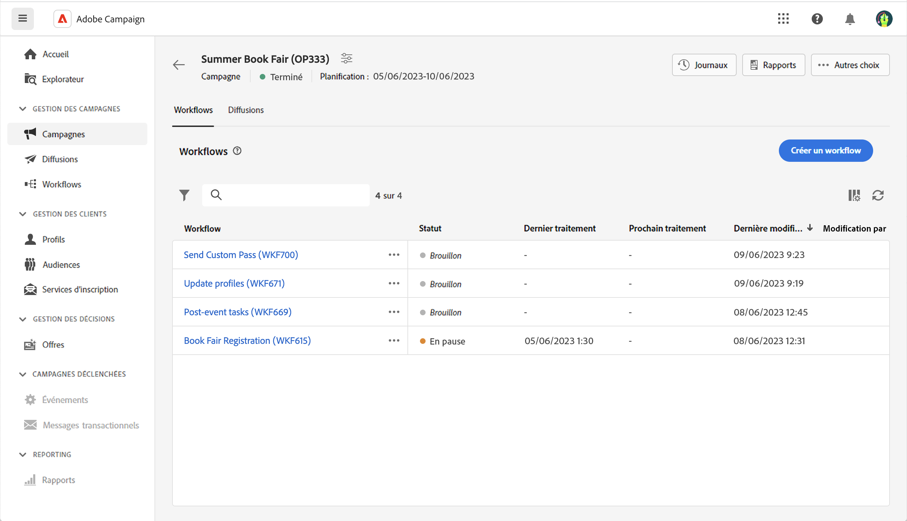
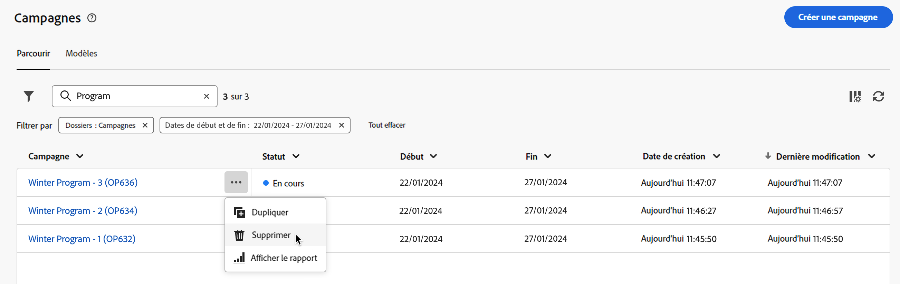
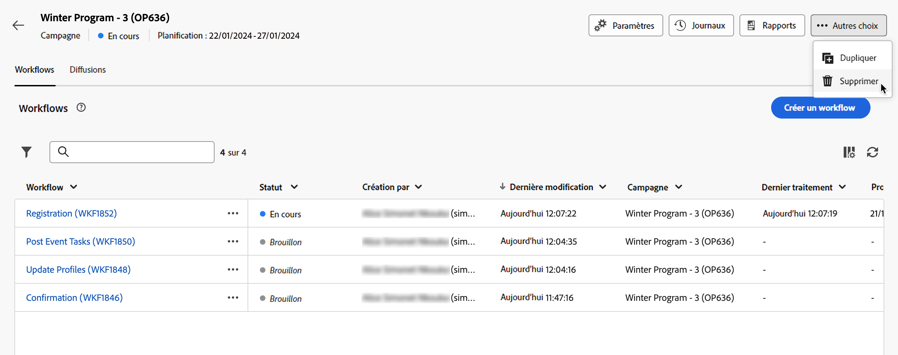

# Accéder aux campagnes et les gérer {#manage-campaigns}

>[!CONTEXTUALHELP]
>id="acw_campaign_schedule"
>title="Planning de la campagne"
>abstract="Définissez ou modifiez le planning de votre campagne."

Pour accéder à vos campagnes et les gérer, cliquez sur le menu **[!UICONTROL Campagnes]** dans le volet de navigation de gauche.

## Liste de campagnes {#access-campaigns}

La liste des campagnes comprend deux onglets :

* L’onglet **Parcourir** répertorie toutes les campagnes existantes. Cliquez sur une campagne pour afficher son tableau de bord ou créez une campagne à l’aide du bouton **Créer une campagne**. Consultez cette [section](create-campaigns.md#create-campaigns).

* L’onglet **Modèles** répertorie tous les modèles de campagne disponibles. Vous pouvez afficher un modèle existant ou en créer un nouveau. [En savoir plus](#manage-campaign-templates).

Par défaut, chaque campagne de la liste affiche des informations sur son statut actuel, ses dates de début et de fin, la dernière fois qu’elle a été modifiée, etc.

Vous pouvez personnaliser les colonnes affichées en cliquant sur l’icône **Configurer la colonne pour une disposition personnalisée**, située dans le coin supérieur droit de la liste. Vous pouvez ainsi ajouter ou supprimer des colonnes et réorganiser les informations dans la liste des campagnes.

Une barre de recherche et des filtres sont également disponibles pour faciliter la recherche dans la liste. [En savoir plus](../get-started/user-interface.md#list-screens).

Vous pouvez, par exemple, filtrer selon le planning de votre campagne. Ouvrez le panneau de filtrage et accédez à la section **Date de début et de fin** :

## Tableau de bord de la campagne {#campaign-dashboard}

>[!CONTEXTUALHELP]
>id="acw_campaign_delivery_list"
>title="Liste des diffusions de la campagne"
>abstract="L’onglet **Diffusions** répertorie toutes les diffusions liées à la campagne en cours. Cliquez sur le nom d’une diffusion pour la modifier. Cliquez sur le bouton Créer une diffusion pour ajouter une diffusion à cette campagne."

>[!CONTEXTUALHELP]
>id="acw_campaign_workflow_list"
>title="Liste des workflows dans une campagne"
>abstract="L’onglet **Workflow** répertorie tous les workflows liés à la campagne actuelle."

Dans l’onglet **Parcourir** de la liste des campagnes, cliquez sur une campagne pour afficher ses détails.

Le statut et le planning de la campagne sont affichés en haut de l’écran. Utilisez le bouton **Paramètres** pour mettre à jour les propriétés de votre campagne, telles que son libellé, son dossier et sa description. Vous pouvez également modifier le planning de votre campagne à partir de l’écran des paramètres. Pour en savoir plus sur les plannings de campagnes, consultez [cette section](create-campaigns.md#campaign-schedule).

Dans le tableau de bord de campagne, utilisez les boutons **Journaux** et **Rapports** pour surveiller votre campagne. En savoir plus dans cette [section](create-campaigns.md#create-campaigns).

Pour chaque campagne, le tableau de bord affiche deux onglets principaux : Workflows et Diffusions.

* L’onglet **Workflows** répertorie tous les workflows associés à la campagne. Cet onglet permet également de créer un workflow au sein de la campagne. Consultez cette [section](create-campaigns.md#create-campaigns).

* L’onglet **Diffusions** répertorie toutes les diffusions créées dans la campagne en cours. Vous pouvez également créer une diffusion au sein de la campagne. Consultez cette [section](create-campaigns.md#create-campaigns).

>[!NOTE]
>
>L’onglet **Diffusions** affiche toutes les diffusions liées à la campagne. Cependant, les diffusions créées dans un workflow ne peuvent pas être supprimées depuis cet endroit. Pour supprimer une diffusion créée dans le cadre d’un workflow, supprimez l’activité de diffusion du workflow. [En savoir plus](../msg/gs-messages.md#delivery-delete).

## Suprimer une campagne {#campaign-delete}

Vous pouvez supprimer une campagne de deux manières différentes :

* Dans la liste des campagnes, cliquez sur le bouton représentant des points de suspension, puis sélectionnez **Supprimer**.

  

* Dans la campagne elle-même, cliquez sur le bouton **Plus**, puis sélectionnez **Supprimer**.

  

## Dupliquer une campagne {#campaign-duplicate}

Vous pouvez dupliquer une campagne de deux manières :

* Dans la liste des campagnes, cliquez sur le bouton représentant des points de suspension, puis sélectionnez **Dupliquer**.

* Dans la campagne elle-même, cliquez sur le bouton **Plus**, puis sélectionnez **Dupliquer**.

Dans les deux cas, confirmez la duplication pour créer la nouvelle campagne. Le libellé de la campagne est **Copie de`<label of the initial campaign>`**. Accédez aux paramètres de la campagne pour mettre à jour ce libellé.

## Utiliser des modèles de campagnes {#manage-campaign-templates}

Les modèles de campagne contiennent des paramètres préconfigurés qui peuvent être réutilisés pour créer de nouvelles campagnes. Nous mettons à votre disposition un ensemble de modèles intégrés pour vous aider à démarrer. Vous pouvez créer et configurer des modèles d’opération, puis créer des opérations à partir de ces modèles.

Un modèle de campagne peut stocker les informations suivantes :

* La campagne **Paramètres**
* La campagne **Planifier**
* Modèles de workflows
* Modèles de diffusion

Pour créer un modèle de campagne, procédez comme suit :

1. Cliquez sur le menu **[!UICONTROL Campagnes]**, accédez à l’onglet **Modèles**, puis cliquez sur le bouton **[!UICONTROL Créer un modèle]**.
1. Sélectionnez le **modèle** à utiliser. Vous pouvez ainsi baser votre nouveau modèle sur un modèle créé précédemment.
1. Attribuez un libellé à votre modèle.
1. Si nécessaire, modifiez les **options supplémentaires** suivantes : nom interne, dossier, personne désignée, description et nature.
1. Définissez le **planning** de votre campagne. Découvrez comment définir le planning de vos campagnes dans [cette section](create-campaigns.md#campaign-schedule).
1. Cliquez sur **Créer**.
1. Ajoutez des workflows et des modèles de diffusion à votre campagne.