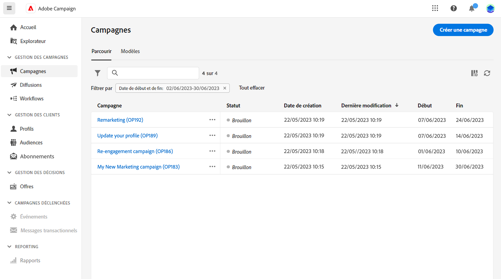
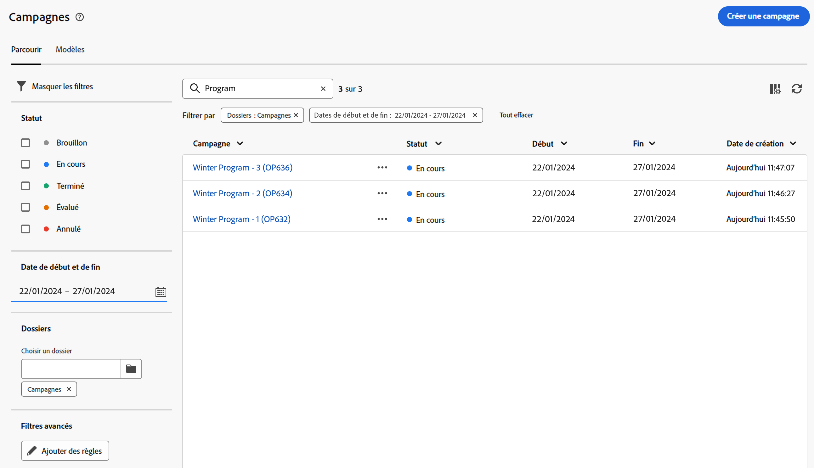
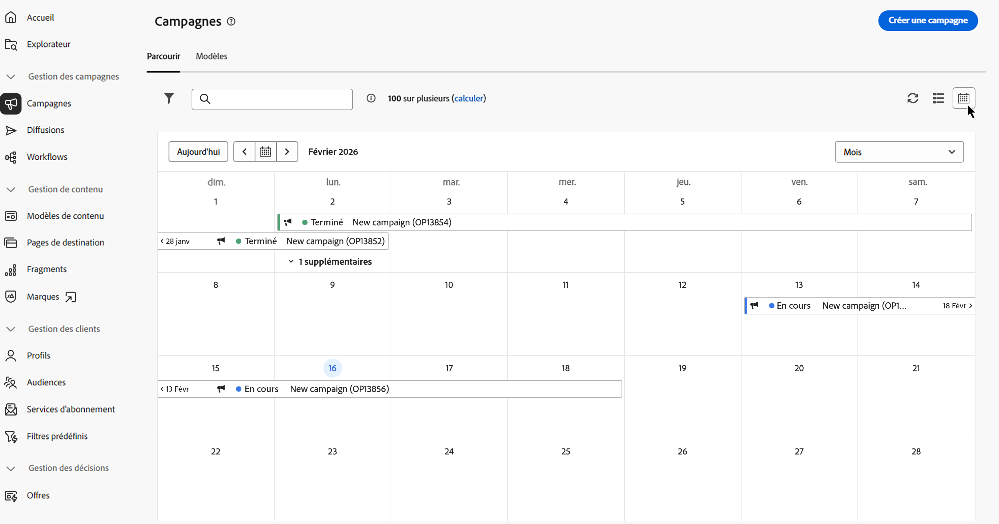
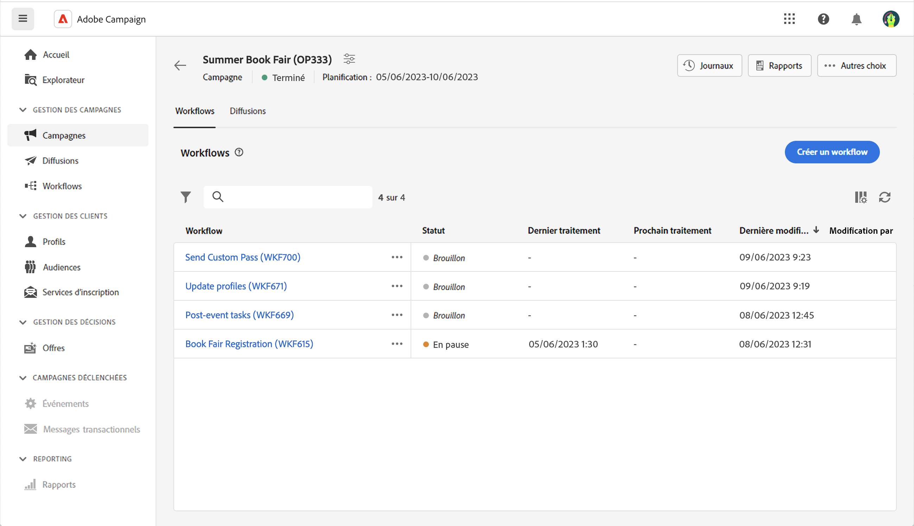
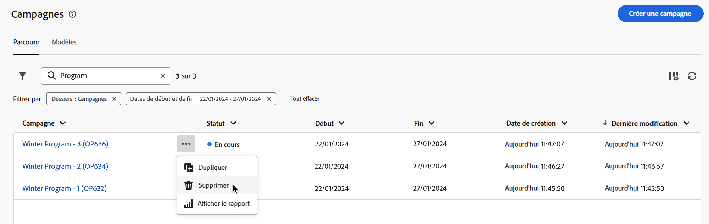
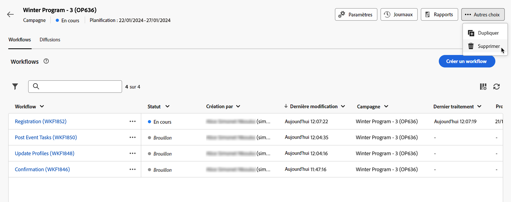

# Accéder aux campagnes et les gérer {#manage-campaigns}

>[!CONTEXTUALHELP]
>id="acw_campaign_schedule"
>title="Planning de la campagne"
>abstract="Définissez ou modifiez le planning de votre campagne."

Pour accéder à vos campagnes et les gérer, cliquez sur le menu **[!UICONTROL Campagnes]** dans le volet de navigation de gauche. Deux onglets sont disponibles :

* L’onglet **Parcourir** répertorie toutes les campagnes existantes. Cliquez sur une campagne pour afficher son tableau de bord ou créez une campagne à l’aide du bouton **Créer une campagne**. Consultez cette [section](create-campaigns.md#create-campaigns).

* L’onglet **Modèles** répertorie tous les modèles de campagne disponibles. Vous pouvez afficher un modèle existant ou en créer un nouveau. [En savoir plus](#manage-campaign-templates).

## Inventaire des campagnes {#inventory}

L’onglet **[!UICONTROL Parcourir]** fournit des informations sur le statut actuel des campagnes, les dates de début et de fin, la date de création, la dernière fois qu’elles ont été modifiées, etc. Vous pouvez personnaliser les colonnes affichées en cliquant sur l’icône **Configurer la colonne pour une disposition personnalisée**, située dans le coin supérieur droit de la liste. Ceci vous permet d’ajouter ou de supprimer des colonnes et de réorganiser les informations dans la liste des campagnes.

### Rechercher et filtrer l’inventaire {#search-and-filter}

Une barre de recherche et des filtres sont disponibles pour faciliter la recherche dans la liste. [En savoir plus](../get-started/user-interface.md#list-screens). Vous pouvez, par exemple, filtrer selon le planning de votre campagne. Ouvrez le panneau de filtrage et accédez à la section **Date de début et de fin** :

### Mode Chronologie {#timeline}

Par défaut, l’écran de la campagne affiche la **vue Liste** (inventaire). Vous pouvez basculer vers la **vue Chronologie** à tout moment à l’aide du bouton (bascule) d’affichage. Les deux vues affichent les mêmes campagnes et partagent les mêmes filtres et la même recherche. Lorsque vous modifiez les filtres ou effectuez une recherche dans une vue, l’autre vue reflète la même sélection.

La vue Chronologie vous permet de visualiser et de gérer vos campagnes au fil du temps. Toutes vos campagnes s’affichent dans un format temporel, ce qui facilite la planification et la coordination de vos activités marketing.

**Fonctionnement de la chronologie :**

* La chronologie affiche vos campagnes en fonction de leurs dates de début et de fin. Les campagnes qui s’étendent sur plusieurs jours apparaissent entre les dates appropriées.
* Vous pouvez naviguer par semaine, mois ou jour. Utilisez le sélecteur de date ou les boutons fléchés pour vous déplacer entre les périodes. Utilisez le bouton **Aujourd’hui** pour revenir rapidement à la date actuelle.
* La sélection d’une campagne ouvre un panneau de droite avec les détails de la campagne : statut, dates de début et de fin, liste des workflows et liste des diffusions. Vous pouvez accéder à ces workflows et diffusions à partir du panneau.
* Les campagnes en cours sont prioritaires dans l’affichage lorsque de nombreuses campagnes tombent à la même date.
* Lorsque de nombreuses campagnes tombent sur un seul jour (dans la vue Mois, par exemple), un contrôle **Plus** vous permet de développer l&#39;ensemble des campagnes pour ce jour, ou de passer à la vue Semaine ou Jour pour plus de détails.

## Tableau de bord de la campagne {#campaign-dashboard}

>[!CONTEXTUALHELP]
>id="acw_campaign_delivery_list"
>title="Liste des diffusions de la campagne"
>abstract="L’onglet **Diffusions** répertorie toutes les diffusions liées à la campagne en cours. Cliquez sur le nom d’une diffusion pour la modifier. Cliquez sur le bouton Créer une diffusion pour ajouter une diffusion à cette campagne."

>[!CONTEXTUALHELP]
>id="acw_campaign_workflow_list"
>title="Liste des workflows dans une campagne"
>abstract="L’onglet **Workflow** répertorie tous les workflows liés à la campagne actuelle."

Dans l’onglet **Parcourir** de la liste des campagnes, cliquez sur une campagne pour afficher ses détails.

Le statut et le planning de la campagne sont affichés en haut de l’écran. Utilisez le bouton **Paramètres** pour mettre à jour les propriétés de votre campagne, telles que son libellé, son dossier et sa description. Vous pouvez également modifier le planning de votre campagne à partir de l’écran des paramètres. Pour en savoir plus sur les plannings de campagnes, consultez [cette section](create-campaigns.md#campaign-schedule).

Dans le tableau de bord de campagne, utilisez les boutons **Logs** et **Rapports** pour surveiller votre campagne. En savoir plus dans cette [section](create-campaigns.md#create-campaigns).

Pour chaque campagne, le tableau de bord affiche deux onglets principaux : Workflows et Diffusions.

* L’onglet **Workflows** répertorie tous les workflows liés à la campagne. Cet onglet permet également de créer un workflow au sein de la campagne. Consultez cette [section](create-campaigns.md#create-campaigns).

* L’onglet **Diffusions** répertorie toutes les diffusions créées dans la campagne en cours. Vous pouvez également créer une diffusion au sein de la campagne. Consultez cette [section](create-campaigns.md#create-campaigns).

>[!NOTE]
>
>L’onglet **Diffusions** affiche toutes les diffusions liées à la campagne. Cependant, les diffusions créées dans un workflow ne peuvent pas être supprimées depuis cet endroit. Pour supprimer une diffusion créée dans le cadre d’un workflow, supprimez l’activité de diffusion du workflow. [En savoir plus](../msg/gs-messages.md#delivery-delete).

## Suprimer une campagne {#campaign-delete}

Vous pouvez supprimer une campagne de deux manières différentes :

* dans la liste des campagnes, cliquez sur le bouton représentant des points de suspension puis sélectionnez **Supprimer**.

  

* dans la campagne elle-même, cliquez sur le bouton **Plus** puis sélectionnez **Supprimer**.

  

## Dupliquer une campagne {#campaign-duplicate}

Vous pouvez dupliquer une campagne de deux manières :

* dans la liste des campagnes, cliquez sur le bouton représentant des points de suspension puis sélectionnez **Dupliquer**.

* dans la campagne elle-même, cliquez sur le bouton **Plus** puis sélectionnez **Dupliquer**.

Dans les deux cas, confirmez la duplication pour créer la nouvelle campagne. Le libellé de la campagne est **Copie de`<label of the initial campaign>`**. Accédez aux paramètres de la campagne pour mettre à jour ce libellé.

## Utiliser des modèles de campagnes {#manage-campaign-templates}

Les modèles de campagnes contiennent des paramètres préconfigurés qui peuvent être réutilisés pour créer de nouvelles campagnes. Nous mettons à votre disposition un ensemble de modèles intégrés pour vous aider à démarrer. Vous pouvez créer et configurer des modèles d’opération, puis créer des opérations à partir de ces modèles.

Un modèle de campagne peut stocker les informations suivantes :

* les **Paramètres** de la campagne ;
* le **Planning** de la campagne.
* Les modèles de workflows
* Modèles de diffusion

Pour créer un modèle de campagne, procédez comme suit :

1. Cliquez sur le menu **[!UICONTROL Campagnes]**, accédez à l’onglet **Modèles**, puis cliquez sur le bouton **[!UICONTROL Créer un modèle]**.
1. Sélectionnez le **modèle** à utiliser. Vous pouvez ainsi baser votre nouveau modèle sur un modèle créé précédemment.
1. Attribuez un libellé à votre modèle.
1. Si nécessaire, vous pouvez modifier les **options supplémentaires** suivantes : nom interne, dossier, personnes assignées, description et nature.
1. Définissez le **planning** de votre campagne. Découvrez comment définir le planning de votre campagne dans [cette section](create-campaigns.md#campaign-schedule).
1. Cliquez sur **Créer**.
1. Ajoutez des workflows et des modèles de diffusion à votre campagne.
