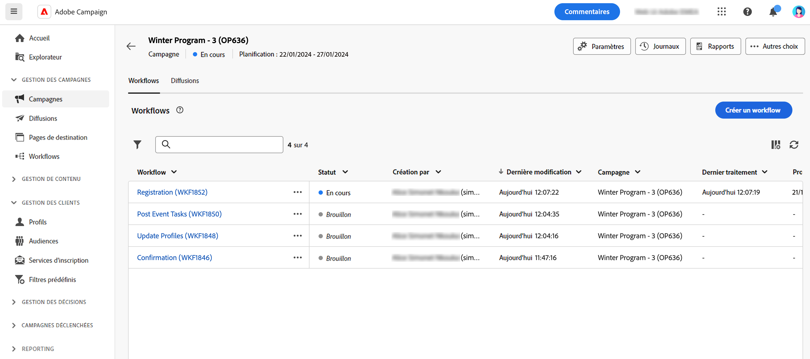

# Accès et gestion de vos campagnes{#manage-campaigns}

Pour créer une campagne ou gérer vos campagnes existantes, cliquez sur le bouton **[!UICONTROL Campagnes]** .

## La liste des campagnes{#access-campaigns}

Dans la liste des campagnes, deux onglets sont disponibles :

* Le **Parcourir** répertorie toutes les campagnes existantes. Vous pouvez cliquer sur une campagne pour ouvrir son tableau de bord ou créer une nouvelle campagne en cliquant sur le bouton **Créer une campagne** bouton . Consultez cette [section](create-campaigns.md#create-campaigns).

* Le **Modèles** répertorie tous les modèles d’opération disponibles. Les modèles d&#39;opération sont préconfigurés afin de pouvoir être réutilisés lors de la création de campagnes. Ils sont créés à partir de la console cliente. [En savoir plus](https://experienceleague.adobe.com/docs/campaign/automation/campaign-orchestration/marketing-campaign-templates.html?lang=fr)

Chaque campagne de la liste affiche des informations sur son état actuel, sa date de création, la dernière fois où elle a été modifiée, etc.

Vous pouvez personnaliser les colonnes affichées en cliquant sur le **Configuration d’une colonne pour une disposition personnalisée** située dans le coin supérieur droit de la liste. Vous pouvez ainsi ajouter des informations supplémentaires à la liste. En outre, une barre de recherche et des filtres sont disponibles pour faciliter la recherche dans la liste. [En savoir plus](../get-started/user-interface.md#list-screens)

Vous pouvez, par exemple, filtrer selon le calendrier de votre campagne. Ouvrez le panneau de filtrage et utilisez le **Start - End Date** section :

## Le tableau de bord de l&#39;opération{#campaign-dashboard}

Dans le **Parcourir** dans la liste des campagnes, cliquez sur une campagne pour en afficher les détails.

L&#39;état et le planning de l&#39;opération sont affichés en haut de l&#39;écran. Vous pouvez utiliser la variable **Configuration des paramètres de campagne** pour modifier les propriétés de l&#39;opération qui ont été définies lors de la création de l&#39;opération. Trois boutons sont disponibles pour afficher les logs, créer des rapports, dupliquer ou supprimer l&#39;opération. Consultez cette [section](create-campaigns.md#create-campaigns)

Deux onglets sont disponibles :

* Le **Workflows** répertorie tous les workflows liés à l&#39;opération. Cet onglet permet également de créer un nouveau workflow dans l&#39;opération. Consultez cette [section](create-campaigns.md#create-campaigns)

* Le **Diffusions** répertorie toutes les diffusions liées à l&#39;opération. Vous pouvez également créer une diffusion au sein de l&#39;opération. Consultez cette [section](create-campaigns.md#create-campaigns)

## Duplication et suppression d’une campagne

Vous pouvez dupliquer ou supprimer une campagne :

* dans la liste des campagnes, cliquez sur le bouton représentant des points de suspension puis sélectionnez **Dupliquer** ou **Supprimer**.
* dans la campagne elle-même, cliquez sur le bouton **Plus** bouton puis sélectionner **Dupliquer** ou **Supprimer**.

>[!NOTE]
>
>Le **Diffusions** affiche toutes les diffusions liées à l&#39;opération. Cependant, les diffusions créées dans un workflow ne peuvent pas être supprimées de là. Pour supprimer une diffusion créée dans le cadre d&#39;un workflow, vous devez supprimer l&#39;activité de diffusion du workflow.
