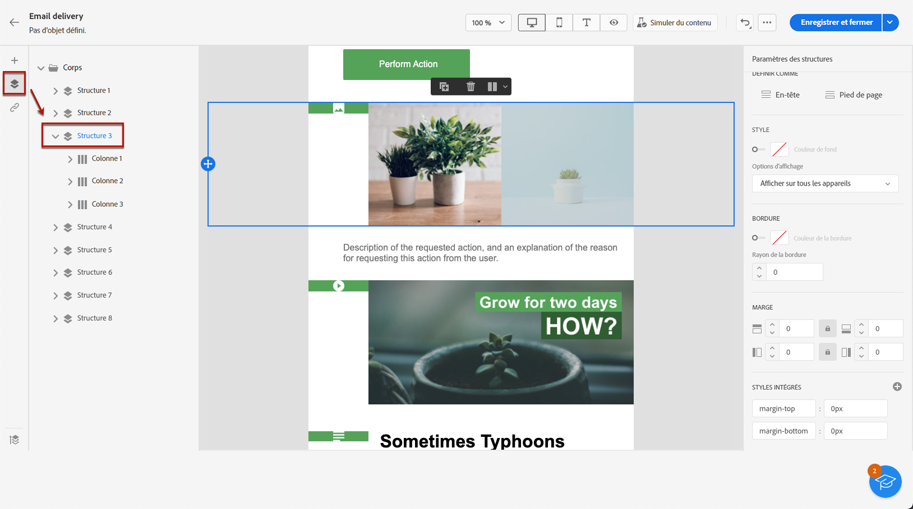
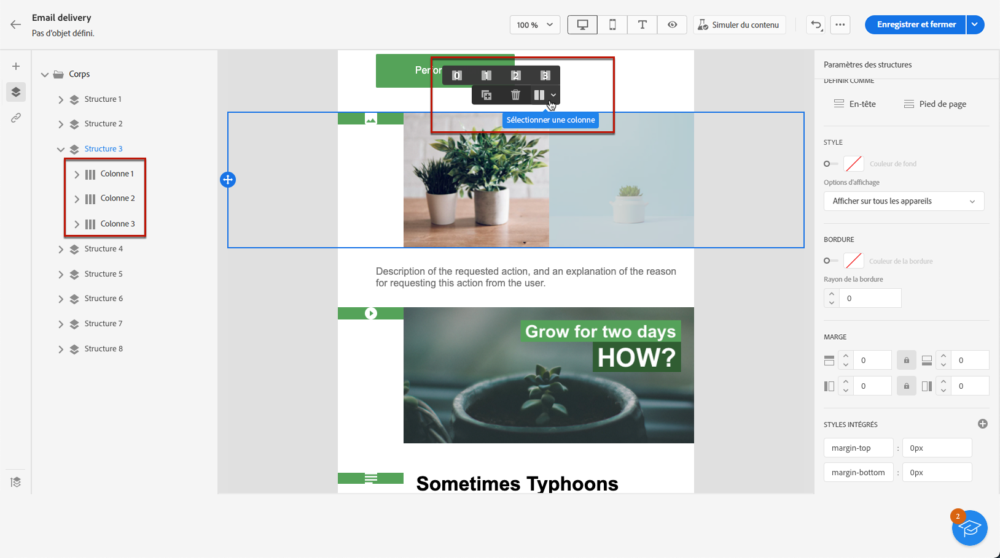
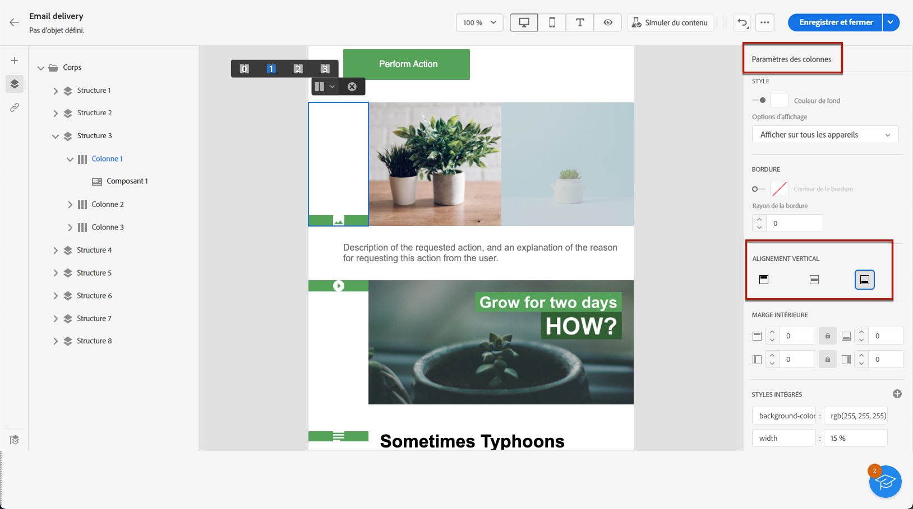
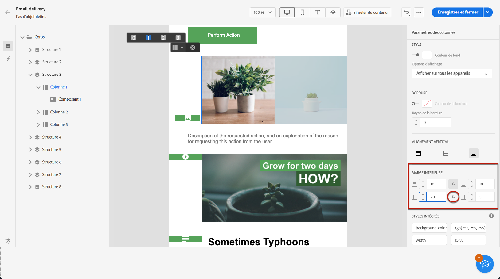

# Ajuster l’alignement vertical et la marge intérieure {#alignment-and-padding}

Dans cet exemple, nous ajusterons la marge intérieure et l’alignement vertical à l’intérieur d’un composant de structure composé de trois colonnes.

1. Sélectionnez le composant de structure directement dans l’e-mail ou à l’aide de l’**[!UICONTROL Arborescence de navigation]** disponible dans le volet de gauche.

   

1. Dans la barre d’outils contextuelle, cliquez sur **[!UICONTROL Sélectionner une colonne]** et choisissez celle à éditer. Vous pouvez également le sélectionner dans l’arborescence de structure à gauche.

   

1. Les paramètres modifiables pour cette colonne sont affichés dans le menu **[!UICONTROL Paramètres de colonne]** à droite. Ajustez l’**[!UICONTROL Alignement vertical]** à l’aide de la section dédiée.

   

   Par exemple, sélectionnez **[!UICONTROL Bas]**. Le composant de contenu se déplace en bas de la colonne.

1. Sous **[!UICONTROL Marge intérieure]**, définissez la marge intérieure supérieure à l’intérieur de la colonne, puis définissez la marge intérieure à gauche et à droite de cette colonne.

   >[!NOTE]
   >
   >Cliquez sur l’icône représentant un verrou pour interrompre la synchronisation entre la marge intérieure supérieure et inférieure ou droite et gauche.

   

1. Procédez de façon similaire pour ajuster l&#39;alignement et la marge intérieure des autres colonnes.

1. Enregistrez vos modifications.
