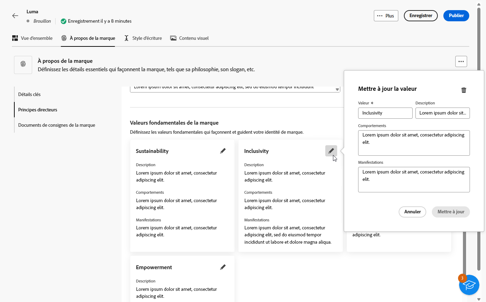
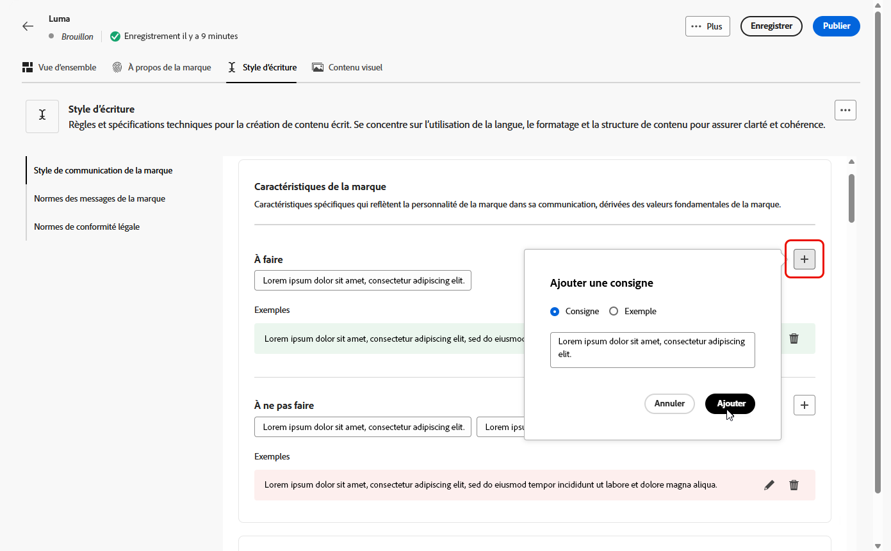

# Personnaliser votre marque {#brands-personalize}

Pour créer un kit de marque complet qui assure la cohérence de l’ensemble de votre contenu et de vos canaux, configurez les quatre onglets suivants, chacun se concentrant sur un aspect différent de l’identité de votre marque :

* **[!UICONTROL À propos de la marque]** établit l&#39;identité et les valeurs fondamentales de votre marque.
* Le **[!UICONTROL style d’écriture]** définit les normes de langue et de contenu.
* **[!UICONTROL Contenu visuel]** définit les directives relatives à l’imagerie et à la conception.
* **[!UICONTROL Colors]** gère le système de couleurs et l’utilisation de votre marque.

Une fois la configuration effectuée, vous pouvez utiliser vos directives de marque pour valider la qualité du contenu et l’alignement de la marque. [En savoir plus sur la validation de la qualité du contenu](brands-score.md#validate-quality)

## À propos de la marque {#about-brand}

Utilisez l’onglet **[!UICONTROL À propos de la marque]** pour établir l’identité principale de votre marque en décrivant son objectif, sa personnalité, son slogan et d’autres attributs déterminants.

1. Commencez par renseigner les informations fondamentales de votre marque dans la catégorie **[!UICONTROL Détails clés]** :

   * **[!UICONTROL Nom du kit de marque]** : saisissez le nom de votre kit de marque.

   * **[!UICONTROL Quand l’utiliser]** : spécifiez les scénarios ou les contextes dans lesquels ce kit de marque doit être appliqué.

   * **[!UICONTROL Nom de la marque]** : saisissez le nom officiel de la marque.

   * **[!UICONTROL Description de la marque]** : fournissez une vue d’ensemble de ce que représente cette marque.

   * **[!UICONTROL Slogan par défaut]** : ajoutez le slogan principal associé à la marque.

     

1. Dans la catégorie **[!UICONTROL Principes directeurs]**, précisez l’orientation et la philosophie de base de votre marque :

   * **[!UICONTROL Mission]** : détaillez l’objectif de votre marque.

   * **[!UICONTROL Vision]** : décrivez votre objectif à long terme ou l’état futur souhaité.

   * **[!UICONTROL Positionnement sur le marché]** : expliquez comment votre marque se positionne sur le marché.

   

1. Dans la catégorie **[!UICONTROL Valeurs de marque de base]**, cliquez sur l’icône  pour ajouter des valeurs de base de la marque et renseigner les détails :

   * **[!UICONTROL Valeur]** : attribuez un nom à une valeur de la marque de base.

   * **[!UICONTROL Description]** : expliquez ce que cette valeur signifie pour votre marque.

   * **[!UICONTROL Comportements]** : décrivez les actions ou attitudes qui reflètent cette valeur dans la pratique.

   * **[!UICONTROL Manifestations]** : donnez des exemples de la manière dont cette valeur est exprimée dans l’image de marque réelle.

     

1. Si nécessaire, cliquez sur l’icône  pour mettre à jour ou supprimer l’une des valeurs de votre marque de base.

   

Vous pouvez désormais personnaliser davantage votre marque ou [publier votre marque](#create-brand-kit).

## Style d’écriture {#writing-style}

La section **[!UICONTROL Style d’écriture]** décrit les normes d’écriture de contenu et explique en détail comment la langue, la mise en forme et la structure doivent être utilisées pour garantir la clarté, la cohérence et l’homogénéité entre tous les matériels.

+++ Catégorie disponible et exemples

<table>
  <thead>
    <tr>
      <th>Catégorie</th>
      <th>Sous-catégorie</th>
      <th>Exemple de directives</th>
      <th>Exemple d’exclusions</th>
    </tr>
  </thead>
  <tbody>
    <tr>
      <td rowspan="4">Normes de création de contenu</td>
      <td>Normes de messages de marque</td>
      <td>Mettez l’accent sur l’innovation et les messages axés sur le client ou la cliente.</td>
      <td>Ne faites pas de promesses au-delà des fonctionnalités du produit.</td>
    </tr>
    <tr>
      <td>Utilisation du slogan</td>
      <td>Placez le slogan sous le logo sur toutes les ressources de marketing numérique.</td>
      <td>Ne modifiez ou ne traduisez pas le slogan.</td>
    </tr>
    <tr>
      <td>Messages de base</td>
      <td>Insistez sur l’énoncé de l’avantage clé, comme l’amélioration de la productivité.</td>
      <td>Évitez d’utiliser des propositions de valeur sans rapport.</td>
    </tr>
    <tr>
      <td>Normes de dénomination</td>
      <td>Utilisez des noms simples et descriptifs tels que « ProScheduler ».</td>
      <td>N’utilisez ni termes complexes ni caractères spéciaux.</td>
    </tr>
    <tr>
      <td rowspan="5">Style de communication de la marque</td>
      <td>Caractéristiques de personnalité de la marque</td>
      <td>Conviviale et accessible.</td>
      <td>Ne soyez pas défaitiste.</td>
    </tr>
    <tr>
      <td>Mécanique d’écriture</td>
      <td>Faites en sorte que les phrases soient courtes et percutantes.</td>
      <td>N’utilisez pas trop de jargon.</td>
    </tr>
    <tr>
      <td>Ton en fonction de la situation</td>
      <td>Gardez un ton professionnel dans les communications de crise.</td>
      <td>Ne faites pas preuve de mépris dans les communications de support.</td>
    </tr>
    <tr>
      <td>Instructions relatives au choix des mots</td>
      <td>Utilisez des mots comme « innovant » et « intelligent ».</td>
      <td>Évitez les mots tels que « bon marché » ou « piratage ».</td>
    </tr>
    <tr>
      <td>Normes linguistiques</td>
      <td>Respectez les conventions de l’anglais américain.</td>
      <td>Ne mélangez pas les orthographes britannique et américaine.</td>
    </tr>
    <tr>
      <td rowspan="3">Normes de conformité légale</td>
      <td>Normes de marque commerciale</td>
      <td>Utilisez toujours le symbole ™ ou ®.</td>
      <td>N’omettez pas les symboles légaux lorsqu’ils sont nécessaires.</td>
    </tr>
    <tr>
      <td>Normes de copyright</td>
      <td>Incluez les avis de copyright sur les supports marketing.</td>
      <td>N’utilisez pas de contenu tiers sans autorisation.</td>
    </tr>
    <tr>
      <td>Normes de non-responsabilité</td>
      <td>Présentez clairement les clauses de non-responsabilité sur les ressources numériques.</td>
      <td>Ne dissimulez pas les clauses de non-responsabilité dans les zones non visibles.</td>
    </tr>
</table>

+++

 

Pour personnaliser votre **[!UICONTROL Style d’écriture]** :

1. Dans l’onglet **[!UICONTROL Style d’écriture]**, cliquez sur  pour ajouter une directive, une exception ou une exclusion.

1. Saisissez votre règle, votre exception ou votre exclusion. Vous pouvez également inclure des **[!UICONTROL exemples]** pour mieux illustrer la manière dont ces instructions doivent être appliquées.

   

1. Spécifiez le **[!UICONTROL contexte d’utilisation]** pour votre règle, votre exception ou votre exclusion :

   * **[!UICONTROL Type de canal]** : choisissez où cette règle, cette exception ou cette exclusion doit s’appliquer. Par exemple, vous pouvez souhaiter qu’un style d’écriture spécifique apparaisse uniquement dans les canaux E-mail, Mobile, Impression ou d’autres canaux de communication.

   * **[!UICONTROL Type d’élément]** : spécifiez à quel élément de contenu la règle s’applique. Il peut s’agir d’éléments tels que des titres, des boutons, des liens ou d’autres composants de votre contenu.

   

1. Une fois votre règle, votre exception ou votre exclusion configurée, cliquez sur **[!UICONTROL Ajouter]**.
1. Le cas échéant, sélectionnez l’une de vos règles ou exclusions pour la mettre à jour ou la supprimer.

1. Cliquez sur  pour modifier votre exemple ou sur l’icône  pour le supprimer.

   

Vous pouvez désormais personnaliser davantage votre marque ou [publier votre marque](#create-brand-kit).

## Contenu visuel {#visual-content}

La section **[!UICONTROL Contenu visuel]** définit les normes d’imagerie et de conception, en détaillant les spécifications nécessaires pour maintenir une apparence de marque unifiée et cohérente.

+++ Catégories disponibles et exemples

<table>
  <thead>
    <tr>
      <th>Catégorie</th>
      <th>Exemple de directives</th>
      <th>Exemple d’exclusions</th>
    </tr>
  </thead>
  <tbody>
    <tr>
      <td>Normes de photographie</td>
      <td>Utilisez un éclairage naturel pour les prises de vue en extérieur.</td>
      <td>Évitez les images trop retouchées ou pixellisées.</td>
    </tr>
    <tr>
      <td>Normes d’illustration</td>
      <td>Utilisez des styles épurés et minimalistes.</td>
      <td>Évitez les énoncés trop complexes.</td>
    </tr>
    <tr>
      <td>Normes des icônes</td>
      <td>Utilisez un système de grille de 24 pixels homogène.</td>
      <td>Ne mélangez pas différentes tailles d’icônes, n’utilisez pas d’épaisseurs de traits incohérentes et ne débordez pas du quadrillage.</td>
    </tr>
    <tr>
      <td>Instructions d’utilisation</td>
      <td>Choisissez des images de la vie de tous les jours qui reflètent des clientes et clients réels utilisant le produit dans des environnements professionnels.</td>
      <td>N’utilisez pas d’images en contradiction avec l’identité de la marque ou qui semblent hors sujet.</td>
    </tr>
</table>

+++

 

Pour personnaliser votre **[!UICONTROL contenu visuel]**, procédez comme suit :

1. Dans l’onglet **[!UICONTROL Contenu visuel]**, cliquez sur  pour ajouter une directive, une exclusion ou un exemple.

1. Saisissez votre règle, votre exclusion ou votre exemple.

   

1. Spécifiez le **[!UICONTROL contexte d’utilisation]** pour votre règle ou votre exclusion :

   * **[!UICONTROL Type de canal]** : choisissez où cette règle, cette exception ou cette exclusion doit s’appliquer. Par exemple, vous pouvez souhaiter qu’un style d’écriture spécifique apparaisse uniquement dans les canaux E-mail, Mobile, Impression ou d’autres canaux de communication.

   * **[!UICONTROL Type d’élément]** : spécifiez à quel élément de contenu la règle s’applique. Il peut s’agir d’éléments tels que des titres, des boutons, des liens ou d’autres composants de votre contenu.

     

1. Une fois votre règle, votre exception ou votre exclusion configurée, cliquez sur **[!UICONTROL Ajouter]**.

1. Pour ajouter une image présentant une utilisation correcte, sélectionnez **[!UICONTROL Exemple]** et cliquez sur **[!UICONTROL Sélectionner une image]**. Vous pouvez également ajouter une image montrant une utilisation incorrecte comme exemple d’exclusion.

   

1. Sélectionnez l’une de vos instructions ou exclusions à mettre à jour ou à supprimer.

1. Sélectionnez l’une de vos instructions ou exclusions pour la mettre à jour. Cliquez sur  pour la supprimer.

   

Vous pouvez désormais personnaliser davantage votre marque ou [publier votre marque](#create-brand-kit).

## Couleurs {#colors}

La section **[!UICONTROL Couleurs]** décrit les normes du système de couleurs de votre marque et décrit comment les couleurs sont sélectionnées, organisées et appliquées dans les expériences. Il garantit une utilisation cohérente des couleurs primaires, secondaires, d’accentuation et neutres afin de conserver une identité de marque cohérente, accessible et reconnaissable.

+++ Catégories disponibles et exemples

<table>
  <thead>
    <tr>
      <th>Catégorie</th>
      <th>Exemple de directives</th>
      <th>Exemple d’exclusions</th>
    </tr>
  </thead>
  <tbody>
    <tr>
      <td>Couleurs du Principal</td>
      <td>Utilisez les principales couleurs de la marque pour les logos, les en-têtes et les principaux éléments de call-to-action.</td>
      <td>Ne remplacez pas et ne modifiez pas les couleurs principales de la marque.</td>
    </tr>
    <tr>
      <td>Secondaire colors</td>
      <td>Utilisez des couleurs secondaires pour prendre en charge les mises en page, illustrations et composants de l’interface utilisateur.</td>
      <td>Ne laissez pas les couleurs secondaires remplacer les couleurs primaires de la marque.</td>
    </tr>
    <tr>
      <td>Couleurs d’accentuation</td>
      <td>Utilisez les couleurs d’accentuation avec parcimonie pour les boutons, les liens et les alertes.</td>
      <td>N’utilisez pas de couleurs d’accentuation pour les grandes zones d’arrière-plan.</td>
    </tr>
    <tr>
      <td>Couleurs neutres</td>
      <td>Utilisez des couleurs neutres pour le texte, les séparateurs, les bordures et les éléments d’IU subtils.</td>
      <td>Évitez d’utiliser des couleurs neutres avec un contraste faible ou des fondus de couleurs lourds.</td>
    </tr>
    <tr>
      <td>Couleurs de fond</td>
      <td>Utilisez des arrière-plans légers ou neutres pour garantir la lisibilité et la clarté visuelle.</td>
      <td>Ne placez pas de texte ou de logos sur des fonds peu contrastés.</td>
    </tr>
    <tr>
      <td>Couleurs supplémentaires</td>
      <td>Utilisez des couleurs supplémentaires uniquement pour la visualisation de données ou les campagnes approuvées.</td>
      <td>N’introduisez pas de couleurs non approuvées ou hors marque.</td>
    </tr>
    <tr>
      <td>Echelles de couleur</td>
      <td>Utilisez des teintes et des ombres approuvées pour les états de l’interface utilisateur tels que survoler, actif et désactivé.</td>
      <td>Ne créez pas de dégradés ou de dégradés non officiels.</td>
    </tr>
    <tr>
      <td>Instructions d’utilisation</td>
      <td>Conservez une utilisation cohérente des couleurs et un contraste accessible sur toutes les ressources.</td>
      <td>Ne mélangez pas les palettes en conflit et n’appliquez pas les couleurs de manière incohérente.</td>
    </tr>
</table>

+++

 

Pour personnaliser vos **[!UICONTROL couleurs]** :

1. Dans l’onglet **[!UICONTROL Couleurs]**, cliquez sur  pour ajouter une couleur, une ligne directrice ou une exclusion.

1. Saisissez vos informations de couleur pour les définir avec précision :

   * **Nom de la couleur** : indiquez un nom clair et descriptif pour identifier la couleur dans votre système de marque.

   * **Valeur de couleur** : choisissez votre couleur à l’aide du sélecteur de teinte ou saisissez des valeurs précises à l’aide du nom/code RGB, HEX ou Pantone pour assurer la cohérence entre les ressources numériques et d’impression.

   

1. Vérifiez votre sélection pour confirmer l’exactitude et la cohérence visuelle, puis cliquez sur **[!UICONTROL Ajouter]** pour enregistrer votre couleur.

1. Saisissez ensuite votre règle ou votre exclusion.

1. Spécifiez le contexte d’utilisation pour votre règle ou exclusion :

   * **[!UICONTROL Type de canal]** : choisissez où cette règle, cette exception ou cette exclusion doit s’appliquer. Par exemple, vous pouvez souhaiter qu’un style d’écriture spécifique apparaisse uniquement dans les canaux E-mail, Mobile, Impression ou d’autres canaux de communication.

   * **[!UICONTROL Type d’élément]** : spécifiez à quel élément de contenu la règle s’applique. Il peut s’agir d’éléments tels que des titres, des boutons, des liens ou d’autres composants de votre contenu.

     

1. Une fois votre règle, votre exception ou votre exclusion configurée, cliquez sur **[!UICONTROL Ajouter]**.

1. Le cas échéant, sélectionnez l’une de vos règles ou exclusions pour la mettre à jour ou la supprimer.

1. Sélectionnez l’une de vos instructions ou exclusions pour la mettre à jour. Cliquez sur  pour la supprimer.

   

1. Cliquez sur **[!UICONTROL Ajouter un groupe]** pour définir des couleurs supplémentaires pour votre marque ou pour ajouter un groupe d’échelle de couleurs.

Vous pouvez désormais personnaliser davantage votre marque ou [publier votre marque](brands.md#create-brand-kit).

