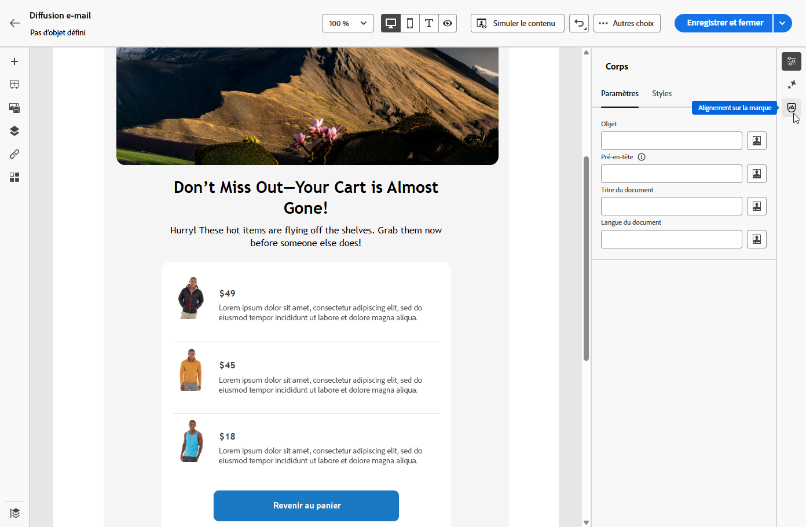
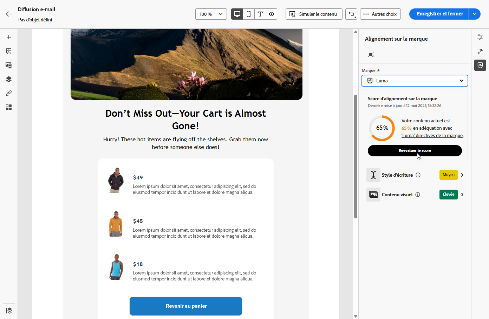
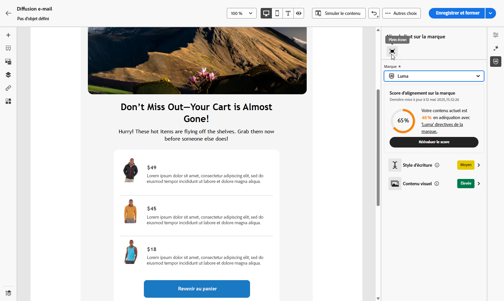
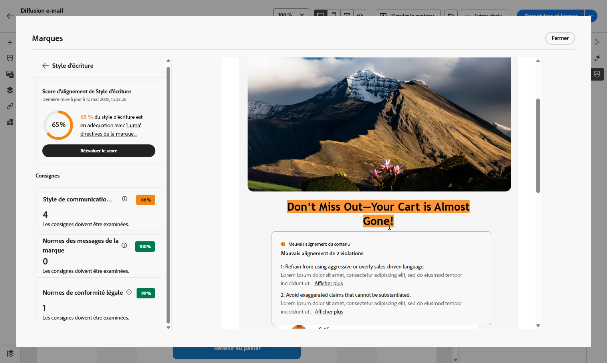

# Évaluation de votre contenu {#brands-score}

>[!AVAILABILITY]
>
>Vous devez accepter un [contrat d’utilisation](https://www.adobe.com/legal/licenses-terms/adobe-dx-gen-ai-user-guidelines.html){target="_blank"} avant de pouvoir utiliser l’assistant IA. Pour plus d’informations, contactez votre représentant ou représentante Adobe.

La fonction de révision du contenu fournit des outils d’évaluation complets permettant de mesurer la conformité de vos campagnes avec les directives de votre marque et de maintenir les normes de qualité du contenu dans toutes les communications :

* **Alignement des marques** : examinez et gérez le contenu qui respecte les directives de votre marque. Cela garantit la cohérence du ton, du message et de l’identité visuelle dans vos campagnes par e-mail.
* **Vérification de la qualité** : validez votre contenu avant sa mise en ligne pour maintenir des normes élevées et l’intégrité de la marque.

## Valider le contenu avec l’alignement sur la marque {#validate-content}

Une fois [votre marque configurée et publiée](brands.md), évaluez son score d’alignement sur la marque directement dans votre campagne par e-mail pour vous assurer que votre contenu est conforme à vos directives de marque :

1. Créez votre [campagne par e-mail](../email/create-email.md).

1. Ouvrez le menu **[!UICONTROL Alignement sur la marque]** dans le concepteur d’e-mail.

   Votre contenu sera automatiquement évalué par rapport à votre marque par défaut. [Découvrez comment attribuer une marque par défaut](brands.md).

   

1. Pour évaluer à l’aide d’une autre marque, sélectionnez-la dans le menu déroulant **[!UICONTROL Marque]** et cliquez sur **[!UICONTROL Réévaluer le score]**.

   

1. Parcourez le **Score d’alignement sur la marque** (Élevé, Moyen, Faible) et passez en revue les commentaires détaillés.

1. Cliquez sur l’icône  pour afficher plus d’informations sur votre score.

   

1. Sélectionnez une directive marquée pour afficher les commentaires et suggestions spécifiques.

   

1. Modifiez votre contenu en fonction des recommandations pour améliorer l’alignement sur la marque.

1. Réévaluez manuellement le contenu après avoir apporté des modifications pour actualiser votre score d’alignement.

## Valider la qualité du contenu {#validate-quality}

>[!NOTE]
>
>L’évaluation de la qualité du contenu est indépendante des directives de la marque. Même si une marque est sélectionnée dans le menu déroulant, ses directives ne sont pas appliquées au contrôle qualité. La sélection de la marque n’est pertinente que pour la notation de l’alignement de la marque.

Outre l’alignement de la marque, vous pouvez évaluer la qualité générale du contenu afin d’identifier les problèmes potentiels de lisibilité, de cohésion du contenu et d’efficacité, indépendamment des directives de votre marque.

Pour évaluer la qualité de votre contenu :

1. Créez votre [ diffusion e-mail ](../email/create-email.md).

1. Ouvrez le menu **[!UICONTROL Alignement des marques]** dans le Designer Email.

   

1. Cliquez sur **[!UICONTROL Évaluer le score]** pour générer des scores d’alignement de la marque et de qualité du contenu.

   

1. Accédez à l’onglet **[!UICONTROL Qualité globale]** pour consulter vos informations et recommandations sur la qualité du contenu.

   

1. Cliquez sur l’icône  pour obtenir une vue détaillée de votre score de qualité.

   

1. Sélectionnez un élément avec indicateur pour afficher des commentaires spécifiques et des suggestions d’amélioration exploitables. Les scores sont basés sur les catégories suivantes :

   * **[!UICONTROL Efficacité de CTA]** : évalue dans quelle mesure votre call-to-action motive les lecteurs à effectuer l’action souhaitée.
   * **[!UICONTROL Objet]** : évalue la clarté, la pertinence et la qualité pour attirer l’attention afin d’encourager les ouvertures d’e-mails.
   * **[!UICONTROL Lisibilité]** : mesure à quel point votre contenu est facile à comprendre et attrayant pour les lecteurs et lectrices.
   * **[!UICONTROL Vérification anti-spam]** : identifie les déclencheurs de spam courants susceptibles d&#39;avoir un impact sur la délivrabilité.
   * **[!UICONTROL Cohésion du contenu]** : garantit le bon déroulement de votre contenu et le respect des rubriques.
   * **[!UICONTROL Relecture]** : vérifie les problèmes d’orthographe, de grammaire et de clarté.

   

1. Modifiez votre contenu en fonction des recommandations afin d’améliorer la lisibilité, la cohésion du contenu et la qualité globale.

1. Cliquez sur **[!UICONTROL Réévaluer le score]** après avoir apporté des modifications pour actualiser votre score de qualité.
