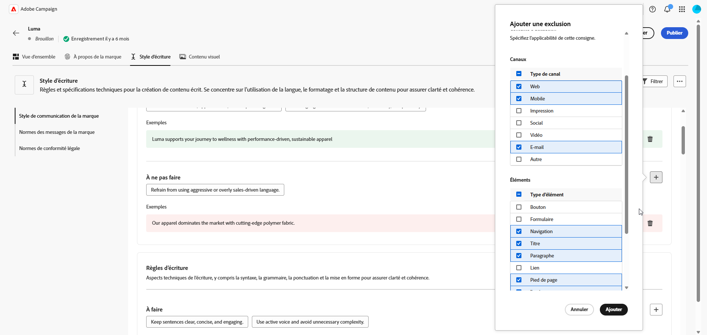
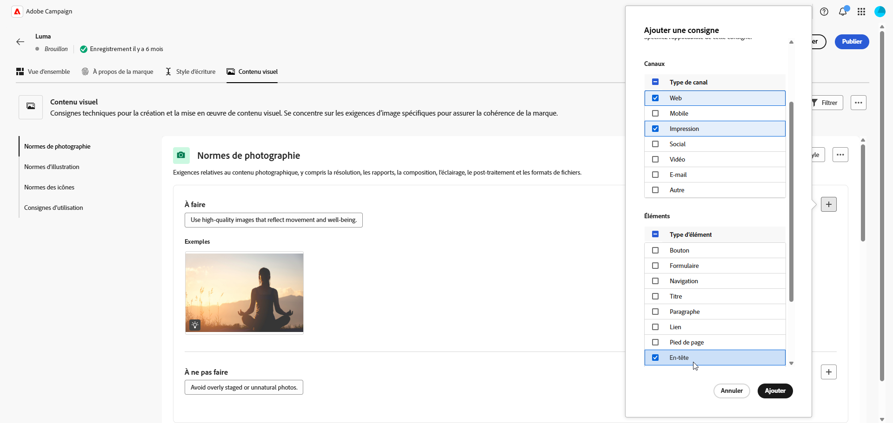

# Créer et gérer vos marques {#brands}

Les directives de marque sont un ensemble complet de règles et de normes qui définissent l’identité visuelle et verbale d’une marque. Elles servent de référence pour homogénéiser la représentation de la marque sur tous les canaux de marketing et de communication.

Dans [!DNL Adobe Campaign Web], les utilisateurs et utilisatrices peuvent saisir et organiser manuellement les informations de marque ou charger des documents de directives de marque pour une extraction de données automatique.

## Accéder aux marques {#generative-access}

Pour accéder au menu **[!UICONTROL Marques]** dans [!DNL Adobe Campaign Web], les utilisateurs et utilisatrices doivent disposer de profils de produit **[!UICONTROL Administration (admin)]** et **[!UICONTROL Kit de marque]** pour créer et gérer des marques. Pour un accès en lecture seule, les utilisateurs et utilisatrices ont besoin d’un profil de produit [!UICONTROL Assistant IA]. [En savoir plus](https://experienceleague.adobe.com/fr/docs/campaign/campaign-v8/admin/permissions/manage-permissions)

+++ Découvrir comment attribuer des autorisations liées à la marque

1. Accédez à votre produit Campaign sur la page d’accueil [Admin Console](https://adminconsole.adobe.com/enterprise).

   

1. Sélectionnez le **[!DNL Product profile]** en fonction du niveau d’autorisations que vous souhaitez accorder à la personne.

   

1. Cliquez sur **[!DNL Add users]** pour attribuer le profil de produit sélectionné.

   

1. Saisissez le nom de la personne, le groupe d’utilisateurs et d’utilisatrices ou l’adresse e-mail.

1. Cliquez sur **Enregistrer** pour appliquer les changements.

Les personnes déjà affectées à ce rôle voient leurs autorisations automatiquement mises à jour.

+++

## Créer votre marque {#create-brand-kit}

Pour créer et configurer vos directives de marque, suivez les étapes indiquées ci-dessous.

Les utilisateurs et utilisatrices peuvent saisir les détails manuellement ou charger un document de directives de marque pour extraire automatiquement les informations :

1. Dans le menu **[!UICONTROL Marques]**, cliquez sur **[!UICONTROL Créer une marque]**.

   

1. Saisissez le **[!UICONTROL nom]** de votre marque.

1. Effectuez un glisser-déposer ou sélectionnez votre fichier pour charger vos directives de marque et extraire automatiquement les informations pertinentes. Cliquez sur **[!UICONTROL Créer une marque]**.

   Le processus d’extraction des informations commence alors. Notez que cette opération peut prendre plusieurs minutes.

   

1. Vos normes de création visuelle et de contenu sont désormais automatiquement renseignées. Parcourez les différents onglets pour adapter les informations selon vos besoins. [En savoir plus](#personalize)

1. Dans le menu avancé de chaque section ou catégorie, vous pouvez ajouter des références pour extraire automatiquement les informations de marque pertinentes.

   Pour supprimer du contenu existant, utilisez les options **[!UICONTROL Effacer la section]** ou **[!UICONTROL Effacer la catégorie]**.

   

1. Une fois la configuration effectuée, cliquez sur **[!UICONTROL Enregistrer]**, puis sur **[!UICONTROL Publier]** pour mettre à disposition vos directives de marque dans l’assistant IA.

1. Pour apporter des modifications à votre marque publiée, cliquez sur **[!UICONTROL Modifier la marque]**.

   >[!NOTE]
   >
   >Cela crée une copie temporaire en mode d’édition, qui remplace la version active une fois publiée.

   

1. Dans le tableau de bord **[!UICONTROL Marques]**, ouvrez le menu avancé en cliquant sur l’icône  pour effectuer les actions suivantes :

   * Afficher la marque
   * Modifier
   * Marquer comme marque par défaut
   * Dupliquer
   * Publier
   * Dépublier
   * Supprimer

   

Vos directives de marque sont désormais accessibles à partir du menu déroulant **[!UICONTROL Marque]** dans le menu de l’assistant IA. Cela permet à l’assistant IA de générer du contenu et des ressources alignés sur vos spécifications. [En savoir plus sur l’assistant IA](../content/generative-gs.md)

### Définir une marque par défaut {#default-brand}

Vous pouvez désigner une marque par défaut à appliquer automatiquement lors de la génération du contenu et du calcul des scores d’alignement pendant la création de campagne.

Pour définir une marque par défaut, accédez au tableau de bord **[!UICONTROL Marques]**. Ouvrez le menu avancé en cliquant sur l’icône  et sélectionnez **[!UICONTROL Marquer comme marque par défaut]**.

## Personnaliser votre marque {#personalize}

### À propos de la marque {#about-brand}

Utilisez l’onglet **[!UICONTROL À propos de la marque]** pour établir l’identité principale de votre marque en décrivant son objectif, sa personnalité, son slogan et d’autres attributs déterminants.

1. Commencez par renseigner les informations fondamentales de votre marque dans la catégorie **[!UICONTROL Détails clés]** :

   * **[!UICONTROL Nom du kit de marque]** : saisissez le nom de votre kit de marque.

   * **[!UICONTROL Quand l’utiliser]** : spécifiez les scénarios ou les contextes dans lesquels ce kit de marque doit être appliqué.

   * **[!UICONTROL Nom de la marque]** : saisissez le nom officiel de la marque.

   * **[!UICONTROL Description de la marque]** : fournissez une vue d’ensemble de ce que représente cette marque.

   * **[!UICONTROL Slogan par défaut]** : ajoutez le slogan principal associé à la marque.

     

1. Dans la catégorie **[!UICONTROL Principes directeurs]**, précisez l’orientation et la philosophie de base de votre marque :

   * **[!UICONTROL Mission]** : détaillez l’objectif de votre marque.

   * **[!UICONTROL Vision]** : décrivez votre objectif à long terme ou l’état futur souhaité.

   * **[!UICONTROL Positionnement sur le marché]** : expliquez comment votre marque se positionne sur le marché.

   

1. Dans la catégorie **[!UICONTROL Valeurs de marque de base]**, cliquez sur l’icône  pour ajouter des valeurs de base de la marque et renseigner les détails :

   * **[!UICONTROL Valeur]** : attribuez un nom à une valeur de la marque de base.

   * **[!UICONTROL Description]** : expliquez ce que cette valeur signifie pour votre marque.

   * **[!UICONTROL Comportements]** : décrivez les actions ou attitudes qui reflètent cette valeur dans la pratique.

   * **[!UICONTROL Manifestations]** : donnez des exemples de la manière dont cette valeur est exprimée dans l’image de marque réelle.

     

1. Si nécessaire, cliquez sur l’icône  pour mettre à jour ou supprimer l’une des valeurs de votre marque de base.

   

Vous pouvez désormais personnaliser davantage votre marque ou [publier votre marque](#create-brand-kit).

### Style d’écriture {#writing-style}

La section **[!UICONTROL Style d’écriture]** décrit les normes d’écriture de contenu et explique en détail comment la langue, la mise en forme et la structure doivent être utilisées pour garantir la clarté, la cohérence et l’homogénéité entre tous les matériels.

+++ Catégorie disponible et exemples

<table>
  <thead>
    <tr>
      <th>Catégorie</th>
      <th>Sous-catégorie</th>
      <th>Exemple de directives</th>
      <th>Exemple d’exclusions</th>
    </tr>
  </thead>
  <tbody>
    <tr>
      <td rowspan="4">Normes de création de contenu</td>
      <td>Normes de messages de marque</td>
      <td>Mettez l’accent sur l’innovation et les messages axés sur le client ou la cliente.</td>
      <td>Ne faites pas de promesses au-delà des fonctionnalités du produit.</td>
    </tr>
    <tr>
      <td>Utilisation du slogan</td>
      <td>Placez le slogan sous le logo sur toutes les ressources de marketing numérique.</td>
      <td>Ne modifiez ou ne traduisez pas le slogan.</td>
    </tr>
    <tr>
      <td>Messages de base</td>
      <td>Insistez sur l’énoncé de l’avantage clé, comme l’amélioration de la productivité.</td>
      <td>Évitez d’utiliser des propositions de valeur sans rapport.</td>
    </tr>
    <tr>
      <td>Normes de dénomination</td>
      <td>Utilisez des noms simples et descriptifs tels que « ProScheduler ».</td>
      <td>N’utilisez ni termes complexes ni caractères spéciaux.</td>
    </tr>
    <tr>
      <td rowspan="5">Style de communication de la marque</td>
      <td>Caractéristiques de personnalité de la marque</td>
      <td>Conviviale et accessible.</td>
      <td>Ne soyez pas défaitiste.</td>
    </tr>
    <tr>
      <td>Mécanique d’écriture</td>
      <td>Faites en sorte que les phrases soient courtes et percutantes.</td>
      <td>N’utilisez pas trop de jargon.</td>
    </tr>
    <tr>
      <td>Ton en fonction de la situation</td>
      <td>Gardez un ton professionnel dans les communications de crise.</td>
      <td>Ne faites pas preuve de mépris dans les communications de support.</td>
    </tr>
    <tr>
      <td>Instructions relatives au choix des mots</td>
      <td>Utilisez des mots comme « innovant » et « intelligent ».</td>
      <td>Évitez les mots tels que « bon marché » ou « piratage ».</td>
    </tr>
    <tr>
      <td>Normes linguistiques</td>
      <td>Respectez les conventions de l’anglais américain.</td>
      <td>Ne mélangez pas les orthographes britannique et américaine.</td>
    </tr>
    <tr>
      <td rowspan="3">Normes de conformité légale</td>
      <td>Normes de marque commerciale</td>
      <td>Utilisez toujours le symbole ™ ou ®.</td>
      <td>N’omettez pas les symboles légaux lorsqu’ils sont nécessaires.</td>
    </tr>
    <tr>
      <td>Normes de copyright</td>
      <td>Incluez les avis de copyright sur les supports marketing.</td>
      <td>N’utilisez pas de contenu tiers sans autorisation.</td>
    </tr>
    <tr>
      <td>Normes de non-responsabilité</td>
      <td>Présentez clairement les clauses de non-responsabilité sur les ressources numériques.</td>
      <td>Ne dissimulez pas les clauses de non-responsabilité dans les zones non visibles.</td>
    </tr>
</table>

+++

 

Pour personnaliser votre **[!UICONTROL Style d’écriture]** :

1. Dans l’onglet **[!UICONTROL Style d’écriture]**, cliquez sur  pour ajouter une directive, une exception ou une exclusion.

1. Saisissez votre règle, votre exception ou votre exclusion. Vous pouvez également inclure des **[!UICONTROL exemples]** pour mieux illustrer la manière dont ces instructions doivent être appliquées.

   

1. Spécifiez le **[!UICONTROL contexte d’utilisation]** pour votre règle, votre exception ou votre exclusion :

   * **[!UICONTROL Type de canal]** : choisissez où cette règle, cette exception ou cette exclusion doit s’appliquer. Par exemple, vous pouvez souhaiter qu’un style d’écriture spécifique apparaisse uniquement dans les canaux E-mail, Mobile, Impression ou d’autres canaux de communication.

   * **[!UICONTROL Type d’élément]** : spécifiez à quel élément de contenu la règle s’applique. Il peut s’agir d’éléments tels que des titres, des boutons, des liens ou d’autres composants de votre contenu.

   

1. Une fois votre règle, votre exception ou votre exclusion configurée, cliquez sur **[!UICONTROL Ajouter]**.
1. Le cas échéant, sélectionnez l’une de vos règles ou exclusions pour la mettre à jour ou la supprimer.

1. Cliquez sur  pour modifier votre exemple ou sur l’icône  pour le supprimer.

   

Vous pouvez désormais personnaliser davantage votre marque ou [publier votre marque](#create-brand-kit).

### Contenu visuel {#visual-content}

La section **[!UICONTROL Contenu visuel]** définit les normes d’imagerie et de conception, en détaillant les spécifications nécessaires pour maintenir une apparence de marque unifiée et cohérente.

+++ Catégories disponibles et exemples

<table>
  <thead>
    <tr>
      <th>Catégorie</th>
      <th>Exemple de directives</th>
      <th>Exemple d’exclusions</th>
    </tr>
  </thead>
  <tbody>
    <tr>
      <td>Normes de photographie</td>
      <td>Utilisez un éclairage naturel pour les prises de vue en extérieur.</td>
      <td>Évitez les images trop retouchées ou pixellisées.</td>
    </tr>
    <tr>
      <td>Normes d’illustration</td>
      <td>Utilisez des styles épurés et minimalistes.</td>
      <td>Évitez les énoncés trop complexes.</td>
    </tr>
    <tr>
      <td>Normes des icônes</td>
      <td>Utilisez un système de grille de 24 pixels homogène.</td>
      <td>Ne mélangez pas différentes tailles d’icônes, n’utilisez pas d’épaisseurs de traits incohérentes et ne débordez pas du quadrillage.</td>
    </tr>
    <tr>
      <td>Instructions d’utilisation</td>
      <td>Choisissez des images de la vie de tous les jours qui reflètent des clientes et clients réels utilisant le produit dans des environnements professionnels.</td>
      <td>N’utilisez pas d’images en contradiction avec l’identité de la marque ou qui semblent hors sujet.</td>
    </tr>
</table>

+++

 

Pour personnaliser votre **[!UICONTROL contenu visuel]**, procédez comme suit :

1. Dans l’onglet **[!UICONTROL Contenu visuel]**, cliquez sur  pour ajouter une directive, une exclusion ou un exemple.

1. Saisissez votre règle, votre exclusion ou votre exemple.

   

1. Spécifiez le **[!UICONTROL contexte d’utilisation]** pour votre règle ou votre exclusion :

   * **[!UICONTROL Type de canal]** : choisissez où cette règle, cette exception ou cette exclusion doit s’appliquer. Par exemple, vous pouvez souhaiter qu’un style d’écriture spécifique apparaisse uniquement dans les canaux E-mail, Mobile, Impression ou d’autres canaux de communication.

   * **[!UICONTROL Type d’élément]** : spécifiez à quel élément de contenu la règle s’applique. Il peut s’agir d’éléments tels que des titres, des boutons, des liens ou d’autres composants de votre contenu.

     

1. Une fois votre règle, votre exception ou votre exclusion configurée, cliquez sur **[!UICONTROL Ajouter]**.

1. Pour ajouter une image présentant une utilisation correcte, sélectionnez **[!UICONTROL Exemple]** et cliquez sur **[!UICONTROL Sélectionner une image]**. Vous pouvez également ajouter une image montrant une utilisation incorrecte comme exemple d’exclusion.

   

1. Sélectionnez l’une de vos instructions ou exclusions à mettre à jour ou à supprimer.

1. Sélectionnez l’une de vos instructions ou exclusions pour la mettre à jour. Cliquez sur  pour la supprimer.

   

Vous pouvez désormais personnaliser davantage votre marque ou [publier votre marque](#create-brand-kit).
