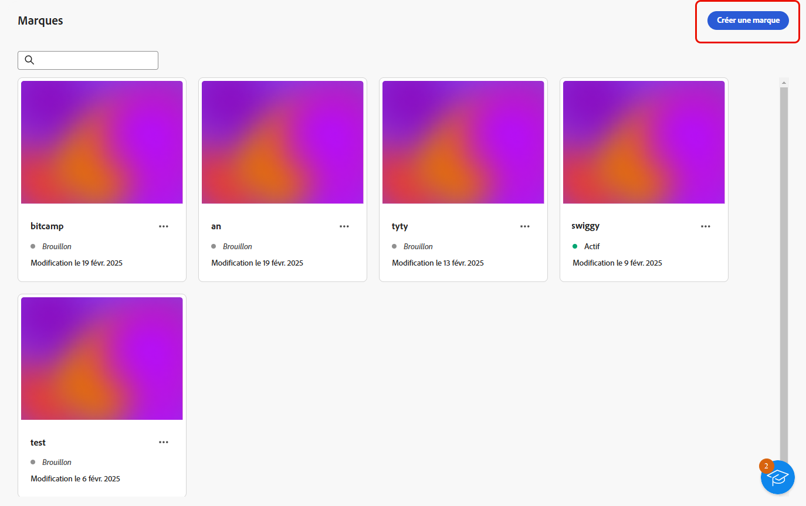
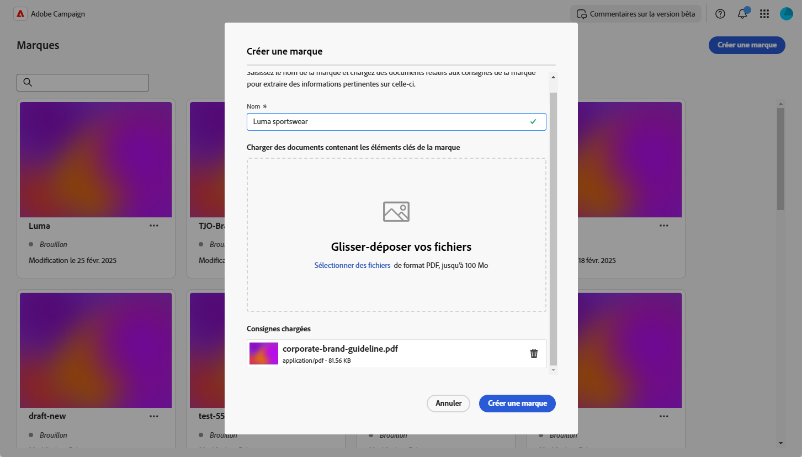
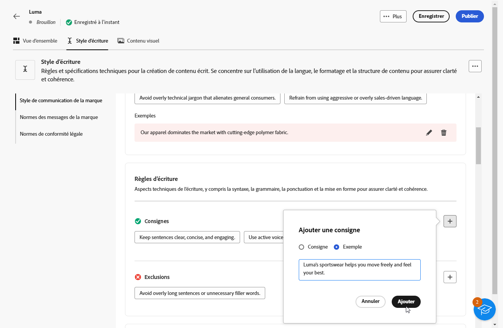
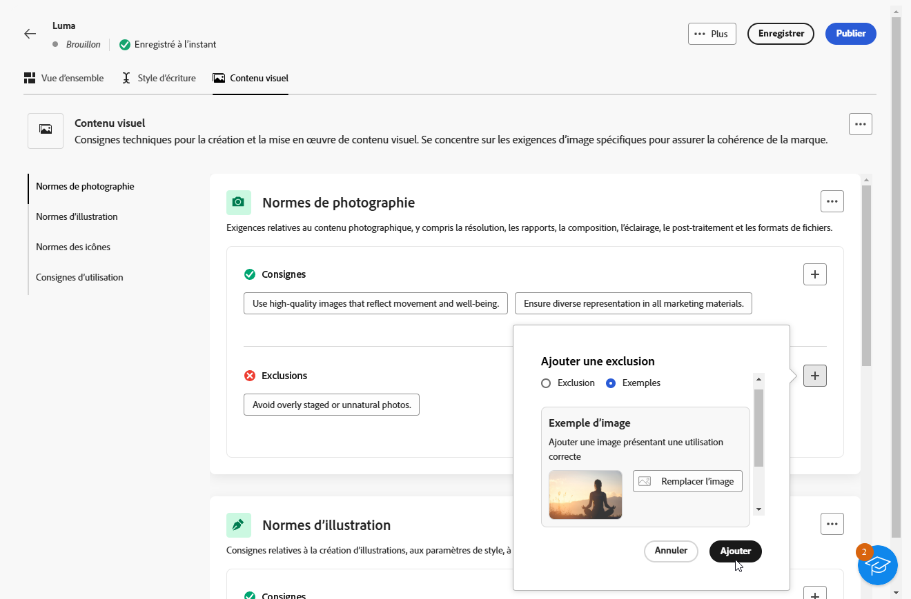
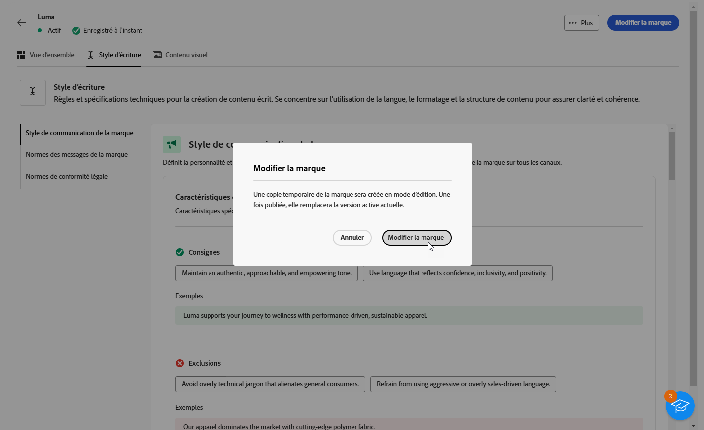
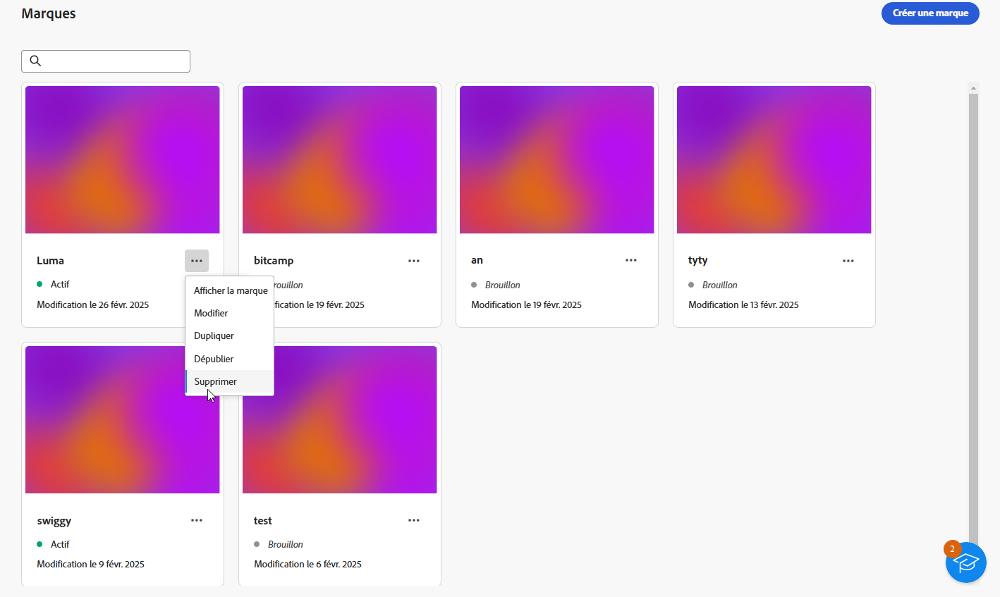

# Créer et gérer vos marques {#brands}

>[!AVAILABILITY]
>
>Cette fonctionnalité est publiée sous la forme d’une version Private Beta. Elle sera progressivement disponible pour l’ensemble des clientes et clients dans les prochaines versions.

Les directives de marque sont un ensemble complet de règles et de normes qui définissent l’identité visuelle et verbale d’une marque. Elles servent de référence pour homogénéiser la représentation de la marque sur tous les canaux de marketing et de communication.

Dans [!DNL Adobe Campaign Web], vous pouvez désormais saisir et organiser manuellement vos informations de marque ou charger des documents de directives de marque pour une extraction de données automatique.

## Accéder aux marques {#generative-access}

Pour accéder au menu **[!UICONTROL Marques]** dans [!DNL Adobe Campaign Web], il convient de disposer de profils de produit **[!UICONTROL Administration (admin)]** et **[!UICONTROL Kit de marque]** permettant de créer et de gérer des marques. Pour un accès en lecture seule, les utilisateurs et utilisatrices ont besoin d’un profil de produit [!UICONTROL Assistant IA].

[En savoir plus](https://experienceleague.adobe.com/fr/docs/campaign/campaign-v8/admin/permissions/manage-permissions)

+++  Découvrir comment attribuer des autorisations liées à la marque

1. Accédez à votre produit Campaign sur la page d’accueil [Admin Console](https://adminconsole.adobe.com/enterprise).

   

1. Sélectionnez le **[!DNL Product profile]** en fonction du niveau d’autorisations que vous souhaitez accorder à la personne.

   

1. Cliquez sur **[!DNL Add users]** pour attribuer le profil de produit sélectionné.

   

1. Saisissez le nom de la personne, le groupe d’utilisateurs et d’utilisatrices ou l’adresse e-mail.

1. Cliquez sur **Enregistrer** pour appliquer les changements.

Les autorisations de tous les utilisateurs et utilisatrices déjà affectés à ce rôle seront automatiquement mises à jour.

+++

## Créer votre marque {#create-brand-kit}

Pour créer et configurer vos directives de marque, suivez les étapes indiquées ci-dessous.

Pour créer et gérer vos directives de marque, vous pouvez saisir vous-même les détails ou charger votre document de directives de marque pour que les informations soient extraites automatiquement :

1. Dans le menu **[!UICONTROL Gestion de contenu]**, sélectionnez **[!UICONTROL Marques]**.

1. Dans le menu **[!UICONTROL Marques]**, cliquez sur **[!UICONTROL Créer une marque]**.

   

1. Saisissez le **[!UICONTROL nom]** de votre marque.

1. Effectuez un glisser-déposer ou sélectionnez votre fichier pour charger vos directives de marque et extraire automatiquement les informations pertinentes. Cliquez sur **[!UICONTROL Créer une marque]**.

   Le processus d’extraction des informations commence alors. Notez que cette opération peut prendre plusieurs minutes.

   

1. Vos normes de création visuelle et de contenu sont désormais automatiquement renseignées. Parcourez les différents onglets pour adapter les informations selon vos besoins.

1. Dans l’onglet **[!UICONTROL Style d’écriture]**, cliquez sur  pour ajouter une directive ou une exclusion, ainsi que des exemples.

   

1. Dans l’onglet **[!UICONTROL Contenu visuel]**, cliquez sur  pour ajouter une autre directive ou une autre exclusion.

1. Pour ajouter une image présentant une utilisation correcte, sélectionnez **[!UICONTROL Exemples]** et cliquez sur **[!UICONTROL Sélectionner une image]**. Vous pouvez également ajouter une image montrant une utilisation incorrecte comme exemple d’action à ne pas faire.

   

1. Une fois la configuration effectuée, cliquez sur **[!UICONTROL Enregistrer]**, puis sur **[!UICONTROL Publier]** pour mettre à disposition vos directives de marque dans l’assistant IA.

1. Pour apporter des modifications à votre marque publiée, cliquez sur **[!UICONTROL Modifier la marque]**.

   >[!NOTE]
   >
   >Cela crée une copie temporaire en mode d’édition, qui remplace la version active une fois publiée.

   

1. Dans le tableau de bord **[!UICONTROL Marques]**, ouvrez le menu avancé en cliquant sur l’icône  pour effectuer les actions suivantes :

   * Afficher la marque
   * Modifier
   * Dupliquer
   * Publier
   * Dépublier
   * Supprimer

   

Vos directives de marque sont désormais accessibles à partir de la liste déroulante **[!UICONTROL Marque]** dans le menu de l’assistant IA, ce qui permet de générer du contenu et des ressources conformes à vos spécifications. [En savoir plus sur l’assistant IA](../email/generative-gs.md)

