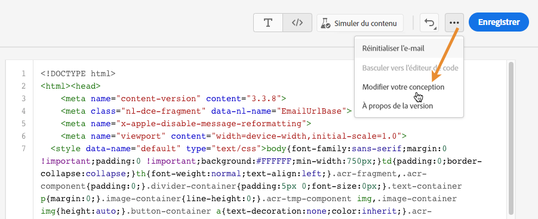
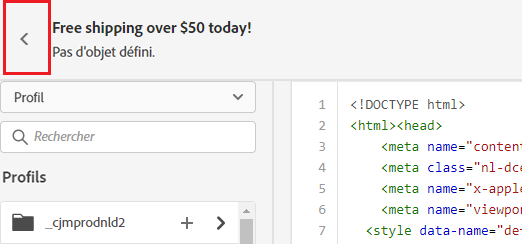

# Code votre propre contenu {#code-content}

>[!NOTE]
>
>Cette documentation est en cours de construction et fréquemment mise à jour. La version finale de ce contenu sera prête en janvier 2023.

Utilisez la variable **[!UICONTROL Codez vos propres]** pour importer du HTML brut et/ou coder le contenu de votre email. Cette méthode nécessite des compétences de HTML.

➡️ [Découvrez cette fonctionnalité en vidéo](#video)

>[!CAUTION]
>
> Les images de Adobe Experience Manager Assets Essentials ne peuvent pas être référencées lors de l’utilisation de cette méthode. Les images référencées dans votre code de HTML doivent être stockées dans un emplacement public.

1. Dans la page d&#39;accueil du Concepteur d&#39;email, sélectionnez **[!UICONTROL Codez vos propres]**.

   

1. Entrez ou collez votre code de HTML brut.

1. Utilisation du volet de gauche pour tirer parti [!DNL Journey Optimizer] fonctionnalités de personnalisation.

   

1. Si vous souhaitez ouvrir le Concepteur d&#39;email pour démarrer votre email à partir d&#39;une nouvelle conception, sélectionnez **[!UICONTROL Modifier votre conception]** dans le menu options.

   

1. Cliquez sur le bouton **[!UICONTROL Aperçu]** pour vérifier la conception et la personnalisation des messages à l’aide de profils de test.

   

1. Une fois que votre code est prêt, cliquez sur **[!UICONTROL Enregistrer]** revenez ensuite à l&#39;écran de création du message pour finaliser votre message.

   
