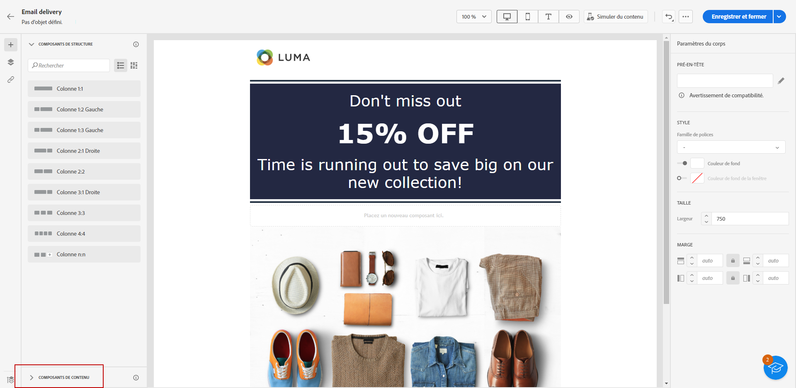

# Utiliser les composants de contenu du Concepteur d’email {#content-components}

>[!NOTE]
>
>Cette documentation est en cours d’élaboration et est fréquemment mise à jour. La version finale de ce contenu sera prête en janvier 2023.

>[!CONTEXTUALHELP]
>id="ac_content_components_email"
>title="À propos des composants de contenu"
>abstract="Les composants de contenu sont des espaces réservés de contenu vides que vous pouvez utiliser pour créer la disposition d’un email."

>[!CONTEXTUALHELP]
>id="ac_content_components_landing_page"
>title="À propos des composants de contenu"
>abstract="Les composants de contenu sont des espaces réservés de contenu vides que vous pouvez utiliser pour créer la disposition d’une page de destination."

>[!CONTEXTUALHELP]
>id="ac_content_components_fragment"
>title="À propos des composants de contenu"
>abstract="Les composants de contenu sont des espaces réservés de contenu vides que vous pouvez utiliser pour créer la disposition d’un fragment."

>[!CONTEXTUALHELP]
>id="ac_content_components_template"
>title="À propos des composants de contenu"
>abstract="Les composants de contenu sont des espaces réservés de contenu vides que vous pouvez utiliser pour créer la disposition d’un modèle."

## Ajouter des composants de contenu {#add-content-components}

Pour ajouter des composants de contenu à votre e-mail et les ajuster selon vos besoins, suivez les étapes ci-dessous.

1. Dans le Concepteur d’e-mail, utilisez un contenu existant ou faites glisser et déposez la section **[!UICONTROL Composants de structure]** dans votre contenu vide pour définir la disposition de votre e-mail. [Voici comment procéder](create-email-content.md).

1. Pour accéder à la section **[!UICONTROL Composants de contenu]**, sélectionnez le bouton correspondant dans le volet gauche du Concepteur d’e-mail.

   

1. Faites glisser et déposez les composants de contenu de votre choix dans les composants de structure appropriés.

   

   >[!NOTE]
   >
   >Vous pouvez ajouter plusieurs composants dans un seul composant de structure et dans chaque colonne d’un composant de structure.

1. Ajustez les attributs de style de chaque composant à l’aide du volet **[!UICONTROL Paramètres des composants]** sur la droite. Par exemple, vous pouvez changer le style de texte, la marge intérieure ou la marge de chaque composant. [En savoir plus sur l’alignement et la marge intérieure](alignment-and-padding.md).

   

Lorsque vous créez le contenu de votre e-mail en partant de zéro, la section **[!UICONTROL Composants de contenu]** vous permet de personnaliser davantage votre e-mail à l’aide des composants bruts que vous pouvez utiliser une fois placés dans un e-mail.
Vous pouvez ajouter autant de **[!UICONTROL composants de contenu]** que nécessaire dans un **[!UICONTROL composant de structure]**, ce qui permet de définir la disposition de votre e-mail.

## Conteneur {#container}

Vous pouvez ajouter un conteneur simple à l’intérieur duquel vous pourrez ajouter un autre composant de contenu. Vous pouvez ainsi appliquer un style spécifique au conteneur, qui sera différent du composant utilisé à l’intérieur.

Par exemple, ajoutez un composant **[!UICONTROL Conteneur]**, puis ajoutez un composant [Bouton](#button) à l’intérieur de ce conteneur. Vous pouvez utiliser un arrière-plan spécifique pour le conteneur et un autre pour le bouton.

## Bouton {#buttons}

Utilisez le composant **[!UICONTROL Bouton]** pour insérer un ou plusieurs boutons dans votre e-mail et rediriger votre audience d’e-mail vers une autre page.

1. À partir de **[!UICONTROL Composants de contenu]**, faites glisser et déposez le composant **[!UICONTROL Bouton]** dans un **[!UICONTROL composant de structure]**.

   

1. Cliquez sur votre bouton nouvellement ajouté pour personnaliser le texte et accéder aux **[!UICONTROL Paramètres des composants]** dans le volet droit du Concepteur d’e-mail.

   

1. Dans le champ **[!UICONTROL Lien]**, ajoutez l’URL vers laquelle vous souhaitez rediriger lors d’un clic sur le bouton.

1. Choisissez comment votre audience sera redirigée avec la liste déroulante **[!UICONTROL Cible]** :

   * **[!UICONTROL Aucune]** : ouvre le lien dans le même cadre que celui sur lequel l’utilisateur ou l’utilisatricea cliqué (par défaut).
   * **[!UICONTROL Vierge]** : ouvre le lien dans une nouvelle fenêtre ou un nouvel onglet.
   * **[!UICONTROL Auto]** : ouvre le lien dans le même cadre que celui sur lequel l’utilisateur ou l’utilisatrice a cliqué.
   * **[!UICONTROL Parent]** : ouvre le lien dans le cadre parent.
   * **[!UICONTROL Haut]** : ouvre le lien dans le corps complet de la fenêtre.

   

1. Vous pouvez personnaliser davantage votre bouton en modifiant les attributs de style, tels que la **[!UICONTROL bordure]**, la **[!UICONTROL taille]**, la **[!UICONTROL marge]**, etc. à partir du volet **[!UICONTROL Paramètres des composants]**.

## Texte {#text}

Utilisez le composant **[!UICONTROL Texte]** pour insérer du texte dans votre e-mail et ajuster le style (bordure, taille, marge intérieure, etc.) en utilisant le volet **[!UICONTROL Paramètres des composants]**.

1. À partir des **[!UICONTROL Composants de contenu]**, faites glisser et déposez **[!UICONTROL Texte]** dans un **[!UICONTROL composant de structure]**.

   

1. Cliquez sur votre composant nouvellement ajouté pour personnaliser le texte et accéder aux **[!UICONTROL Paramètres des composants]** dans le volet droit du Concepteur d’e-mail.

1. Modifiez votre texte avec les options suivantes disponibles dans la barre d’outils :

   

   * **[!UICONTROL Modifier le style de texte]** : appliquez le style gras, italique, souligné ou barré à votre texte.
   * **Modifier l’alignement** : sélectionnez l’alignement gauche, droite, centré ou justifié pour votre texte.
   * **[!UICONTROL Créer une liste]** : ajoutez une liste à puces ou à nombres à votre texte.
   * **[!UICONTROL Définir un titre]** : ajoutez jusqu’à six niveaux de titre à votre texte.
   * **Taille de police** : sélectionnez la taille de police de votre texte en pixels.
   * **[!UICONTROL Modifier l’image]** : ajoutez une image ou une ressource à votre composant de texte.
   * **[!UICONTROL Afficher le code source]** : affichez le code source de votre texte. Impossible d’effectuer une modification.
   * **[!UICONTROL Dupliquer]** : ajoutez une copie de votre composant de texte.
   * **[!UICONTROL Supprimer]** : supprimez le composant de texte sélectionné de votre e-mail.
   * **[!UICONTROL Ajouter une personnalisation]** : ajoutez des champs de personnalisation pour personnaliser le contenu des données de vos profils.
   * **[!UICONTROL Activer le contenu conditionnel]** : ajoutez du contenu conditionnel pour adapter le contenu du composant aux profils ciblés.

1. Ajustez les autres attributs de style tels que la couleur du texte, la famille de polices, la bordure, la marge intérieure, la marge, etc. à partir du volet **[!UICONTROL Paramètres des composants]**.

   

## Diviseur {#divider}

Utilisez le composant **[!UICONTROL Diviseur]** pour insérer une ligne de séparation afin d’organiser la disposition et le contenu de l’e-mail.

Vous pouvez ajuster les attributs de style, tels que la couleur de la ligne, le style et la hauteur, à partir du volet **[!UICONTROL Paramètres des composants]**.

## HTML {#HTML}

Utilisez le composant **[!UICONTROL HTML]** pour copier-coller les différentes parties de votre code HTML existant. Vous pouvez ainsi créer des composants HTML modulaires autonomes afin de réutiliser du contenu externe.

1. À partir des **[!UICONTROL Composants de contenu]**, faites glisser et déposez le composant **[!UICONTROL HTML]** dans un **[!UICONTROL composant de structure]**.

   

1. Cliquez sur le composant que vous venez d’ajouter, puis sélectionnez **[!UICONTROL Afficher le code source]** dans la barre d’outils contextuelle pour ajouter votre code HTML.

   

>[!NOTE]
>
>Pour rendre un contenu externe compatible avec le Concepteur d’e-mail, Adobe recommande de créer un message en partant de zéro et de copier le contenu de l’e-mail existant dans des composants.

## Image {#image}

Utilisez le composant **[!UICONTROL Image]** pour insérer un fichier image de votre ordinateur dans l’e-mail.

1. Dans **[!UICONTROL Composants de contenu]**, faites glisser et déposez **[!UICONTROL Image]** dans un **[!UICONTROL composant de structure]**.

   

1. Cliquez sur **[!UICONTROL Parcourir]** pour choisir un fichier image parmi vos ressources.

1. Cliquez sur le composant que vous venez d’ajouter et configurez les propriétés de l’image à l’aide du volet **[!UICONTROL Paramètres des composants]** :

   * **[!UICONTROL Titre de l’image]** permet de définir le titre de l’image.
   * **[!UICONTROL Texte alternatif]** permet de définir la légende associée à votre image. Cela correspond à l’attribut HTML alternatif.

   

1. Ajustez les autres attributs de style tels que la marge, la bordure, etc. ou en ajoutant un lien pour rediriger votre audience vers un autre contenu à partir du volet **[!UICONTROL Paramètres des composants]**.

## Vidéo {#Video}

>[!CONTEXTUALHELP]
>id="ac_edition_video_email"
>title="Paramètres vidéo"
>abstract="Utilisez ce composant pour insérer une vidéo dans votre email. Notez que les vidéos ne fonctionnent pas sur tous les clients de messagerie. Nous vous conseillons de définir une image de remplacement."

>[!CONTEXTUALHELP]
>id="ac_edition_video_landing_page"
>title="Paramètres vidéo"
>abstract="Utilisez ce composant pour insérer une vidéo sur votre page de destination. Notez que les vidéos ne fonctionnent pas sur tous les clients de messagerie. Nous vous conseillons de définir une image de remplacement."

>[!CONTEXTUALHELP]
>id="ac_edition_video_fragment"
>title="Paramètres vidéo"
>abstract="Utilisez ce composant pour insérer une vidéo dans votre fragment. Notez que les vidéos ne fonctionnent pas sur tous les clients de messagerie. Nous vous conseillons de définir une image de remplacement."

>[!CONTEXTUALHELP]
>id="ac_edition_video_template"
>title="Paramètres vidéo"
>abstract="Utilisez ce composant pour insérer une vidéo dans votre modèle. Notez que les vidéos ne fonctionnent pas sur tous les clients de messagerie. Nous vous conseillons de définir une image de remplacement."

Utilisez le composant **[!UICONTROL Vidéo]** pour insérer une vidéo dans votre e-mail via un lien URL.

1. Dans **[!UICONTROL Composants de contenu]**, faites glisser et déposez **[!UICONTROL Vidéo]** dans un **[!UICONTROL composant de structure]**.

   

1. Cliquez sur le composant que vous venez d’ajouter pour commencer à configurer les **[!UICONTROL Composants de contenu]** et avoir accès aux **[!UICONTROL Paramètres des composants]** dans le volet de droite du Concepteur d’e-mail.

1. Dans le champ **[!UICONTROL Lien de la vidéo]** des **[!UICONTROL Paramètres des composants]**, ajoutez l’URL de la vidéo.

   

1. Vous pouvez ajouter une **[!UICONTROL Image d’affichage]** à votre vidéo. Cette image apparaîtra jusqu’à ce que votre audience clique sur le bouton de lecture.

1. Ajustez les autres attributs de style tels que le style, la marge, la bordure, etc. à partir du volet **[!UICONTROL Paramètres des composants]**.

## Social {#social}

Utilisez le composant **[!UICONTROL Social]** pour insérer des liens vers des pages de réseaux sociaux dans le contenu de l’e-mail.

1. À partir des **[!UICONTROL Composants de contenu]**, faites glisser et déposer le composant **[!UICONTROL Social]** dans un composant **[!UICONTROL composant de structure]**.

1. Cliquez sur le composant que vous venez d’ajouter.

1. Dans le champ **[!UICONTROL Social]** du volet **[!UICONTROL Paramètres des composants]**, sélectionnez les médias sociaux à ajouter ou à supprimer.

   

1. Sélectionnez la taille des icônes dans le champ **[!UICONTROL Taille des images]**.

1. Cliquez sur chaque icône de réseau social pour configurer l’**[!UICONTROL URL]** vers laquelle votre audience sera redirigée.

   

1. Vous pouvez également modifier les icônes de chaque réseau social si nécessaire dans le champ **[!UICONTROL Image]**.

1. Ajustez les autres attributs de style tels que le style, la marge, la bordure, etc. à partir du volet **[!UICONTROL Paramètres des composants]**.

## Carrousel {#carousel-settings}

1. Placez le composant **[!UICONTROL Carrousel]** à l’intérieur d’un composant de structure.

1. Parcourez votre ordinateur pour sélectionner des images.

1. Dans le volet **[!UICONTROL Paramètres]**, définissez le nombre de miniatures souhaitées dans le carrousel.

1. Sélectionnez une image de remplacement à partir de votre ordinateur.

Le composant carrousel n’est pas compatible avec tous les programmes de messagerie. Chargez une image de remplacement pour l’afficher lorsque le carrousel n’est pas pris en charge dans un email.
