# Utiliser les contenus du concepteur d’e-mail {#content-components}

>[!CONTEXTUALHELP]
>id="ac_content_components_email"
>title="À propos des contenus"
>abstract="Les composants des contenus sont des espaces réservés de contenu vides que vous pouvez utiliser pour créer la disposition d’un e-mail."

>[!CONTEXTUALHELP]
>id="ac_content_components_landing_page"
>title="À propos des contenus"
>abstract="Les composants de contenu sont des espaces réservés de contenu vides que vous pouvez utiliser pour créer la disposition d’une page de destination."

>[!CONTEXTUALHELP]
>id="ac_content_components_fragment"
>title="À propos des contenus"
>abstract="Les composants de contenu sont des espaces réservés de contenu vides que vous pouvez utiliser pour créer la disposition d’un fragment."

>[!CONTEXTUALHELP]
>id="ac_content_components_template"
>title="À propos des contenus"
>abstract="Les composants de contenu sont des espaces réservés de contenu vides que vous pouvez utiliser pour créer la disposition d’un modèle."

Lorsque vous créez le contenu de votre e-mail, les composants de **[!UICONTROL contenu]** vous permettent de personnaliser davantage votre e-mail à l’aide des composants bruts et vides que vous pouvez utiliser une fois placés dans un e-mail.

Vous pouvez ajouter autant de **[!UICONTROL contenus]** que nécessaire dans une **[!UICONTROL structure]**, ce qui permet de définir la disposition de votre e-mail.

## Ajouter des composants de contenu {#add-content-components}

Pour ajouter des composants de contenu à votre e-mail et les ajuster selon vos besoins, suivez les étapes ci-dessous.

1. Dans le concepteur d’e-mail, utilisez un [contenu existant](existing-content.md) ou faites glisser et déposez une **[!UICONTROL structure]** dans votre contenu vide pour définir la disposition de votre e-mail. [Voici comment procéder](create-email-content.md).

1. Faites glisser et déposez le **[!UICONTROL contenu]** de votre choix dans les structures appropriées.

   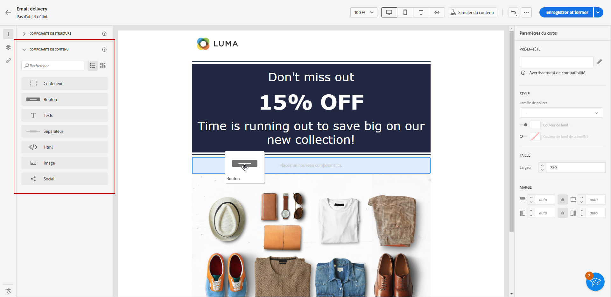

   >[!NOTE]
   >
   >Vous pouvez ajouter plusieurs composants dans une seule structure et dans chaque colonne d’une structure.

1. Ajustez les options de chaque composant en utilisant l’onglet **[!UICONTROL Paramètres]** contextuels. Par exemple, vous pouvez choisir de ne l’afficher que sur les ordinateurs de bureau ou les appareils mobiles, ou les deux. Vous pouvez également gérer les options de lien à partir de cet onglet. [En savoir plus sur la gestion des liens](message-tracking.md)

1. Ajustez les attributs de style de chaque composant à l’aide de l’onglet **[!UICONTROL Style]**. Par exemple, vous pouvez changer le style de texte, la marge intérieure ou la marge de chaque composant. [En savoir plus sur l’alignement et la marge intérieure](alignment-and-padding.md).

   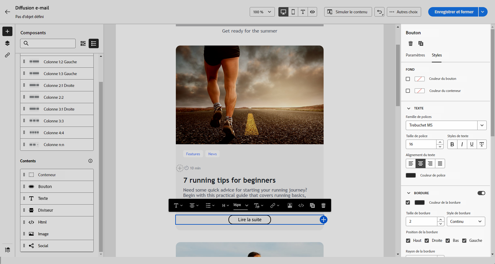

1. Dans le menu avancé de votre **[!UICONTROL Contenu]** dans le volet de droite, vous pouvez facilement supprimer ou dupliquer n’importe quel composant de contenu, si nécessaire.

## Conteneur {#container}

Vous pouvez ajouter un conteneur simple à l’intérieur duquel vous ajouterez un autre composant de contenu. Vous pouvez ainsi appliquer un style spécifique au conteneur, qui est différent du composant utilisé à l’intérieur.

Par exemple, ajoutez un composant **[!UICONTROL Conteneur]**, puis ajoutez un composant [Bouton](#button) à l’intérieur de ce conteneur. Vous pouvez utiliser un arrière-plan spécifique pour le conteneur et un autre pour le bouton.

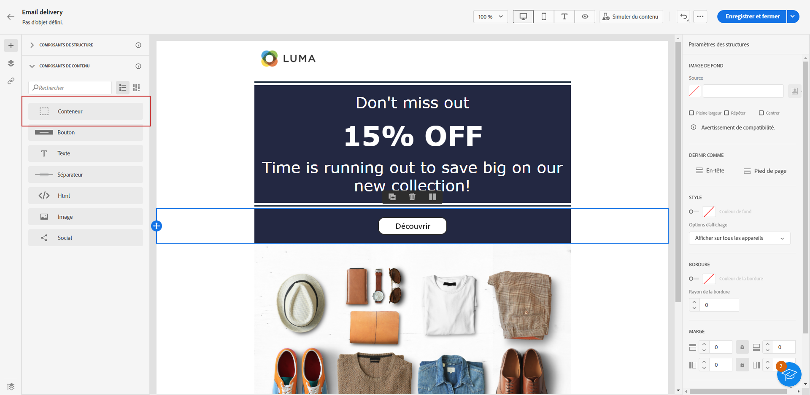

## Bouton {#buttons}

Utilisez le composant **[!UICONTROL Bouton]** pour insérer un ou plusieurs boutons dans votre e-mail et rediriger votre audience d’e-mail vers une autre page.

1. À partir de la liste **[!UICONTROL Contenu]**, faites glisser et déposez le composant de **[!UICONTROL bouton]** dans un composant de **[!UICONTROL structure]**.

   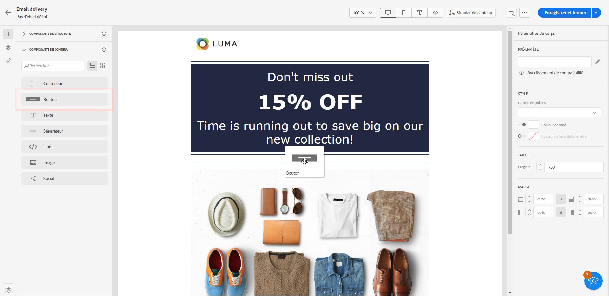

1. Cliquez sur le bouton que vous venez d’ajouter pour personnaliser le texte et accéder aux onglets **[!UICONTROL Paramètres]** et **[!UICONTROL Styles]**.

   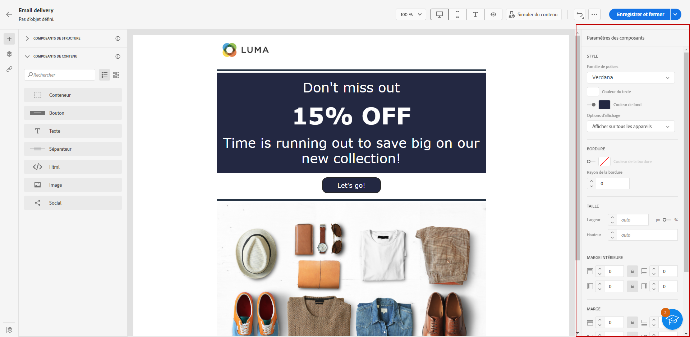

1. Depuis l’onglet **[!UICONTROL Paramètres]**, dans le champ **[!UICONTROL URL]**, ajoutez l’URL vers laquelle vous souhaitez rediriger lors d’un clic sur le bouton.

1. Sélectionnez l’affichage du contenu avec la liste déroulante **[!UICONTROL Cible]** :

   * **[!UICONTROL Aucune]** : ouvre le lien dans le même cadre que celui sur lequel l’utilisateur ou l’utilisatricea cliqué (par défaut).
   * **[!UICONTROL Vierge]** : ouvre le lien dans une nouvelle fenêtre ou un nouvel onglet.
   * **[!UICONTROL Auto]** : ouvre le lien dans le même cadre que celui sur lequel l’utilisateur ou l’utilisatrice a cliqué.
   * **[!UICONTROL Parent]** : ouvre le lien dans le cadre parent.
   * **[!UICONTROL Haut]** : ouvre le lien dans le corps complet de la fenêtre.

   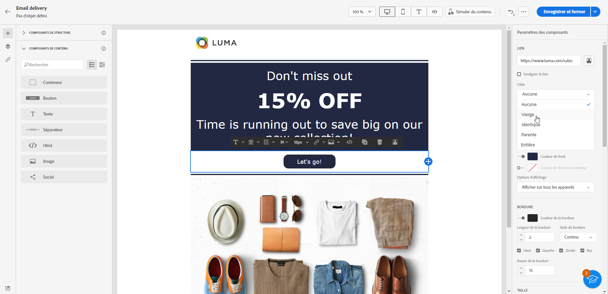

1. Vous pouvez personnaliser davantage votre bouton en modifiant les attributs de style, tels que la **[!UICONTROL bordure]**, la **[!UICONTROL taille]**, la **[!UICONTROL marge]**, etc. depuis l’onglet **[!UICONTROL Styles]**.

## Texte {#text}

Utilisez le composant **[!UICONTROL Texte]** pour insérer du texte dans votre e-mail et ajuster le style (bordure, taille, marge intérieure, etc.) en utilisant les onglets **[!UICONTROL Paramètres]** et **[!UICONTROL Styles]**.

1. Dans le menu **[!UICONTROL Contenu]**, faites glisser et déposez du **[!UICONTROL texte]** dans un composant de **[!UICONTROL structure]**.

   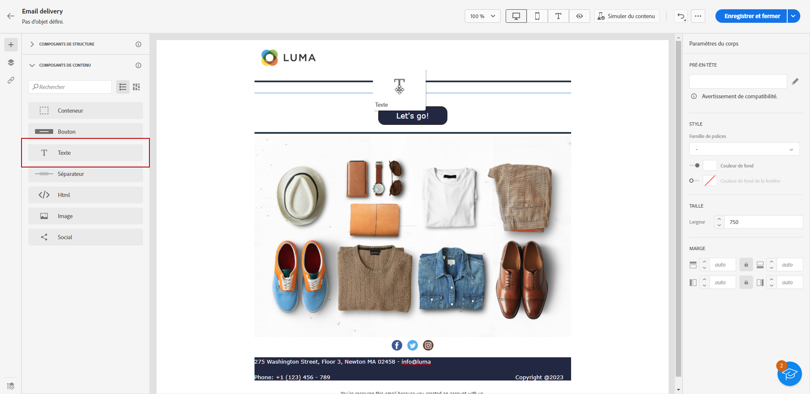

1. Cliquez sur le composant que vous venez d’ajouter pour personnaliser le texte et accéder aux onglets **[!UICONTROL Paramètres]** et **[!UICONTROL Styles]**.

1. Modifiez votre texte avec les options suivantes disponibles dans la barre d’outils contextuelle :

   

   * **[!UICONTROL Modifier le style de texte]** : appliquez le style gras, italique, souligné ou barré à votre texte.
   * **Modifier l’alignement** : sélectionnez l’alignement gauche, droite, centré ou justifié pour votre texte.
   * **[!UICONTROL Créer une liste]** : ajoutez une liste à puces ou à nombres à votre texte.
   * **[!UICONTROL Définir un titre]** : ajoutez jusqu’à six niveaux de titre à votre texte.
   * **Taille de police** : sélectionnez la taille de police de votre texte en pixels.
   * **[!UICONTROL Modifier l’image]** : ajoutez une image ou une ressource à votre composant de texte.
   * **[!UICONTROL Afficher le code source]** : affichez le code source de votre texte. Impossible d’effectuer une modification.
   * **[!UICONTROL Dupliquer]** : ajoutez une copie de votre composant de texte.
   * **[!UICONTROL Supprimer]** : supprimez le composant de texte sélectionné de votre e-mail.
   * **[!UICONTROL Ajouter une personnalisation]** : ajoutez des champs de personnalisation pour personnaliser le contenu des données de vos profils.
   * **[!UICONTROL Activer le contenu conditionnel]** : ajoutez du contenu conditionnel pour adapter le contenu du composant aux profils ciblés.

1. Ajustez les autres attributs de style tels que la couleur du texte, la famille de polices, la bordure, la marge intérieure, la marge, etc. depuis l’onglet **[!UICONTROL Styles]**.

   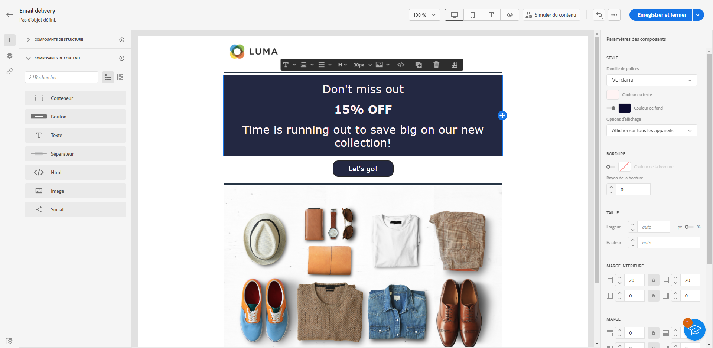

## Diviseur {#divider}

Utilisez le composant **[!UICONTROL Diviseur]** pour insérer une ligne de séparation afin d’organiser la disposition et le contenu de l’e-mail.

Vous pouvez ajuster les attributs de style, tels que le style, la hauteur et la couleurs des lignes depuis l’onglet **[!UICONTROL Styles]**.

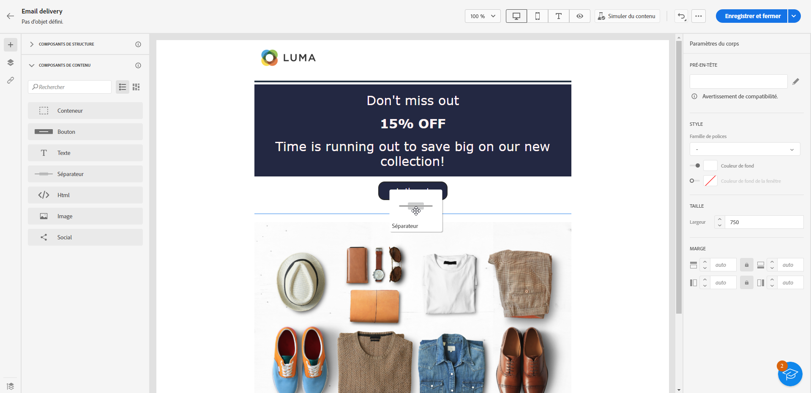

## HTML {#HTML}

Utilisez le composant **[!UICONTROL HTML]** pour copier-coller les différentes parties de votre code HTML existant. Vous pouvez ainsi créer des composants HTML modulaires autonomes afin de réutiliser du contenu externe.

1. À partir des **[!UICONTROL Composants]**, faites glisser et déposez le composant **[!UICONTROL HTML]** dans une **[!UICONTROL structure]**.

   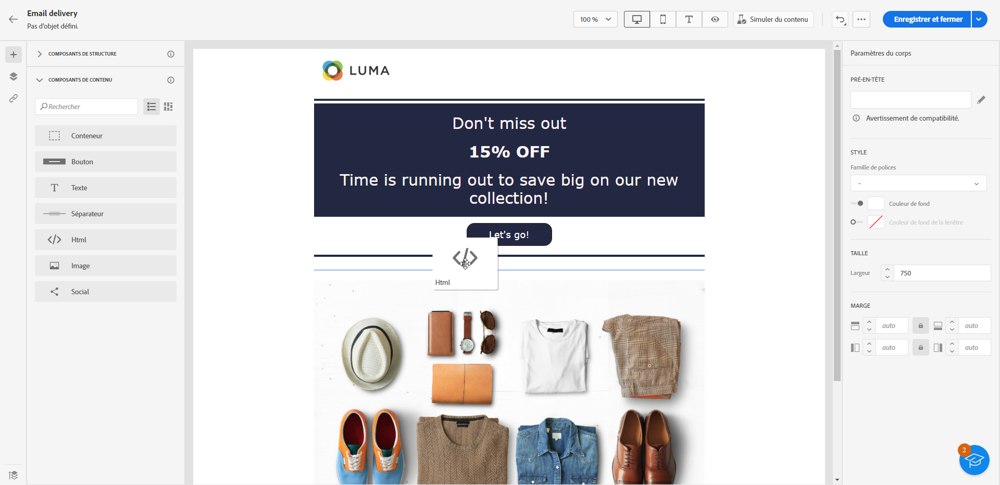

1. Cliquez sur le composant que vous venez d’ajouter, puis sélectionnez **[!UICONTROL Afficher le code source]** dans la barre d’outils contextuelle pour ajouter votre code HTML.

   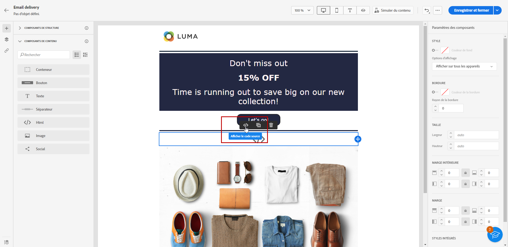

>[!NOTE]
>
>Pour rendre un contenu externe compatible avec le concepteur d’e-mail, Adobe recommande de [créer un message en partant de zéro](create-email-content.md) et de copier le contenu de l’e-mail existant dans des composants.

## Image {#image}

Utilisez le composant **[!UICONTROL Image]** pour insérer un fichier image de votre ordinateur dans l’e-mail.

1. Dans le menu **[!UICONTROL Contenu]**, faites glisser et déposez **[!UICONTROL Image]** dans un composant de **[!UICONTROL structure]**.

   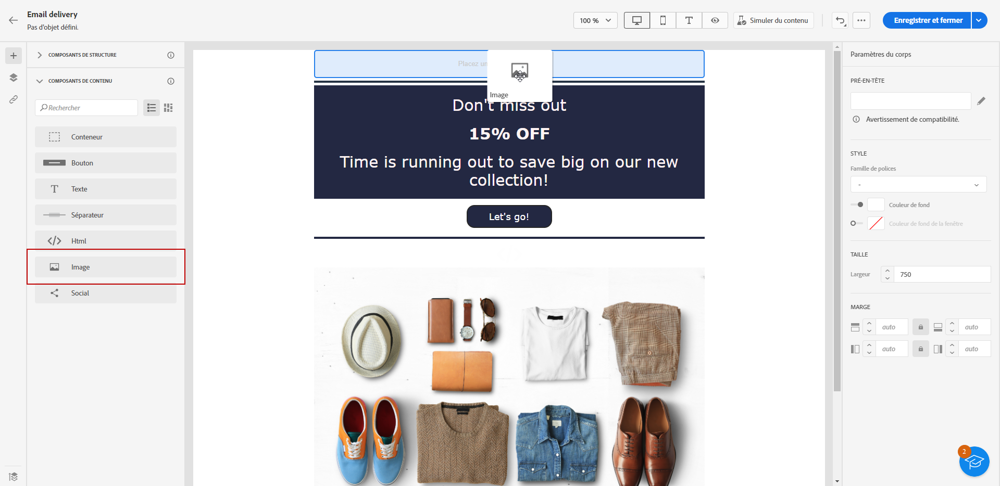

1. Cliquez sur **[!UICONTROL Parcourir]** pour choisir un fichier image parmi vos ressources. Vous pouvez également choisir d’**[!UICONTROL importer votre contenu multimédia]**.

   Pour en savoir plus sur le chargement et l’ajout de ressources dans Adobe Experience Manager, reportez-vous à la [Documentation d’Adobe Experience Manager as a Cloud Service](https://experienceleague.adobe.com/docs/experience-manager-cloud-service/content/assets/manage/add-assets.html?lang=fr).

   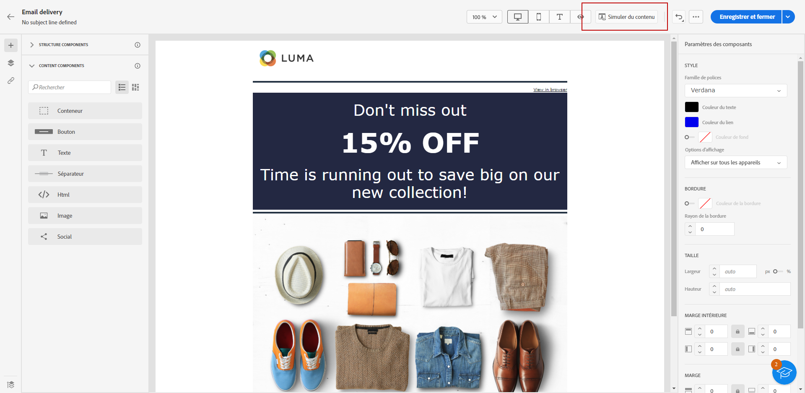

1. Parcourez vos dossiers pour localiser la ressource spécifique dont vous avez besoin ou utilisez la barre de recherche pour la chercher efficacement.

   Une fois que vous avez trouvé la ressource recherchée, cliquez sur **[!UICONTROL Sélectionner]**.

   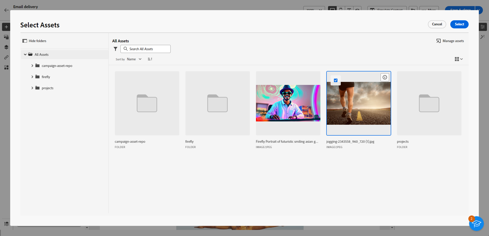

1. Cliquez sur le composant que vous venez d’ajouter et configurez les propriétés de l’image à l’aide de l’onglet **[!UICONTROL Paramètres]** :

   * **[!UICONTROL Titre de l’image]** permet de définir le titre de l’image.
   * **[!UICONTROL Texte alternatif]** permet de définir la légende associée à votre image. Cela correspond à l’attribut HTML alternatif.

   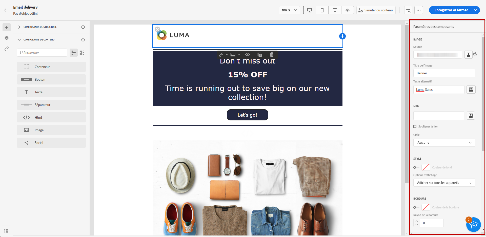

1. Vous pouvez ajouter un lien pour rediriger votre audience vers un autre contenu. [En savoir plus](message-tracking.md)

1. Ajustez les autres attributs de style tels que la marge, la bordure, etc. en utilisant l’onglet **[!UICONTROL Styles]**.

## Social {#social}

Utilisez le composant **[!UICONTROL Social]** pour insérer des liens vers des pages de réseaux sociaux dans le contenu de l’e-mail.

1. À partir du menu **[!UICONTROL Composants]**, faites glisser et déposez le composant **[!UICONTROL Social]** dans un composant de **[!UICONTROL structure]**.

1. Cliquez sur le composant que vous venez d’ajouter.

1. Dans le champ **[!UICONTROL Social]** de l’onglet **[!UICONTROL Paramètres]**, sélectionnez les médias sociaux à ajouter ou à supprimer.

   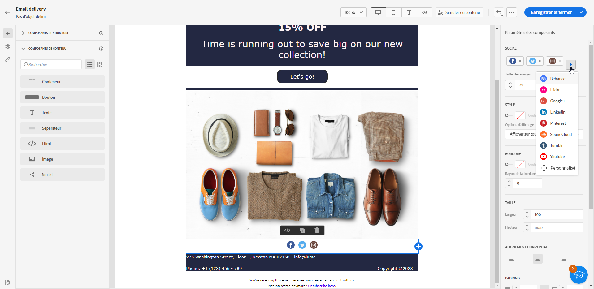

1. Sélectionnez la taille des icônes dans le champ **[!UICONTROL Taille des images]**.

1. Cliquez sur chaque icône de réseau social pour configurer l’**[!UICONTROL URL]** vers laquelle votre audience est redirigée.

   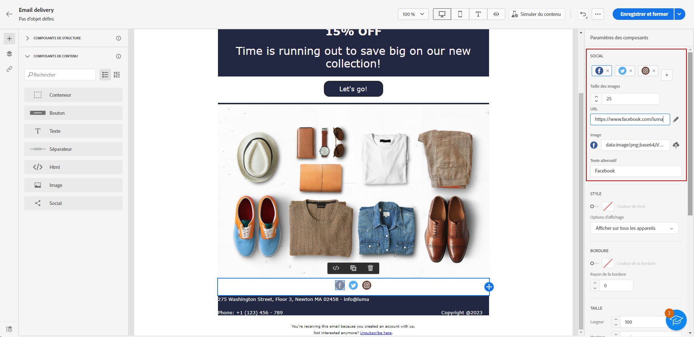

1. Vous pouvez également modifier les icônes de chaque média social si nécessaire dans le champ **[!UICONTROL Source]**.

1. Ajustez les autres attributs de style tels que le style, la marge, la bordure, etc. depuis l’onglet **[!UICONTROL Styles]**.
