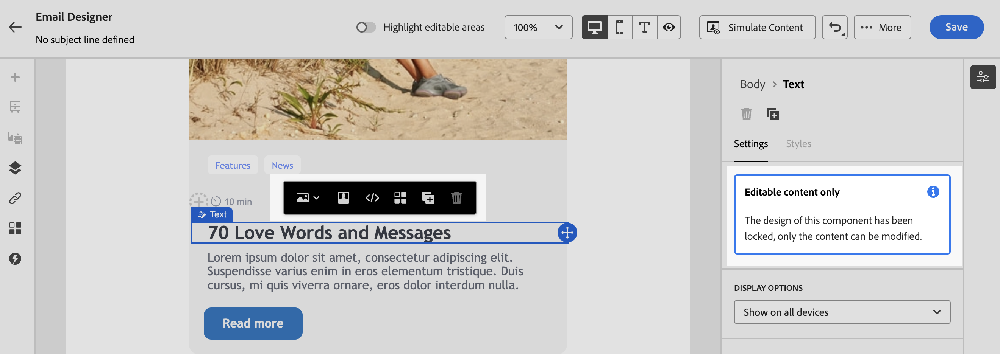

# Verrouillage de contenu dans les modèles d’e-mails {#lock-content-email-templates}

>[!CONTEXTUALHELP]
>id="ajo_locking_governance"
>title="Gouvernance"
>abstract="Activez la gouvernance pour verrouiller le contenu dans le modèle, en verrouillant soit l’ensemble du modèle, soit des structures et composants spécifiques. Cela vous permet d’éviter les modifications ou suppressions involontaires, de mieux contrôler la personnalisation des modèles et d’améliorer l’efficacité et la fiabilité de vos campagnes par e-mail."

>[!CONTEXTUALHELP]
>id="ajo_locking_mode"
>title="Mode"
>abstract="Sélectionnez le mode de verrouillage souhaité pour le modèle. Le **Verrouillage du contenu** vous permet de verrouiller des sections spécifiques de contenu dans le modèle. La **Lecture seule** vous permet de verrouiller l’intégralité du contenu du modèle, empêchant toute modification."

>[!CONTEXTUALHELP]
>id="ajo_locking_content_addition"
>title="Activer l’ajout de contenu"
>abstract="Activez cette option pour définir plus précisément comment les personnes peuvent interagir avec le modèle. Sélectionnez **Autoriser l’ajout de structures et de contenu** pour permettre aux utilisateurs et aux utilisatrices d’insérer de nouvelles structures entre celles déjà en place et d’ajouter des composants ou fragments de contenu dans les structures modifiables. **Autoriser l’ajout de contenu uniquement** permet aux utilisateurs et aux utilisatrices d’ajouter des composants ou fragments de contenu dans des structures modifiables, sans possibilité d’ajouter ou de dupliquer des structures."

>[!CONTEXTUALHELP]
>id="ajo_email_locking_activated"
>title="Gouvernance activée"
>abstract="Le verrouillage de contenu est activé et empêche les modifications."

>[!CONTEXTUALHELP]
>id="ajo_email_locking_read_only"
>title="Lecture seule"
>abstract="Ce contenu est en lecture seule et ne peut pas être modifié."

Adobe Campaign vous permet de verrouiller le contenu de modèles d’e-mail en verrouillant le modèle entier ou des structures et composants spécifiques. Vous pouvez ainsi éviter les modifications ou suppressions involontaires, ce qui vous permet de mieux contrôler la personnalisation des modèles et d’améliorer l’efficacité et la fiabilité de vos campagnes par e-mail.
<!--
>[!IMPORTANT]
>
>Content locking is an editor-level feature for authors and does not guarantee the content will remain unedited when imported or created through API.-->

Le verrouillage de contenu peut être appliqué au niveau **structure** ou au niveau **composant**. Vous trouverez ci-dessous les principes principaux qui s’appliquent au niveau de la structure et du composant lors du verrouillage de contenu dans votre modèle :

* Lorsqu’une structure est verrouillée :

   * Tout le contenu de cette structure est également verrouillé par défaut.
   * Aucun contenu ne peut être ajouté à la structure.
   * Par défaut, vous ne pouvez pas supprimer la structure. Vous pouvez contourner cette restriction en activant l’option « Autoriser la suppression ».
   * Les composants de contenu individuels de la structure verrouillée peuvent être définis comme modifiables.

* Lorsqu’une structure est modifiable (structure non verrouillée) :

   * Des composants de contenu individuels peuvent être verrouillés dans cette structure.
   * Par défaut, vous ne pouvez pas supprimer un composant s’il est verrouillé ou si l’option « Verrouillage de contenu modifiable uniquement » est sélectionnée. Vous pouvez contourner cette restriction en activant l’option « Autoriser la suppression ».

>[!AVAILABILITY]
>
>Les utilisateurs autorisés à créer des modèles de contenu peuvent activer le verrouillage de contenu.

<!--
➡️ [Discover this feature in video](#video)-->

## Verrouiller un modèle d’e-mail {#define}

### Activer le verrouillage de contenu {#enable}

Vous pouvez activer le verrouillage de contenu pour un modèle d’e-mail directement dans le Designer d’e-mail, que vous créiez un nouveau modèle ou en modifiiez un existant. Procédez comme suit :

1. Ouvrez ou créez un modèle d’e-mail et accédez à l’écran d’édition du contenu dans la [Designer d’e-mail](../email/get-started-email-designer.md).

1. Dans le volet **[!UICONTROL Corps]** à droite, activez l’option **[!UICONTROL Gouvernance]**.

1. Dans la liste déroulante **[!UICONTROL Mode]**, sélectionnez le mode de verrouillage souhaité pour le modèle :

   * **[!UICONTROL Verrouillage de contenu]** : verrouillez des sections spécifiques de contenu dans le modèle. Par défaut, toutes les structures et tous les composants deviennent modifiables. Vous pouvez ensuite verrouiller des éléments individuels de manière sélective.
   * **[!UICONTROL Lecture seule]** : verrouiller l’intégralité du contenu du modèle pour empêcher toute modification.

   

1. Si vous avez sélectionné le mode **[!UICONTROL Verrouillage de contenu]**, vous pouvez définir plus en détail la manière dont les utilisateurs peuvent interagir avec le modèle. Activez l’option **[!UICONTROL Activer l’ajout de contenu]** puis choisissez l’une des options suivantes :

   * **[!UICONTROL Autoriser la structure et l’ajout de contenu]** : les utilisateurs et utilisatrices peuvent ajouter des structures entre les structures existantes et ajouter des composants de contenu ou des fragments dans des structures modifiables.

   * **[!UICONTROL Autoriser l’ajout de contenu uniquement]** : les utilisateurs et utilisatrices peuvent ajouter des composants de contenu ou des fragments dans des structures modifiables, mais ne peuvent pas ajouter ni dupliquer de structures.

1. Après avoir sélectionné le mode de verrouillage, vous pouvez définir les structures et/ou composants à verrouiller si vous avez sélectionné le mode **[!UICONTROL Verrouillage du contenu]** :

   * [Découvrez comment verrouiller des structures](#lock-structures)
   * [Découvrez comment verrouiller des composants](#lock-components)

   Si vous avez choisi le mode **[!UICONTROL Lecture seule]**, finalisez et enregistrez votre modèle comme vous le faites habituellement.

Vous pouvez ajuster les paramètres **[!UICONTROL Gouvernance]** à tout moment lors de la conception de votre modèle en sélectionnant le corps du modèle. Pour ce faire, cliquez sur le lien **[!UICONTROL Corps]** dans le rail de navigation situé en haut du volet droit.

### Verrouillage des structures {#lock-structures}

>[!CONTEXTUALHELP]
>id="ajo_locking_structure"
>title="Verrouillage du contenu dans la structure"
>abstract="Pour verrouiller la structure dans le modèle, sélectionnez **Verrouillé** dans la liste déroulante **Type de verrouillage**. Par défaut, les utilisateurs et les utilisatrices ne peuvent pas supprimer les structures verrouillées. Vous pouvez contourner cette restriction en activant l’option **[!UICONTROL Autoriser la suppression]**."

Pour verrouiller une structure dans votre modèle :

1. Sélectionnez la structure à verrouiller.

1. Dans la liste déroulante **[!UICONTROL Type de verrouillage]**, choisissez **[!UICONTROL Verrouillé]**.

   

   >[!NOTE]
   >
   >Par défaut, les utilisateurs et les utilisatrices ne peuvent pas supprimer les structures verrouillées. Vous pouvez contourner cette restriction en activant l’option **[!UICONTROL Autoriser la suppression]**.

Après le verrouillage d’une structure, aucun autre composant ou fragment de contenu ne peut être dupliqué ou ajouté à l’intérieur. Tous les composants d’une structure verrouillée sont également verrouillés par défaut. Pour rendre un composant modifiable dans une structure verrouillée :

1. Sélectionnez le composant à déverrouiller.

1. Activez/désactivez l’option **[!UICONTROL Utiliser un verrouillage spécifique]**.

1. Dans la liste déroulante **[!UICONTROL Type de verrouillage]**, choisissez **[!UICONTROL Modifiable]**. Pour autoriser la modification du contenu lors du verrouillage des styles, sélectionnez **[!UICONTROL Contenu modifiable uniquement]**. [Découvrez comment verrouiller des composants](#lock-components)

   

### Verrouillage des composants {#lock-components}

>[!CONTEXTUALHELP]
>id="ajo_locking_component"
>title="Utiliser un verrouillage spécifique dans le composant"
>abstract="Pour verrouiller le composant dans le modèle, activez l’option **Utiliser le verrouillage spécifique**. Dans la liste déroulante **[!UICONTROL Type de verrouillage]**, sélectionnez l’option de verrouillage souhaitée : **Verrouillage de contenu modifiable uniquement** permet de verrouiller les styles du composant tout en autorisant la modification du contenu, tandis que **Verrouillé** verrouille entièrement le contenu et les styles du composant."

Pour verrouiller un composant spécifique dans une structure :

1. Sélectionnez le composant et activez l’option **[!UICONTROL Utiliser un verrouillage spécifique]** dans le volet de droite.

1. Dans la liste déroulante **[!UICONTROL Type de verrouillage]**, sélectionnez votre option de verrouillage préférée :

   

   * **[!UICONTROL Contenu modifiable uniquement]** : verrouillez les styles du composant, mais autorisez la modification du contenu.
   * **[!UICONTROL Verrouillé]** : verrouillez entièrement le contenu et les styles du composant.

   >[!NOTE]
   >
   >Le type de verrouillage **[!UICONTROL modifiable]** permet aux utilisateurs et aux utilisatrices de modifier un composant, même dans une structure verrouillée. [Découvrez comment verrouiller des structures](#lock-structures)

1. Par défaut, les utilisateurs ne peuvent pas supprimer les composants verrouillés. Vous pouvez activer la suppression en activant l’option **[!UICONTROL Autoriser la suppression]**.

### Identification du contenu verrouillé {#identify}

Pour identifier facilement les structures et composants verrouillés dans votre modèle, utilisez l’**[!UICONTROL arborescence de navigation]** située dans le menu de gauche. Ce menu offre un aperçu visuel de tous les éléments du modèle, en mettant en surbrillance les éléments verrouillés avec une icône de verrouillage et les éléments modifiables avec une icône en forme de crayon.

Dans l’exemple ci-dessous, la gouvernance est activée pour le corps du modèle. La *Structure 2* est verrouillée avec le *Composant 1* modifiable, tandis que la *Structure 3* est entièrement verrouillée.

## Utilisation de modèles avec du contenu verrouillé {#use}

>[!CONTEXTUALHELP]
>id="ajo_email_editable_areas"
>title="Mise en surbrillance des zones modifiables"
>abstract="Selon le type de verrouillage appliqué au modèle, vous pouvez effectuer différentes actions sur les structures et composants du modèle. Pour identifier rapidement toutes les zones modifiables dans le modèle, activez l’option **[!UICONTROL Mettre en surbrillance les zones modifiables]**."

Lors de l’utilisation d’un modèle avec du contenu verrouillé, un message s’affiche dans le volet de droite.

Selon le type de verrouillage appliqué au modèle, vous pouvez effectuer différentes actions sur les structures et composants du modèle. Pour identifier rapidement toutes les zones modifiables dans le modèle, activez l’option **[!UICONTROL Mettre en surbrillance les zones modifiables]**.

Par exemple, dans le modèle ci-dessous, toutes les zones sont modifiables, à l’exception de l’image supérieure, qui a été verrouillée, ce qui signifie que vous ne pouvez pas la modifier ni la supprimer.

Vous trouverez des informations détaillées sur les différents types de verrouillage pouvant être appliqués dans les sections suivantes :

* [Verrouillage des structures](#lock-structures)
* [Verrouillage des composants](#lock-components)

Voici quelques exemples d’éditions d’e-mail et des configurations de verrouillage de contenu associées qui ont été configurées :

| Type de verrouillage du contenu | Configuration du modèle | Édition des e-mails |
| ------- | ------- | ------- |
| Modèle de contenu en lecture seule | {zoomable="yes"} | {zoomable="yes"} |
| Le contenu complet est modifiable, mais les utilisateurs ne peuvent pas ajouter de structure ni de composant | {zoomable="yes"} | {zoomable="yes"} |
| Structure verrouillée ne pouvant pas être supprimée | {zoomable="yes"} | {zoomable="yes"} |
| Composant avec styles verrouillés. Les utilisateurs peuvent uniquement modifier le contenu. | {zoomable="yes"} | {zoomable="yes"} |
| Composant modifiable dans une structure verrouillée. | {zoomable="yes"} | {zoomable="yes"} |

<!--
TO REPLACE WITH VIDEO FOR CAMPAIGN IF/WHEN CREATED

## How-to video {#video}

Learn how to lock content in email templates.

>[!VIDEO](https://video.tv.adobe.com/v/3451609?quality=12&captions=fre_fr)-->
