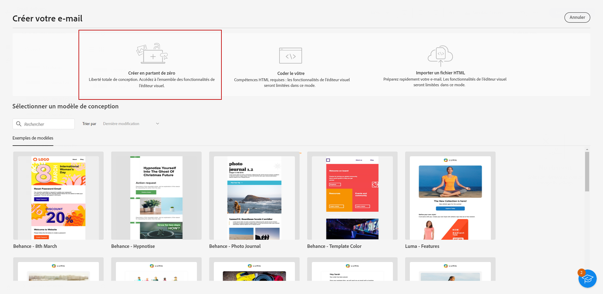
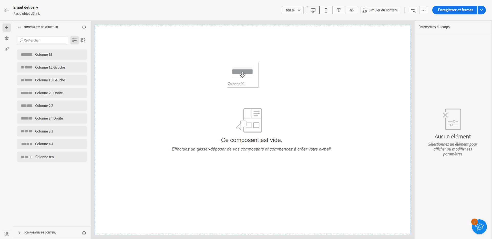
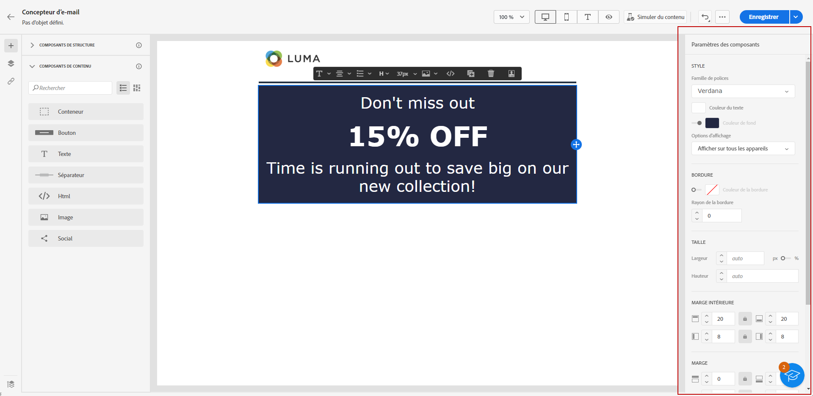
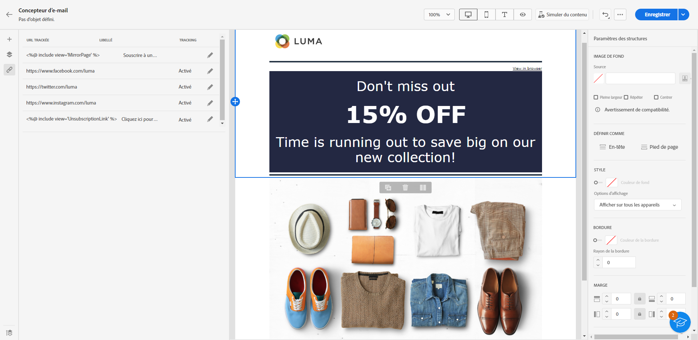
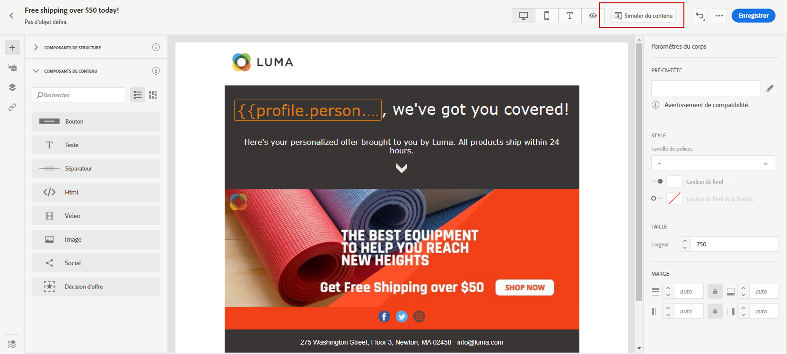

# Commencer à partir de zéro {#create-email-content}

>[!NOTE]
>
>Cette documentation est en cours de construction et fréquemment mise à jour. La version finale de ce contenu sera prête en janvier 2023.

>[!CONTEXTUALHELP]
>id="ac_structure_components_email"
>title="À propos des composants Structure"
>abstract="Les composants de structure définissent la disposition de votre email."

>[!CONTEXTUALHELP]
>id="ac_structure_components_landing_page"
>title="À propos des composants Structure"
>abstract="Les composants de structure définissent la disposition de la landing page."

>[!CONTEXTUALHELP]
>id="ac_structure_components_fragment"
>title="À propos des composants Structure"
>abstract="Les composants de structure définissent la disposition du fragment."

>[!CONTEXTUALHELP]
>id="ac_structure_components_template"
>title="À propos des composants Structure"
>abstract="Les composants de structure définissent la disposition du modèle."

>[!CONTEXTUALHELP]
>id="ac_edition_columns_email"
>title="Définition des colonnes de l’email"
>abstract="Le Concepteur d’email vous permet de définir facilement la disposition de votre email en définissant la structure des colonnes."

>[!CONTEXTUALHELP]
>id="ac_edition_columns_landing_page"
>title="Définir les colonnes de landing page"
>abstract="Le Concepteur d&#39;email permet de définir facilement la mise en page de votre landing page en définissant la structure des colonnes."

>[!CONTEXTUALHELP]
>id="ac_edition_columns_fragment"
>title="Définition des colonnes de fragments"
>abstract="Le Concepteur d&#39;email permet de définir facilement la mise en page de votre fragment en définissant la structure des colonnes."

>[!CONTEXTUALHELP]
>id="ac_edition_columns_template"
>title="Définir les colonnes du modèle"
>abstract="Le Concepteur d&#39;email permet de définir facilement la mise en page de votre modèle en définissant la structure des colonnes."

Le Concepteur d’email permet de définir facilement la structure de votre email. En ajoutant et en déplaçant des éléments structurels à l’aide de simples actions de glisser-déposer, vous pouvez concevoir la forme de votre email en quelques secondes.

Pour commencer à créer votre contenu d&#39;email avec le Concepteur d&#39;email, procédez comme suit :

1. Sur la page d&#39;accueil du Concepteur d&#39;email, sélectionnez l&#39;option **[!UICONTROL Conception à partir de zéro]** .

   

1. Commencez à concevoir le contenu de votre email par glisser-déposer. **[!UICONTROL Composants de structure]** pour définir la mise en page de votre email.

   >[!NOTE]
   >
   >Les colonnes empilées ne sont pas compatibles avec tous les programmes de messagerie. Lorsqu’elles ne sont pas prises en charge, les colonnes ne sont pas empilées.
   >
   >Une fois qu’ils ont été placés dans l’email, vous ne pouvez pas déplacer ni supprimer vos composants, à moins qu’un composant de contenu ou un fragment ne soit déjà placé à l’intérieur.

   

1. Ajoutez autant de **[!UICONTROL Composants de structure]** selon les besoins.

   Sélectionnez le composant **[!UICONTROL n:n colonne]** pour définir le nombre de colonnes de votre choix (entre 3 et 10). Vous pouvez aussi définir la largeur de chaque colonne en déplaçant les flèches situées au bas de celle-ci.

   >[!NOTE]
   >
   >La taille de chaque colonne ne peut pas être inférieure à 10 % de la largeur totale du composant de structure. Vous ne pouvez pas supprimer une colonne qui n’est pas vide.

1. Dans la **[!UICONTROL Composants de contenu]** , vous pouvez ajouter autant de **[!UICONTROL Composants de contenu]** comme vous en avez besoin dans votre composant de structure. [En savoir plus sur les composants de contenu](content-components.md).

   

1. Chaque composant peut être personnalisé de manière plus détaillée à l’aide de la fonction **[!UICONTROL Paramètres des composants]** . Par exemple, vous pouvez modifier le style de texte, la marge ou la marge intérieure de votre composant. [En savoir plus sur l’alignement et la marge intérieure](adjusting-vertical-alignment-and-padding.md).

   

1. Dans la **[!UICONTROL Sélecteur de ressources]**, vous pouvez ajouter directement des ressources stockées dans la variable **[!UICONTROL Bibliothèque de ressources]** à votre email.

   Double-cliquez sur le dossier contenant vos ressources et faites glisser et déposez la ressource à ajouter à votre email.

   

1. Ajoutez des champs de personnalisation pour personnaliser le contenu des données de vos profils.

   

1. Ajoutez un contenu dynamique pour adapter le contenu aux profils ciblés selon des règles conditionnelles.

   

1. Dans le **[!UICONTROL Liens]** dans le volet de gauche, vérifiez la liste de toutes les URL de votre contenu qui seront trackées. Vous pouvez modifier les **[!UICONTROL Type de suivi]**, **[!UICONTROL Libellé]** et **[!UICONTROL Balises]** si nécessaire.

   

   >[!NOTE]
   >
   >En savoir plus sur les liens et le tracking des messages dans [cette page](message-tracking.md).

1. Si nécessaire, vous pouvez passer à l’éditeur de code pour personnaliser davantage votre email en cliquant sur **[!UICONTROL Passer à l’éditeur de code]** dans le menu avancé. Pour plus d’informations sur l’éditeur de code, reportez-vous à la section [cette page](code-content.md#).

   >[!NOTE]
   >
   >Vous ne pourrez pas utiliser le concepteur visuel pour cet email après avoir basculé vers l’éditeur de code.

   

1. Cliquez sur **[!UICONTROL Afficher l’aperçu]** pour vérifier le rendu de votre email. Vous pouvez choisir la vue de bureau ou mobile.

   

1. Lorsque votre email est prêt, cliquez sur **[!UICONTROL Enregistrer et fermer]**.

